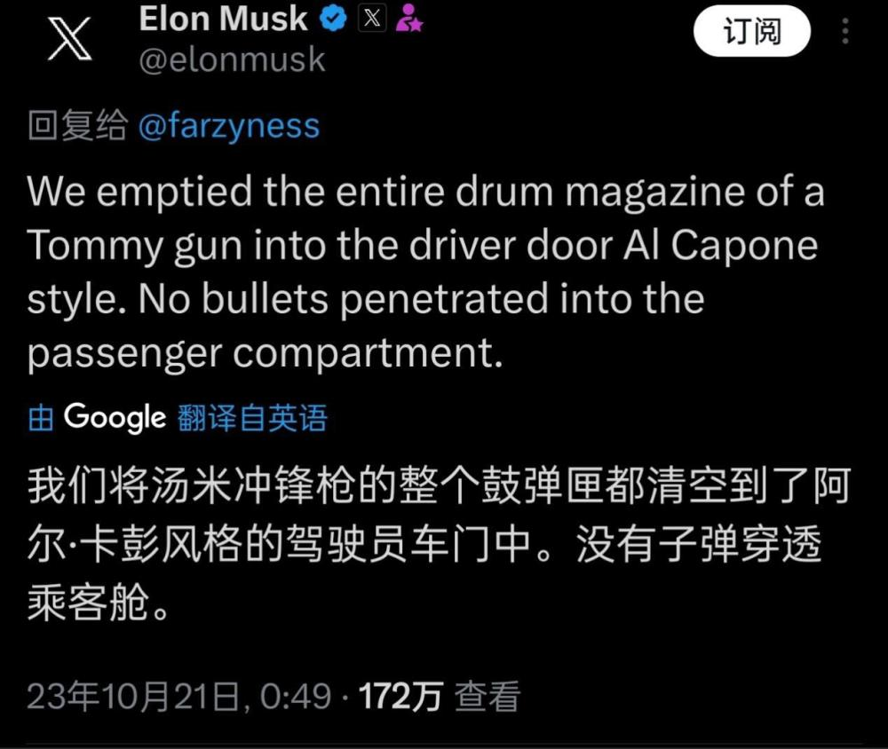
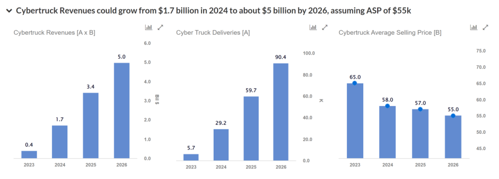
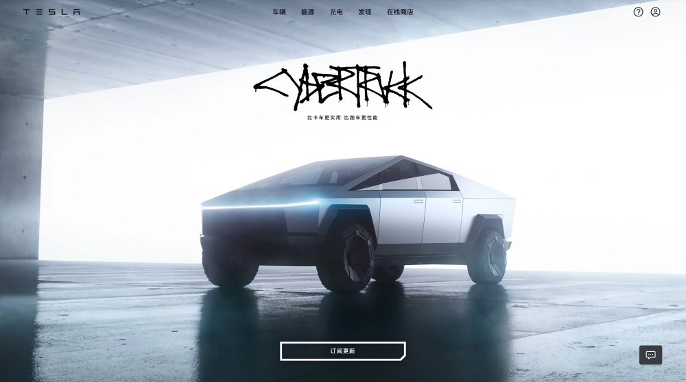

# 交付在即，特斯拉Cybertruck车主或放弃订单：到手可能只是个“玩具”

**腾讯新闻《远光灯》特约作者 麦麦 作者 纪振宇 发自上海、硅谷**

交付在即，马斯克开始不断围绕Cybertruck“整活儿”。

近日，有北美网友在路上拍到了一辆Cybertruck测试车，与众不同的是这辆测试车主驾侧车门有着密密麻麻的70个弹孔，看起来像是经历了某种防弹测试。

很快马斯克就在社交平台上回应，他们的确对Cybertruck进行了防弹测试，并称将汤普森冲锋枪一整个弹夹的子弹都倾泻到了Cybertruck的车门上，然而没有一颗子弹进入驾驶舱。

与其说这是一个测试，不如说是马斯克又大开脑洞进行的一场营销活动。

不久前，特斯拉Cybertruck官方X账号宣布，11月30日将在德州超级工厂进行Cybertruck的首批交付活动。

防弹测试后，特斯拉官网又称，特斯拉将为股东举办抽奖活动，中奖者可以参与 Cybertruck 交付活动。

一系列造势活动显示，Cybertruck正肩负厚望而来。

一个背景是，特斯拉曾经令传统车企艳羡的高利润率在第三季度已经尽显疲态。根据其刚刚公布的第三季度财报显示，特斯拉该季度的毛利率已经下降至17.9%，运营利润率下滑至7.6%，这样的利润率水平是特斯拉两年来最差。同时，个位数的运营利润率已经与传统车企相差无几，甚至已经落后——福特截至2023年6月30日的第二季度息税前利润率已经达到8.1%。

在这样的情况下，如何尽快提高利润率水平，继续维持特斯拉相比其他传统车企的高估值，已经成了当下特斯拉最为急迫的任务，而Cybertruck这一款全新车型，似乎就是为着这一目标而来。

但面对Cybertruck在北美市场即将开启的狂欢，此前已经预订了该车型的一位中国用户却表示，已经准备放弃订单。三年前，他通过特斯拉中国官网预订了一款单电机后轮驱动版，定金1000元人民币。

“（相比预订时价格）大概率会涨价，而且国内持有成本太高，提车也遥遥无期。”他无奈地说。

**销量王福特皮卡的利润诱惑**

美国是全球最大的皮卡车市场，这与美国地广人稀、独门独院、能源价格低廉的社会环境，以及房屋修缮、装饰草坪等生活习惯有关。数据显示，2022年全球皮卡销量565万辆，仅北美市场就卖出了305万辆，超过了全球销量的一半。美国销量最好的10款车型中5款为皮卡，大名鼎鼎的福特F系列皮卡2022年全年销量超过65万辆，连续蝉联美国销量最高车型41年。

同时，就美国汽车市场而言，大型皮卡、中大型SUV等车型，历来也是车企利润率最高的来源。根据行业粗略的计算，通用或福特等皮卡车型，运营利润率甚至能够高达30%以上。作为福特最为畅销的皮卡车型F-150，平均每卖出一辆车，能够给福特带来1万至1.3万美元的毛利润。福特F-150近年来平均年销量在80万辆以上，为福特带来80亿美元以上的毛利，福特在全球90%的利润都是由F-150这一款车型所带来。

据市场研究机构Fortune Business Insights的报告显示，
全球皮卡市场将从2023年的2086.7亿美元增长至2030年的2999.8亿美元，年化增长率为5.3%。更进一步细化至电动皮卡市场，有机构预计，市场将在2023年达到295.7亿美元，年化增长14.3%至2028年增长至576.9亿美元。

但电动化的风还没有吹到北美最为核心的皮卡车市场上。即便是抛开马斯克的个人情结，对于正在经历市场波动的特斯拉而言，电动皮卡也是一座难以忽视的金矿，这一市场仅有Rivian
R1T和福特F150闪电等少数竞争者。

在特斯拉的Cybertruck发布之后，不时会看到这款车与福特F-150的各种对比评测，毫无疑问，特斯拉希望通过直接对标福特这一款带来高利润率的车型，进入这一细分市场。

市场研究机构Trefis认为，到2026年，Cybertruck这一款车型将给特斯拉新增50亿美元收入，这差不多是特斯拉整个2020年收入的15%。

同时，该机构预计，Cybertruck到2026年交付量将达到9万辆，同时平均售价也会从2023年的6.5万美元一路下降至2026年的5.5万美元。

**“自掘坟墓”？Cybertruck量产考验**

算下来，从Cybertruck首次亮相到正式交付，特斯拉一共花费了1469天，毫不夸张的说，这是特斯拉在生产制造上面对的有史以来最大挑战。

2019年11月22日，
Cybertruck在洛杉矶举行的一场特别活动中亮相，这款车型采用了与此前皮卡乃至以往的所有汽车都完全不同的外观造型和制造方法，除了轮胎以外整个车身几乎没有任何一条曲线。

Cybertruck优异的防弹性能来源于其车身采用的30X冷轧不锈钢材料，这种材料与SpaceX的“星舰（starship）”火箭所使用的不锈钢材料相同，有着极高的强度和耐腐蚀性能，但在延展性方面表现不佳。如果使用传统的冲压方式加工，那么模具的损耗将远超加工普通钢或铝制蒙皮的速度，这对于追求成本控制的特斯拉而言显然是不可接受的。

一位业内人士对腾讯新闻《远光灯》表示：“大多数车企对于引入新材料都是非常谨慎的，没有先例参考意味着车企要从头进行焊接、涂装、碰撞等一系列的开发和测试流程，需要高额的成本和精力投入，关键最后的结果还不一定是好的。”

此前彭博社曾报道称，特斯拉原意在今年9月份就交付Cybertruck，但因不锈钢车身超重，使得原有的续航目标无法达成，因此工程团队又耗费了几个月的时间来尝试更换更轻的零部件以减轻重量、提升续航。

无独有偶，今年5月份也有特斯拉内部员工向媒体泄露了100GB的数据，其中就包含部分关于Cybertruck生产制造的秘密细节。该数据显示，初期制造的Cybertruck存在大量基础性问题，特斯拉工程师在Cybertruck样车上发现了21个潜在噪音泄露点，并且还存在漏水的风险，此外在悬架、刹车等与行走紧密相关的结构上也存在问题。尽管文件中提及的车辆是非常早期的样车，但仍然能够由此看出特斯拉所面临的工程挑战。

尽管Cybertruck已经成为了“那个最不让人省心的孩子”，但马斯克从不掩饰自己对于这款车型的喜爱，无论是口中“特斯拉有史以来的最佳车型”，还是屡次驾驶试制车出现在公众面前，都能感受到他对Cybertruck寄予的厚望。

不过，令人意外的是，在特斯拉第三季度财报电话会上，马斯克罕见的悲观回应了Cybertruck的进度，称现阶段很难预测其交付量，需要一年乃至一年半的时间才能为公司贡献正向现金流，他甚至还说开发Cybertruck就是“自掘坟墓”。

Cybertruck的成功与否取决于产量和价格。对于的产能问题，马斯克称在未来的18个月里，Cybertruck都将处于产能爬坡阶段，并最终在2025年左右达到25万辆每年的目标产量。马斯克强调，特斯拉正在革新汽车的制造方法，因此越是探索未知的领域，其最终结果也越难以预测。

需要指出的是，特斯拉目前在手的Cybertruck订单或超过190万张，虽然每个订单只需支付100美金且随时可退，但即便是按照30%的转化率来计算，特斯拉也需要至少两到三年的时间来消化存量订单。目前，特斯拉已不接受中国、欧洲等北美以外市场的订单了。

另一个悬而未决的是价格。截至目前Cybertruck的最终销售价格仍未公布，2019年发布时其官网标注售价为39,900美元起售，约合人民币29万元，不过这个价格在2021年已从其官网删除。目前业内人士猜测，Cybertruck的制造成本或有溢出，实际销售价格将比预期的要高。

**皮卡短时间内难“开”进中国**

中国是特斯拉最重要的海外市场之一，焕新版Model
3甚至专门考虑到中国大陆的消费需求而做出了针对性的调整，并且新车也选择在中国首发。然而Cybertruck却是个例外。

早在2020年，特斯拉就向中国消费者开放了
Cybertruck预订渠道。根据特斯拉中国官网显示，当时Cybertruck订金为1000元人民币，可订购单电机后轮驱动、双电机全轮驱动、三电机全轮驱动，共计三款车型。

从2022年5月份起，特斯拉已经停止接收中国和欧洲市场订单，官网也没有了预订链接，Cybertruck页面只有“订阅更新”的按钮。

有订购了Cybertruck的用户对腾讯新闻《远光灯》表示，他的订单在特斯拉App内已经看不到了，本以为是个bug，但特斯拉却对他说是正常的。目前，该订单仅在官网可见。

今年年初，有报道称意大利IDRA集团一台全新的9000吨级压铸机已经发往中国，而此前一台同级别压铸机交付给了特斯拉德州超级工厂用于Cybertruck的量产。因此有不少人猜测交付中国的这台压铸机是否意味着上海超级工厂正在为生产Cybertruck做准备。

然而，有分析人士对腾讯新闻《远光灯》表示，“特斯拉强调就近生产，中国也包括欧洲在内，都不是Cybertruck的目标市场，要想进入中国首先面临的就是政策和认知难题，所以短期来看Cybertruck国产的概率几乎为零。”

1994年国务院颁布的《汽车工业产业政策》将皮卡视为“轻型货车”管理，因此在很长的一段时间内，买皮卡不仅需要办理货运车辆道路运输证、驾驶员从业资格证，以及一年一检、车身喷字，还需要遵循各地严格的限行政策。

从2016年起，各重点城市均陆续取消或部分取消了对皮卡车进城的限制，政策层面上也取消了喷字、车身反光条等管理规定，市场上也出现了吉利雷达RD6、长城炮等高端乘用皮卡。

有车圈人士认为，中国对皮卡的政策是逐步宽松的趋势，但目前也只是解除部分市区禁行并且可能仍然存在时间段的限行措施。总的来说，中国对皮卡的管控依然紧张，城市家用通勤基本不可能，还是主要以玩具或商用车的身份进入市场。小城市郊区没有Cybertruck的购买力，大城市除了限制多，叠加车牌指标压力和限行压力，普通人也只能望而却步。更重要的是，皮卡车型15年/60万公里强制报废的政策依旧存在。

前述已经在三年前预订了Cybertruck的中国用户表示，自己之所以想放弃这个订单，一方面预计售价将远超此前的29万起步价，更重要的是，各种限制下，Cybertruck在国内仅仅也只可能是一个“大玩具”而已。

不过，凭借特斯拉的品牌光环，Cybertruck也许能在国内创造一批新的皮卡车用户，经由部分先锋消费者在国内掀起一场皮卡热潮也犹未可知。但按照目前特斯拉的节奏来看，中国消费者最早也要到2024年以后才有机会体验这款划时代的车型。

