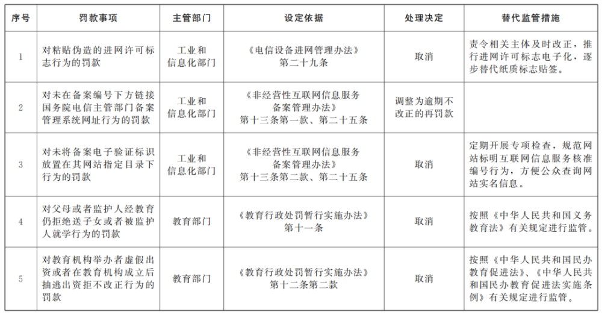
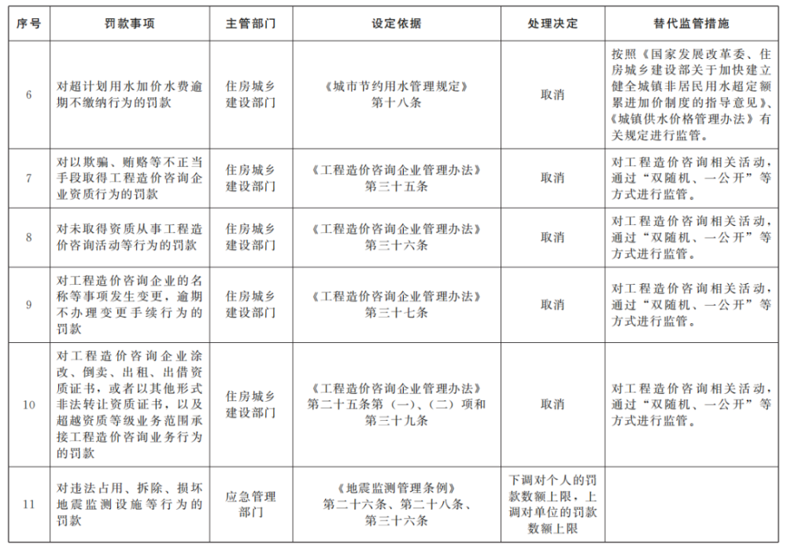
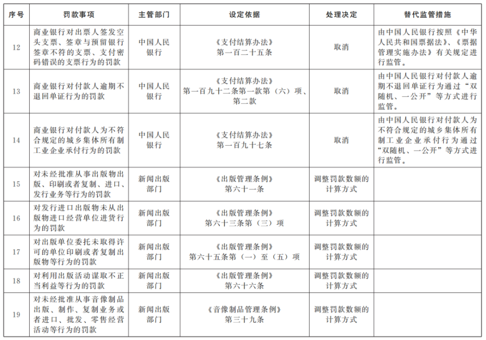
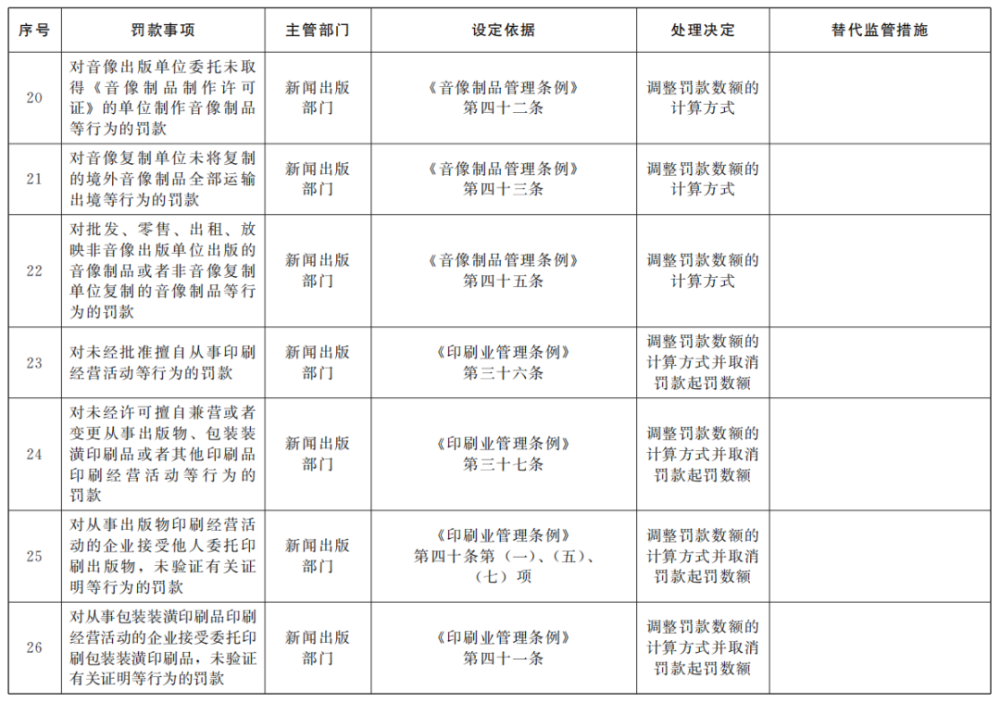
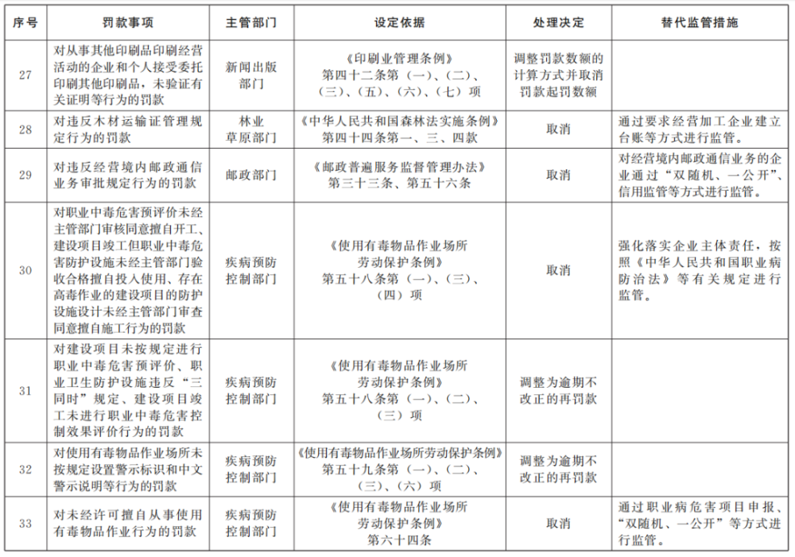

# 国务院关于取消和调整一批罚款事项的决定

**国务院关于取消和调整一批罚款事项的决定**

国发〔2023〕20号

各省、自治区、直辖市人民政府，国务院各部委、各直属机构：

为进一步优化营商环境，国务院开展了清理行政法规和部门规章中罚款事项工作。经清理，决定取消住房城乡建设等领域16个罚款事项，调整工业和信息化等领域17个罚款事项。取消罚款事项的，自本决定印发之日起暂时停止适用相关行政法规和部门规章中的有关罚款规定。调整罚款事项的，按照修改后的相关行政法规和部门规章中的有关罚款规定执行。

国务院有关部门要自本决定印发之日起60日内向国务院报送相关行政法规修改方案，并完成相关部门规章修改和废止工作，部门规章需要根据修改后的行政法规调整的，要自相关行政法规公布之日起60日内完成修改和废止工作。因特殊原因无法在上述期限内完成部门规章修改和废止工作的，可以适当延长，但延长期限最多不得超过30日。罚款事项取消后，有关部门要依法认真研究，严格落实监管责任，着力加强事中事后监管，完善监管方法，规范监管程序，提高监管的科学性、简约性和精准性，进一步提升监管效能，为推动高质量发展提供有力支撑。

附件：国务院决定取消和调整的罚款事项目录

国务院

2023年10月27日

（此件公开发布）

**附件**

**国务院决定取消和调整的罚款事项目录**

