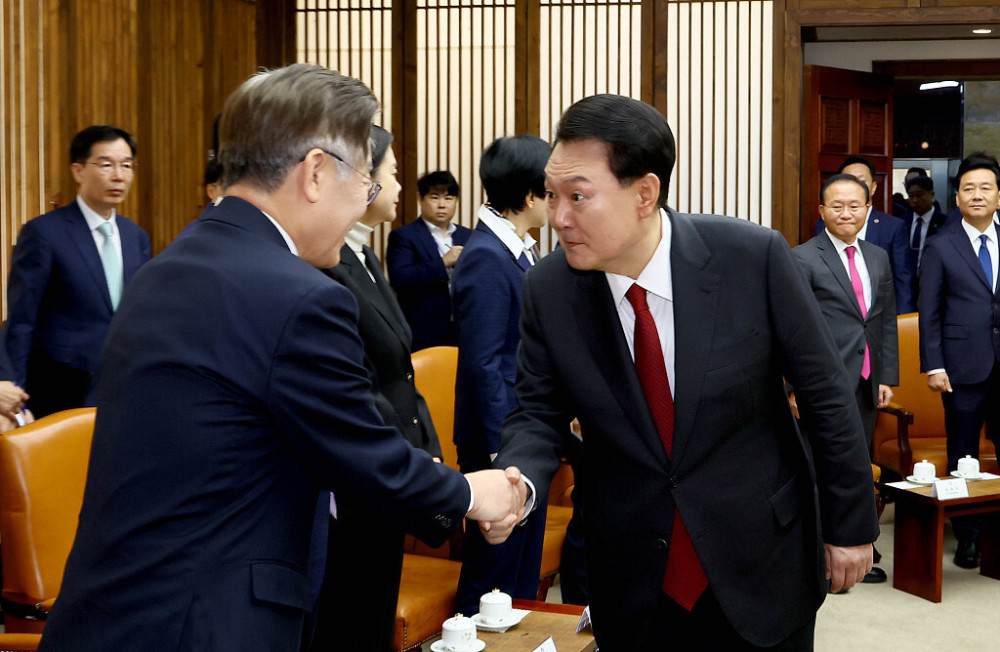

# 尹锡悦施政演说前会见李在明，韩媒：两人能坐下来会面“实属罕见”

【环球时报驻韩国特约记者 赵振 环球时报特约记者
李艾】10月31日，韩国总统尹锡悦在国会发表施政演说，介绍2024年度约657万亿韩元（约合人民币3.6万亿元）预算案。据韩联社报道，尹锡悦表示，韩国政府将以稳健财政作为财政运营基调，不给下一代留下难以承担的债务。尹锡悦说，明年总支出预算仅增加2.8%，增幅为2005年以来最低。政府将把稳物价、保民生放在所有政策的首位并全力以赴，还将致力于减轻弱势群体在住房、交通、通信等必需生活费用方面的负担。

韩国《中央日报》称，在提升对弱势群体的支援上，预算案中提到，将向123万户低保家庭提供1.5万亿韩元生活补贴；放宽单亲家庭补贴限制标准，向3.2万人额外援助抚养费等等。

 _当地时间10月31日，韩国首尔，韩国总统尹锡悦与最大在野党党首李在明会面。（视觉中国）_

值得一提的是，在发表施政演说前，尹锡悦与最大在野党共同民主党党首李在明进行了会面。据韩联社报道，鉴于尹锡悦和李在明此前只在政府纪念仪式等活动上有过短暂照面，此次会面成为尹锡悦就任总统后双方首次正式沟通，因此引人关注。韩国《中央日报》称，尹锡悦与李在明能坐下来会面，在两党沟通中“实属罕见”。

韩联社提到，当天，尹锡悦同国会议长金振杓一同入场后，依次与国会副议长金荣珠、韩国正义党党首李贞味、执政党国民力量党党首金起炫、李在明握手致意。握手时，尹锡悦简短问候李在明，李在明只面带微笑未作回答。会面结束后，双方的茶会以闭门形式举行。报道称，尹锡悦去年发表施政演说时，共同民主党为抵制该党遭遇的侦查等行为，集体缺席议会活动和茶会。有观点认为，李在明可能担心对继去年之后今年也缺席该活动有损民主党形象，因此决定赴会。李在明此举旨在展现“负责任在野党”的面貌，但尹锡悦方面不会因此停止两党僵持对立的路线。

韩联社称，尹锡悦在结束施政演说离场时，有反对党的国会议员手举标语对他的演说内容表达抗议。对于就预算案发表的施政演说，韩国电视频道“TV朝鲜”10月31日称，共同民主党认为这是一场“盲目的演说”，“他（尹锡悦）的讲话只是忙着为自己辩解，为自己治理的失败给出冗长而蹩脚的借口。演说的字里行间看不到对当前令人担忧的经济状况的危机意识，缺少对国民因通胀高企而生活困难的共鸣，也没有任何符合实际的解决方案”。共同民主党国会院内发言人尹永德批评称，“口口声声说要解决民生问题的总统，其实什么都没有改变。”

韩联社称，韩国正义党首席发言人金喜瑞在施政演说结束后的新闻发布会上表示：“这是一次固执己见的演讲。没有任何有意义的内容，对改变现状也没有任何帮助。”金喜瑞批评道，总统的预算案立场仍然是“维持灾难性的紧缩预算和对富人的减税”。

在施政演说中，尹锡悦表示将坚持削减政府研究和开发预算，这引起了韩国科学界的不满。据韩国《京乡新闻》报道，自今年8月以来，包括大学和政府出资的研究机构一直呼吁不要削减研发预算，但尹锡悦依旧无视了这些声音。共同民主党国会院内发言人尹永德说：“在明年的政府预算中，没有韩国的未来，也没有民众的明天，只充满了没有远见的随意削减。”

韩国民调机构Realmeter10月30日公布的调查结果显示，尹锡悦的施政好评率为35.7%，差评率为61.9%。政党支持率民调显示，共同民主党的支持率上升1.9个百分点，为48%；而执政党国民力量党仅为35.8%。

