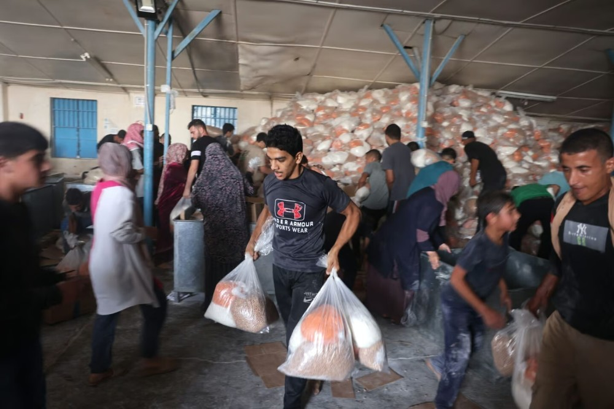
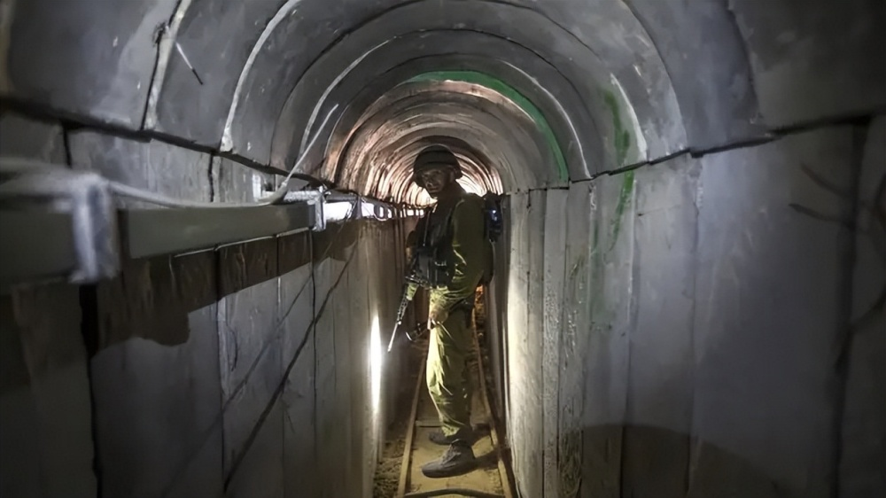

# 空袭与封锁下的加沙围城：民众喝污水抢食物，孕妇在没有麻醉下剖宫产

据《每日邮报》报道，巴以冲突持续，当地230万居民面临食物、水、燃料和药物等资源严重短缺的困境。10月29日，加沙地面战彻底打响，这也被称为“二战后最惨烈”的城市巷战。加沙电力和通讯一度被切断，230万居民陷入孤立，他们不得不喝有污染的水、盐水甚至海水，抢夺食物，孕妇被迫在没有麻醉的情况下剖宫产，而医生只能用缝衣针缝合伤口。

>>战事胶着

“二战后最惨烈”城市巷战

哈马斯地道成加沙地面战关键

10月29日，经过了三周的精心准备后，大批以军坦克和装甲车突入加沙，加沙地面战彻底打响。虽然俄军在乌克兰、美军在伊拉克都遭遇过激烈巷战，但考虑到加沙人口密集、楼房众多、哈马斯苦心经营的情况，这也被称为“二战后最惨烈”的城市巷战。

10月31日，巴以冲突进入第四周，以色列向加沙地带发起地面行动来到第三天。加沙各地，到处是爆炸和火光，连绵不绝。地面上，大批以军坦克和士兵已突入加沙地带，在多个地段与哈马斯发生激烈交火；空中，以军战斗机、无人机、直升机在加沙空中盘旋。

报道称，以色列对加沙地带发动地面进攻，哈马斯建造的地道成为以色列军队面临的最大挑战之一。据估计，该地下网络由1300条地道组成，总长约500公里，其中一些地道深达地下70米。地道中还储存武器、食物、水、发电机、燃料和其他设备。这些地道将使本已复杂困难的战斗局面更加复杂。

以色列军队进入加沙进行地面战，他们将不得不在陌生环境下面对错综复杂的地道网络，作战风险极大。哈马斯还在地道里面设置了各种机关，成员都接受了“先开枪后逃跑”的袭击训练，目的是把以军引入到死亡陷阱之中。

如今，哈马斯已经表示愿与以色列就交换被扣押人员进行谈判，但无法换来暂时停火。以色列和美国更是反对联合国达成的停火决议。

以色列总理内塔尼亚胡排除了在加沙停火的呼吁，称“这是战争时期”。他称以色列将继续推进消灭哈马斯的计划，停火等同“向哈马斯投降”。

>>医疗崩溃

孕妇无麻醉剖宫产

医生只能用缝衣针缝合伤口

以色列接连三周轰炸加沙并派出地面部队，加上全面封锁加沙，当地医院缺乏人力物力治疗大量伤员，医疗体系濒临崩溃。加沙的医院目前不仅面临断电，呼吸机、药物和血浆短缺，孕妇被迫无麻醉接受剖宫产，患者被要求恢复七成就离院，加护病房无力挽救垂死生命。在加沙的医院，医护人员已经多次接到以色列军方要求撤离的通知。

在爆满的急诊室门口，救护车仍夜以继日将伤者送到，医生只得在地板和走道上医治从断垣残壁中救出的患者。麻醉、手术灯、绷带、缝合工具——所有的医疗物资都严重不足。51岁的骨科医生阿贝德用衣服做绷带，用生理盐水和过滤不足的污染水清洗伤口，用醋做消毒剂，用缝衣针取代外科缝合器具。阿贝德说，这种操作可能会损伤组织、造成伤口感染，但医院的处境早已由不得医生挑剔。

在加沙最大的希法医院，约5000位病人正在接受治疗，医院原容纳患者数上限为700。伤员躺在地板上，医生在充满呻吟声的拥挤走廊里进行手术。在南部城市汗尤尼斯的纳赛尔医院，护士和手术助理不得不手持手机给正在进行外科手术的医生照明。

>>民众绝望

人均用水量只有3升

闯入联合国仓库抢夺食物

自2007年6月起，以色列就对加沙地带实行封锁，民众一直依靠每天从埃及和以色列运来的商品和各种人道主义物资，水、电、燃料也都在很大程度上依靠以色列。据《德国之声》统计，由于以色列实施全面围困，自此次巴以冲突开始至今，累计只有117辆载有救援物资的车辆进入加沙。

由于加沙地带许多建筑物变成了废墟，平民难以找到庇护住所，当地居民缺乏食物、水、燃料和药物。从10月27日晚上开始，当地通讯和网络服务被切断，整夜遭到以色列军队的猛烈轰炸。

联合国持续向以色列施压，要求恢复人道主义通道，允许物资进入加沙，但收效甚微。加沙民众奥斯玛表示，在避难所，他只收到一瓶330毫升的水。他说：“每人一小瓶。我们来到这里后只拿到了一瓶，我该怎么处理它呢？当眼药水吗？”

随着加沙地带所有水井、水泵站和提供饮用水的海水淡化厂都因空袭受损或停电而关闭，世界卫生组织估计，目前加沙的日人均用水量只有3升。此次巴以冲突前，加沙居民的人均用水量约为84升，其中只有27升符合世界卫生组织适合人类使用的标准。

如今，一些加沙民众不得不喝有污染的水、盐水甚至海水，这加剧了瘟疫爆发的可能性，传染病或将造成大量民众死亡。

10月29日，联合国近东巴勒斯坦难民救济和工程处表示，数千名加沙地带居民闯入该机构的仓库和配送中心，抢夺小麦、面粉和基本生存物品。

视频显示，加沙民众将装有物资的箱子、袋子搬出仓库，有的扛在肩上、有的装在自行车上运走。包括位于中部的代尔拜莱赫和南部的汗尤尼斯在内，共有4个中心遭遇抢劫。

记者法蒂在汗尤尼斯目睹了仓库抢劫，但他对此毫不惊讶：“他们只想活下去。仅此而已。我和两个不足10岁的孩子也逃难至此，前一天，我到处都没有找到面包。”

随着以色列发动地面进攻，网络通信被切断，民众们不知道发生了什么。同时，也可能就这样被杀害，而无人得知。

联合国近东巴勒斯坦难民救济和工程处通讯主任图马表示，加沙人民陷入绝望，耐性及承压能力正跌入谷底。

全球多个援助组织表示，他们无法联系到加沙地带的工作人员。联合国秘书长古特雷斯表示：“一场人道主义灾难正呈现在我们的眼前。”

**华商报大风新闻记者 郭霁 编译 编辑 王喆楠**

