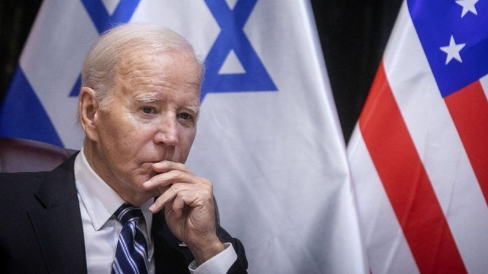
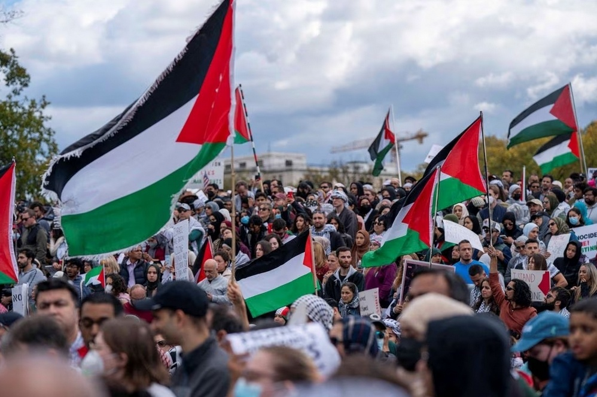

# 美国穆斯林群体向拜登下“最后通牒”：加沙再不停火，选票就没了

（观察者网讯）综合路透社、《华盛顿邮报》等1日报道，巴以新一轮冲突引发的连锁反应之一，美国总统拜登因力挺以色列，与穆斯林选民的关系正“迅速破裂”，后者的立场对其大选结果起到至关重要的作用。

“美国穆斯林告诉拜登：加沙再不停火，选票就没了。”据路透社报道，包括有着多名民主党领导人参与的“全国穆斯林民主委员会”等多个穆斯林和阿拉伯裔美国人团体近日接连表态称，除非拜登立即采取措施确保加沙停火，否则他们将动员美国数百万穆斯林选民不为拜登2024年竞选连任提供捐款和选票。

报道称，美国穆斯林大多集中在密歇根州、俄亥俄州等关键摇摆州，近7成在2020年大选中投票给了拜登，但现在其中许多人表示不会在2024年继续支持拜登。当地时间周二公布的一份最新民调还显示，阿拉伯裔美国人对拜登的支持也已经骤降至17%。

综合美国有线电视新闻网（CNN）报道，虽然穆斯林仅占美国人口的1%多一点，但美国两党都越加关注这一群体以拉拢选票。

2020年，当时作为民主党总统候选人的拜登曾向穆斯林选民保证，如若当选将立即终结时任总统特朗普对多个穆斯林国家实行的旅行禁令，并表示希望在美国的学校里传授更多有关伊斯兰信仰的知识。此外，拜登所任命的、由阿拉伯裔美国人和穆斯林担任政治职务的人数比任何一届美国总统都多，他还任命了两名穆斯林担任联邦法官。此举成功帮助拜登赢得了美国穆斯林群体的普遍好感。

美国穆斯林选民主要集中在密歇根州、俄亥俄州、宾夕法尼亚州、得克萨斯州、弗吉尼亚州和佐治亚州等几个摇摆州。其中，密歇根州是美国穆斯林和阿拉伯裔美国人最多的州之一，人数占该州选民数量的5%，同时也是2020年美国总统大选中的关键摇摆州，拜登当时赢得了密歇根州50.6%的选票，特朗普的得票率为47.8%。类似地，在宾夕法尼亚州阿拉伯裔美国人尽管占比不到2%，但起到了关键作用，拜登在该州的得票率为50.01%，特朗普为48.84%，双方差距仅1.17个百分点。

报道指出，在这些竞争激烈的摇摆州，穆斯林群体的立场将对拜登2024年是否能够连任起到关键性作用，而拜登政府对以色列的支持正在“激怒”这一重要群体。

据路透社称，全国穆斯林民主委员会在一封名为“2023年停火最后通牒”的公开信中敦促拜登利用他对以色列的影响力，在美东时间周二（10月31日）下午5时前促成巴以冲突方停火。报道提到，这一组织的成员包括来自密歇根州、俄亥俄州和宾夕法尼亚州等竞争激烈的关键摇摆州的民主党领导人。

“拜登政府（对以色列）包括资金和军援在内的无条件支持，在造成平民伤亡的持续暴力事件中扮演了重要角色，削弱了选民的信任。”信中承诺，他们将动员穆斯林、阿拉伯裔和盟国选民“不认可、不支持或不投票给任何支持以色列攻击巴勒斯坦人民的候选人”。

路透社指出，美国阿拉伯和穆斯林社区对拜登没有谴责以色列对加沙袭击而“感到越来越愤怒和沮丧”，这封信就是最新迹象。

_当地时间10月21日，美国穆斯林在华盛顿纪念碑附近举行呼吁停火的抗议集会 图自路透社_

尽管拜登自上任以来一直明确坚决抵制“伊斯兰恐惧症”，同时也抨击日益高涨的反犹太主义，但穆斯林领导人认为当务之急是拜登“喊停”这场战争。

美国最大的穆斯林民权组织，美国伊斯兰关系委员会（CAIR），其执行主任杰拉尼·侯赛因（Jaylani
Hussein）来自明尼苏达州。他明确表示，除非拜登努力结束战争，否则他别无选择，只能在2024年投票反对拜登。

来自密歇根州的巴勒斯坦裔美国议员拉希达·特莱布（Rashida
Tlaib），周一也在社交媒体平台X（原推特）上网站X上发布了一段90秒的视频，谴责拜登支持“以色列在巴勒斯坦的种族灭绝运动”，并配文道：“不要指望我们在2024年的选票。”

截至发稿前，拜登的竞选连任团队没有对此作出回应。美媒早些时候曾称，白宫和拜登的竞选团队正在努力应对穆斯林选民态度的转变。

一位白宫官员称，在因对巴方公布的死亡人数持怀疑态度而被美国伊斯兰关系委员会怒斥要求道歉后，上周四（10月26日）拜登与白宫挑选的5名穆斯林社区领导人举行了一次未公开的会议，以缓和双方的紧张关系。

拜登竞选活动发言人阿马尔·穆萨（Ammar
Moussa）表示，拜登自上任以来一直明确坚决抵制“伊斯兰恐惧症”，冲突爆发后也一直在为确保人道主义援助能顺利到达加沙地带而努力，“拜登总统将继续与美国穆斯林和巴勒斯坦社区的领导人密切合作，倾听他们的心声，给予他们最大程度的支持。”

《华盛顿邮报》指出，白宫迅速进行危机公关，但效果有限。报道称，不少受访的阿拉伯裔美国人和穆斯林表示，因为共和党人及其领导人特朗普对穆斯林群体的公开敌意，他们曾经认为民主党是避难所，但现在他们觉得被“背刺”了，他们将重新考虑是否继续支持拜登。

《纽约时报》也发文称，美国伊斯兰关系委员会委托进行的出口民意调查发现，在2020年大选中，全国大约69%的穆斯林投票给了拜登。但现在他们中的许多人表示，不会在2024年的大选中支持拜登。

另据路透社报道，阿拉伯裔美国人研究所委托进行的一项民调于本周二出炉，数据显示拜登在这一群体中的支持率仅有17%，而2020年大选时，这一数值为59%。只有20%的阿拉伯裔美国人认为拜登的工作表现为“良好”，66%的人对总统的整体评价为负面。还有40%的受访者表示，他们将投票给2024年共和党候选人、前总统特朗普，这比2020年高出5个百分点。

另外，68%的阿拉伯裔受访者认为，美国不应该向以色列运送武器和军事装备，并认为美国应该利用其对以色列的影响力来呼吁停火。大多数人对日益严重的反犹太主义（67%）和反阿拉伯偏见（78%）表示担忧，59%的人表示遭受过歧视，这比4月份的上次民调上升了6个百分点。

报道称，美国白宫发言人卡琳·让-皮埃尔拒绝就民调结果发表评论，仅表示拜登理解美国穆斯林群体“承受了过多的仇恨攻击”，尊重他们的观点，拜登政府一直与阿拉伯和穆斯林社区成员、犹太领袖以及政府官员就他们的不同关切进行接触，并将继续朝这一方向努力。

**本文系观察者网独家稿件，未经授权，不得转载。**

