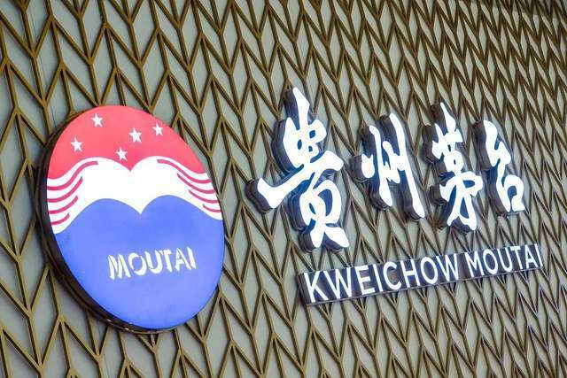

# 茅台深夜涨价20%：公司感受到了寒气，提价早已箭在弦上

曲线涨价多年后，贵州茅台决定不装了。

10月31日晚间，贵州茅台发布公告称，经研究决定，自2023年11月1日起上调53%vol
贵州茅台酒（飞天、五星）出厂价格，平均上调幅度约为20％。此次调整不涉及本公司产品的市场指导价格。

贵州茅台上一次涨价还要追溯到2018年元旦，彼时将飞天茅台酒的出厂价由819元提高到969元，零售指导价由1299元上调到1499元，平均上调幅度18%左右。

11月1日上午，A股开盘，三大指数高开，上证指数涨0.64%，深证成指涨0.35%，创业板指涨0.04%。其中白酒股领涨，贵州茅台更是高开9.82%，股价报1850元。

_图/视觉中国_

**茅台提价**

谁都没想到，这一次的提价竟会来得如此突然。

此次调价主要涉及飞天53%vol 500ml贵州茅台酒、五星53%vol 500ml贵州茅台酒，以及飞天同系列的其他毫升规格产品。飞天53%vol
100ml贵州茅台酒（i茅台）及尊品、珍品、精品等产品未作调整。

若按20%涨幅计算，53%vol 贵州茅台酒（飞天、五星）出厂价格上调约200元/瓶，调整后出厂价格约1169元/瓶。

根据相关资料显示，本轮调价系茅台自2001年上市以来的第8次调价。之前的调价时间分别在2001年、2003年、2006年、2008年、2010年、2012年和2018年，调整幅度在10%-35%区间。

茅台上一次价格调整是2018年元旦，平均上调幅度约为18%左右，飞天茅台酒零售指导价由1299元/瓶上调到1499元/瓶，出厂价由819元/瓶调整到969元/瓶。

时间再前移五年，2012年9月1日，茅台宣布适当上调部分产品出厂价格，平均上调幅度为20%-30%，其中茅台酒出厂价提升至819元/瓶。

从时间上看，2010年后，茅台产品调价间隔节奏放缓，本轮最新调价也是过去二十余年来，间隔时间最长的一次，达到5年10个月。

关于“飞天茅台”是否会提价，一直是市场热议的话题。

在今年6月13日，贵州茅台2022年度股东大会上，针对前海开源基金首席经济学家杨德龙关于“茅台提价”的提问，贵州茅台董事长丁雄军做了回应。

“价格要科学、全面地看待。提不提价格，对于管理层来讲，是我们每天都在追求的。但什么时候提、怎么提，确实要有智慧。这两年的改革，给股份公司和股东贡献了一些利润，大家就在想飞天茅台能提价就会有更多的利润、回报得更多，我们也是这么想的。”

但丁雄军同时表示，茅台酒的本质属性是商品属性，但产品价格是由市场、供需关系等多方面因素决定的。

**茅台也感受到了寒气**

在酒水行业研究者欧阳千里看来，此番贵州茅台涨价在意料之外，又在情理之中。

“意料之外，是指行业存在下行的风险，龙头酒企的一言一行应慎重，特别是绝对龙头茅台。”欧阳千里告诉中国新闻周刊。

今年以来，白酒行业和白酒市场已经进入新一轮调整周期，由增量发展时代进入到存量竞争时代，库存高企和价格倒挂等诸多问题十分突出，即便强如茅台也感觉到了寒气。

有经销商对中国新闻周刊表示，今年市场压力较大，原箱飞天茅台的价格从年初的3000元/瓶出头，一度下降到2700元/瓶。

另据报道，部分贵州茅台的经销商表示，今年贵州茅台依然要求，相关经销商每个月的茅台酒库存都必须清零，以达到动销目的。这或从侧面反映出了贵州茅台面临的压力。

10月20日，贵州茅台发布了三季报。数据显示，今年前三季度，公司实现营业收入1032.68亿元，同比增长18.48%；实现净利润528.76亿元，同比增长19.09%。

从整体上来看，贵州茅台维持了两位数的增长，同时也是首次年内营收破千亿规模。但这份业绩报还是略低于市场预期。

分季度来看，今年第一季度和第二季度，贵州茅台营收增幅分别为20.00%和21.72%，净利润增幅分别为19.9%和20.22%。而到了第三季度，该公司单季度营收和净利润增幅分别为14.04%和15.68%，均有所放缓。

就在贵州茅台业绩发布的前一天，即10月19日，公司股价跌幅超5%，创一年来单日最大跌幅，盘中一度跌至1616.25元/股，创2021年12月以来的股价新低。

事实上，由于消费复苏未达预期，今年多个消费品板块都在降价促销，比如汽车、乳品、餐饮，价格战可谓相当惨烈。

对于茅台逆势提价，酒水分析师蔡学飞向中国新闻周刊解释道，白酒的消费逻辑和其他消费品不同。“白酒属于社交性消费品，是典型的面子消费，信心与预期更加重要，提价反而能提振市场消费信心，从而激发市场需求，带动市场消费。”

要说情理之中，则是茅台提价早已箭在弦上。其实过去几年，茅台一直在暗暗试探市场的态度。

国海证券指出，从去年以来，公司非标产品提价、新品推出、增加直营渠道占比等举措也已有效提升均价，实际上实现了提价。

以茅台电商平台“i茅台”中的mini款飞天茅台为例，100ml售价399元，500ml合计1995元，与正品500ml/1499元相比，高出496元，涨幅33%。

2022年6月的茅台2021年度股东大会上，丁雄军在谈到mini茅台比正品茅台更贵时曾表示：“你懂的嘛，释放了一些信号。”

**业绩将显著增长**

可以预见的是，此次调价将为茅台带来更多的营收和利润。

2018年贵州茅台宣布涨价后，业绩当年就迎来大涨。数据显示，2018年贵州茅台实现营业收入736.39亿元，同比增加26.49%；实现净利润352.04亿元，同比增加30.00%。

国海证券认为，公司在2022年报中披露了2023年总营收“+15%”的目标，预计有望超额完成。

方正证券也持同样的观点，据其测算，这次提价将增厚今年收入约62亿元，增厚利润约41亿元。

通过涨价，企业有望增厚业绩，从而获得更多的利润，但渠道商则更关心如何保证自己的切身利益。

在过去几年，贵州茅台通过增加销量、调整产品结构、提高直销渠道收入这些方式来提高业绩收入。以提高直销渠道方式为例，该渠道收入正在逼近批发渠道收入。

今年前三季度，茅台直销渠道以及批发渠道收入分别是462.07亿元、566.57亿元，两者仅相差104.5亿元。

由于飞天茅台产能提升缓慢，直销收入的增长，势必会挤压代理渠道的配额。

2022年，贵州茅台批发代理渠道的营收同比下降9.31%，收入总额743.9亿元。这也是茅台自2016年分别列出直销和批发代理收入以来，批发代理收入的首次下滑。

蔡学飞表示，提价不仅能够增厚业绩，也意味着渠道利润的再分配。

飞天茅台按照之前的出厂价969元计算，贵州茅台作为厂家，所能获得的利润是800多元，而经销商的利润则超过2000元。

调价后，生产成本和销售成本并没有变化，但厂家的利润白白多了200元，如果市场价格没有变化，那么经销商的利润势必会被挤压。

当然，即便按照目前的终端价，经销商仍然有较大利润空间。

在欧阳千里看来，面对提价，经销商是既高兴，又恐慌。“高兴的是，库存即将升值，恐慌的是，终端实际成交价是否能够如期上涨，一旦不能上涨，或许会有更多不可控的事情发生。”

值得注意的是，此次价格调整中，贵州茅台强调并不涉及市场指导价格。

那么，提高出厂价会不会拔高终端零售价，使得买茅台成为更困难的事？

蔡学飞对此持谨慎态度，“考虑到目前市场相对偏紧的需求现状，零售价变动幅度不会太多，茅台提价的具体市场后续反应表现还需要进一步观察。”

作者：余源

