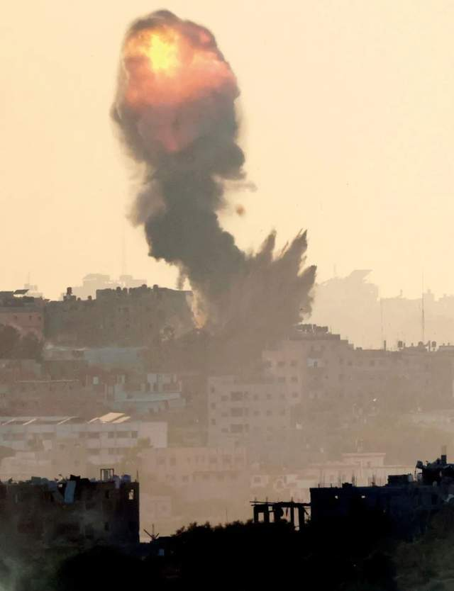
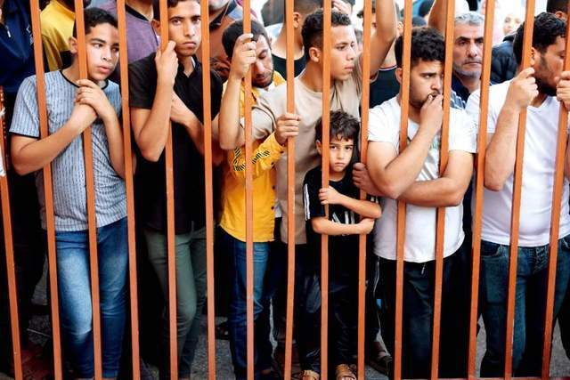

# 超万人在冲突中身亡：一场真正的血腥报复

当地时间10月28日，一场特殊的新闻发布会在特拉维夫举行。这是以色列总理内塔尼亚胡自10月7日以来，首次召开新闻发布会回答记者提问。内塔尼亚胡宣布，以色列地面部队已经进入加沙地带，开始“战争的第二阶段”。他称这是以色列的“第二次独立战争”，并提醒以色列人，铲除哈马斯的战争预计会“漫长而艰难”。

与内塔尼亚胡一同出席发布会的，还有战时内阁的其他两位成员：以色列国防部长约亚夫·加兰特和反对党国家团结党领袖本尼·甘茨。现场视频显示，当内塔尼亚胡站在发言台后，向世界宣布以色列加大对加沙的进攻时，甘茨双臂环抱在胸前呈现防御姿势。

10月27日以来，以色列发起对加沙地带迄今为止最猛烈的空袭，地面部队也已经深入到加沙北部三公里多。在长达48小时内，加沙地带的互联网连接和电话线路完全中断。

以色列方面坚称，不会同意停火。内塔尼亚胡表示，“要求停火或要求以色列向哈马斯投降、向恐怖分子投降、向野蛮行为投降，这些都不会发生。”

目前，这一轮巴以冲突已导致双方超1万人死亡。10月31日，据巴勒斯坦卫生部表示，自10月7日以来，加沙地带已有8525名巴勒斯坦人因以色列的袭击死亡，其中包括3542名儿童和2187名妇女，另有21543人受伤。此外，约旦河西岸地区至少有119人在冲突中身亡，近2000人受伤。另据以色列媒体10月30日报道，冲突已造成以色列方面1538人死亡。

 _10月30日，加沙地带北部，被以色列轰炸的建筑冒起浓烟。本文图/视觉中国_

**血腥报复**

战争升级始于10月27日夜幕降临后，加沙地区的互联网连接和电话线路开始中断，外界猜测以色列军队已经准备好对加沙进行地面袭击。稍晚些时候，以军一份简短声明证实，地面行动正在“扩大”，但没有提供其他细节。

随之而来的是，持续时间已达三周的新一轮巴以冲突中最猛烈的轰炸。与此同时，以色列国防军分别从加沙北部城镇拜特哈农和布雷吉难民营发起进攻，在空袭和炮击的掩护下，坦克和运载步兵和工兵的装甲车进入加沙境内。

以色列国防军10月30日表示，随着以色列继续在加沙加大地面行动，数十名躲在建筑物和隧道中的哈马斯特工在一夜之间被杀。以色列国防军地面部队引导的一架战机，还袭击了巴勒斯坦伊斯兰抵抗运动（哈马斯）的一个据点，大楼里面约有20多名武装分子。此外，一架制导战斗机袭击了爱资哈尔大学地区。

“过去几天，以方袭击了600多个‘恐怖目标’，包括武器库、数十个反坦克导弹发射阵地以及哈马斯的藏身处和集结地。”以色列国防军在声明中表示。

视频还显示，在距离加沙以色列边界的3公里处，一面以色列国旗悬挂在加沙一家度假酒店的屋顶上。这也表明，与以往的袭击不同，此次以军留在加沙境内，并建立了临时据点。

此轮袭击，也对加沙城的希法医院和圣城医院以及加沙地带北部的印度尼西亚医院造成破坏。联合国人道事务协调办公室指出，约有11.7万名流离失所者在加沙城和加沙地带北部其他地区仍在运营的10家医院避难，这些医院最近几天一再接到撤离命令。

世界卫生组织在社交媒体上重申：“将患者从医院撤离是不行的，这不可能不危及他们的生命。”

“加沙人所经历的恐怖难以言表，平民百姓日益绝望。”联合国人道事务协调办公室人道筹资司司长丽莎·道顿在声明中表示，在绝望中，人们不得不闯入联合国机构的仓库寻找食物和水。这期间，联合国世界粮食计划署部分援助物资在加沙遭到抢劫。巴勒斯坦难民救济机构警告称，“令人担忧的公共秩序的崩溃正在开始”。

每一天都有更多的人死亡，但战争结束却遥遥无期。以色列特拉维夫国家安全研究所高级研究员梅尔·埃尔兰对《中国新闻周刊》表示，目前战争还处于早期阶段，而且很可能比以往巴以间的任何一场战争都持续更长的时间。

以色列国防军近日多次表示，战争的总体目标保持不变，即一次性地消灭哈马斯。不过，以色列并没有像起初外界所预想的那样发起快速大规模进攻，从袭击拜特哈农和布雷吉的行动来看，这是一项逐步包围加沙的战略计划。对此，一位不愿透露姓名的以色列军官认为，地面战争可能持续数月甚至一年。

伦敦亚非学院巴勒斯坦研究中心教授洛雷利·哈恩·埃雷拉也表示，与以色列过去对加沙和巴勒斯坦人的袭击不同，这次对哈马斯的打击，是以色列真正的“血腥报复”。

正如内塔尼亚胡在10月30日通过视频对公众所称：“我们将把他们（哈马斯）扔进历史的垃圾箱。这就是我们的目标，这是我们的责任。”

_10月26日，加沙地带南部城市汗尤尼斯一家医院外，巴勒斯坦人在等待辨认以色列空袭中遇难亲人的遗体。_

**能否“消灭哈马斯”？**

“以色列可以发动地面战争，但无法确保能够以他们满意的方式结束战争。”巴勒斯坦籍的卡塔尔西北大学中东问题学者哈立德·赫鲁布向《中国新闻周刊》表示。

哈立德·赫鲁布曾深入研究过哈马斯组织，并著有《哈马斯：政治思想与实践》一书，在他看来，“消灭哈马斯”很难实现，因为该组织已经深入到当地的政治、社会甚至宗教中。

2005年，以色列完成撤军，结束对加沙地带长达38年的占领。当时，哈马斯宣称这是自己战斗的结果，加沙地带部分群体也称哈马斯为“抗以英雄”。以至于在2006年1月的巴勒斯坦议会选举中，哈马斯赢得了巴勒斯坦民族权力机构议会的多数席位，击败了长期领导巴勒斯坦抵抗运动的巴勒斯坦解放组织（法塔赫）。

从那以后，以色列在战略上倾向于维持巴勒斯坦的内部分歧，将加沙地带和约旦河西岸“分而治之”。内塔尼亚胡2009年重新掌权时，也贯彻这样的战略。内塔尼亚胡的传记作者安谢尔·普费弗对此表示，内塔尼亚胡一度很满意这种平衡。

加沙人和约旦河西岸的巴勒斯坦人能够深刻感受到这样的隔绝。今年夏天，哈佛大学的中国留学生赵梓涵曾参与约旦河西岸的一项世卫组织的培训活动，学员中就有几位来自加沙的同学。加沙的同学告诉她，这是他们20多年人生中，第一次离开加沙，虽然同为巴勒斯坦人，但他们一点也不了解西岸的情况。

赵梓涵对《中国新闻周刊》表示，她清楚记得加沙医学生法哈对她说过的一句话：“以前我以为只有加沙人生活在露天监狱里，西岸的同胞能过上相对和平的生活——没想到他们也是一样，生活在随时可能发生的炮击中。”

哈立德·赫鲁布说，其实加沙人对哈马斯的态度也是复杂的。其一，2007年哈马斯管理加沙以来，加沙地带的情况日益恶化，日益封闭，哈马斯未能提供就业和其他服务，人们没有任何希望；其二，放在广泛的巴勒斯坦争取解放、自由和尊严的斗争中，加沙人只能选择哈马斯，因为他们坚决反抗以色列、巴勒斯坦占领者和殖民者。就在这种复杂的情绪当中，哈马斯在16年的时间里逐步在加沙内部发展。

哈马斯的军事力量也在不断壮大，已经建造或获得了一个庞大的火箭武器库，射程几乎覆盖整个以色列。此外，哈马斯多年来在加沙地下挖掘出庞大的防御隧道网络。哈马斯此前声称，隧道系统覆盖面很大且使用广泛，长度超过500公里。

根据以色列方面的计划，对加沙的战争将分为三个主要阶段。第一阶段，先通过空袭开展军事行动，随后再发动地面袭击，目的是消灭特工和破坏基础设施，从而击败和摧毁哈马斯。第二阶段，地面部队进入加沙后，将采取较低强度的行动，来消除“零星的抵抗力量”。第三阶段，在加沙地带建立新的“安全政权”，免除以色列对加沙地带日常生活的责任，并为以色列及其公民创造新的安全环境。

在哈立德·赫鲁布看来，以色列关于地面入侵的言论非常高调，但也有某些不情愿的迹象。更重要的是，他们无法解决如何根除哈马斯以及用什么取代它的战略困境。很难想象以色列如何“消灭哈马斯”。哈马斯不是伊斯兰国（IS），即使哈马斯的军事力量在这场战争中遭到重创，支离破碎的军事派系也会衍生出新的武装组织，继续抵抗以色列的占领。

“对于以色列和哈马斯来说，我认为他们都没有一个明确和长远的计划。”哈立德·赫鲁布还反问道：“就算是以色列真的成功摧毁了哈马斯，所有人面临的问题是，接下来会发生什么？”

**内塔尼亚胡的道歉**

“内塔尼亚胡希望成为‘摧毁哈马斯的英雄’，也希望让这场战争拖得尽可能长一些，借此转移国内对其司法改革和腐败指控的注意力。”伦敦大学东方与非洲研究学院教授海姆·布雷谢特认为。但事实却是，战争发生后，内塔尼亚胡正在陷入更深的政治困局。

冲突开始几天后，一项针对以色列犹太人的民意调查于10月12日公布，84％的受访者表示，他们将责任归咎于以色列政治领导层。高达94％的受访者称，以色列南部防御不力应由内塔尼亚胡政府负责。

随后的另一项民调结果还显示，如果当下举行选举，内塔尼亚胡、他的政府和利库德集团都将遭受重大损失。而甘茨所领导的国家团结党，支持率显著提高。

在这样的氛围之下，内塔尼亚胡宣布成立战时内阁，3名核心成员为总理内塔尼亚胡、国防部长加兰特，以及反对党国家团结党领袖、前国防部长甘茨；另外还有两名观察员，分别为战略事务部长、前以色列驻美国大使德尔默，以及前国防军总参谋长艾森科特。

内塔尼亚胡想要紧急组建战时内阁也有着自己的考量。阿拉伯应用社会研究中心发布的报告指出，内塔尼亚胡试图平息公众的愤怒，防止政府的崩溃，并在决策过程中让经验丰富的军事领导层与其并肩作战，以让未来的军事行动更名正言顺，因为甘茨和艾森科特的观点在很大程度上代表了以色列安全机构。

但这个战时内阁从成立第一天起，就面临着成员不和的猜测。多年来，甘茨一直是内塔尼亚胡最大的政治对手，他被认为是“另一个内塔尼亚胡”。但与执政多年的内塔尼亚胡不同，甘茨是政治新手。在2019年的选举中，甘茨在社会问题上持自由主义立场。此外，甘茨还支持立即开始与巴勒斯坦人谈判以寻求外交解决方案。

国防部长加兰特与内塔尼亚胡的分歧也很明显。今年早些时候，加兰特因公开批评内塔尼亚胡有争议的司法改革被解雇，一个月后复职。外界怀疑，两人间的信任至今没有修复。以色列媒体还猜测，政府高调宣称的地面进攻“迟迟没有到来”，一个重要原因是领导层在时间表上存在“重大分歧”。

尽管内塔尼亚胡坚称，战时内阁不存在分歧，但他本人却在10月28日的新闻发布会后，在社交媒体上写道，自己在“任何时候、任何阶段”都没有收到哈马斯10月7日袭击事件的预警，这是以色列领土上最致命的一次袭击。所有安全官员，都估计是被哈马斯被吓住了。

这段文字遭到甘茨和艾森科特的猛烈批评。随后，内塔尼亚胡的原帖被删除，并于次日上午发布了道歉声明。

另一个重大挑战来自人质谈判。多年来，以色列政府一直指定情报部门高级官员担此重任。当内塔尼亚胡去年12月底重新掌权时，该职位一直处于人员空缺状态。不久前，内塔尼亚胡任命了新的负责人加尔·赫希。赫希曾在黎巴嫩战争期间因为指挥不力受到批评，2006年被迫辞职。

这项任命引发了质疑。情报部门高级官员往往拥有与恐怖组织进行秘密交易的丰富经验，而赫希则缺乏这些经验。许多人认为，他能获得任命主要源自对内塔尼亚胡的忠诚。

一名外交官员称，卡塔尔驻加沙特使穆罕默德·艾马迪曾试图与赫希取得联系，但没有收到回复。这也证实了以色列记者什洛米·埃尔达尔的报道，卡塔尔在没有赫希帮助的情况下，协调哈马斯释放了两名人质。赫希的行为也引起了以色列安全机构的批评，有匿名国防官员直接对以色列《国土报》说：赫希不适合这份工作。

内塔尼亚胡对人质危机的处理方式，也让很多以色列人不满。10月22日，数百名人质家属代表在耶路撒冷的总统官邸外静默示威，要求政府想办法解救人质。

“以色列经历了新冠疫情、选举政治危机、司法改革等严峻的考验，在这些危机的背景下，10月7日的事件造成大量以色列人死亡，让以色列人面临全国性的创伤。”梅尔·埃尔兰说。

以色列议会前议员、米特维姆大学以色列-
中东关系项目主任克谢尼娅·斯维特洛娃认为，加沙战争将成为压垮内塔尼亚胡漫长政治生涯的最后一根稻草。“那个声称可以在没有巴勒斯坦人的情况下，促进阿拉伯国家和平的人，将因巴勒斯坦人发起的另一场战争结束他的职业生涯。”

安谢尔·普费弗也表示，“当以色列的内塔尼亚胡时代结束时，在历史上，在以色列人的心中，它将永远与这场可怕的战争联系在一起。”

**“加沙已成为战场”**

与以色列人质和家属同样遭遇痛苦的还有加沙地带200多万平民。随着新一轮猛烈的袭击开始，以色列飞机在加沙上空投放了新的阿拉伯语传单，警告该地区北部和中部地区的人们“加沙已成为战场”。传单上写道：“你们必须立即撤离并转移到加沙干河以南的人道主义地区。”

但卫星雷达的分析却表明，尽管以色列下令北部居民向南逃亡，但过去两周同样加大了对加沙南部的轰炸力度。

黎巴嫩看守政府总理纳吉布·米卡表示，加沙战争升级可能使整个地区陷入混乱。以色列与真主党的冲突加剧引发了人们的担忧，黎巴嫩准军事组织可能会卷入冲突。

据以色列《国土报》10月28日报称，美国在地中海部署的第二个航母战斗群——“艾森豪威尔”号航母战斗群进入地中海。伊朗外交部长侯赛因·阿米拉卜杜拉希安威胁称，“如果美国继续采取现有的举措，那么针对美国的新战线将会开辟。”据报道，一些民兵组织已经对叙利亚和伊拉克的美国基地发动了至少19次无人机或导弹袭击。伊朗总统莱希也指责以色列“跨越了红线，可能迫使所有人采取行动”。

美国官方则于10月31日通过联合国表示，不寻求与伊朗发生冲突。不过，美国国务卿布林肯警告说，如果伊朗或其代理人在任何地方袭击美方人员，华盛顿将迅速果断地采取行动。

10月30日，联合国安理会第五次尝试介入加沙冲突。此前两周时间里，四份有关巴以冲突的决议草案均未获得安理会通过。由于15个理事国分歧严重，安理会始终无法就一份呼吁“人道主义停火”或者“人道主义暂停”的草案达成一致。

“如果和平进程以前不起作用，现在肯定也不起作用。”安谢尔·普费弗表示，我们不会期望犹太人在德国投降后立即拥抱那些实施大屠杀的人。同样，以色列人也很难立即回到和平进程。

安谢尔·普费弗说，她本人仍然相信努力实现“两国方案”的想法，一些以色列人也持同样的看法。但很难想象，在未来几年甚至是几十年里，大多数以色列人能够接受这样的想法。

哈立德·赫鲁布则认为，自推动《奥斯陆协议》的以色列前总理伊扎克·拉宾被暗杀后，右翼政治长期在以色列占据主导地位。自从拉宾被暗杀，“两国方案”就不断落空，世界基本上已经忘记了加沙人民。

发于2023.11.6总第1115期《中国新闻周刊》杂志

杂志标题：加沙战事的“第二阶段”

记者：郑立颖

