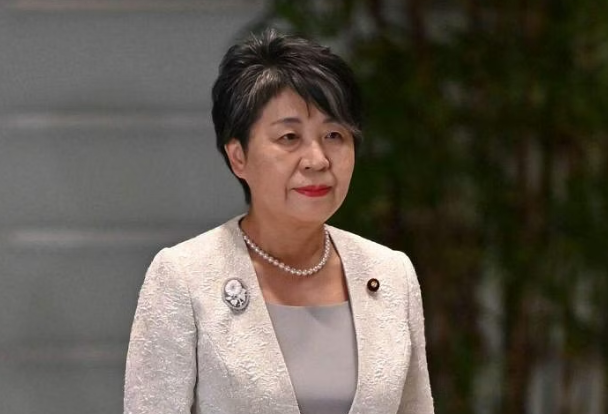

# “针对中国”？日本外相计划邀中亚五国参加G7外长会

（观察者网讯）据《日本经济新闻》11月2日报道，日本外相上川阳子计划邀请中亚五国外长在线参加下周在日本举行的七国集团（G7）外长会议。日经称，中国正在拉拢中亚地区，而日本希望加强对该地区的外交接触。

 _日本外相上川阳子/法新社_

哈萨克斯坦、乌兹别克斯坦、土库曼斯坦、塔吉克斯坦和吉尔吉斯斯坦的部长预计将出席11月8日举行的以该地区为重点的会议，讨论的议题还可能涉及新一轮巴以冲突、俄乌冲突以及印度-
太平洋地区。

日经称，这五个国家曾是前苏联的一部分，拥有大量的石油、天然气、铀、黄金和其他资源，并且在中国“一带一路”倡议上具有战略地位。特别是在俄乌冲突爆发后，G7和中国都希望扩展与中亚国家的联系，而日本此次发出邀请，也是G7加强与中亚接触战略的一部分。

报道还提到，世界多国领导人如今都在抓紧拉拢中亚国家。例如法国总统马克龙正在访问哈萨克斯坦和乌兹别克斯坦，日本首相岸田文雄计划于2024年前往中亚与当地领导人会面。上川阳子今年9月在纽约会见了哈萨克斯坦政府副总理兼外交部部长穆拉特·努尔特列吾，为岸田的访问铺平了道路。

实际上，日本并非第一次把目光投向中亚地区。早在去年12月末，时任日本外相的林芳正就曾与中亚五国外长举行会议，提出了人力资源开发、脱碳技术开发等支援措施。法媒认为，此举旨在牵制在中亚具有强大影响力的俄罗斯和中国。

俄罗斯外交部发言人扎哈罗娃曾表示，日本对中亚国家的经济路线，显然是由美国授意，很久以来旨在破坏多年来与俄联邦建立的广泛经济关系。她指责日本似乎已经失去推行独立政策的能力，完全转向为其他国家的利益服务，并试图将这些角色强加给其他国家，加强对俄罗斯的全面压力。

11月1日，法国总统马克龙抵达哈萨克斯坦，开始了他中亚行的第一站，之后还将访问乌兹别克斯坦。对此，法国《费加罗报》1日分析称，“在俄罗斯、中国和欧洲争夺影响力之际，法国试图在这两个前苏联加盟国留下自己的印记”。俄罗斯《观点报》认为，法国在尼日尔的政策失败迫使其重新考虑自己的战略，马克龙如今正试图在亚洲站稳脚跟。

**本文系观察者网独家稿件，未经授权，不得转载。**

