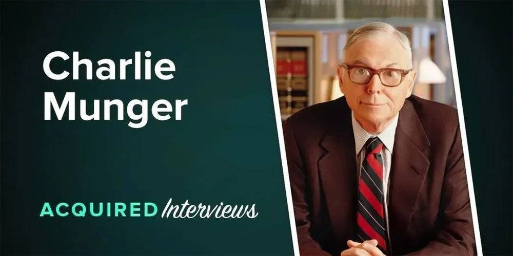

# 万字实录！99岁芒格播客首秀，畅谈1小时投资见解，称比亚迪是个奇迹

查理·芒格，沃伦·巴菲特的黄金搭档，华尔街传奇投资大师，将在明年迎来100岁高龄生日。近日，他罕见地现身热门商业播客节目Acquired的录制，谈论了他的投资观点、经验和教训。

在节目中，芒格谈到了他对Costco、可口可乐、苹果、比亚迪、特斯拉、通用等众多知名企业的投资历程和独到见解，对中国、日本经济和投资的洞见，以及他对于未来的看法。

值得一提的是，Acquired是芒格有生以来第一次做客一档播客节目。Acquired致力于揭露科技行业巨头背后不为人知的故事，今年以来，持续位居美国热门播客前列。

以下是芒格的核心观点：

  * _1_ 散户只是对价格进行追涨杀跌而已。如果我是管理者，我会对短线获利征税，把这些投机者赶出市场。
  * _2_ 在VC投资中能一次又一次地成功几乎是不可能的。所有的投资项目都很热门，投资人必须很快做决定。这就意味大多数人都只是在赌博。
  * _3_ 中国经济未来20年的前景比其他任何大型经济体都要好。中国的头部企业更强大、更优秀，而且它们的估值要便宜得多。因此，我自然愿意在芒格投资组合中纳入一定中国风险资产。
  * _4_ 当你持有某支股票5年后，你可能会慢慢融入其中，或者对它地理解会更深刻。但是，当你意识到你有优势的时候，你就应该下重注。你一定要在最好的投资上下重注！
  * _5_ 如果我们（伯克希尔）自始至终多用一点杠杆，那我们现在的杠杆就会是原来的三倍，且风险也不会那么大，但我们不希望杠杆会破坏避险位置。
  * _6_ （日本）投资是一个显而易见的机会。日本在这10年来，每年利率才0.5%，而这些日本公司确实是根基深厚的老牌企业，他们拥有所有的廉价铜矿和橡胶基地，所以你可以提前10年借到所有的钱，去购买股票，且支付5%的股息。 
  * _7_ 现在会有人发现一些（投资）机会，但这变得越来越难了。我认为购买像（喜诗糖果、爱马仕）这样的公司的机会非常少，因此自己根本不会去寻找。我只相信并寻找那些我认为有可能找到的投资机会。
  * _8_ 我喜欢像苹果一样真正拥有品牌的公司。伟大的品牌，要以适当的价格买入，诀窍就是抓住真正便宜的罕见机会下注。
  * _9_ 如果一些公司的股票真的很便宜，就算它是一家糟糕的公司，我都会考虑持有一段时间。
  * _10_ 王传福是一个狂热的人，痴迷于亲手制造产品，所以他更靠近一线。换句话说，王传福比马斯克更擅长制造。
  * _11_ 沃尔玛太执着于已有的想法，这困扰每个人。他们就是无法接受新事物，因为空间已经被旧的想法占据了。
  * _12_ 我不会随便给任何年轻人建议，会慎重地考虑时机和对象，并不想成为精神导师。世界充满着欺骗和疯狂，年轻人越来越难了。
  * _13_ 你需要跟每个家庭成员和睦相处，你必须帮助他们度过困难时期，他们也会帮助你。我认为这并不像看起来那么难。我认为美国一半的婚姻都非常顺利。

**以下为本次播客全编译内容：**

欢迎来到Acquired，一个专注于伟大科技公司及其背后的故事的播客。我是本·吉尔伯特。我是大卫·罗森塔尔。

主持人：这对大卫和我来说是非常独特的一集，节目的好朋友安德鲁·马克思安排我们与查理·芒格以及其他几个人共进了晚餐，就在查理洛杉矶的家里。你们可以听到安德鲁几次在后台问查理问题。
**我们很确定，这是查理目前做过的唯一一个播客。**

查理与他的合伙人沃伦·巴菲特，是有史以来最多产的投资者之一。查理今年已经99岁高龄了，他将在明年1月1日满100岁。当然，我们的谈话很有趣，因为他是查理·芒格，但同样也因为，经历了99年历史的人，观点很有趣。

当然，我们与查理谈论了Costco，他在过去50年中投资零售商的经历。我们还听到了他对其他一些问题的看法，比如建立良好伙伴关系所需的条件、全球证券市场的问题、投资与赌博的概念以及当今世界的投资机会。

散户其实是在赌博

主持人：查理，我上周末看了NFL（美国国家橄榄球联盟）比赛，现在似乎每个广告都与体育博彩有关。这对美国有好处吗？

芒格：没有，当然没有。赛马以及赌场对美国有好处吗？当然没有。他们只是非常受欢迎。就是这样。

主持人：沃伦已经赌上了。

芒格：好吧，但沃伦从未豪赌过，他比较谨慎，记住，沃伦不是一般人，不会轻易拿一成的胜算去冒险。对。就是这么简单。

主持人：下一个话题是股市散户交易，对许多美国人来说散户交易这类似于赌博。

芒格：嗯，这就是为什么它是有组织的。散户对于公司或发生的任何事情都一无所知，他们只对价格进行追涨杀跌而已。
**如果我是管理者，我会对短线获利征税，把这些投机者赶出市场。这对每一个市场参与者都有好处。**

主持人：你对Renaissance Technologies等量化投资公司的算法有什么看法。

芒格：Renaissance的第一个算法非常简单。这个算法会筛选历史数据，他们能决定什么？

他们发现，如果（股票）连续两天收涨，接下来连续两天收跌的情况，比一天跌（涨）一天涨（跌）更加常见。

他们意识到这是源于“奖励心理”，人类的内心深处是一个自然的趋势追随者，尤其在进行短期押注的情况下。量化公司利用计算机编程在上涨的第一天自动买进，然后在第二天收盘之前自动卖出套现。每天重复以上的动作，每一天，中央清算机构都会说，今天结算的话有850万美元，到了第二天就可能变成943万美元。

结果是，最容易的交易是前端，指数基金必须进行的交易。没错。
**他们年复一年地为获得回报而提高杠杆，将杠杆变得越来越高。因此，他们的交易量越来越大，但是利润却越来越微薄，这给他们带来了巨大的风险，我自己是绝不会这么做的。这是他们轻松获得回报的唯一方法——巨大的杠杆。如果你已经很富有，这个杠杆会让你发疯的。**

投资Costco的原因

主持人：我很好奇，你第一次是怎么想到投资Costco（前身Price Club）的？

芒格：Rod Hills（芒格的合伙人之一）认识Sol Price（Price
Club创始人），他了解Sol的生意。他对我说，你得去见见他。所以我开车直奔他的商店和Sol聊天。当然，Sol是一个非常聪明的人一直是一名律师，直到39岁，他开了一家做政府雇员生意的会员制折扣商店。

主持人：这是在Fedco时代吗？

芒格：他不再是Fedco，1975年来自德国的Hugo Mann收购Fedmart三分之二的股权。

主持人：在Price Club与Costco合并之前，你有没有投资过它？

芒格：是的，我买了他家的股票，但我是自己在股市上买的，我没有得到任何帮助。

主持人：那么你最终是怎么认识人Jim Sinega（Costco的创始人）的？

芒格：嗯，Sinega想要沃伦成为Costco的董事，他正寻找有卓越的金融声誉的投资者。

主持人：作为一个独立的董事吗？

芒格：是的，他（沃伦）不愿意去，说你让查理去做吧。我接受更短的飞机行程去独董会议，就是这样发生了。

主持人：伯克希尔是否曾试图成为他们的股东或获得客户。

芒格：我曾建议巴菲特在家乐福（Carrefour）离开印度时购买法国人的股份，但巴菲特拒绝了这个建议，因为他不喜欢零售业。

主持人：只是他不喜欢零售还是有什么别的反对意见？

芒格：他害怕零售业，他是对的，渐渐地，零售业中曾经强大的一切都消失了，合作伙伴离开了，零售有太多竞争对手，零售太难做了，他很担心。

主持人：他在Diversified Retailing这家公司有过糟糕的经历对吗。

芒格：不，我们从Diversified Retailing中赚了很多钱，我们并没有从零售行业中赚钱。

整个故事非常简单，巴菲特和我买下了这家位于巴尔的摩的小型百货连锁店。这是个巨大的错误，因为竞争太激烈了！ 我们刚签完字后，就意识到我们犯了一个可怕的错误。
所以我们决定扭转局面，承担看起来愚蠢的后果，而不是让它直接破产。 在那些衰退的年代，我们就买买买，所有的钱都进入了这些股票，当然我们让它翻了两番。

主持人：但这成就了Blue Chip吗（在20世纪60年代晚期到70年代早期，芒格、盖林和巴菲特逐渐收购了Blue Chip
Stamps的控股股份。这家小公司是做帮助零售商家发行优惠券的生意。消费者收集这些优惠券，然后到门店用于消费。）

芒格：我们应该做一些人们不知道的事情，是的，我们大约花了2000万美元买下了一家小型储蓄和贷款公司。当我们离开那家公司时，我们从2000万美元的‘小投资’中拿回了超过20亿美元的有价证券，这些证券成为投资内布拉斯加州的保险公司基础资本的一部分。这就是每个人都需要的、完美的开端。

主持人：在我们聊到Costco的节目中，我们从大约10年前的一次伯克希尔会议上的笑话讲起，沃伦讲了一个关于你在一架被劫持的飞机上的笑话，劫机者可以满足你最后一个请求，你说你想发表演讲。

芒格：这个事儿提醒了我。

主持人：巴菲特的回答相当于“开枪打我”。我们希望你能给我们讲讲Costco的优点？

芒格：
**你一生中很少会知道自己是对的，且会确定你做的事情会奏效。也许一生只有5、6次你们需要这样去做，而在早期可能会尝试两三次。很多人都破产了，以为一切很容易，而实际情况是非常困难和罕见的。**

主持人：是什么让你意识到Costco是一生中为数不多的时刻之一？

芒格：他们的售价比美国任何地方都便宜，且他们是大型、高效的商店。Costco有充足且宽敞的停车位，所有停车位都有10英尺宽，以奖励积分的方式给予到店的人特殊福利；
让供应商等待（付款）直至Costco拿到消费者支付的货款。

你有一个像Costco一样大的企业。一直贯彻执行“极致性价比”战略，且又有大型停车场，你想错过芒格案吗？

公司一直贯彻执行“极致性价比”战略，通过低价优质的商品和聚焦3700个爆款SKU，带来单品更高的销售量和更高的周转效率，而高销量和高周转又反过来推动销售成本和运营费用的降低，形成正向循环；在会员经营端，会员费为主要利润来源，会员费收入和公司净利润规模基本相等，推进公司业绩实现持续高质量的成长。

主持人：你有没有见过另一个利用低SKU（库存单位）和低成本来取得成功。

芒格：加利福尼亚州的一家小杂货连锁店盖尔森兄弟（Gelson's），他们采用了与Costco类似的策略，但他们的经营方式不如Costco高效，因此无法实现类似的成功。

在最好的投资上下重注

主持人：当你回顾这些一生中为数不多的伟大公司之时，你应该大举押注，作为年轻的投资者，你会对David和我提出哪些建议？

芒格：
**当你持有某支股票5年后，你可能会慢慢融入其中，或者对它地理解会更深刻。但是，当你意识到你有优势的时候，你就应该下重注。你知道你是对的，但是商学院可不会教这些。这可太不可思议了。你一定要在最好的投资上下重注！**

主持人：你如何培养这种信念水平？

芒格： 你在不断地工作探索，你认识到了它，通过大量的阅读和思考来理解。

主持人： 你和沃伦有着长达半个世纪的融洽合作关系，有什么变化吗？

芒格：在我们共事的早期阶段，有很多无法判断的事情，没有任何一样事情可以轻易给出芒格案。

主持人：那你们如何维持融洽的关系。

芒格：我们都很相似，我们都想让家人安全，为投资者做好工作等等。我们有相似的态度。

伯克希尔应该使用更多杠杆

主持人：在这几十年间，想法有变化吗？

芒格：没有，沃伦依旧很在意安全这件事，更关心伯克希尔股东的安全，而不是其他事情，
**如果我们自始至终使用更多一点的杠杆，我们现在的杠杆就会是原来的三倍，且风险也不会那么大，我们不希望杠杆会破坏我们的避险位置。**

主持人：伯克希尔的杠杆，无一例外都是没有提前还款要求的资金，也就是“稳定的钱”。假设你开一家新店，当然是使用杠杆，没有资本，谁不想拥有一个没有存货的企业呢，对吧，在开店的第一天就欠供应商大量资金，而这些货物却迅速卖出。你怎么看？

芒格：这样的情况终究会出现反转。

主持人：你怎么看债务？

芒格：现在许多制造业公司可以强制供应商承担所有的库存成本。这些制造公司通过与供应商的合作，将库存负担转嫁给供应商。

主持人：回到合作伙伴关系的话题，David和我已经成为这个播客的合作伙伴10年。当然这样的合作关系与投资不同，但仍然是一个需要共同完成的事业。与沃伦合作50年后，你对建立持久的合作关系有什么建议？

芒格：如果你喜欢彼此并喜欢共事，这会很有帮助。但我不使用任何一种公式。许多长期合作良好的伙伴关系之所以能够持续，是因为一个人擅长一件事，另一个人擅长另一件事。他们自然分工，每个人都喜欢他正在做的事情。

比如Costco的Jeffrey Brotman和James
Sinegal，Brotman非常聪明但不是零售商出身，当所有董事会成员决定让Brotman担任董事长兼CEO的时候，Sinegal表示反对。那是一次非常不愉快的董事会会议也是一次大内斗，后来Brotman还是让步了。

主持人：这次内斗是在你加入董事会后吗？

芒格：是在之前。

主持人：你认为，你和沃伦并不居住在一个城市对于你们长期维持的伙伴关系是有利的吗？

芒格：对我来说可能有所帮助，但是巴菲特与所有人都保持着非常紧密的关系，且每周六都会在伯克希尔总部吃午餐。我和巴菲特在年轻时有很多共处时光，因为那时候没有那么多事可做。随着年龄的增长，他们有更多的事情要做，生活中的其他事情也增多。这跟年轻的时候是不同的。

投资成功是非常困难的，在风险投资领域，一次又一次地投资成功几乎是不可能的。

VC行业整体做得很差

主持人：你对风险投资（Venture Capital）有什么看法？

芒格：一些项目可能变得非常火爆， **你必须快速决策，所有人都只是在赌博** 。

主持人：你认为VC在社会中是否发挥了其应有作用？

芒格：没有， **我认为VC行业整体做得很差。**

剩下的一部分查理芒格关于VC的看法并未录音，但话题转向了比特币。

主持人：关于比特币，你在很多评论中都提到了，我很好奇你对这个特定角度有何看法：比特币作为一种独立的价值存储方式而不与国家挂钩，是否是一件好事？

芒格：对全球而言，拥有一种全球范围内接受的货币是有益的。在过去，英镑曾是国际投资领域的主要货币，然后逐渐转向美元，并且现在仍然以美元为主。一些国家比如中国拥有大量美元储备，因为他们购买美国的产品和服务，而美国可以自主发行美元。

主持人：那对于那些无法获得美元的普通人又该怎么办呢？

芒格：当人们手头有足够资金时，他们总可以获得美元。美元是很容易被换取的，无论你身在何处，都可以轻松地获取。

主持人：回到风险投资在社会中所扮演角色的话题，如果你可以设计一个完美的系统来为一个国家提供资金，你会如何做？

芒格：
**VC做好了，这是一个非常合法的业务。如果你想给正确的人权利并培养他们，你就要帮助他们。你知道这场游戏的诀窍，所以你可以帮助他们做好生意，但又不会过多干扰他们。他们会讨厌你。总的来说，在接触过大量来自VC的人之后，企业中的人其实往往会很讨厌这群VC。**

他们不觉得VC是他们的合作伙伴，不觉得这群VC是在帮助他们，相反，他们认为VC只关心自己，所以他们不喜欢这群VC。

主持人：那是否有其他可能的运作方式呢？

芒格：在伯克希尔并不是这样的。伯克希尔的策略并不会因为其他公司提高价格而轻易投资。如果某个业务存在问题，而伯克希尔无法解决这些问题，我们可能会出售这个业务。如果某个业务是相当不错的（a
halfway decent business），伯克希尔通常不会出售它。这种策略有助于建立声誉并维持长期的商业关系。

主持人：买入并持有策略是否是让投资者与资产管理者之间利益和目标达成一致的关键因素？

芒格：许多人都按照标准方式处理事务，律师们使用标准文件。在特定的投资环境中，大多数人都取得了相似的成果。你不想通过欺骗投资者来赚钱。很多风险投资公司采用了不道德或剥削性的方式来盈利。

世界充斥着类似高盛合伙人们成立的私募基金，他们筹集了数十亿美元或类似的金额，对投资者收取2%的管理费以及其他费用。这种做法使他们能够获得丰厚的回报。但是投资者并没有获得很好的回报。

主持人：你认为这是基金管理费结构的问题吗？

芒格：除非你能够取得非同寻常的投资成果，否则不应该收取额外的费用。假装能够取得出色的投资结果比实际取得这些结果更容易，因此风险投资业务吸引了不适合这一行的人，那些将风险投资视为获取高额回报的手段，而不是为了真正的投资成功。那些从风险投资中赚取最多钱的人往往类似于投资银行家，决定要进入哪个热门新领域。

主持人：那你认为大型捐赠基金应该如何做呢？

芒格：它们已经开始行动了。这些捐赠基金表示他们仍愿意支付高额管理费，但在基金的下一个投资周期投入两倍的资金且不会支付任何管理费。这意味着管理费降低了50%，这种费用结构的改变正在美国各地发生。高额管理费让他们感到愤怒和被误导，同时认为这样的费用结构不合理。

投资越来越难了

主持人：对于刚才你提到的关于风险投资的问题，目前市场上资金充裕且竞争激烈，当前的投资环境与过去的“Cigar
Butt”（便宜股）时代相去甚远，当前市场是否还存在低估的、有价值的投资机会吗？

芒格：会 **有人发现一些机会，但这变得越来越难了。我认为最简单的案例之一是Home
Depot决定模仿Costco的商业模式，并把它直接放到家具领域。这是一个很好的商业决策，Home Depot因此也赚了很多钱。**

主持人：还有谁在模仿Costco的商业模式吗？

芒格：还有另一个，Floor & Decor，它们在其地板产品的销售上模仿Costco但不断添加各种其他品类或许会成为问题。

主持人：为什么沃尔玛没有竞争过Costco？

芒格： **他们太执着于已有的想法，这是每个人的困扰。他们就是无法接受新事物，因为空间已经被旧的想法占据了。**
他们形成了购置地产的习惯，即使那些地方原本毫无价值，因此入驻成本经常为零。而且它们知道如何建造大型店铺，这就是它们的策略。

因此对他们来说，入驻富裕地段并因此付费让他们感到被冒犯。Costco只专注于富人居住的好地方，而沃尔玛多年来对此未采取任何行动应对，这是一个严重的错误。

主持人：你认识沃尔玛的创始人Sam Walton吗？

芒格：我没见过他，我认识他其中一个儿子。他把Walton Enterprises分成了六部分，因此他们从来没有缴纳过太多税。

比亚迪是个奇迹

主持人：说说你对于汽车行业和汽车制造业的看法。

芒格：现在进入汽车行业并获得高额利润十分困难，没有人知道谁会取成为最终的赢家。电动汽车的出现彻底改变了整个汽车行业，并且进入需要大量的资本投入。汽车销售的方式也发生了变化，加之汽车制造业中强大的工会存在。所以他甚至没有关注汽车行业。

主持人：由于电车颠覆式的创新，你认为今天的汽车行业相比于50年前更值得投资吗？

芒格：也许对于一两家真正优质的电动汽车企业而言是的。但对于其他公司肯定不是。

主持人：你觉得比亚迪是这一两家之中的吗？

芒格： **比亚迪是个奇迹。那个家伙（王传福）每周工作70个小时而且智商超高。他能做到你做不到的事，他可以看着其他汽车制造商的零部件搞清楚如何制造它们。**

主持人：你投资了现代汽车，这项投资对你来说怎么样？

芒格：他们也很聪明。我损失了一些钱但是不多，我很固执，一直坚持到几乎回本才卖掉。

日本是一个显而易见的投资机会

主持人：关于伯克希尔对日本商社的投资，为何巴菲特在日本的投资是不二之选？

芒格：
**这是一个显而易见的投资机会。如果你像巴菲特一样聪明，也许一个世纪有两三次，你就会得到这样的想法。日本的利率10年来每年才0.5%。而这些公司确实是根深蒂固的老牌企业，他们拥有所有这些廉价的铜矿和橡胶基地，所以你可以提前10年借到所有的钱，去购买股票，并且支付5%的股息。**

不用投资、不用思考，就有大量的现金流，你多长时间才能找到这样一个机会？如果你能在一个世纪里获得一两次这样的机会，你就足够幸运了。
我们可以做到这一点——因为伯克希尔的信用，但是其他人都做不到。

芒格：提醒我了，我最近有研究过耐克这家公司。但我不喜欢这种时尚公司。如果是爱马仕我会投资，但除此之外我并不会想要投资一家时尚公司。

大品牌拥有强大的定价权

主持人：对于LVMH这家公司，你怎么看？

芒格：如果你有足够的时间、耐心和优秀的能力，你可能能够用一生的时间或者三、四代人的时间达到类似LVMH这样的成功。然而，即使有这么多时间，要成就像他们一样成功的事业也并非易事。

主持人：你认为爱马仕和LVMH这些世界上最好的品牌他们持久价值是什么？是什么让他们经久不衰？

芒格：他们拥有品牌忠诚度，且花了一个世纪才做到这一点。

讨论转向将Kirkland Signature与爱马仕（Hermès）品牌进行比较。

主持人：你如何看待品牌的价值？

芒格：
**我们很难不喜欢品牌。因为我们曾经有幸以2000万美元的价格买下了喜诗糖果，这是我们的第一笔收购。我们很快发现可以每年将价格提高10%而且无人在意涨价与否。我们在没有提高销量的情况下提升了利润。在这40年左右的时间里，我们每年将价格提高
10%。这是一家非常令人满意的公司。**

不需要任何新的资本投入，这就是它的好处。我们买下它前后，公司的基本情况没有什么变化，仍然拥有两个大厨房和一些租赁店。当Charlie
See的长子Laurence See去世之后，由于See
family需要支付高额的遗产税，所以他们迫切希望出售公司。1972年我们购买喜诗糖果的时候，它的税前收入只有400万美元。

主持人：所以购买机会只出现在See family需要流动性来支付遗产税的时候

芒格：我们之所以知道这件事是因为Charlie Se和Blue Chip Stamps的一位投资顾问Robert
Flaherty在去往夏威夷的游轮上相识。我们向Robert支付了一笔发现费，尽管从那以后我们再也没有支付过。

主持人：你怎么看喜诗糖果或者爱马仕所在的品类中由品牌决定定价权？

芒格：我认为购买像这样的公司的机会非常低，因此自己根本不会去寻找。我只相信并寻找那些我认为有可能找到的投资机会。

主持人：你怎么看其他品类中那些知名品牌呢？比如包装食品或者其他

芒格：有很多专业投资者除了知名品牌的股票其他什么都不买。他们通常从雀巢开始，然后只是查漏补缺。他们可能相对市场平均表现略好，但并不会取得巨大的成功。

主持人：为什么亨氏能够拥有定价权但是卡夫却没有？

芒格：这很有趣。某些品类的品牌对消费者来说非常重要，例如亨氏番茄酱，人们可能因为特定品牌的口味而改变品牌选择，愿意为其支付更高的价格。因此，我们可以提高亨氏番茄酱的价格。然而，对于其他产品，如卡夫奶酪，人们可能不那么关心品牌，因此试图提高价格可能会导致市场反感，包括最终的消费者（主妇）。

主持人：因为酱汁是难以模仿的独特风味，是商业机会，所以这会带来定价回报。

芒格：是的。人们会习惯并且喜欢上。这种情况在韩国也发生过，一个中国人掌握了每种主要酱汁95%的市场份额。

主持人：可口可乐也是这样吗？

芒格：是的，当然。

成功人士三要素

主持人：有什么是99岁的你相信但是70岁的你不会同意的？

芒格：在70岁的时候我知道投资很难，但我现在知道到底有多难了。但一些收取高额管理费和分成的投资人会说这很容易，并开始自欺欺人，但投资非常难。

主持人：如果回到三四十岁，你还会选择投资行业吗？

芒格：或许会的，因为这符合我的天性。 **但我的确不喜欢高额管理费和分成的模式，更愿意用自有资金来投资，我认为这种方式更好**
，因为能带来更大的自由。这样就不用被迫与投行、投资顾问和VC打交道，就不需要其他人。富有的目的之一是不再需要依赖他人。

主持人：如果你和巴菲特现在都是30岁，你们开始一起工作，你认为你们还会打造出与今天的伯克希尔类似的公司吗？

芒格：不，我们不会。 **几乎所有取得杰出成果的人都具备三个要素：非常聪明，非常努力工作，非常幸运。**
如果你早早开始并且长时间不断尝试，也许最终你会具备其中一两个要素。

主持人：如果今天重新开始，保险仍会是你的选择吗？

芒格：这取决于性格特点。保险对于某种性格的人是理想的，它需要极大的耐心和时间来获得回报。而且需要长时间与对手进行竞争，赚钱十分困难。

主持人：我曾经听到过你的观点，一旦你有足够的财富来自负风险，你应该尽量不再购买保险。

芒格：想想那些因过度饮酒后出现问题然后向保险公司提出巨额索赔的人，为什么要支付自己的份额来弥补那些不明智行为的人的损失。

主持人：你现在有保险吗？

芒格：我没有火灾保险。

主持人：你有汽车保险吗？

芒格：我必须这样做，只有这样才合法。

科技巨头是最大赢家

主持人：现在大家都非常关注技术，我很好奇你不是技术出身，你是如何看待投资苹果这件事，是什么让你有如此有信心？

芒格：每个投资人都需要在12家公司中有一些重要的参与，才能比其他人做得更好。至少需要重注两三家公司以使自己的投资表现更优，如果你有这种想法，苹果就是十分合理的选择，想到这点并不难。

主持人：列出投资的对象其实并不难，比如FAANG或者Meme股，微软、苹果、谷歌、Facebook（已更名为Meta）。但是选择一个并投入数千亿美元，创造数千亿价值，这对我来说十分困难。你们是怎么选的？

芒格：我们找不大其他值得投资的股票。

主持人：因为估值？

芒格：是的，我们低价买入，然后得到大约10倍的受益。

主持人：可能是2015年首次买入的。对我来说，这个概念很有趣，如果你看看困境债务，我认为沃伦在上次伯克希尔的信中指出，这是一些非常好的决定。或者你看看风险投资，它是经典的幂定律分布的。其中任何一个资产的表现都可以归结为几个非常好的决策，这些决策贯穿了他的整个职业生涯。

芒格：正是如此。

主持人：但没有资产可以反复用到这些策略。

芒格： **不，不，机会并没有消失，而是变得很小。**

主持人：你提到了这个想法，当我们谈论苹果时，有一些公司非常重要。 **你觉得这些大型科技公司是最大的赢家吗？**
所有的养老金、伯克希尔和大学捐款以及每个人的退休金都投资在这些公司，你认为这是理所应当的结果吗？我们必须以这种方式结束吗？

芒格：是的，是理所应当的。

主持人：是什么导致了这种结果？

芒格：人性和竞争。

主持人：哪一个因素最重要？

芒格：这种疯狂冒险的资本，当他们都变得愚蠢时，就会产生一个自然而然的结果。

主持人：未来会出现一个价值20万亿美元的公司吗？然后出现更大的公司？

芒格：会的，我认为会。

看好中国经济

主持人：你会继续在中国投资吗？你对此持什么立场？

芒格：
**我对中国的立场是，第一，中国经济未来20年的前景比其他任何大型经济体都要好，第二，中国的头部企业更强大、更优秀，而且它们的估值要便宜得多。因此，我自然愿意在芒格投资组合中纳入一定中国风险资产。**

**至于风险值具体是多少，这不是一个科学问题，但自己不介意是18%或者其他的比例，只要芒格家族认为合适，我都同意。**

主持人：你会在这个时候持有台积电吗？

芒格： **我喜欢像苹果一样真正拥有品牌的公司。** （没有正面回答）

只研究便宜股和伟大的品牌

主持人：我很好奇，还有哪些没有被提到的大公司，其优点是值得投资者研究的？比如，Costco的优点？

芒格：我只研究两种公司。好吧，我是本.格雷厄姆(Ben Graham)的忠实粉丝。
**如果一些公司的股票真的很便宜，尽管它是一家糟糕的公司，我都会考虑持有一段时间。** 我偶尔会这样做，并且取得了一定成功。

但我有点像霍华德·马克斯（Howard Marks），曾经下过一两次特别大的赌注，并没有数百次。数百次获得的容易钱是几乎不存在的。

主持人：一种是“Cigar Butt”(便宜股)，另一种是什么？

芒格： **伟大的品牌，要以适当的价格买入，诀窍就是抓住真正便宜的罕见机会下注。Costco目前的股价还可以，但会变得越来越困难。**

主持人：不考虑股票的前景，你如何看待Costco未来10年的业务？

芒格：可以做得很好。

年轻人越来越难了

主持人：还有一个问题。你最希望给年轻人什么建议？

芒格： **我不会随便给任何年轻人建议，会慎重地考虑时机和对象，并不想成为精神导师。世界充满着欺骗和疯狂，年轻人越来越难了。**

主持人：一切似乎都被高估了，可以去哪里寻找有吸引力的机会？有可能找到吗？

芒格：当然有可能，只能是有可能的，事实上可能已经发生了。

主持人：如果资本充足但机会稀缺，怎么才能变得富有？

芒格：自然的本质如此。生物演变使像人类这样高度进化的生物出现，但无论如何，这一过程是通过残酷的竞争和数万年的相互残杀来实现的。换句话说，自然界通过竞争来提高智慧的系统，对于那些失败者而言并不愉快。

主持人：因此，在过去的一百年里，我们残酷地将所有这些价值从劳动力转移到了资本。现在， **资本都在争夺非常小的机会。**

芒格： **资本从来都不是那么容易的，只是如果回看很久以前，与今天相比是相对容易的。**

主持人：如果持续变得困难，你就会得到自然竞争的结果。

芒格：是的，现代的民主制度出现一些挑战后，会发生什么？天知道会发生什么？也许会像欧洲一样，这是相当不正常的。

主持人：有人认为目前世界上没有足够好的想法与想要投资它们的资本体量相匹配，这种想法是不是过于悲观？

芒格：成功从来都不容易，我彻底明白，这从来都不容易，而且现在变得更加困难。你需要注意如何与人打交道，并且建立良好的声誉。

主持人：我认为 **，你不是说没有任何机会，而是期望值更低和财富更少。**

芒格： **美妙之处就在于你只需要变得富有一次就好，你不需要爬四次这座山，你只需要做一次。**

主持人：好吧，这是你的双面哲学，你必须耐心等待巨大的机会，但当机会来临时，你必须意识到。

主持人：再问一个有关Costco的问题，我一直想问的是，低SKU和高库存周转率等多种策略如此美妙地组合在一起，如此明显，为什么没有其他公司做到？

芒格：需要很强的执行力才能做到这一点。你真的必须着手去做，然后每天、每周、每年作分析，持续40年。这并不容易。

成功=商业模式+文化

主持人： **那么你认为成功必须依赖商业模式和文化吗？**

芒格：是的， **文化加模式。** 是的，绝对。非常可靠、勤奋、坚定的执行40年。

主持人：以番茄沙司的故事为例。你可以将番茄沙司的价格提高3%，没有人会注意到，但如果真这样做，那将摧毁一切。

芒格：我会说，核心原则是不要提高市场价格，努力保持价格低廉并且长期如此。

主持人：这就让我想到了热狗的故事。当克雷格接任Costco首席执行官时，他确实试图提高热狗的价格，这个故事是真的吗？

芒格：我不知道，没人和我谈过这个问题。

主持人：董事会层面也没有讨论过吗?

芒格：没有。他们不会认为讨论热狗的价格是重要的事情。

主持人：Costco让我着迷的一件事是，他们似乎每年只能增长10%，尽管他们没有资本限制。即使能免费获得大量资金，他们似乎也会这么做。

芒格：我可以告诉你的事，一年很难开太多店。新店铺、新经理、新政治环境等等。这些都是很难的事情。而且还有很多东西需要学习、传授并落实到位。所以他们不想做超出他们能轻松处理范围的事情。

主持人：我发现Costco有趣的一件事是，尽管他们的价格是最低的，但是客户大多数是富有的人。这是随着时间推移发现的意外吗，还是早就意识到了？

芒格：Saul Price在Price Club时期就意识到了这一点，他总是希望富人努力省钱。

主持人：不仅仅是因为他们是最富有的客户，他们是很聪明的顾客，他们是挑剔、富有的客户。

再聊聊在Costco之外的一些话题，您在今年的《每日新闻 》（Daily Journal）年会上提到， **年轻人了解规则，老人知道例外。**

芒格：这是Peter Kaufman的一句老话。

主持人：你发现，生活中最有用的例外是什么？

芒格：就拿Costco的这些热狗来说吧，这是一个例外，换作其他人早就会提高热狗的价格了。他们只是不这样做，他们知道热狗是卖点之一，会吸引很多家庭来购物。即使有机会提高热狗的价格，他们也不这样做。

王传福是个天才，比马斯克擅长制造

主持人：有一件事我从未完全理解。我知道你是比亚迪的忠实粉丝，这家中国公司生产电池和电动汽车。

芒格：我可能是个大粉丝，但我确定的是，当这家公司在赛道上疾驰时，我感到非常紧张。这家公司野心非常大。

主持人：这对一家公司而言危险吗？

芒格：当然，这就是让我紧张的原因。

主持人：所以，你认为这家公司是否应该以低于自身能力的速度增长，以获得更持久的成长？

芒格：如果这样做更安全、更容易等等，你就可以这样做。但比如Costco，它们在热狗价格这种极端事项上的做法产生了积极的结果，在一些事情上，它们明智地选择了不改变这些方式。

主持人：这看起来像一个谱系，一边是Costco，它并不是一个快速增长的公司，因为这很困难；另一边是比亚迪这样的公司，实现了疯狂增长。

芒格： **比亚迪今年至少销售了250万辆车，大多数是电动车，这前所未闻。比梅赛德斯多得多。**

主持人：也远超特斯拉。

芒格：是吗？每个公司都曾遭遇过很多麻烦和损失，它们也遇到了可怕的麻烦，制造了错误类型的车辆，犯了很多错误。

但幸运的是，它们处于电动汽车行业的前沿。它的加速性能远超过其他品牌，使其比大多数汽车更有活力。我真的很喜欢比亚迪的电动汽车，在很多方面，它表现得更好。

90度转弯时，比亚迪汽车可以直接移动到对面的平行位置，然后就这样继续前进。轮胎转动90度并前进。如果一个车胎没气了，其他三个轮子依然可以工作，跑上一百英里。

主持人：它们的经济模型会更好吗，因为没有太多的零件？

芒格：更好，因为它们更简单。

主持人：你之前进行过类似的投资吗？您向比亚迪投资了2.7亿美元，现在价值大约在80亿美元。

芒格： **很多“聪明人”会进行VC类型的投资。**
比亚迪实际上是一家流动性较低的上市公司，我们的投资并非VC类型的。他们非常积极地采取行动，像是将油门踩到底，全力以赴。

我们曾劝阻他们不要轻易进入汽车行业。比亚迪是通过收购一家破产的汽车公司，进入了汽车行业。我认为，这对他们而言是坟墓，为什么要做这件事呢。但他们没有听从建议，仍然继续行动。

主持人：当他把这个计划告诉你的时候，你已经投资了吗？

芒格：是的，在犯了巨大错误之后，它运行的非常好。它因为早期的经销商体系差一点就破产了，就差一点。

主持人： **是什么吸引了你投资比亚迪？**

芒格： **那个家伙（王传福）是个天才** 。他攻读了工程学博士学位，看一眼其他公司的零部件，就知道怎么制造，我从来没见过这样的人，他能做任何事情。

他是天生的工程师，并且擅长执行和解决问题，这非常重要。他是各种天赋的集合体，这非常有用。他在电动汽车领域解决了许多问题，包括电动机、加速和刹车等方面的技术挑战。

主持人：如何将他的比亚迪与Elon的特斯拉相比较？

芒格： **王传福是一个狂热的人，痴迷于亲手制造产品，所以他更靠近一线。换句话说，王传福比马斯克更擅长制造。**

报纸业务是一座金矿

主持人：查理，你明年1月1日就满100岁了，这是一个难以置信的日子。你有什么计划吗？

芒格：我会办一场聚会。

主持人：近来有什么让你着迷的东西吗，或者有哪些好玩的？

芒格：就我个人而言，一切都很有趣。即使政治本身很糟糕，但也很有趣。

主持人：当你回头看时，你在和沃伦相处的时间里，什么时候玩得最开心？

芒格：一直都很开心。

主持人：有没有一个你最怀念的特定时代，感觉像过去的美好时光？

芒格：好吧，有一段汗流浃背的时光。

主持人：所罗门兄弟。

芒格：是的，当时我们有大问题要解决，可能会有巨大的损失。

主持人：当我们在播客中审视伯克希尔·哈撒韦公司时，我们的结论是整个特许经营权在所罗门兄弟期间面临风险，堵上伯克希尔·哈撒韦公司的整个名誉和未来。你同意吗？

芒格：没有那么严重，本来就会活下来的。

主持人：如果你让所罗门的整个投资归零，会发生什么？

芒格：一切都会爆炸。我们本可以注销坏账的，我们本可以处理得很好。

主持人：你认为这是你最美好的时光吗？

芒格：我们在《布法罗晚报》的投资上遇到了可怕的问题。

主持人：《布法罗晚报》。

芒格：布法罗当时有两家报纸，我们推出了周日版，引发了一次激烈的竞争。结果，竞争对手破产了。

主持人：那时你们都很年轻，很有进取心。

芒格：不，但我非常积极地想办好周日版。 **如果没有周日版，我不会持有这家报刊50年的时间，** 其他同行也有周日版了。

主持人：是什么让报纸业务在那个历史时刻如此有吸引力？

芒格： **报纸业务是一座金矿。**

主持人：收购《布法罗晚报》以及推出周日版是为了垄断当地的报业。对，要玩一个大游戏，就要在城里玩游戏。有了报纸，你就可以做到这一点。当然，我的意思是，几十年来，报社的EBITDA利润率在50%-60%之间。对吧？

芒格：不，这是小型报社的利润率，大型报社的EBITDA利润率在25%-40%之间。

主持人：抱歉，我忽略了报社的规模。

主持人：实际上，你是否仍然觉得eBay一直在犯罪，你过去是否妖魔化了它？

芒格：确实。 **所以你得到了一家大卡车公司，并从卡车的折旧中扣除了收益。那你就在盈利方面撒谎了。**

通用曾是一家伟大的公司

主持人：我是说，EBITDA利润率的概念被发明时，你见证了它与John Malone 、TCI和Liberty的崛起，对吗？你当时在想什么？

芒格：好吧， **我从来不喜欢单独的极端操作** 。我并不想像John一样被称为伟大的操纵者，他缴纳的所得税比任何人都要少，他只是把一切都推向了极端。

主持人：也许是最后一个问题是，你认为你见过的最伟大的公司有哪些，你持有的，或者是没有持有的？

芒格：嗯，有很多伟大的公司 **。通用汽车曾是一家伟大的公司。是的，鼎盛时期的通用汽车是一家伟大的公司，它只是一步步走向衰落。**

主持人：你认为有多少公司的可预测性，当你开始创业的时候，有很多公司的业务可以说10年后将保持不变。你认为现在还是这个数字吗？还是你认为现在更难了？

芒格： **我认为大多数地方未来的威胁都会发生很大的变化。**

主持人：你认为50年前也是这样吗？

芒格：这是有区别的。伯克希尔拥有很多我称作是专业工业公司的资产，这些公司能够免受真正激烈的竞争，只是因为它们已经成立了很长时间，而且它们非常擅长自己的工作，并且拥有良好的声誉和高价值等等。

主持人：除了伯克希尔和Costco，今天有哪些公司你可以自信地说未来10年的业务状况会像现在一样好？

芒格：我认为很多公司都相当不错，但你通常不能说会发生什么，因为你可能会遇到那种推动一切只为维护公共关系的人。所以不管业务多么出色，都会有点虚伪。

与家人和睦相处

主持人：查理，我有一个私人问题要问你。大卫有一个两岁的孩子，我一个月后就要有第一个孩子了。你对我们建立家庭有什么建议？

芒格：当然， **你需要跟每个家庭成员和睦相处，你必须帮助他们度过困难时期，他们也会帮助你。我认为这并不像看起来那么难。我认为美国一半的婚姻都非常顺利。**
顺便说一句，如果双方都必须迎娶/嫁给别人，也会同样顺利。

主持人：好吧，你说过，拥有一位优秀配偶的最好方式就是值得拥有一个。只要双方都有这样的感觉，那就是成功的秘诀。

芒格：当然是这样，而且在孩子教育这类事情上，你必须信任自己的另一半。

主持人：我同意你的观点，查理。

芒格：祝你好运。

