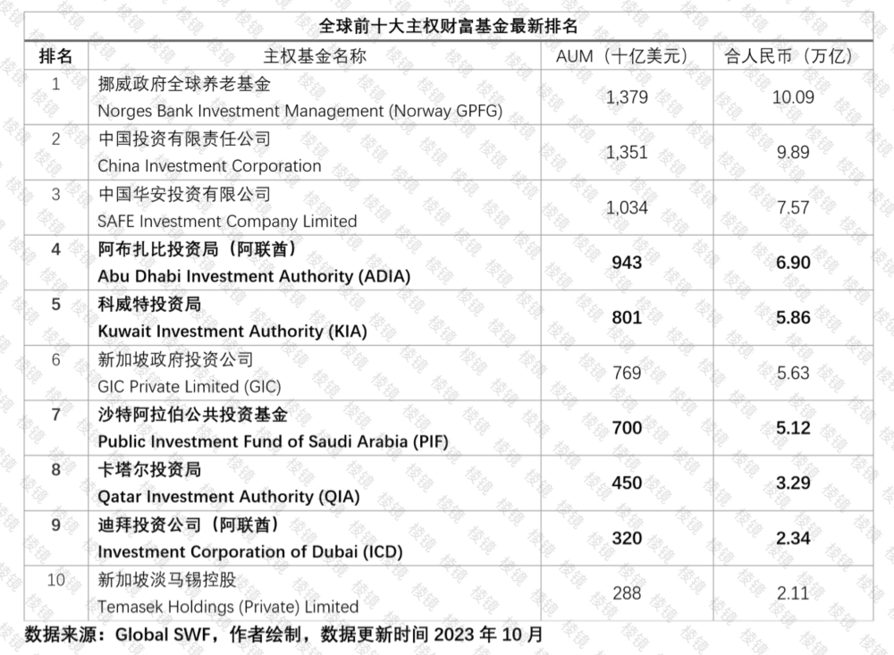
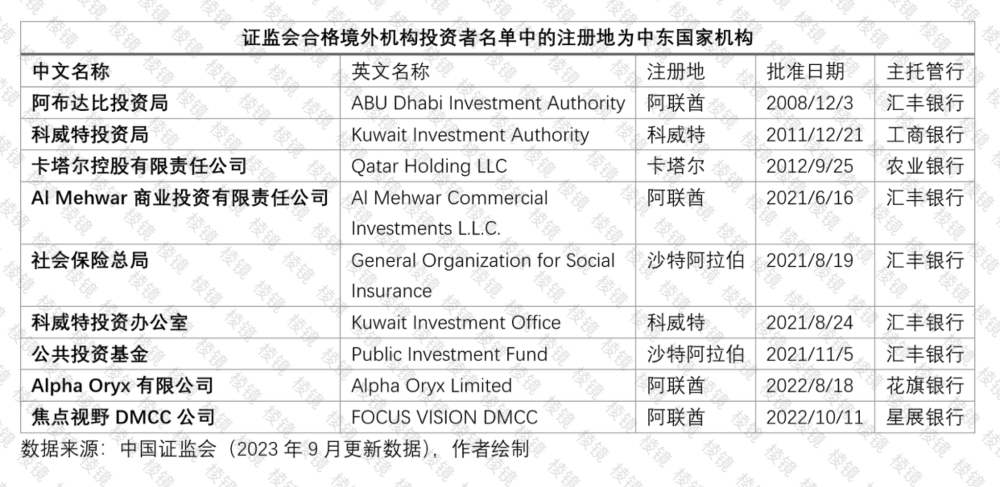
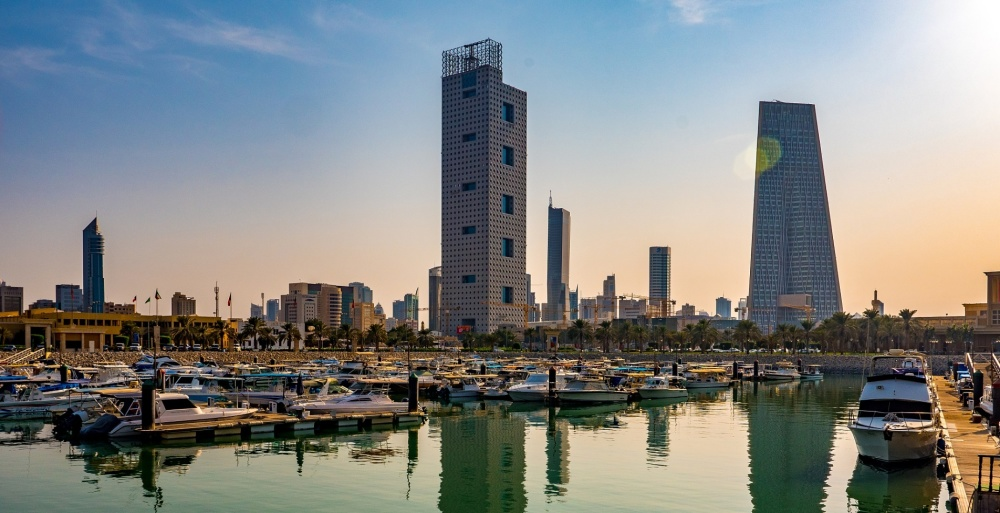
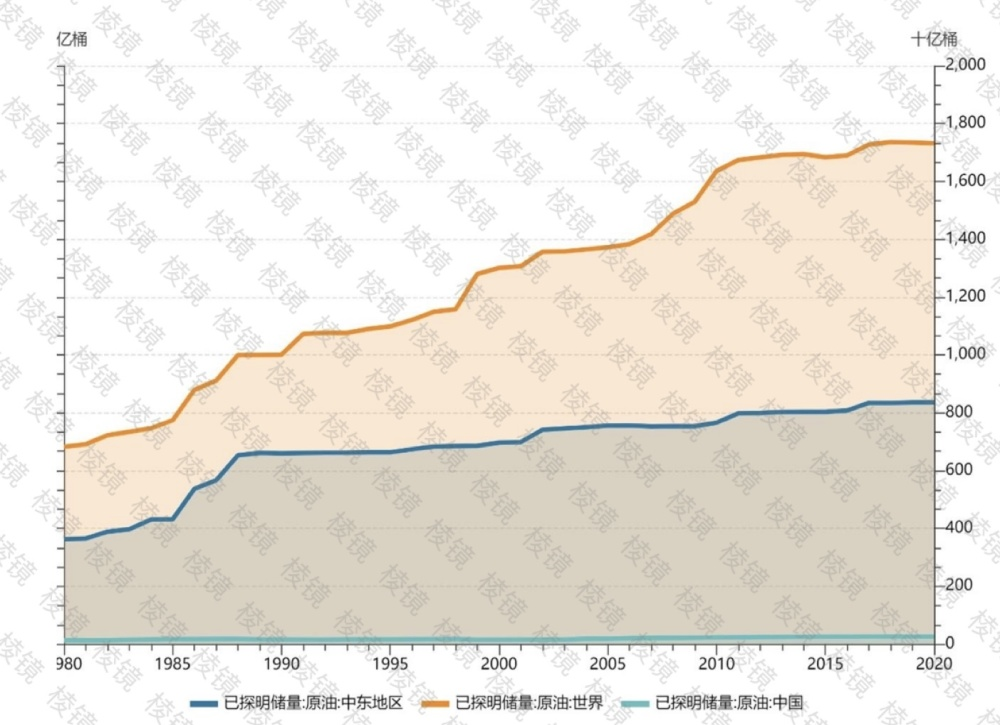
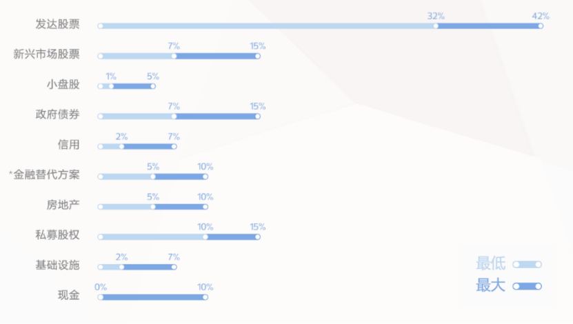

# 中东土豪也炒A股，揭秘阿拉伯世界数万亿美元主权财富基金

_图片来源：视觉中国_

作者|温世君

编辑|陈弗也

出品|棱镜·腾讯小满工作室

巴以冲突的升级，让世界再度聚焦中东。

鲜为人知的是，那里的石油富豪们也正在炒A股。他们掌握着数万亿美元的主权财富基金，早在15年前就开始进入中国。两年前，国际油价、A股股价齐飞，阿拉伯世界的主权财富基金又迎来了一轮集中入华。

今年，A股行情起伏，上市公司的十大股东中，又看到这些巨大体量的主权财富基金闪身腾挪。

**土豪们调研当天，股价飙升16.95%**

A股上市公司股东名单中，阿布扎比投资局(ADIA)出现非常频繁。阿布扎比是阿联酋最大的一个酋长国。阿布扎比政府将以石油收入为主的财政盈余，提供给阿布扎比投资局(ADIA)用于投资。

目前，阿布扎比投资局管理规模达9430亿美元，约合6.9万亿人民币，是全球第四大代表政府投资的主权财富基金（Sovereign Wealth
Fund，SWF）。

从最新发布的2023年三季报看，阿布扎比投资局共进入24家上市公司的十大流通股东名单，而且交易活跃，其中有万亿、千亿级别市值的大公司。

三季度，阿布扎比投资局“抄底”银行股，首次进入中国银行十大流通股东名单，季末持流通股0.0583%，对应市值4.63亿元。

万华化学十大流通股东名单中也出现了阿布扎比投资局的名字，季末持流通股0.62%，对应市值17.1亿元。

对紫金矿业的增持也没有停止，继2021年阿布扎比投资局进入十大流通股东名单后，今年三季度继续买入299.8万股，季末持股市值约18.5亿元。

中小盘股票也是阿布扎比投资局的投资目标：常铝股份、聚灿光电、吉鑫科技三季报披露的十大流通名单中，都出现了阿布扎比投资局这个“新面孔”。这三家公司总市值不高，都在数十亿人民币的范围，因而阿布扎比投资局这三笔投资规模都在千万人民币级别。

卖出离场亦在进行之中，例如不久前因董秘“喊冤”而登上新闻的东方雨虹。

2023年中报，阿布扎比投资局还增持了东方雨虹的股票，位列十大流通股东之八，期末持股对应市值7.34亿元。但到三季报，东方雨虹十大股东名单中已经没有了阿布扎比投资局的身影。

投资调研活动也比较活跃。公开信息显示，今年三季度以来，阿布扎比投资局对宁波银行、开立医疗、赛微电子等上市公司进行了调研。虽然赛威电子公开称“本次（调研）活动属于一家投资机构对一家上市公司的正常访问”，但10月24日，就在阿布扎比投资局调研赛微电子的当天，其股价飙升16.95%。

世界第五大主权财富基金，管理着8010亿美元（5.86万亿人民币）的科威特投资局（KIA）在A股也非常活跃。三季报数据统计，科威特投资局出现在27家A股公司的十大流通股东名单中。

相较于阿布扎比投资局投资集中在百亿市值以上的大公司（近九成），科威特投资局名单中的百亿市值以下的中小市值公司占其投资标的几乎一半。

值得一提的是恒力液压。这是科威特投资局和阿布扎比投资局在A股的“交集”。2023年三季报数据，两家机构分别持股0.595%、0.593%，位列流通股第六、七位。而流动股东第八名的，正是全国社保基金602组合。

**世界上第一家主权财富基金来自中东**

阿布扎比投资局、科威特投资局是最早一批真正进入中国投资的中东国家主权财富基金。

证监会网站显示，早在2008年底，阿布扎比投资局（证监会用“阿布达比投资局”的译法）就获批QFII（合格境外投资者）牌照。

这让阿布扎比投资局成为中东诸国家主权财富基金中最早入华的一家。此时，距离2003年7月中国首次放开QFII，不过四年多的时间。

中国的QFII制度是加入WTO背景下，兑现金融开放承诺、落实资本项目对外开放的系统化制度体系的一部分。简言之，就是允许审批白名单中的“合格境外投资者”，直接兑换人民币在中国A股市场进行投资。

2007年到2008年，A股从6124点俯冲直下，经历了一次历史性的大跌。在当时的背景下，推动外资流入中国股市，成为当时救市“组合拳”的一部分。加快QFII资格审批，降低各类投资限制和门槛，成为后来几年的主流。

继阿布扎比投资局2008年获批之后，科威特投资局、卡塔尔投资局（通过全资公司卡塔尔控股有限责任公司）也在后来几年获得了QFII牌照。

中东国家主权财富基金入华的新一轮的井喷，出现在2021年-2022年。

天时地利，契机很多：

2017年-2019年，明晟（MSCI）、富时罗素、标普道琼斯、彭博巴克莱等国际主流指数相继将中国股票和债券纳入其指数体系。这些指数是很多国际投资者进行投资资产配置的重要标尺，甚至直接影响其股票池的构成。

2019 年 9
月，国家外汇管理局宣布取消QFII额度限制。时任国家外汇管理局新闻发言人、总经济师王春英在随后的答记者问中，也将“境外投资者对我国金融市场的投资需求相应增加”作为政策的背景之一。

2020 年 9
月，证监会、中国人民银行、国家外汇管理局联合发布《合格境外机构投资者和人民币合格境外机构投资者境内证券期货投资管理办法》，新规进一步降低了准入门槛、扩大了投资范围。

与此同时，是国际油价和中国A股的齐升。

由于2020年出现历史上首次“负油价”，沙特阿拉伯主导的欧佩克开始持续减产，叠加美国页岩油产量下滑等因素，以及疫情期间宽松的货币环境带来的大宗商品价格抬升。2021年开始，国际油价开始持续放量上涨。

石油带来了更多的财富，也让这些中东的国家主权财富基金来开始寻求更多的投资目标。

A股也在一轮牛市之中。2021年，上证指数三次站到3700点以上，其峰值3731.69点，为5年来新高。牛市吸引的不仅仅是散户，也有中东“土豪”。

2021、2022两年，沙特阿拉伯社会保险总局基金、科威特投资办公室（KIO）、沙特阿拉伯公共投资基金三家主权财富基金密集拿下QFII牌照。

值得一提的是，科威特投资办公室（KIO）总部位于伦敦，虽然在科威特投资局（KIA）的管辖之下，但有着比较强的自主性。事实上，科威特投资办公室（KIO）在1953年就已经在伦敦成立，是世界上第一家主权财富基金，比科威特独立还早八年。

_图：科威特首都科威特城停满了游艇的码头，中间方形大楼即为科威特投资局总部 来源：视觉中国_

**寻找石油财富之外的替代品，巨大体量足以影响全球市场**

正如一句阿拉伯谚语所言：钱能生钱（المال يولد المال.）。

实际上，世界前十大主权财富基金中，有一半属于中东国家；如果把范围扩大到前100家，有20家属于中东国家。包括以色列和巴勒斯坦，都有自己的主权财富基金巴勒斯坦投资基金。

石油黑金变黄金，中东国家财富的积累，首要的因素是石油。

截止2020年全球已探明原油储量1.73万亿桶，其中中东地区就有0.84万亿桶，几乎占据一半。与之对比的是，中国同期的数据是259.6亿桶。

_图：全球、中东地区、中国已探明原油储量比较 数据来源：bp世界能源统计年鉴，Wind_

科威特石油和天然气储量丰富，居世界第五位。

官方数据显示，在2022-23财年，科威特的石油日均产量为269.3万桶，约占全球总产出的7%，实现了267.1亿第纳尔（约合863.24亿美元）的石油收入。石油收入在科威特财政总收入中所占比重高达93%。

科威特投资局对自己定位有一个关键的描述：就是要找到石油财富之外的替代品（providing an alternative to oil reserves）。

外交部数据显示，截止2023年7月，科威特籍人口数151.78万人。那么科威特投资局8030亿美元资产，如果平均到每位科威特公民身上，人均52.9万美元，约合386.21万人民币。

不仅科威特，在很多依赖石油的中东国家，投资就是未来。让石油换来的资金，变成持续增长的财富，是这些主权财富基金的目标。

另外一个重要的原因是中东国家有着独特的金融环境。

按照古兰经和伊斯兰教法规定，利息是不合法的收入，必须禁止。国家商务部官网关于伊斯兰金融制度有一个比较清晰的解释：“伊斯兰银行是不允许对单纯的资金使用收取费用的。”

因此，在全球的金融体系中，很多来自中东石油资金都要受到“禁止利息”的限制，发放贷款的基础金融商业模式走不通。

这也让这部分巨大体量的财富，成为活跃在全球投资市场的资金。

特别是针对最为富有的波斯湾沿岸国家的资金（伊朗、伊拉克、沙特阿拉伯、科威特、巴林、阿曼、卡塔尔、阿联酋），在国际金融界，甚至有个专门的词汇——gulf
money（海湾资金）。

上述海湾国家，除伊拉克之外的七个国家（阿联酋是联邦制，有多个酋长国均有自己的主权财富基金）的主权财富基金规模，均位列全球百大。

这些钱要怎么投？

今年6月，以95岁高龄去世的经济学家哈里·马科维茨（Harry
Markowitz）有句名言：“多元化（投资）是金融领域唯一的免费午餐（diversification is the only free lunch in
finance）”。1990年，马科维茨曾以其资产组合理论，获得了当年的诺贝尔经济学奖。

在投资界，多元化的资产配置组合已经成为被普遍接受的方法。尤其对于主权财富基金而言，要让这样大体量的资产能够保值、增值，必须构建自己的投资组合。

根据阿布扎比投资局公布的投资策略，其分配到新兴市场股票的投资份额在7%-15%之间。那么，按照其9430亿美元的资产管理规模，就有660-1415亿美元（4831-10357亿人民币）投向包含中国A股在内的新兴市场。

毫无疑问，这些体量的资金，足以影响全球市场。

_图：阿布扎比投资局投资组合资产配置策略 数据来源：阿布扎比投资局_

考量到其资产管理规模，阿布扎比投资局成绩其实还不错。

截止2022年末，阿布扎比投资局20年和30年的年化收益率分别为7.1%和7.0%。如果站在2021年末看，这两个数字还更高一些，都是7.3%。

可以参照的是，2000 年 8 月组建，被媒体称为“吊打所有公募基金”的中国社保基金，成立以来年均投资收益率7.66%。

阿布扎比投资局2023年10月发布的报告显示，其在全球65个国家，拥有1380名员工——相对于其超过9430亿美元的资产管理规模，这个数字不大。

