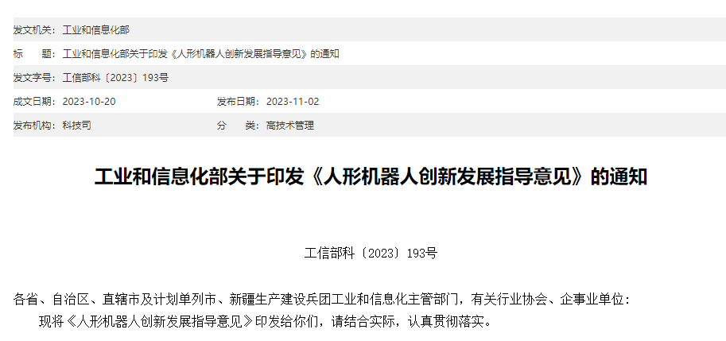
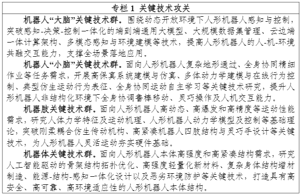

# 人形机器人重磅文件出炉！工信部定义为“颠覆性产品”

**《科创板日报》11月2日讯（编辑 宋子乔）**
今日盘后，工信部印发《人形机器人创新发展指导意见》（以下简称《意见》），称人形机器人集成人工智能、高端制造、新材料等先进技术，
**有望成为继计算机、智能手机、新能源汽车后的颠覆性产品** 。

值得注意的是，这是工信部继10月份提出培育“北斗+”新模式新业态、促进形成新质生产力后，再提“如何形成新质生产力”。

工信部表示，
**我国人形机器人产业前期已有一定基础，但在关键基础部件、操作系统、整机产品、领军企业和产业生态等方面仍存在短板弱项，需要加强政策引导，集聚资源推动关键技术创新，培育形成新质生产力**
。

**《意见》按照谋划三年、展望五年的时间安排做了战略部署**
，提出到2025年，人形机器人创新体系初步建立，“大脑、小脑、肢体”等一批关键技术取得突破，确保核心部组件安全有效供给。整机产品达到国际先进水平，并实现批量生产；到2027年，人形机器人技术创新能力显著提升，形成安全可靠的产业链供应链体系。

**人形机器人关键技术有哪些？** 主要包括负责优化机器人脑力的“大脑”技术，以及让机器人拥有运动能力的“小脑”技术和“肢体”技术。

《意见》提出，要开发基于人工智能大模型的人形机器人“大脑”，增强环境感知、行为控制、人机交互能力，推动云端和边缘端智能协同部署。建设大模型训练数据库，创新数据自动化标注、清洗、使用等方法，扩充高质量的多模态数据。科学布局人形机器人算力，加速大模型训练迭代和产品应用。

另外，要开发控制人形机器人运动的“小脑”，搭建运动控制算法库，建立网络控制系统架构。

机器人肢体即仿人机械臂、灵巧手和腿足，《意见》提出，突破轻量化与刚柔耦合设计、全身协调运动控制、手臂动态抓取灵巧作业等技术。攻关“机器体”关键技术群，突破轻量化骨骼、高强度本体结构、高精度传感等技术，研发高集成、长续航的人形机器人动力单元与能源管理技术。

**工信部还提出培育整机、基础部组件等重点产品**
。对于后者，工信部划定了重点，将基础部组件聚焦在人形机器人专用传感器、高功率密度执行器、人形机器人专用芯片、高能效专用动力组件。

**特种环境和制造业是人形机器人有望最先应用的场景**
。《意见》提出，打造特种应用场景下高可靠人形机器人解决方案，聚焦3C、汽车等制造业重点领域，打造人形机器人示范产线和工厂。医疗、家政、农业、物流等民生领域的人形机器人应用也将进一步推进。

在最后的部分，《意见》还提出营造产业生态、健全产业标准体系、加强安全治理能力等。

产业化迎破晓时刻 全球市场空间有望达千亿元

2023年以来，我们目睹了人形机器人产业的许多进展——特斯拉人形机器Optimus通过视频展示了自主分类物品、单脚保持平衡等能力；小鹏汽车自研的人形机器人PX5完成首秀；傅利叶通用人形机器人开启对外预售；英伟达、Meta发布了重磅机器人训练工具……

**商业化的前奏似乎已经响起**
。广发证券代川表示，2023年是人形机器人产业化的破晓时刻，当前时点刚好是各项技术大突破的交汇点，无论是精密控制零部件方案的迭代升级，还是GPT大模型的不断进步，都让人形机器人产业化的“破晓时刻”更近了一步。上海证券刘阳东称，人形机器人处于商业化前期，需要软硬件不断迭代以达到“类人类”功能，解决成本问题是产业化的前提。

AI大模型发力，有望助力人形机器人快速落地，政策利好则与技术进步一起，共同推动着商业化进程加速。浙商证券预计，
**2030年人形机器人需求量约177万台，全球市场空间有望达1692亿元**
，2023-2030年CAGR达25%。中短期（3-5年）工商业场景率先应用；中长期（5-10年后）个人场景应用空间大。

中国是全球最大的机器人消费市场，众多机构将人形机器人视为新一轮机器人创新周期的核心，积极挖掘本土产业链的机会。

广发证券代川表示，就当前的人形机器人市场整体格局来看，多方势力分别在软件（算法、人工智能技术等）及硬件（自研电机、整体结构、运控能力等）等方面具备其先发优势，同时
**部分厂商已具备商业化能力，有望于今年四季度交付产品。** 人形机器人产业化趋势之潮已至，
**当下应积极关注各家现有企业及新进者的技术路线及产业化进程，并关注成熟产业迁移到人形机器人产业过程中可能发生的技术复用现象**
，等待人形机器人产业“0-1”拐点的到来。

华创证券称，只有在人形机器人整合感知系统、驱动系统、末端执行系统、能源供应系统、计算系统及软件这五大系统后，叠加人工智能方面的突破，才能表现出的“人”的特质。
**传感器作为软件控制和硬件零部件的桥梁，是实现特质最为关键的基础**
。在人形机器人智能化快速升级的背景下，感知层的传感器有望迎来新一波的发展机遇。国内厂商经过长期技术积累，在力感知、状态感知、视觉感知和位置感知多领域均有布局，有望借助自身优势快速切入制造环节。（科创板日报
宋子乔）

