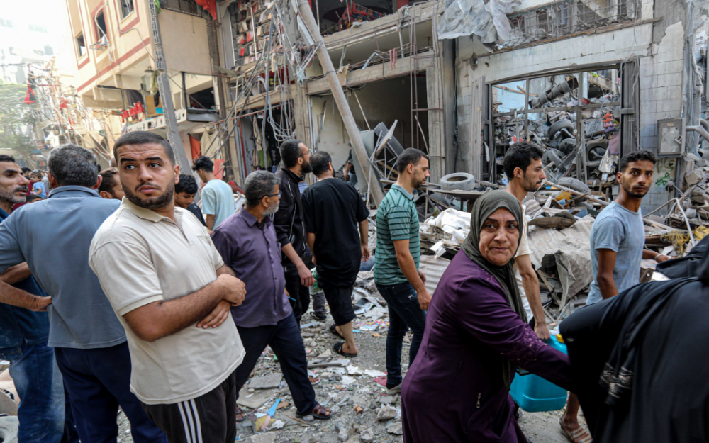
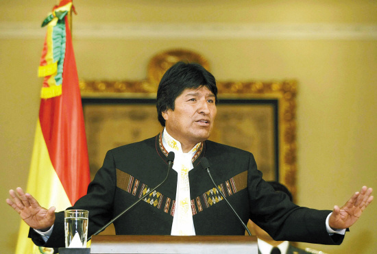

# 媒体：断交、召回，拉美国家开始对以色列说“不”了

_▲10月31日，在加沙地带北部，人们查看以军空袭后的废墟。图/新华社_

据参考消息援引外媒报道，当地时间10月31日，玻利维亚外交部副部长弗雷迪·马马尼宣布，玻利维亚“在尊重生命的原则立场框架内，决定与以色列断交，拒绝并谴责以色列在加沙地带进行的侵略性和不成比例的军事进攻”。由此，玻利维亚成为此轮巴以冲突爆发以来，第一个与以色列断交的国家。

同一天，智利和哥伦比亚分别以“以色列在加沙地带犯下了令人无法接受的违反国际人道主义法的行为”、
以色列“屠杀巴勒斯坦人民”为由，宣布召回驻以色列大使。召回大使，意味着外交关系降为代办级，很多时候此举也被视为断交前奏。

11月1日，以色列外交部作出回应，给玻利维亚扣上了“向恐怖主义和伊朗投降”的帽子。

事情当然不是简单扣扣帽子就能解释得了的。

**为什么是玻利维亚率先断交**

玻利维亚地处南美，与巴以并无重大的利益关联，为什么会率先与以色列断交？

有消息称，玻利维亚现政府是在前总统埃沃·莫拉莱斯的强烈要求下作出的决定。莫拉莱斯与玻利维亚现总统路易斯·阿尔塞同属于一个阵营，即玻利维亚“争取社会主义运动”。

阿尔塞曾在莫拉莱斯担任总统期间的三届政府中先后出任财政和经济部长。

阿尔塞执政后，“争取社会主义运动”出现了内耗。但阿尔塞被认为是技术派出身，需要莫拉莱斯的支持，而莫拉莱斯已经宣布将在2025年再次竞选总统。因此，莫拉莱斯推动玻利维亚政府作出与以色列断交的决定，是有可能的。

而更重要的背景是玻利维亚与以色列建立外交关系的基础本就不牢靠。

早在2008年莫拉莱斯执政时期，玻利维亚政府就曾因以色列在加沙的军事行动宣布与以色列断交。玻以复交，是2020年玻利维亚政坛动荡、参议院第二副议长珍尼娜·阿涅斯担任临时总统时作出的决定。而当年11月，“争取社会主义运动”就在大选中获胜了。

当然，玻以断交还释放了其他信息。以色列的背后还有美国的身影。阿尔塞胜选后，美国宣布愿与阿尔塞政府“开展合作”，而莫拉莱斯是著名的反美斗士。玻以断交，意味着玻利维亚正部分回到莫拉莱斯的外交轨道中。

_▲资料图：玻利维亚前总统莫拉莱斯。图/新华社_

**断交、降级潮是否会蔓延**

玻利维亚、智利和哥伦比亚，都是在2018年—2022年拉美地区掀起的“粉红浪潮”中，由左翼政府上台执政。

而智利和哥伦比亚的左转特别具有标志性意义。

刚在中国进行了深度游的智利总统加夫列尔·博里奇出身智利左翼政党联盟“赞成尊严”，他是在击败多年主导智利政坛的执政联盟后上台执政的，而哥伦比亚总统古斯塔沃·佩特罗的胜利让哥伦比亚20多年首次出现了左翼政权。

佩特罗17岁就参加过哥伦比亚的左翼游击队“4月19日运动”（“M19”），该组织成员主要由哥伦比亚知识分子组成，1990年转为议会政党。

这不禁令人联想，对以断交、降级潮是否会在拉美“粉红地区”蔓延开来？

相对而言，拉美左翼政府在经济主张上的立场较为一致，主张用“大政府”的治理方式修正右翼治理模式失灵，解决通胀、债务危机、贫困等问题。

但在外交政策方面，拉美国家并无统一立场和协调机制。如在对待古巴、委内瑞拉和尼加拉瓜这三个美国眼中钉国家的问题上，墨西哥、阿根廷、危地马拉、洪都拉斯等国明确反对美国立场，而智利等国则另有态度。这一差异在2022年美国召开的美洲峰会上表现得很明显。

拉美三国掀起的断交、降级潮，或许今后在一些拉美国家能得到响应，但未必会在“粉红地区”完全蔓延开来。

_▲11月1日，受伤人员在拉法口岸加沙一侧等待前往埃及。图/新华社_

**中东北非国家的态度也值得关注**

当然，中东北非国家的态度同样值得关注。此轮巴以冲突爆发后，沙特阿拉伯已暂停与以色列建立外交关系的进程，伊合组织（伊斯兰合作组织）、阿盟多次对以色列发出了强烈谴责。当地时间11月1日，约旦外交与侨务部宣布其召回驻以色列大使，以表达约旦对以色列行为的拒绝和谴责立场。

伊朗则在伊斯兰合作组织部长级特别会议等场合呼吁，穆斯林国家应与以色列断交，伊斯兰合作组织还应设立法庭，审判以色列的战争罪行。

长期以来，中东北非国家，特别是阿拉伯国家奉行先解决巴以问题再解决阿以问题的原则，但在2020年巴林、阿联酋、摩洛哥与以色列建交后，这一原则形同废止。

不过，随着加沙地带人道主义灾难愈演愈烈，巴以问题又成为穆斯林世界必须直面的问题。

而拉美三国与以色列断交、降级，未尝不会带动穆斯林世界作出更强烈的反应。

据以色列《耶路撒冷邮报》网站11月1日报道，美国白宫国家安全委员会战略沟通协调员约翰·柯比10月31日透露，沙特阿拉伯仍有兴趣推进与以色列关系正常化的协议。

但同一天，在以色列袭击加沙贾巴利亚难民营后，沙特阿拉伯等多个阿拉伯国家和组织对以色列的行为进行了强烈谴责。这让约翰·柯比放出的风声显得格外不合时宜。

到目前为止，中东北非国家的诉求重点，仍是呼吁以色列立即停火，保护加沙地带的平民。但以色列的炮火已停不下来。

这种情况持续下去，中东北非国家与以色列原本趋于缓和的外交关系势必进一步恶化，两方的关系有可能重新回到2020年前相对冰冷的时代。

撰稿/徐立凡（专栏作家）

编辑/迟道华

校对/赵琳

