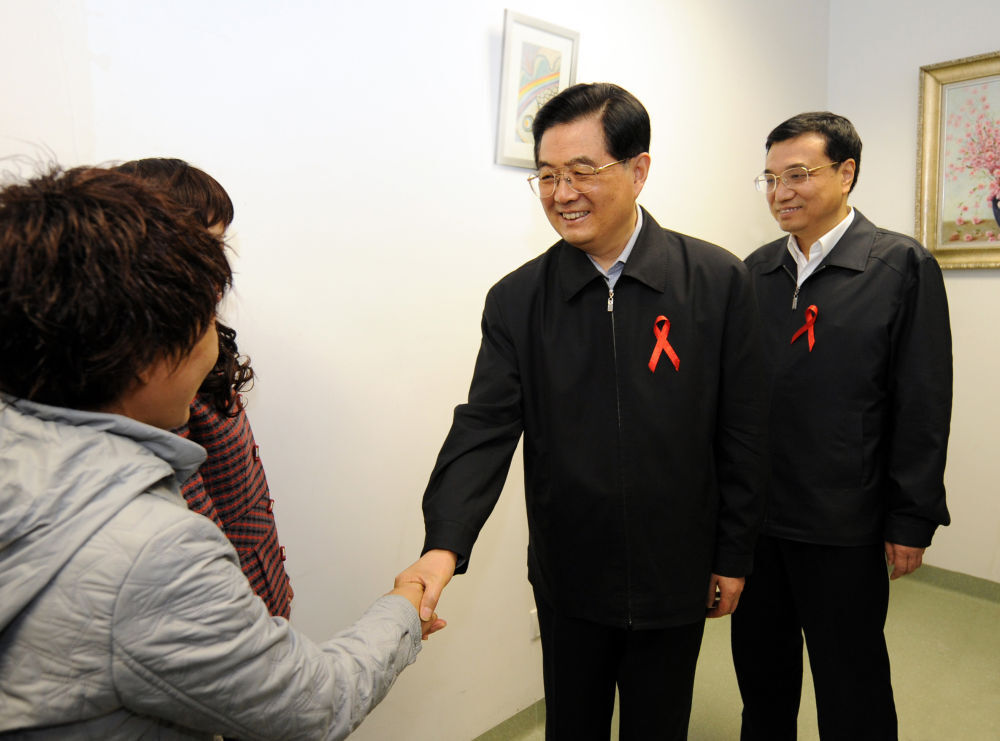

# 李克强同志生平照片

_2013年3月15日，第十二届全国人民代表大会第一次会议在北京人民大会堂举行第五次全体会议。会议经过投票表决，决定李克强为中华人民共和国国务院总理。这是习近平同志和李克强同志亲切握手。新华社记者
兰红光 摄_

_1993年5月3日下午，中国共产主义青年团第十三次全国代表大会在北京人民大会堂开幕。在5月3日上午的预备会议后，举行第一次主席团会议，推选李克强等同志为主席团常务主席。这是江泽民同志与李克强同志握手。新华社记者
郭占英 摄_

_2008年12月1日是第21个世界艾滋病日。胡锦涛同志和李克强同志来到北京地坛医院考察艾滋病防治工作。新华社记者 马占成 摄_

_2003年8月8日，李克强同志在河南省新乡市调研。这是李克强同志在原阳县桥北乡马庄村与村民亲切交谈。新华社发（郭宇 摄）_

_2004年12月26日，李克强同志到辽宁省抚顺市莫地沟棚户区居民王淑贞家中走访调研。新华社发_

_2013年5月26日，李克强同志在柏林出席德国总理默克尔举行的欢迎仪式。新华社记者 马占成 摄_

_2014年3月5日，第十二届全国人民代表大会第二次会议在北京人民大会堂开幕。李克强同志作政府工作报告。新华社记者 姚大伟 摄_

_2008年5月19日，李克强同志在四川地震灾区察看灾情。新华社记者 兰红光 摄_

_2014年12月16日，李克强同志在贝尔格莱德出席第三次中国－中东欧国家领导人会晤。这是会谈间隙，他与随行部长进行会商。新华社发_

_2016年3月16日，李克强同志在北京人民大会堂与中外记者见面，并回答记者提问。新华社记者 吕迅 摄_

_2016年9月21日，李克强同志在纽约联合国总部出席第71届联合国大会以“可持续发展目标：共同努力改造我们的世界”为主题的一般性辩论并发表题为《携手建设和平稳定可持续发展的世界》的讲话。新华社记者
李涛 摄_

_2020年1月27日，李克强同志赴湖北省武汉市考察指导疫情防控工作，代表党中央、国务院慰问疫情防控一线的医务人员。新华社记者 李涛 摄_

