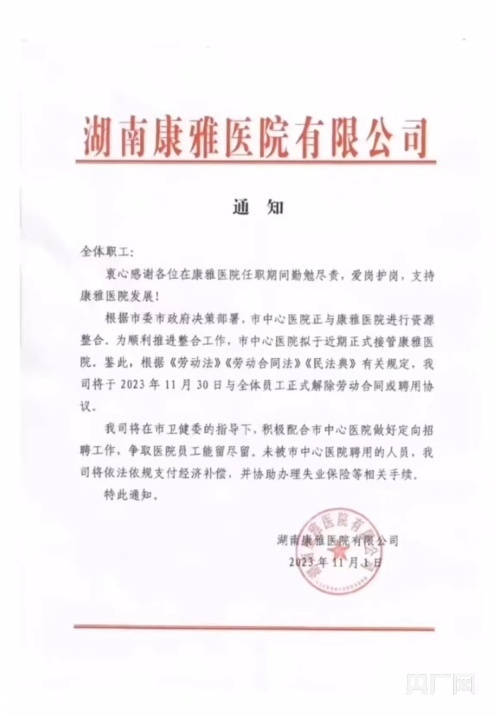
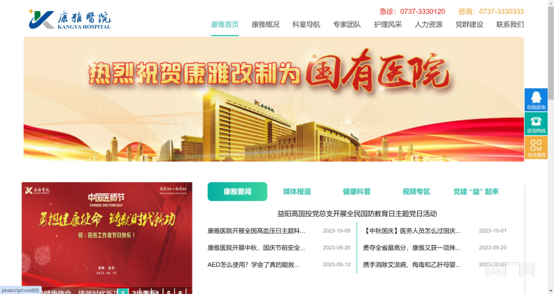

# 湖南益阳一国有医院通知将与全体员工解除劳动合同？官方回应

央广网益阳11月2日消息（记者张志诚见习记者黄珂岚）11月1日晚，湖南益阳康雅医院发布一则通知，鉴于益阳市中心医院近期将正式接管康雅医院，决定于11月30日和全体员工正式解除劳动或聘用协议。

11月2日，记者致电康养医院，一名工作人员表示，“我们员工都是昨晚（1日）接到的通知，目前还没有提出具体的方案。”据其透露，部分医院员工已前往益阳市政府。

随后记者致电益阳市卫健委，相关负责人回复，正在处理中，目前正在和医院员工沟通协商。

_益阳康雅医院发通知，将于11月30日和全体员工正式解除劳动或聘用协议（央广网发图片来源于网络）_

公开资料显示，康雅医院于2016年6月开业，集医疗、预防、康复、养老、科研和教学于一体的大型三级综合医院，2022年1月由益阳高新区国有资本投资运营有限公司整体收购，正式转制为益阳高新区国有医院，设置床位1000张。

_益阳康雅医院官网（央广网发官网截图）_

据此前消息，10月13日，益阳市召开的2023年第30次市委常委会会议上，专题听取了关于推进市中心医院整合湖南康雅医院及支持市中心医院高质量发展的情况汇报。会议审议并原则通过市中心医院整合湖南康雅医院方案，以无偿划转方式，将湖南康雅医院资产划转至市中心医院，建立益阳市中心医院高新院区。

（来源：央广网）

