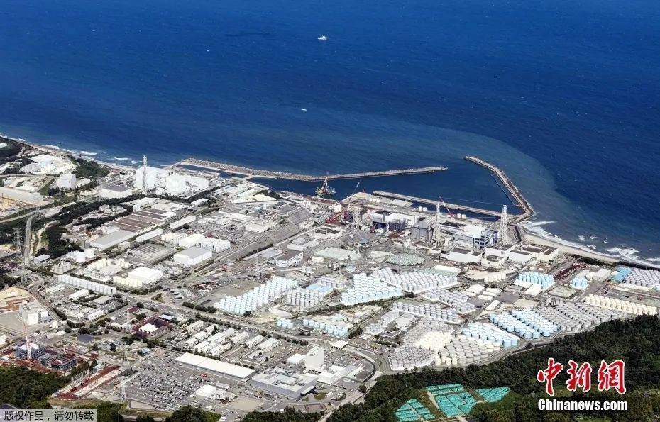
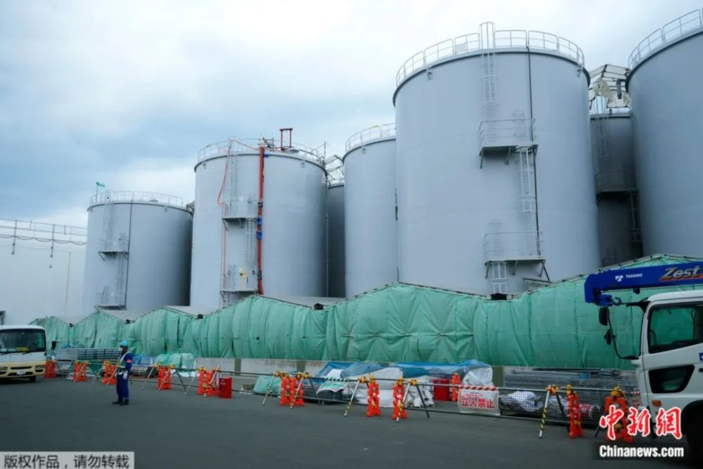
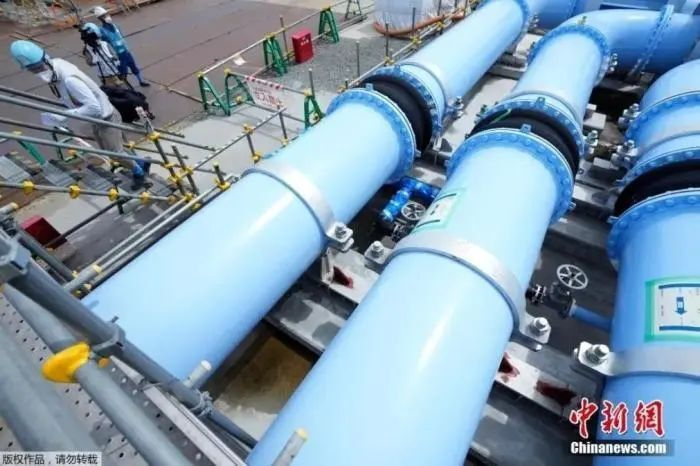
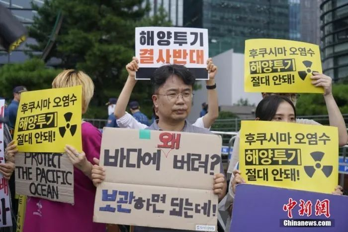

# 福岛工作人员遭辐射，日本仍然启动了第三次排污

**11月2日，日本正式开始排放第三批福岛核污水，预计将持续17天。此次的排放量与前两次大致相同，仍为7800吨左右。**

这也意味着，第三批的排放结束后，流入大海的核污水累计将超过2.3万吨。与此同时，福岛核电站问题不断，包括工作人员可能被核污水辐射等安全问题，持续引发日本国内外广泛担忧。

_资料图：福岛第一核电站_

**01**

**仅仅3个月**

**超2.3万吨核污水将流入大海**

日本在8月24日正式启动福岛核污水排海，并已完成两批次排放。前两批的排放量分别为7788吨和7810吨。

日方公布的第三批核污水排放量仍为7800吨左右。也就是说，不到3个月的时间内，将有超过2.3万吨核污水流入太平洋。

日本放送协会(NHK)介绍称，7800吨相当于10个核污染水储水罐的量，在2011年福岛核事故之后，当地已经修建了1000多个储水罐。

关于今后的排放计划，东京电力公司（东电）原本打算，在2023年内共分4次排出总计3.12万吨核污染水。但最新发布的公告显示，这一期限将延长至2024年3月底。

有数据显示，在正式排污开始前，福岛核污染水已存到了130万吨，要把这些水全部排完，至少需要30年。

 _资料图：福岛第一核电站核污水储罐。_

**02**

**福岛核电站工作人员遭辐射**

**排水设施一度异常**

随着排放的继续，排放设备的安全性备受关注。10月25日，东电称，在福岛第一核电站进行核污水处理工作的4名作业员，被核污水溅射。

4人中，有2人情况较为严重，被紧急送医，后确认2人均为外包工人，其中一名20岁男性除脸部外全身被辐射，另一名40岁男性双手和下半身被辐射。医院方面初步判明，放射性物质进入到了2人皮肤缝隙里。

虽然2人已于10月28日出院，但外界仍疑问重重。有日本网友表示：“就算有异常也不可能公开，要处理这个问题，还有很长的路要走”。

无独有偶，东电还曾在第二批核污水排放期间发布消息称，用于输送核污水的水泵压力一度降低，原因是水中含有的锈附着在过滤器上，引发了堵塞。

一连串问题，进一步引发外界对排放设备安全性的担忧。这一担忧的根源不仅在于核污水排放本身，更是源于东电。

_资料图：福岛第一核电站污水稀释排放设施中的海水输送管道。_

2011年福岛核事故发生后，东电因在应对紧急情况、赔偿等问题上的表现，受到严厉批评。特别是在没有事先与当地渔民沟通的情况下，东电曾排放低浓度核污水，导致民众对其信任度大打折扣。

核污水排放开始前后，包括NHK、《福岛民报》在内的多家日媒民调均显示，无论是福岛当地民众还是水产业者，大多数意见都认为，日本政府和东电对核污染水排放的说明不充分。

**03**

**日本渔民要求东电赔偿**

**国际社会忧虑加剧**

在福岛核污水排放引发的问题中，渔民成为受影响最为显著的群体之一。

自福岛核事故以来，福岛以及周边渔民一直在努力恢复当地渔业。但核污水排入太平洋后，再次给当地渔业带来巨大冲击。

 _资料图：日本民众抗议将福岛核污水排入大海。_

面对由此带来的经济损失，多地渔民纷纷向东电提出索赔要求。

铃木美智雄是仙台的一名渔业批发业者，10月27日，他参加了东电在仙台市召开的一场关于赔偿金额的说明会。

因核污水排海遭受巨大经济损失，在东电负责人刚说了一句开场白后，铃木就将其打断并质问道：“排海导致海产品完全不能出口，现在根本不知道损失额，你要怎么赔偿？”

另一名渔业批发业者山口清一也表示，赔偿并不能解决问题，而是应该想想今后要怎么促进当地渔业良性发展。

对于核污水持续入海，国际社会的担忧情绪也在加剧。

_资料图：韩国多个民间团体集会抗议日本核污染水排海决定。中新社记者 刘旭 摄_

10月12日，日本的非营利团体“言论NPO”等发表的调查结果显示，对于福岛核污水排海问题，高达七成的韩国民众明确表示“不应该向海洋排放”。

俄罗斯联邦动植物卫生监督局10月16日宣布，俄方自即日起暂停进口日本海产品。俄联邦渔业署此前就曾发表声明，表示保障国民健康是俄罗斯国内食品市场的首要任务，将持续就福岛核污水对俄专属经济区生态和渔业影响加强监测。

中国外交部发言人汪文斌11月1日表示，东京电力公司长期存在的内部管理混乱无序、对公众隐瞒欺骗等痼疾积重难返。福岛核事故发生12年来，东电公司善后处理漏洞百出，多次迟瞒报事故、篡改关键数据，将企业利益而不是环境安全和民众健康放在优先位置。

汪文斌指出，就在放射性废液溅射事故发生次日，东电公司宣布将于近期启动第三批核污染水排海。试问这样劣迹斑斑的企业如何能够确保在长达30年甚至更久的排放管理中做到安全可靠？日方宣称的“安全、透明”的排海计划又如何让人放心？

编辑：王伊萌

责编：程春雨

**相关报道：**

[中国驻日本使馆发言人就日本启动第三批福岛核污染水排海答记者问](https://new.qq.com/rain/a/20231102A033PY00)

