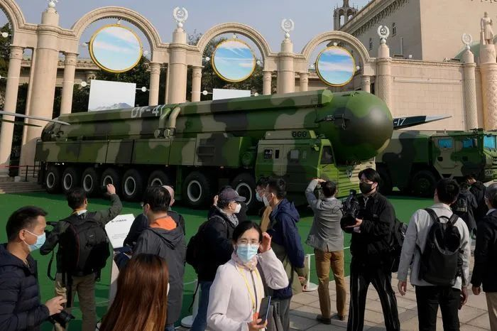
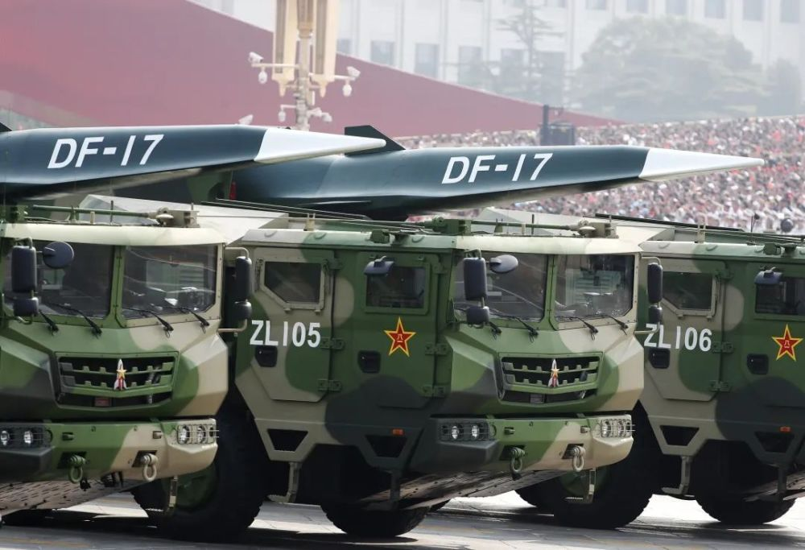

# 胡锡进：中美要谈核军控了？应是沟通而非谈判

美国官员1号向媒体透露，中美将在下周举行“罕见的核军控会谈”。美方称，会谈将在司长级别进行，其目的不是减少中国的核武库规模，而是拜登政府想要更多了解中国的核计划。美方强调这是奥巴马政府以来中美间第一次这样的会谈。

_▲近年来，美国因担心扩大核武库屡次呼吁与中国进行军控谈判，甚至对中国的军控、裁军与防扩散领域指手画脚。_

华盛顿一直想将中国拉入美俄核军控谈判，限制中国的核武库建设。北京没有同意，原因很简单， **中国核武器数量只是美俄数量的零头，核军控是美俄的特殊责任。**
特朗普政府中止与俄罗斯《中导条约》等，把中国不参与谈判作为理由之一。中美在这个时间举行军控谈判，显然有利于为本月中旬有望举行的中美元首旧金山会晤创造良好氛围

不过这样的中美军控会谈主要目的显然是沟通，根本谈不上要达成一个控制目标。上个月美方称，中国已经拥有500枚可使用的核弹头，并预测到2030年时，这个数量将达到1000枚。去年美国预测，2035年中国核弹头将达到1500枚。美方担心，“美国面对的不是一个，而是两个核对手”。

一方面，
**建设强大的核武库是中国的权利和作为负责任大国必须有的标配，中国拥有长期可靠的核威慑力有利于中美之间乃至全球的战略稳定，这比中美关系的短期缓和更加重要。**
另一方面，中美确有必要围绕这个重大问题加强沟通，防止严重误判。

_▲2023年美国发布的《中国军力报告》特意渲染了中国“已经处于世界领先地位的高超音速武器”，声称它们可能会很快取代一些老式短程弹道导弹，目标是西太平洋的外国军事基地和舰队。_

老胡认为，中方应当向美方讲清楚以下几个问题：

第一，我们建设核武库， **是为了对冲中国不断上升的战略风险，实现新的安全平衡，**
换句话说，中国的安全形势变了，保卫中国国家安全所需要的核武库的最低规模也跟着变了，必须比过去要强大得多。不变的是中国防御性军事战略，我们任何时候都不会把核武器作为对外竞争的主动工具来使用。

第二， **不首先使用核武器，中国的这一原则坚定不移。**
美国官员上个月说，没有看到任何迹象表明中国将正式改变这一原则，但是担心在某些特殊情况下中国可能会判断这个原则并不适用。这显然是美方使用核武器的低门槛在作祟，他们以己度人才会产生这样的担心。

**对中国来说，核武器只是用来排除外部力量对中国进行核打击或者实施核讹诈可能性的战略工具。**
中国所有国防安全计划、包括在不得已时使用武力解决台湾问题都是在常规武器层面设计的，核武器的作用是非常潜在的，它的意义是威慑外部力量不得将核武器加入进来塑造战局。不仅中国政府和军队，中国民间也不存在首先使用核武器的联想，因此在特殊情况下首先使用核武器，这对中国来说完全是个伪命题。

_▲当地时间11月1日晚至2日凌晨，美国进行未搭载弹头的“民兵-3”型洲际弹道导弹发射试验。然而试射中发现异常，美方在空中引爆了这枚导弹。这是美国今年以来第四次试射该型洲际导弹。_

第三，倒是美国，已经拥有了世界最强大的综合核力量，但却继续投入巨资搞核武库现代化，美国究竟想要干什么？就在1号，美国“民兵-3”洲际弹道导弹试射因出事故被迫引爆，轰动了世界舆论。
**美国是世界军备竞赛的最大源头，其对绝对军事优势无休止的贪婪追求令中国人不安，我方应当要求美方停止在核力量颠峰上的继续扩张，这是军控产生实际意义的基础。**

第四，中国支持防止核扩散的国际努力，美国这方面的立场也不能动摇。美国帮着澳大利亚发展核潜艇，开了一个核扩散的危险先例。日本、韩国不时出现围绕拥核的危险议论，美国需要把自己的盟友管紧了。中方的这些关切需要对美方强调清楚。

老胡是非常关心中国核力量建设的媒体人，
**我相信中国政府能够在加强核力量建设的同时，回应好外部世界的关切，使得我方核威慑能力的提升与外部增加对中国的好感成为相辅相成的关系。**
中国是热爱和平和负责任的大国，要让全世界充分知晓。由于美西方舆论机器的不断抹黑，中国这一正面形象立信于世界不会是一项轻松任务。

