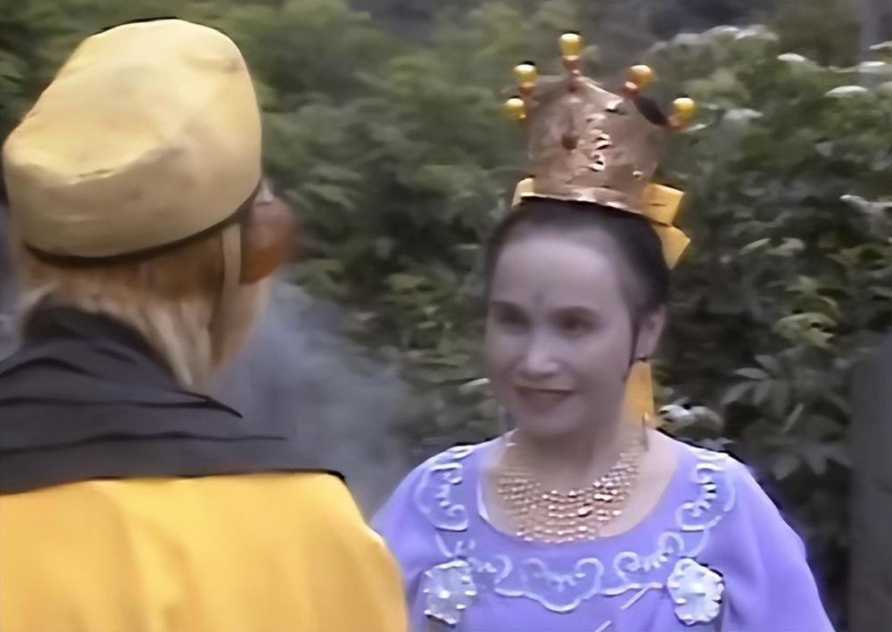
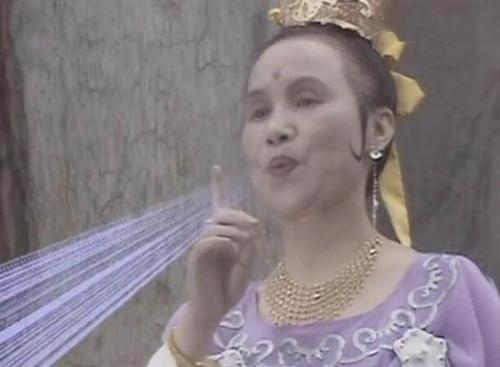

# 82版《西游记》毗蓝婆菩萨扮演者杨琪敏去世，享年99岁

作为我国最经典的电视剧之一，82年版的《西游记》可谓成就了众多演员。红星新闻记者从四川人艺了解到，11月2日晚，曾在82版《西游记》中饰演“毗蓝婆菩萨”的演员杨琪敏于成都逝世，享年99岁。

毗蓝婆菩萨是昴日星官的母亲，在剧中出场不多，但因为与孙悟空有一场对手戏，令人印象深刻。电视剧中，孙悟空中了蜈蚣精百眼魔君斗的毒，到紫云山千花洞求毗蓝婆菩萨帮助。毗蓝婆菩萨在儿子昴日星官的眼睛中炼成了一根宝贝绣花针，抛向天空，就破了百眼妖魔的妖术，随后帮助孙悟空拿下了蜈蚣精。

据悉，杨琪敏来自四川人民艺术剧院，她出演的电视剧不多，主要活跃在话剧舞台上，曾出演过田汉编剧的21场话剧《丽人行》《讽刺百丑图》《升官图》《张灯结彩》等。

红星新闻记者 张世豪 编辑 曾琦

