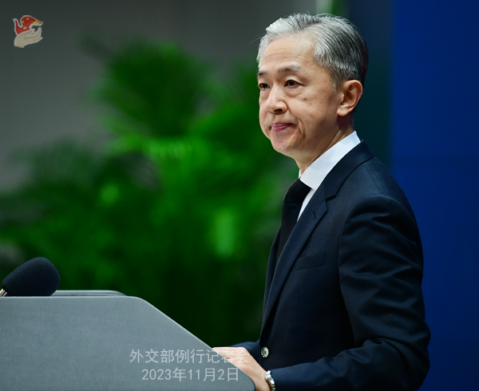
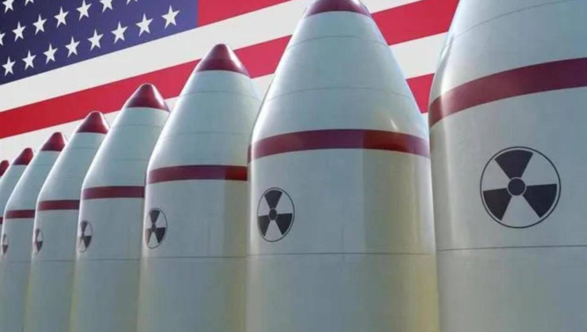

# 中美重启军控谈判有新风向？专家：标志中美恢复对话磋商的重要突破

在中共中央政治局委员、外交部长王毅访美期间，中美双方商定近日举行包括军控和防扩散磋商在内的一系列磋商。周四，外交部正式证实了这一消息，并宣布了磋商的相关细节。发言人汪文斌表示，中美将于下周在华盛顿举行司级军控和防扩散磋商，外交部军控司负责人将率团出席。根据双方商定的安排，中美将就国际军控条约履约、防扩散等广泛议题进行对话交流。

有美国官员向路透社表示，这是自奥巴马政府执政之后中美两国的首次此类会谈，将重点讨论如何降低误判风险。美国《华尔街日报》早先报道，会谈将于下周一由美国国务院负责军备控制的助理国务卿马洛利·斯图尔特和中国外交部军控司司长孙晓波主持。种种迹象表明，随着APEC旧金山会议临近，中美多个战略沟通渠道正加速恢复。

为什么中美要举行军控会谈？

中美关系近期持续回暖，双方高层多领域密集互动交流对外释放积极信号。上月末北京香山论坛举办期间，军事科学院原副院长何雷中将与美国国防部助理国防部长帮办中国事务主任卡莱斯进行了双边交流，被外界解读为中美两军关系回暖的最新迹象。

_第十届北京香山论坛期间，军事科学院中将何雷向美方代表团团长、美国国防部助理国防部长帮办中国事务主任卡莱斯卡莱斯赠送两枚解放军臂章作为礼物。_

关于中美双方宣布举行军控会谈的原因，中国现代国际关系研究院世界政治研究所所长李岩向直新闻分析道，目前中美关系出现了缓和态势，是此次军控会谈的关键前提和背景。改善两国关系是双方共同的意愿，且符合各自利益。前期，中美高层官员进行了一系列互访和互动，包括在经济和金融领域建立了新的对话机制。然而，军控领域一直是一个敏感而棘手的问题，多年来一直没有取得实质性进展。在这种缓和背景下，军控对话成为了解决重大敏感问题和改善中美关系的重要组成部分，标志着中美恢复对话磋商的重要突破。

据美媒《华尔街日报》报道，此次会谈的目的不是削减中国的核武库规模，而是让拜登政府更好地了解中国的规划。然而此前，美国为扩张自身核武库寻找借口，经常渲染“中国威胁论”，五角大楼发布的年度《中国军力报告》则是每年都要上演的炒作戏码。

据悉，自2000年以来，美方连续23年发表所谓的《中国军力报告》，今年的报告则突出渲染中国的核武库扩充速度。综合彭博社、“政治”新闻网等多家美媒报道，美国防部10月19日向美国国会提交了2023年度《中国军事与安全发展报告》。该报告炒作所谓“中国军力扩张”并声称，据五角大楼估计，截至2023年5月，中国拥有超过500
枚核弹头，2030年前还将增加到超过1000枚。

事实却是，即便中国核武器数量增加，仍远低于美国拥有的数量。法新社称，美国核弹头储备量约3700枚，并部署了约1419枚战略核弹头。报道还提到，俄罗斯部署了大约1550枚核弹头，而根据美国科学家联盟的数据，俄罗斯核弹头储备量为4489枚。

对此，李岩认为美方多年来一边散布“中国威胁论”，一边又积极寻求与中国开展军控对话，主要还是为了摸清对方的底牌，了解中国核武器的发展和部署情况，这被视为他们的首要关切。其次，美方也希望通过中美之间的军控对话，对中国的核战略方向产生影响，甚至塑造它。因此，这两方面一直是美国关注的焦点，激发了美方积极推动这一对话的愿望。

然而，美方的优先考虑与中国的需求和利益并不完全吻合。因此，中国同意开展军控对话可能考虑到整个中美关系的大氛围，以及现阶段双方关系的改善。此外，中美之间关于中国核军备发展进程的认知存在较大分歧。虽然中国的核武器增量可能增长较快，但也远远落后于美国和俄罗斯的核武器存量。这意味着，如果美方试图通过军控对话来限制中国的军备发展，可能会引发双方利益的冲突。

此外，当前国际形势复杂多变，地缘冲突不断升级，在这一背景下，建立更有效的危机沟通渠道显得尤为重要，特别是军控和防扩散问题成为备受外界关注的焦点。据美媒报道，美国正设法避免与中俄发生三方核军备竞赛。拜登政府的一位高级官员说，美国希望就“《新削减战略武器条约》之后的框架”展开对话，同时为降低俄乌紧张局势下的核危险，但俄罗斯尚未对拜登政府的新会谈提议作出回应。据悉，美俄之间的《新削减战略武器条约》将于2026年到期，延长条约的谈判目前因俄乌局势陷入停顿。该条约是目前仅存的关于对世界上两个最大核武库进行核查的条约。

中美军控谈什么？

对于即将到来的中美军控磋商，外媒普遍使用“罕见”一词来形容。事实上，长期以来，中美关系被视为世界上最重要的双边关系之一，同时两国均作为拥核国，关于核军控等领域的讨论无可厚非，只是美国在很长一段时间以来单方面借炒作中国核力量以渲染所谓“中国威胁”，导致双方谈话氛围僵持。

如今中美关系呈现回暖迹象为本次磋商的实现提供了良好氛围，李岩表示，虽然美方一直渴望启动与中国的核军控对话，但核军控问题极为敏感，且涉及多方利益，包括俄罗斯、印度、日本和韩国等国家。因此，此次会谈内容主要从政治层面出发，而非深入讨论具体的军事安全细节。这种取向为未来的交流提供了有利因素，也为以后谈及核军控领域的关键问题奠定了基础。尽管此次对话重要，但实际上只是双方开启核军控对话的第一步。

另一方面，中美即将在这次军控磋商中谈什么、怎么谈也备受外界关注。李岩向直新闻分析道，在双方的磋商中，这几个思路需要明确。首先，中美究竟要谈些什么，从磋商的目标来看，中美就此次军控磋商想达成一个什么样的目标，这个目标是分阶段的目标，还是最终目标；另外从磋商的范围及规模来看，是中美两国的一个双边的谈判，还是说美国此前一直希望推动的一个中美俄之间的三方谈判，甚至更大范围的，在联合国安理会五常范围的军控谈判。尽管中美双方目前没有公布相关细节，但外界普遍认为，在目前的国际态势下，中美之间谈总比不谈好。

总部位于华盛顿的军备控制协会执行董事达里尔·金博尔表示，这迟来的军控对话可能会集中于提高各国核理论的透明度和更有效的危机沟通渠道。金博尔说：“然而，我认为我们不应期望在短期内取得突破。这需要时间并需要双方的妥协。”

卡内基国际和平基金会高级研究员赵通说：“中国领导层仍在为与美国的长期竞争做准备。这种交流若能维持下去，并在未来定期举行，可为双方展开更具实质性对话创造机会。”

作者丨李长春，深圳卫视直新闻驻京记者

编辑丨刘立平，深圳卫视直新闻主编

