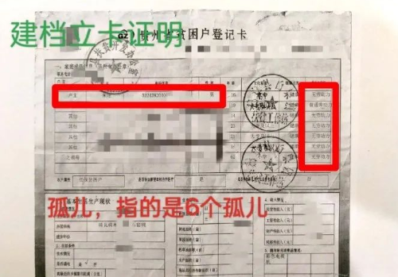

# 中青评论：查清天津助学金事件，别让寒门学子寒心

使助学金回归助人本质，让每一笔资助都能用在刀刃上，是社会的共同期待。

近日，天津中德应用技术大学一学生实名举报学校助学金分配不公，引起社会关注。当事人表示：班内进行困难生助学金评定时，自己作为建档立卡家庭经济困难学生落选，平日有高消费行为的学生却评得上，他质疑其中存在舞弊情况。而且，他在怀疑助学金名额被舍友挤占后，对方还找到辅导员，要求他搬离宿舍。

 _当事人上传的相关证明_

目前，正在该校巡视的天津市委巡视八组表示，已接到有关此事的反映，会按照相关程序转相关单位处理。天津中德应用技术大学发布情况声明称，学校已成立工作专班进行调查核实。此外，天津市教委也已介入处理此事。

建档立卡家庭经济困难学生本是重点资助对象，为何会被身边“穿高档球鞋、总是旅游”的同学挤掉助学金名额，甚至因此被排挤出宿舍？如果事实的确如举报学生所言，人们不难理解他的不忿。当然，出于情绪化、误会或是信息偏差等原因，不排除举报学生所述情况有所失真，甚至存在部分夸大、不实等状况。但无论如何，通过查明此事确保助学金公正分配，都是许多大学生与网友的心声。因此，当下校方和有关部门最迫切的任务，就是尽快确认事实，还原此次助学金评选的过程，以此为基础公正处理。

复盘此次评选，涉事学生提出的不少关键疑点都亟待回应。比如，在资格认定上，相关负责老师和辅导员是否存在明知道一些学生不符合国家助学申请资格，依然暗中“放水”的滥用职权行为？在进行班内民主评议时，是否存在形式化发放，甚至将助学金变为“人情奖”的现象？相关认定和审核流程上，是否有影响公正评选的程序性漏洞？

_图片来源：视觉中国_

一笔雪中送炭的助学金，不仅能切实帮助困难家庭减轻经济负担，让真正有需要的学生在校园里安心生活学习，更关乎大家对社会公平的体认。近些年，我国对高校学生的资助力度不断提升，刚刚发布的《2022年中国学生资助发展报告》显示，去年国家助学金资助高校学生1221.42万人次，金额467.4亿元。这些资助经费对于促进教育公平、保障“不让一个学生因家庭经济困难而失学”，具有不容忽视的作用。

与此同时，如何让每一笔助学金都能用到实处，也是社会各界普遍关注的议题。此前，一些地方出现过学生弄虚作假冒领助学金，真正困难的学生却羞于启齿、不愿申请资助的情况。长此以往，助学金就失去了应有的效用。解决这一问题的一个可行思路是借助“大数据”等工具进行分析印证，尽量减少困难学生的自证负担和隐私泄露风险，同时加强动态审核，严惩弄虚作假等行为。

近几年，西安电子科技大学等高校通过分析学生的食堂消费数据，锁定困难学生，并悄悄给他们的饭卡充值的做法，就更加精准、更具温度，值得推广借鉴。加强部门间的联动，让信息流动更为便利，有利于在照顾到学生自尊心的同时，精准锁定需要经济帮扶的人群。对于试图操纵助学金评选、随意冒领者，也应有更为清晰明确的举报和惩罚机制，从而抬高违规成本，让恶意觊觎助学金者不敢随意伸手。

助学金绝不是可以随意操纵挥霍的“人情福利”，使助学金回归助人本质，让每一笔资助都能用在刀刃上，是社会的共同期待。无论如何，让家境优渥者靠“表演”冒领、让真正困难者在沉默中落选，都是人们最不希望看到的情况。

撰文/任冠青

编辑/杨鑫宇

**中国青年报·中国青年网出品**

