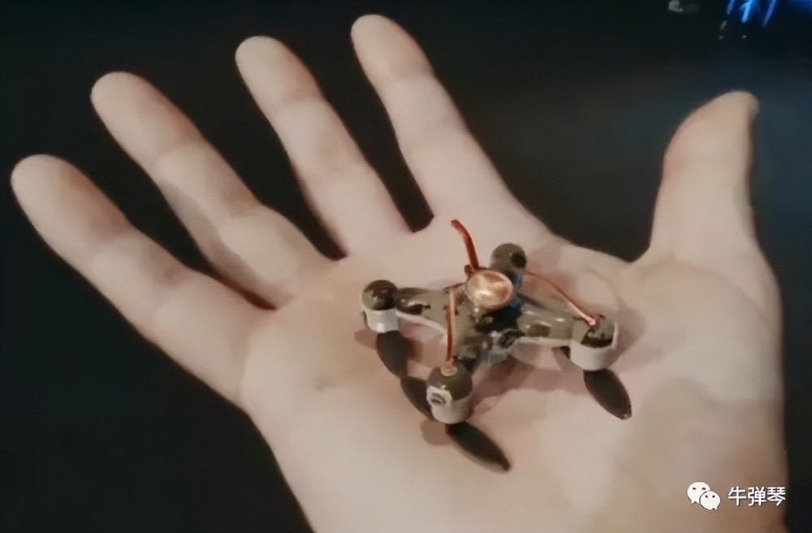
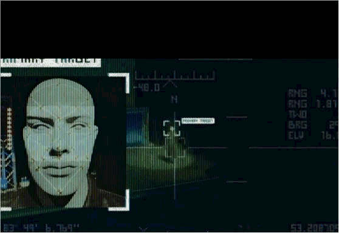

# 以军打响人类史上“第一次AI战争”：AI成杀人机器，或面临可怕的未来

（一）

**不得不说，这是一个相当危险的信号，不仅仅是对哈马斯，更对我们整个人类。**

如果说之前的几场战争，最大的亮点，就是无人机的降维打击；那正在进行的加沙之战，一方面是惨烈的巷战和地道战，另一方面就是人工智能（AI）登场。

按照以色列媒体的报道，
**以军正使用AI和自动化技术，“快速准确”识别并打击哈马斯目标，在上周开始的地面行动中，以军已确定了约1200个哈马斯的新目标。**

以军宣称，以军正在努力“大规模”生产新目标，因为“在战争中，敌人的行为不同，并创造了新的机会。”

什么意思？

我不是军事专家，但以我的粗浅理解，就是以军利用AI技术，通过脸部识别、大数据分析等技术手段，迅速锁定哈马斯目标，然后立刻发动攻击。

作为中东地区技术含量最高的军队，事实上，在哈马斯发动袭击前几个月，以军就宣布，将AI嵌入到作战行动中，因为在以军看来，
**“机器比人类更聪明”，“以军将AI视为现代生存的关键”。**

2021年的加沙之战，就被以军吹嘘为人类“第一次AI战争”。

我查了一下，当时的以色列《耶路撒冷邮报》，还引述以军高级将领的话说，
**AI在打击哈马斯方面，发挥了重要作用，“AI第一次成为与敌人作战的关键组成部分和力量倍增器”。**

作为例证，正是借助AI，以军当时成功出击，瞄准并消灭了两名哈马斯领导人。

而且，AI还能自动检测地形变化，甚至搜集情报，绘制可能的哈马斯地道网络，用以军官员的话说，从而“以色列空军能够使用适当的弹药，击中目标，不管是公寓、隧道还是建筑物。”

现在的加沙之战，规模和惨烈程度，更非2021年可比，AI显然扮演着更重要的角色。

或者我们可以说， **这是人类历史上“第一次真正意义的AI战争”。**

当然，从以军角度看，释放AI参战的信息，也不排除有两个目的：

第一，以军战斗力强，技术含量高，现在又在探索AI战争技术，具有碾压对手的手段；

第二，AI针对性强，准确率高，以色列不是滥杀无辜，而是针对哈马斯，在尽可能减少平民伤亡。

（二）

但我总还是倒吸一口凉气。

因为很简单，万一AI搞错了呢？

比如，以色列的AI锁定了某个哈马斯领导人，万一锁定错了，那是不是意味着以军会杀错对象？

还有，以军通过AI，探知了某个哈马斯据点，万一这是一个伪装据点，或者，AI建议用错了炸弹，是不是会造成大规模人员伤亡？

这次加沙之战，不排除以军使用AI，确实清除了一些哈马斯目标；但更要看到，以军对加沙的轰炸，已导致8000多人死亡，其中3000多人是儿童，这些未成年的孩子，不可能是哈马斯吧？

我看到，有AI专家就明确表达了忧虑，因为大数据是大数据，现实更错综复杂，一旦AI介入到战争，并决定人类生死，那“一个主要的风险，就是你击中了错误的目标，它可能造成平民伤亡，或者打击友军目标造成自相残杀”。

而且，AI还会产生虚假的自信。

一个极具讽刺意味的例子：就在哈马斯发动致命攻击前一周，当时北约军事委员会主席到访以色列，以军将领特意带他到加沙边境，展示以军对加沙的AI监视。

用媒体的话说，从利用人脸识别软件，到头顶上的无人机，再到边境检查站和电子窃听技术，以色列对加沙的监视，被广泛认为技术含量最高也是最有效的努力。

但最后呢？

**以军，以及以军的AI技术，还是没能挡住哈马斯发动突然袭击。** 袭击导致1400多以色列人死亡。这也是以建国70多年来遭遇的最致命袭击。

然后，就是以色列的猛烈报复，对加沙的狂轰滥炸，大量平民死亡，高精确度的AI又在哪里呢？

我看到，美国《洛杉矶时报》专栏作家Brian Merchant就感慨，
**AI可能会加速或增强一个国家因愤怒而产生的破坏力，但算法中潜在的致命错误，却被战争迷雾所掩盖。**

（三）

但AI正不可避免地介入到人类生活，乃至战争冲突。

2017年11月，无人机公司StratoEnergytics，发布了一款微型无人机武器Stinger。这是一种颠覆性的新式武器，体积比成人掌心还小，自带一个小型炸弹，其搭载的摄像头，能进行人脸识别，一旦确认对方就是目标，可以一枪“爆头”。

也就是说， **只要在攻击程序中输入目标，这个微型无人机，就像一枚会飞的子弹，能自动寻找并发现目标，随后发动360度无死角攻击。**

因为是AI武器，根本就不需要人操作，提前输入命令即可。

虽然近距离攻击，但能量足够穿透头骨。另外，这么小的体积，真是防不胜防。如果是集群式攻击呢？

但这可能就是未来的现实。

最后，怎么看？

我总有一种强烈的担忧，简单三点吧。

第一，以目前的AI技术，贸然介入到战争，会不会是一种灾难。很简单，会不会造成“宁可错杀3000，也不放过一个”的严重后果？如果那样，这不就是滥杀无辜吗？那AI就是一个魔鬼，在加沙，我们就看到了地狱般的现实。

第二，这预示着一个全新作战方式的到来。没办法，这也是事实。如同无人机改变了现代战争一样，AI必然会在未来战争中发挥重要作用。以军已开始付诸实施，那其他国家军队，显然也要未雨绸缪。

第三，还有一个更可怕的情况：未来的AI只需要预先输入指令，不再需要人类中间干预，就能自动识别、自动锁定、自动发起攻击，然后摧毁；但一旦掌握了人类生死的战争机器，突然智能到集体“叛乱”起来，人类又何去何从？

这，应该不仅仅只是好莱坞的电影情节。

未来的情况，有时真的无法想象。

**人类发明了无人机、发明了AI ，无人机变成了廉价的杀人机器，AI又成了杀人机器的幕后总指挥；但未来的人类，或许正面临一个更可怕的未来。**

