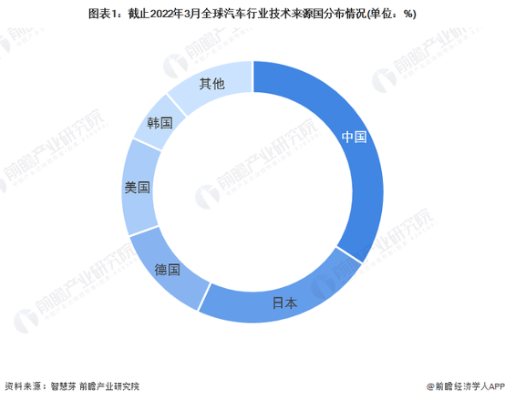
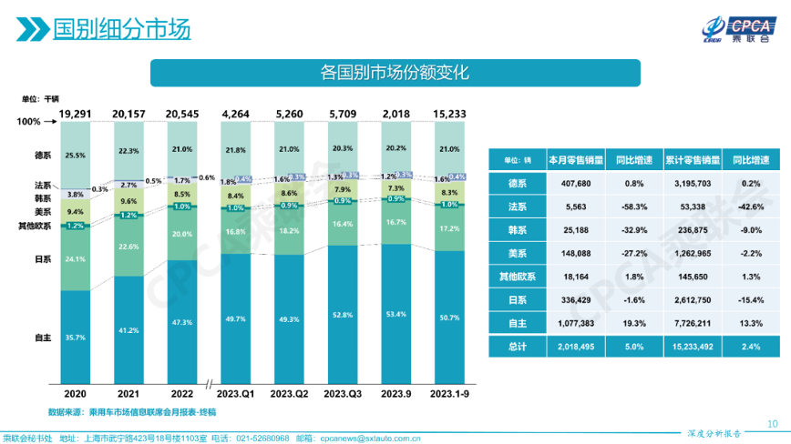

# 价格战谁用都好使？特斯拉比亚迪成本压缩最狠，只有两类车企从中获益

文｜腾讯汽车特约作者 新能源汽车行业分析师-Jarvis

伴随着国产新能源汽车的强势崛起，2023年可以说是中国汽车市场洗牌周期的元年。继雪铁龙引爆了燃油车的降价大潮，新能源车也开始全面下场参与降价。

至此，大众、丰田为代表的传统合资，BBA为代表的豪车品牌，比亚迪、吉利为代表的自主大厂，以及蔚小理为代表的新势力，无一例外全部投入这场残酷的价格战之中，正式开启了全面混战时代。

那么问题来了，大家纷纷选择降价的原因是什么？如果价格战一直打下去，会有什么样的结果？

新能源升级下的行业洗牌周期，催生大规模价格战

这轮价格战，表面上看是大量玩家投入市场，优秀产品层出不穷，大家为了销量不得不降价求生。但这个原因并不足以解释当下的市场情况，因为国产车其实一直以来性价比都很出色，却从未有过今天这般待遇。

今年9月自主品牌的国内市场份额占比达到53.4%；而在高端市场方面，8月份国内市场终端成交价30万以上销量排名中，理想反超奥迪排名第三，而蔚来和腾势也进入前十。如果是30万以上纯电车型榜单，自主品牌更是在TOP10中占比过半。

所以在这一切背后，更深层次的逻辑是：汽车行业新能源升级带来的技术优势重置，使得固有品牌秩序发生错乱。

多年来，传统车企业依靠成熟的燃油车技术，积累了相当深厚的口碑，而也已经形成了稳固的品牌秩序。然而新能源汽车的出现，相当于把专利墙清零重来了。而且在这轮更替中，原本口碑积累的弱势方也就是国产自主品牌，反而在技术端成了强势一方。

根据前瞻研究院整理，目前全球新能源汽车第一大技术来源国为中国，专利申请量占全球新能源汽车专利总申请量的41.20%；随后依次是日本、美国和德国，但是与中国专利申请量差距较大。

如果以国内新能源汽车的代表企业比亚迪为例，据Cascoups等外媒报道，比亚迪在过去的20年里申请了1.3万个专利，是特斯拉（863个）的16倍。

在这个大背景下，消费者的购车逻辑出现了变化。以往好品牌等于好技术的逻辑被颠覆了，现阶段自主品牌的技术实力更加领先，但其品牌号召力相对有着数十年品牌积淀的合资、外资还尚显不足。

所以，很多消费者买车，尤其是买新能源车时，这种品牌、技术二选一的矛盾就会贯穿始终。

而这个矛盾的存在，就使得当前的汽车市场，变成了大量车企重回起跑线一起竞争的局面，过去那种严格的品牌等级仿佛一下子不存在了。

凭借这轮新能源升级，自主品牌的市场份额也从2018年的40.1%，快速提升至今年1-9月的50.7%，以往十分强势的日系车型销量则出现了暴跌、美系也下滑明显，而德系也不过是堪堪维持销量持平罢了。

在当前这样的市场大洗牌周期中，当大家都选择降价的情况下，打价格战还有用吗？

价格战是市场洗牌的加速器，也是奋起直追的时间窗口

真正能用价格战策略获取收益的车企，其实也就两类：一类是新版本下的领先者，具备成本优势；而另一类是品牌余威尚存，以价格换销量，以利润换时间。

价格战武器其实也不是谁用都好用，尤其是在所有车企都参与的情况下，边际收益会被压得很低。这就决定，价格战对于车企，肯定不是可以无限制使用的，但却可以让实力较弱的车企快速出局。随着出局车企的增加，当市场剩下少量头部车企时，价格体系就会重新回到正常状态。

一如2010年-2020年间的国内手机市场，从“中华酷联”为代表的“百花齐放”的时代，随着众多品牌的陆续出局，逐渐形成今天的“华米OVH+苹果”的巨头时代，手机价格的整体趋势，也从追求极致性价比，纷纷转向冲击高端旗舰的路线了。

明确了这个竞争逻辑，就来梳理一下能从价格战获益的两类车企具体是怎样的。

**“我赚你亏，早晚能熬出头”**

这一点最典型的代表就是新能源两巨头--特斯拉和比亚迪。

**特斯拉--产品力 &号召力均在线，综合溢价能力强**

虽然特斯拉并不是传统品牌，但依靠优秀的市场化能力和早期产品的产品力，以及外国品牌的身份，其品牌口碑其实并不弱于传统合资品牌。

特斯拉最高29.3%的毛利率，也正是来源于其早期相对优秀的三电技术+堪比燃油车顶级品牌的溢价能力，一直以来也被奉为商业标杆、盈利王者。

但也正是因为这个溢价构成，特斯拉的毛利其实并不稳固。随着Model 3长达6年、Model
Y长达5年的时间均未推出大改款，其产品力已经显现出后劲不足的态势。

自主品牌在同价位甚至更低价位，大量推出更先进的纯电平台、辅助驾驶，以及高得多的智能及舒适性配置，特斯拉的反应也很真实，就是降价换销量。

根据特斯拉第三季度季报，其毛利润为41.78亿美元，同比下滑22%；而毛利率更是仅为17.9%，相较高峰时下降11.4%。

但这个毛利率已经是行业内顶尖的水平了，而且考虑到特斯拉车型少、零件共用率高、一体化压铸等技术的应用、且内饰一直不舍得堆料的特性，其成本控制能力依然很优秀，其降价空间依然存在，肯定不会是先被熬死的那个。

**比亚迪--全产业链在手，极致成本把控**

而比亚迪则是另外一套逻辑，依靠着全产业链技术储备，其成本控制能力无出其右。

比如电池业务方面，目前市场上绝大多数车企都需要外购电池，而这也是宁德时代获得超过20%毛利率的坚实基础。这部分毛利对于其他需要采购电池的车企而言就是成本，而对于能够自产电池的比亚迪而言则可以整合进整车毛利空间的。

比如一度电的成本是1500元，车企花2000元买入，那么这家车企的电池成本就是2000元；而作为电池生产商的比亚迪，由于无需外购电池，那么它就可以直接以1500元的价格将其计入整车成本，单这一度电就能比其他车企多出500元的毛利空间。

所以，这就是为什么比亚迪的车子看起来没有特斯拉贵，毛利却能超过20%的原因。有业内公认的顶级全产业链技术打底，比亚迪在这轮价格战当中的余量显然是巨大的。

所以，这轮洗牌到目前为止，比亚迪和特斯拉基本上是最先确定上岸的车企。

**“家底深厚，抓紧时间补课”**

这一类最典型的代表，就是燃油车时代王者们，宝马、丰田、奔驰、大众、奥迪、本田等品牌他们的逻辑其实都类似，那就是燃油车时代积累的口碑余威尚在，但新能源车尚有不足。

这类品牌的核心竞争力是燃油车产品力过硬且品牌认可度极高，拥趸数量超多。基于此，如果他们使用降价武器，其实普通大众大概率会沿着以往数十年建立的价格锚，认定这是个“便宜划算”的选择。

而正是这种价格锚的存在，使得他们的降价策略是真的可以换来销量的。而这些销量带来的营收，则可以让这些车企获得一定的时间窗口，从而利用这个时间窗口抓紧进行新能源产品的迭代升级。

可以说，只要这些顶级传统车企能利用好这个时间窗口，都不需要拿出顶级的新能源产品，只要及时拿出合格的产品，那市场基本还是能保住的。最典型的例子就是大众ID系列，虽然老旧的MEB存在动力不足、智能化缺失等明显问题，相对比亚迪的e平台3.0的高集成度以及小鹏、智己们的800V先进平台处于落后状态。但ID系列目前的月销量还是能够稳定破万，与众多技术更好的主流新势力车企处在同一销售量级之上。

究其原因，虽然MEB是基于纯电打造的专用平台，但终究也只是合格水平。但大众多年来积累的强大品牌号召力，使得消费者依然愿意为其买单，再叠加颇具诚意的价格，其销量表现还是可圈可点的。

但更多的车企就没有这个资本了，如法系车、意大利车，甚至是一些耳熟能详的强二线合资品牌。就像当时雪铁龙C6的轰动效应无比巨大，五月销量也上升到了356台，但不久后的9月，其销量就仅剩尴尬的7台。甚至作为日系三杰的日产，其9月份中国市场销量63823台，直接同比下滑了30.7%。

由此可见，降价换销量、寻求时间窗口的操作，也只有顶级品牌们才有资格用，哪怕像日产这样的强二线品牌可能都不好用。

洗牌终有结局，价格战不是常态

在大量车企低毛利、零毛利甚至亏本卖车的情况下，消费者其实是迎来了属于自己的黄金时代。一二十万就能买到过去三四十万的享受，在今天确实也不是一句空话。

但这个状态不会一直持续下去，伴随着十分残酷的竞争，势必会有一些大家耳熟能详的车企消失。比如破产重组的威马、进ICU的天际和爱驰，还有已经官宣退出中国市场的三菱。相信随着技术水平趋于稳定、新的品牌秩序形成、玩家数量的锐减，价格战的必要性也就消失了。

基于目前新能源市场的竞争情况和各家车企的应对表现，未来汽车市场中将主要有三股势力：

像比亚迪和吉利这类新能源技术积累深厚且已经获得大量市场反馈的传统自主品牌，将会乘势崛起占据头部位置；

如理想和蔚来这样产品定位清晰甚至已经形成稳定受众的新势力品牌，大概率能在细分市场中牢牢把住一席之地；

像大众、宝马等忧患意识强且已经在积极寻求转型的老牌车企，仍将是汽车市场的主要角色；

而特斯拉的情况则存疑，以其新能源时代的号召力和经营思路，特斯拉大概率是要与比亚迪分在一组里的。但如果仍然迟迟无法进行产品有效迭代以及推出更多车型的覆盖，那特斯拉也有可能最终成为“新势力PLUS”这一档。

就整体市场发展趋势而言，未来一段时间里，自主品牌对合资/外资品牌替代仍将继续，预计自主品牌销量占比站上六成的难度不大。而在更长期的过程中，则是新能源对燃油车的替代，通过纯电和插混两条腿走路，先快速完成对燃油车的整体替代，再逐步实现真正的纯电化。

自主品牌和新能源，就是当前市场给我们指明的大趋势。随着秩序的打破，我们能看到旧王朝的落幕，也将迎来新王的加冕。现在只是新秩序前的混沌，我们能做的就是充分享受竞争的红利，并静静等待新格局的到来。

