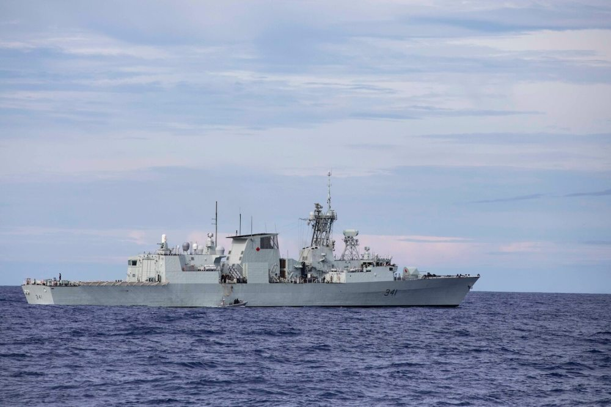

# 加拿大舰载直升机抵近西沙群岛 称遭中国歼-11战机近距“发射干扰弹”

【观察者网
讯】据美国有线电视新闻网（CNN）网站当地时间11月2日报道，加拿大军方称，10月29日一架中国战机在南海“国际水域”上空向一架加拿大军用直升机“发射了干扰弹”，一名接受采访的加拿大军官抱怨称这一行动是“鲁莽的”，可能导致飞机坠毁。

报道称，当事直升机是一架从加拿大海军护卫舰“渥太华”号（“哈利法克斯”级12号舰，舷号FFH-341）上起飞的CH-148“旋风”（即西科斯基S-92）直升机，“渥太华”号上的加拿大空军少校罗布·米伦表示，对于直升机来说在这种情况（指战机投放干扰弹）下，面临着红外干扰弹接触旋翼或者进入发动机的风险，因此认为这是一种“不安全、不标准和不专业”的情况。

_（资料图）今年9月在南海的“渥太华”号 图片来源：美国海军太平洋舰队_

_（资料图）正在FFH-336“蒙特利尔”号（“渥太华”号同型舰）上着舰的加拿大空军CH-148“旋风”直升机 图片来源：加拿大空军_

米伦少校在接受采访时称，当事直升机在10月29日当天于“国际水域”上空两次遭遇中国歼-11战机，其中第二次时两机距离接近到了100英尺（约30米），他还提到，此前（在中国周边抵近活动的）加拿大和其他国家曾多次看到中国战机靠近固定翼飞机，但“很少看到对直升机采取此类行动”。

根据报道描述，29日发生的两次事件分别位于距离西沙群岛34英里（约合55千米/30海里）和23英里（约合37千米/20海里，该距离位于我西沙群岛毗连区内）的“国际水域”上空，其母舰“渥太华”号则在西沙群岛以东约100英里（约合160千米/87海里）的“国际水域”行动，舰上的加拿大官员称，加拿大直升机事发时“正在搜寻一艘此前探测到的潜艇”。

_根据原报道推测的事发位置，从东至西（从右至左）三处蓝色标记分别为当天“渥太华”号所在位置、加军直升机声称遭遇第一次拦截与第二次拦截位置_

米伦称，他本人当天稍早时正在驾驶直升机，当时遭遇了中国歼-11战机的近距拦截，直升机正在3000英尺高度上“笔直地”向“渥太华”号返航，他认为正在返航的直升机对外显示出“没有敌意”的信号。而在更早的遭遇中，中国战机在直升机周围进行盘旋，当拦截飞机“越来越近时”，在某个时候就“不安全”了，米伦说，战机在当事直升机附近造成了湍流，对直升机“构成了危险”。不过他表示，他的机组成员正在训练如何应对这种拦截，并声称将继续飞越南海的“国际水域”。

**本文系观察者网独家稿件，未经授权，不得转载。**

