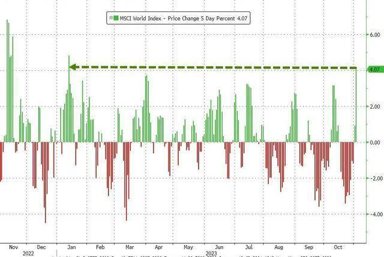

# 就业降温加息结束稳了！美国三大股指创一年最佳周表现，中概燃爆

重磅非农就业报告显示强劲的劳动力市场意外降温，美联储更有理由将利率保持在当前高位、不再进一步加息。美国股债市场喜迎加息周期结束的佐证，双双进一步走高。

周五公布的美国10月新增非农就业人口超预期放缓至15万，较预期少增3万，新增人口仅9月的一半，8月和9月新增人口合计下修10.1万；10月失业率未如预期企稳，反而连升两个月至3.9%，创去年1月以来新高；平均每周工时和劳动力参与率也未企稳，而是小幅下降，同样体现了疲软迹象。

此后公布的10月美国ISM非制造业指数超预期降至五个月低位51.6，分项指标就业指数创去年4月以来最大降幅，体现贡献美国经济多数GDP的服务业活动放缓、就业也降温。

评论称，周五的一系列数据凸显了经济处于既不过热也不过冷的最佳适度状态，这正是此前担心经济过热的投资者希望看到的结果。

数据强化了市场对美联储已完成加息的预期，同时，市场加大押注最早明年6月联储就开始降息。互换合约交易价显示，投资者预计到明年1月，美联储再次加息的概率只有25%，并且充分定价预期了到明年6月会有一次降息，首次降息的时间较此前的7月提前一个月。

非农就业报告公布后，美股高开，美元指数跌幅扩大，各期限美债全线价格跳涨、收益率跳水。基准十年期美债收益率连续第三日盘中降幅超过10个基点，一个月来首次盘中下破4.50%，对利率更敏感的两年期美债收益率降幅也迅速扩大到10个基点以上、一度将近20个基点，降至两个月低位，远离5.0%关口。

ISM服务业数据公布后，美股指刷新日高，纳指标普均涨超1%，美元指数加速下跌，9月下旬以来首次跌穿105.00。中概股加速上涨，相关指数涨势更胜大盘一筹，延续周四跑赢大盘的势头。而公布三季度在中国市场销售超预期下滑、预计四季度总营收同比零增长逊于预期的苹果逆市回落。

在英美日央行不约而同公布货币政策决议的超级央行周，英美央行均连续两次会议暂停加息，美联储首次在决议中承认金融环境收紧影响经济和通胀，美联储主席鲍威尔重申谨慎行事，欧美加息周期结束的市场预期明显升温，股债齐涨。三大美股指创至少一年来最佳单周表现，本周长债表现更佳，十年和30年期期美债的收益率创2020年初新冠疫情初期以来最大三日降幅。除了鲍威尔讲话，美国财政部公布的季度期内长债标售规模低于预期也是美债收益率下行的推手。

经济数据的坏消息成了股市的好消息，MSCI全球指数显示，全球股市本周五日创1月初以来最大五日涨幅。

 _MSCI全球指数本周创十个月最大五日涨幅_

日本央行微调收益率曲线控制政策（YCC）、取消日债收益率硬性上限1%，调整力度令投资者失望，日元周二盘中跳水，此后日本财务省官员发出迄今为止最严正警告之一，称“随时待命”，日元有所反弹，周五美元走软之际进一步反弹，盘中收复去年曾触发日本政府干预的关口150，并成功守住这一关口，全周惊险转涨。也是乘着美元加速下行的东风，人民币周五加速上涨，离岸人民币三周来首次盘中涨破7.29，本周轻松累涨。

大宗商品中，国际原油期货周四刚反弹就重回跌势，美油和布油均逼近各自周三所创的低位，美油曾逼近80美元关口。市场对中东地缘局势的供应面担忧缓和，本轮巴以冲突的溢价消减。黎巴嫩真主党领导人Sayyed
Hassan
Nasrallah周五自巴以冲突以来首次发表讲话，警告中东冲突可能扩大，但未承诺在以色列与黎巴嫩边境开辟另一条战线。有评论称，市场正在从容应对这场冲突，因为它看起来既不是重大的需求中断事件，也不是重大的供应干扰。

黄金得到美元加速下行之支持，继续反弹，纽约期金在美国就业报告发布后曾涨破2000美元，收盘时略低于这一关口，逼近周一站上该关口后所创的7月末以来高位，本周勉强保住了巴以冲突爆发后持续单周累涨的势头，但考虑到美元大跌，黄金累计微涨的表现显得疲软。

纳指五连涨、一周涨超6% 芯片、AI和中概股两日跑赢大盘 苹果财报后回落

三大美国股指连续第五日集体高开，早盘保持涨势。开盘约半小时后，标普500指数和纳斯达克综合指数涨幅扩大到1%以上，开盘不到一小时，道琼斯工业平均指数涨超230点、涨近0.7%，后涨幅有所收窄，标普和纳指涨不足1%，道指涨超百点，午盘标普和纳指再度涨超1%，道指曾涨超300点。

最终，三大指数连续四日集体收涨，纳指连续五日收涨，涨幅1.38%，连续三日收涨超1%，报13478.28点，刷新10月17日以来高位。标普收涨0.94%，报4358.34点，连续两日
刷新10月17日以来高位。道指收涨222.24点，涨幅0.66%，报34061.32点，刷新9月21日以来高位。

价值股为主的小盘股指罗素2000收涨2.71%，两日跑赢大盘，连涨四日至10月17日以来高位
。科技股为重的纳斯达克100指数收涨1.21%，连涨五日，两日刷新10月17日以来高位。

主要美股指本周集体累涨。连跌三周的纳指累涨6.61%；标普累涨5.85%，道指涨5.07%，纳斯达克100涨6.48%，都在连跌两周后反弹，道指创去年10月28日以来最大周涨幅，标普、纳斯达克100、纳指均创去年11月11日以来最大单周涨幅；罗素2000累涨7.56%，创去年6月24日以来最大周涨幅，扭转四周连跌势头。

 _主要美股指本周均大幅累涨，涨幅相对最小的道指都涨幅略超过5%_

龙头科技股多数继续上涨，特斯拉早盘曾涨超3%，收涨近0.7%，连涨四日，两日刷新10月19日以来高位，因本周四涨超6%，全周累涨6.1%。

FAANMG六大科技股中，奈飞收涨1.8%，连涨五日，三日刷新9月12日以来高位；谷歌母公司Alphabet收涨近1.3%，连涨两日，三日刷新10月24日以来高位；微软收涨1.3%，连涨六日至7月19日以来高位；Facebook母公司Meta收涨1.2%，反弹至10月18日以来高位；亚马逊收涨近0.4%，连涨六日，两日刷新9月18日以来高位；而周四盘后公布财报的苹果盘初曾跌近2.4%，收跌0.5%。

本周这些科技股均大幅累涨，奈飞涨约8.7%，亚马逊涨8.5%，微软涨约7%，Meta涨约6%，Alphabet涨近5.7%，涨幅相对最小的苹果也有5%的涨幅。

芯片股总体连涨四日，连续两日跑赢大盘，费城半导体指数和半导体行业ETF
SOXX均收涨约2.6%，刷新10月17日以来高位，本周累涨约7%。到收盘，看好四季度和明年AI芯片销售后周三收涨近10%的AMD涨超4%、本周涨超16%，英伟达涨超3%，英特尔和Arm涨超1%，公布财报优于预期后周四大涨近6%的高通涨1.8%，本周涨超12%，和AMD均将在发布财报的本周累计涨超10%。

周四大涨的多只AI概念股也连续第二日总体跑赢大盘。收盘时BigBear.ai（BBAI）涨近10%，SoundHound.ai（SOUN）涨约7%，C3.ai（AI）涨4.9%，周四公布财报后暴涨20%的Palantir（PLTR）涨超5%，Adobe（ADBE）涨近0.9%。

热门中概股总体连续两日上涨。纳斯达克金龙中国指数（HXC）早盘曾涨逾3.5%，收涨3%，连续第二日跑赢大盘，本周累涨约2.7%。个股中，收盘时B站涨约6%，蔚来汽车涨超5%，拼多多、腾讯粉单涨约5%，京东涨超4%，小鹏汽车涨超3%，理想汽车涨近3%，阿里巴巴、百度、网易涨超2%。

尽管业绩报告接二连三地打击投资者信心，美股光伏股仍普遍收涨。中概股晶科能源收涨7.6%，Ascent光伏科技涨超4.48%，SolarEdge科技涨超3.8%，本周累跌1.9%，11月2日开盘暴跌至63.250美元，创2019年8月16日以来盘中新低；Shoals科技集团收涨超3.1%，第一太阳能涨超2.9%，Array科技涨约2.8%，阿特斯太阳能ADR涨超2.7%，中概股大全新能源涨约2.5%，FTC光伏涨超2.4%，光伏逆变器生产商Enphase能源涨约2.4%，SunPower涨超2.2%，Maxeon光伏科技涨超1.4%，iSun涨约0.6%，Nextera能源合伙则跌超1.9%。

多只公布财报的个股波动较大，其中，三季度盈利和营收均高于预期的在线旅游公司Expedia（EXPE）收涨18.8%；三季度营收超预期激增57%、每月独立付款人同比增长40%的体育博彩公司DraftKings（DKNG）收涨16.5%；因流媒体业务Paramount+亏损远低于预期而三季度EPS盈利远超预期的派拉蒙全球（PARA）收涨15.4%；因旗下Cash
App和Square营收均增长强劲而三季度业绩优于预期的金融科技公司Block（SQ）收涨约10.7%；三季度调整后EBITDA盈利同比增长2.9倍的华尔街狼王伊坎旗下公司Icahn
Enterprises（IEP）收涨13.1%；三季度营收高于预期、四季度指引中值大致符合预期的医疗设备公司Insulet（PODD）收涨15.8%；三季度营收均高于预期的宠物保险公司Trupanion（TRUP）和咨询公司盖特纳（IT）分别收涨14.3%和14.6%。

而在公布全财年营收和盈利指引均低于预期后，被KeyBanc将评级降至持有、认为缺乏近期内的催化剂且面临宏观逆风的软件公司Bill
Holdings（BILL）收跌25.2%。此外，周四反弹的美妆巨头雅诗兰黛（EL）收跌3%，因为在下调全年盈利和收入增长指引后周三收跌近19%，创1995年上市以来最大日跌幅，本周累跌近11%。

欧股方面，泛欧股指连涨五日，虽然涨势较周四缓和，但继续创两周多来新高。欧洲斯托克600指数连续两日刷新10月18日以来收盘高位。主要欧洲国家股指未能连续第三日齐涨，德西意股连涨五日，连涨四日的法股和连涨两日的英股回落。

各板块中，对利率敏感的房产涨超3%，在周四大涨超5%后继续领涨，汽车涨近1.7%，受益于公布10月销量同比增长10%的沃尔沃收涨近3.7%，三季度汽车业务税前利润率超预期升至9.8%的宝马涨约2%。而在宣布将评估回购股票计划、下调今明两年资本支出预期、并将裁员1万人后，丹麦上市的航运巨头马士基收跌16.9%，在斯托克600成份股跌幅居首。

本周斯托克600指数累计涨超3%，创3月31日一周以来最大周涨幅，结束两周连跌，但因上上周跌超3.4%，未能抹平前两周跌幅。欧洲主要国家股指均累计上涨，连跌六周的德法西股和连跌三周的英股及意股均反弹。

因为周四和周五大涨，房产板块一周涨超12%，遥遥领先其他板块，上周跌超4%领跌的汽车涨超6%，涨幅居前，上周涨近4%领涨的矿业股所在板块基础资源涨近3%，而油气跌超1%，表现最差，连跌三周。

