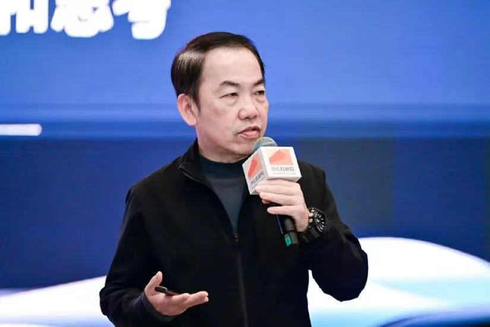

# 投资人陈维广：外资若不投中国，就舍弃了一个大机会｜深网

_来源：视觉中国_

作者|叶蓁

编辑|康晓

出品|深网.小满工作室

“过去这么多年，但凡在融资金额上虚报、造假的造车新势力企业，至今一个不剩，全都死光了。某些借尸还魂的，最后还是个死。”理想汽车创始人李想在微博上公开评论。

今年以来，理想汽车销量增长迅猛，是少数逆势而长的新能源汽车公司，上半年的交付量已经超过2022年全年的交付量。理想二季度财报显示，公司上半年净利润已抹平前三年净亏损，2023年全年营收有望突破千亿规模。

回首几年前舆论对于理想汽车首先发力增程式的不理解，再看其在今年的凶猛战斗力，李想这句话不免有种“轻舟已过万重山”之感。

逆风翻盘从来不止是创业公司的战争，对于背后的投资人来说，如何在一片混沌中捕捉到最后的赢家从来都是天问。

作为理想汽车早期投资方，蓝驰创投管理合伙人陈维广向《深网》分享了其投资方法论。蓝驰创投曾连续5轮投资理想汽车，此外还曾投资了水滴公司、瓜子二手车、趣店、赶集网和怪兽充电、高仙机器人等知名项目。过去两年的资本寒冬中，蓝驰创投募得55亿的双币基金，活跃度不降反增。

新能源汽车之后，创投市场的下一个万亿级赛道在哪里？早期基金如何在这样的寒冬中存活并活跃？如何应对解决募资难的问题？以下是陈维广与《深网》的对话实录整理：

**下一个万亿赛道**

**《深网》：新能源造车新势力中，蓝驰很早就投了理想汽车，为什么？**

**陈维广：新能源造车要做好定位和成本控制。**

从定位来看，如果你跟比亚迪等传统车企在一个档位里竞争，那你的对手有供应链、可能也是电池生产商，成本是比造车新势力低的；你在一些新技术上可能更强，但在当下的环境下还无法凸显优势；而如果现在跟一些走高端路线的车企竞争，他们有深厚的品牌积淀，你要做出差异化就需要提供很多服务，这些都很耗钱。

理想的定位清楚，成本也控制得好。它定位针对家庭，又不完全是纯电，电池相对小，成本就相对低，它能在车内空间上做文章。

北上广深很多家庭只能用一辆车，因此车内空间是非常重要的。

**《深网》：特斯拉在持续降价，对造车新势力来说意味着什么？**

**陈维广：为什么特斯拉能持续降价？因为它的市场是全球大市场。**
造车像其它制造业一样，也是规模经济，如果能卖出去更多车，就分摊了固定成本，毛利的贡献率也就非常客观了。

**长期来看，特斯拉会不会用量把“造车新势力”打死？我觉得也不会。**

先把国内市场占稳，一旦量上来了，特斯拉的优势就不一定那么明显。随着“造车新势力”在国内市场份额的进一步提升，它们也会去做国际市场。未来“造车新势力”都有机会。

**《深网》：除了新能源车之外，现在万亿级赛道的机会还多吗？**

**陈维广：** 机器人是一个。我们投的几个机器人的项目都增长非常快。包括做物业的、清洁的，还有半导体工厂搬运的。

**《深网》：新的万亿级赛道可能需要更长的周期吗？**

**陈维广：不一定，如果具备了一定的要素就会增长的很快。像机器人赛道的增长就和人口老龄化存在关系。最关键的是要关注大势。**

就像冲浪的时候，有的人冲浪技巧很好，但是总是踩不到浪；有的人却总能在特定的时间踩在浪上。

随浪起伏，因此时机很重要。

**《深网》：怎么才能踩到浪？**

**陈维广：**
需要满足一些基本要素。2015年我们开始看汽车的时候，首先，中国已经具备了电子和锂电池的生产能力，且续航公里数已经超过300公里；第二，政府制定政策鼓励大家购买电动汽车，有一些驱动因素。
**如果2010年有人喊这是一个风口，但这些要素不具备的话，也是很难形成大趋势。** 早期的投资人需要学会识别哪些是真正的风口。

**《深网》：看准了大势，赛道中的项目投哪一个？**

**陈维广：有变革式技术的公司。** 只有如此，才能带来超额回报。 **VC这个生意，其实利用的是信息的不对称。**

**硬科技投资时代的乐与痛**

**《深网》：许多年来蓝驰一直在投硬科技早期，为什么？**

**陈维广：**
硅谷在70年代为什么创造VC这个资产类？就是因为半导体技术的创新撕开了计算机和通讯的口子。VC的初心就是技术创新。我是个喜欢底层技术的理工男,投硬科技是蓝驰出于初心和志趣的选择。

**《深网》：十多年来这个领域变化了吗？**

**陈维广：最重要的是人才** ， **我2008年回来投了一些半导体企业，都没有大成，主要是人才的储备缺乏。**

现在中国工程师队伍逐步壮大，而且
**呈现多元化的趋势，既有AI算法、AI芯片等专业方向的工程师，又有生物科学等各学科领域的科研人员，还有很多交叉学科的人才等。**
越来越多的年轻人受到好的教育、重视科研，虽然近年国内生育率在下降，但毕竟中国是一个大国。

我认为至少在2035年前，工程师红利是可以持续的。

**《深网》：投硬科技的逻辑和风险是什么？**

**陈维广：**
技术类项目前期的资金投入不小，研发周期长，而且产品化以及销售过程会比互联网应用慢不少，增长曲线相对比较滞后。这就是风险和挑战。但是一旦它的技术被市场接受，它的进入门槛是非常高的，后续的增长曲线也会比较平稳。

所以投资人更需要了解项目的属性，了解它的风险，其中就包括技术的差异化门槛、知识产权的完备性、应用场景以及投入产出比。此外，很重要的是你的资金是否有足够的耐心，因为硬科技不可能像互联网企业一样三年就能决定胜负，可能需要5-10年，才能真正看到盈利。

而且， **硬科技一定要结合应用场景和商业场景** ，我们投的清洁机器人，取代了清洁工，把成本降低。但这个也是用了很长的时间摸索出来的一个路径。

**《深网》：你怎么看当下的资本市场？**

**陈维广：** 我是比较谨慎的人，但抱着比较乐观的态度。我们投的硬科技企业，他们的收入、业务拓展都正常，还有一些增长，疫情期间唯一的挑战就是融资比较难。

但疫情放开后，它们陆陆续续都公布了新一轮融资。如果都跌了50%，我也慌了，尽快把股票卖了，但现在我觉得基本面都挺好的。

**《深网》：去年蓝驰的双币基金募了55亿，募资过程难吗？**

**陈维广：** 美元和人民币的募资不一样。

先说美元基金，我们要说服美元的LP： **虽然中国的互联网的红利已经消失了，但还有一个新课题叫硬科技，中国还是有好资产；**
这个世界上只有两个最大经济体，就是中国和美国，若不投中国，就舍弃了一个比较大的价值创造的机会。

人民币基金比较多的是地方政府引导基金， **它除了投GP，也是希望被投项目落地到当地去，帮当地创造税收，创造就业。**
募资的难点在于能不到带好项目去当地、如何跟它们合作，以及让它看到基金的价值。

**《深网》：LP对基金的期望是什么？**

**陈维广：为LP创造超额的回报,至少20%的年回报率。**
要创造超额回报率，就要冒更大的风险，而且一定要踩在一个大趋势上，因为创业公司都是小公司，如果没有踩中大趋势，它很难在短时间内成为一个有价值的公司，就无法帮助投资人创造更大的价值。而这个大趋势，我认为不是风口，风口太宽泛了。

**《深网》：中国创投圈和硅谷创投圈的差距是什么？**

**陈维广：** 一是创业者要带着长线视角去创业，而不是追求短线的目标；二是在创新方面还是需要多加努力，但不是为了创新而创新，而是需求催生的创新。

**比早期更早一步**

**《深网》：今年蓝驰主要把时间花在什么事情上？**

**陈维广：** 简单来说三个关键词：AI、全球化、更深度赋能创业者。

**《深网》：第一个毋庸置疑。不过今年越来越多VC强调全球化，背后逻辑是什么？**

**陈维广：** 科技是没有国界的。同时，中国公司和品牌也面临着站到更高舞台、打造更多世界级产品的机会。所以投资人想捕捉到大机会，就要用全球化的视野看项目。

对创业者来说，在世界范围内去争夺机会时，也面临更强竞争、得到更强的锻炼。因为 **如果做不到World
Class，那不一定是很大的机会。当然，创业者具有世界级水平的研发实力和自信时，“国产替代”自然不会成为难题。**

**《深网》：更深度赋能创业者呢？其实传统的早期投资很多是不讲究投后的。**

**陈维广：**
本质上是因为科技创新的时代换挡。科技创新项目跟互联网项目不一样，从0到1的研发阶段是最难、最“不鸣”的。一旦崭露头角，就会进入“booming”的爆发式繁荣阶段。

就像你问我理想为什么快速爆发，但大家或许还记得它在找到并真正抓住PMF（Product Market
Fit，产品市场契合点）之前，也经历过很艰难、孤独的时间。我们希望能在这个阶段当创业者信得过的朋友，建立不同的思考框架帮助创业者更好地看到机会和风险。

**《深网》：这是不是蓝驰始终坚持早期的底层逻辑？**

**陈维广：**
我们先来定义：早期早到什么程度？创业者可能还处在业务的试错和探索当中，业务原型可能还没有完全长出来，还在寻求它的切入点。这个阶段我们要怎么去选人、选事，怎么去管理风险，我们会比较专注在这个方向上，而且这也是我们自己觉得很有成就感的地方。
**做投资的自律是很重要的，我们选择早期这个事情也是对自己自律的一个要求。**

**《深网》：蓝驰未来的挑战是什么？**

**陈维广：**
我觉得每天每年都有新挑战，一是如何更早的、快速地识别大趋势；是能否在大趋势下有时刻与之匹配的最优投资团队；三是团队项目长大了，能不能在市场没有变糟糕的状况下及时退出。

**《深网》：这个能归结为运气吗？**

**陈维广：运气30%，70%是专业判断。**

**《深网》：对创业者来说，钱和钱没什么不同。蓝驰怎么定义自己的个性？**

**陈维广：** 我们不追风口，只追求真实， **而真实是需要好奇心和持续提高自己的认知来达到。**
对创业者是这样的要求，对我们的团队也是这样的要求。第二，对创业者和团队真诚，Be
Open，有想法就坦诚，别因为怕得罪对方或担心自己吃亏，这两个可能是我比较重视的价值观。只要是基于真实的投资决策，真诚地对待创业者和团队，是一百亿还是十亿的回报，可能会有运气的成分，但我相信一定会有好结果。

**《深网》：你比较欣赏谁？**

**陈维广：** 李光耀，他很有前瞻性，有人说现在的新加坡躺平都能挣钱。李光耀在早些年搭了一个很好的框架。

