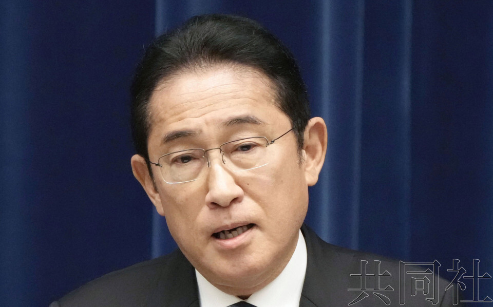
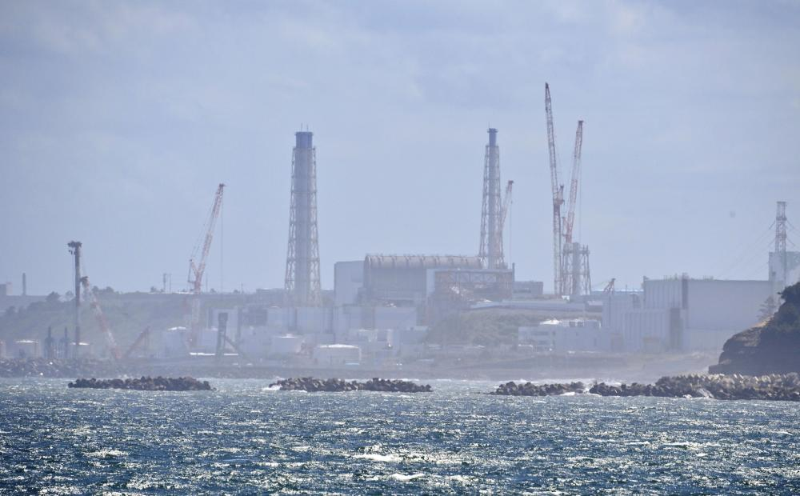

# 日本首相再就对华关系表态：有意与中方密切沟通，包括首脑会谈

（观察者网讯）据共同社报道，日本首相岸田文雄11月2日在记者会上谈及对华关系时表示，必须与中国维持建设性且稳定的关系，日方有意与中方密切沟通，推进包括首脑会谈在内的对话。

岸田在记者会上提及本月中旬将在美国举行的亚太经合组织（APEC）峰会。他说，“包括高层对话在内，力图密切沟通”。

但至于具体会谈计划，岸田表示“现阶段一切尚未确定”。

在谈及中国对日本水产品实施的进口禁令时，岸田再称将要求中方撤销该措施。他同时称：“必须与中国维持建设性且稳定的关系。主张应主张之事，敦促其‘承担大国责任’。”

_11月2日，岸田文雄在官邸就经济对策召开记者会/共同社_

岸田今年以来已多次就对华关系作出表态。

今年7月，岸田在参加日本政策建言组织“令和国民会议”集会时表示，中日关系正“原地踏步”，但两国“密不可分”。

岸田称，中日关系在去年11月首脑会谈后“确定了积极势头”，此后日本外相于4月访华。他随后表示，但自此之后，两国间存在各种各样的问题，仍在“原地踏步”。

“中国是我们的邻居，我们最大的贸易伙伴，我们密不可分。”他说，“我们希望（两国）在保持对话的同时维持建设性和稳定的关系。”

在9月20日赴纽约出席联合国大会期间，岸田召开记者会再度表态说，日方重视与中国开展对话，并“在所有层面谋求与中方紧密沟通”。他说，“通过双方的努力推进建设性和稳定的关系，是日本的一贯方针”。

_2023年8月24日，日本政府无视国内外反对呼声，当天13时正式启动福岛核污染水排海/澎湃影像_

然而，一边作出开放沟通姿态的日本政府，另一边仍不顾包括中方在内的国际社会严重关切和坚决反对，于今年8月执意启动福岛核污染水排海工作，公然向世界转嫁核污染风险。

11月2日，日本东京电力公司启动第三批福岛核污染水排海，预计持续至11月20日，计划排放约7800吨核污染水。

中日关系面临的挑战已然让不少日方人士感到担忧。日媒8月曾放风称日本公明党党首山口那津男计划访华“促进中日关系改善”。不过中国外交部后来表示，鉴于当前中日关系状况，经双方商定，决定推迟日本公明党代表团访华。

10月23日是中日和平友好条约换文生效45周年纪念日。外交部发言人毛宁在当日例行记者会上表示，当前，中日关系处于改善发展的关键阶段，同时面临不少风险和挑战。双方应以纪念缔约45周年为契机，以两国领导人重要共识为指引，重温条约精神，维护政治基础，拓展互利合作，管控矛盾分歧，共同致力于构建契合新时代要求的中日关系。

**本文系观察者网独家稿件，未经授权，不得转载。**

