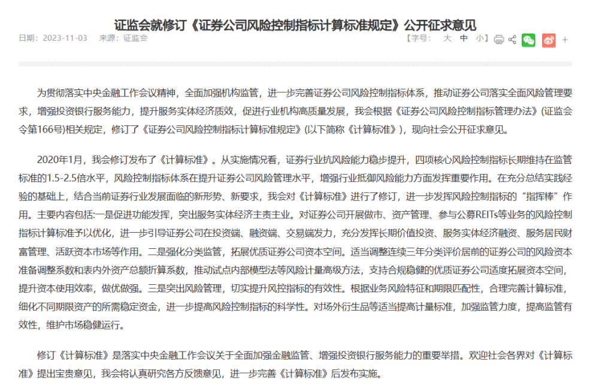

# 最新券商风控指标出台！对做市、资管、公募REITs等业务优化指标

财联社11月3日讯（记者
林坚）据证监会官网消息，近日，证监会就修订《证券公司风险控制指标计算标准规定》向社会公开征求意见。经过财联社记者梳理，本次修订有7大核心看点：

一是本次修订是落实中央金融工作会议关于全面加强金融监管、增强投资银行服务能力的重要举措。

二是对证券公司所有业务活动纳入风险控制指标约束范围，对创新业务和风险较高的业务从严设置风险计算标准。

三是对证券公司开展场外衍生品等业务从严设置风险指标计算标准，加强资本约束，提升监管力度。

四是对证券公司开展做市、资产管理、参与公募REITs等业务的风险控制指标计算标准进行了优化完善。

五是适当调整连续三年分类评价居前的证券公司的风险资本准备调整系数和表内外资产总额折算系数。

六是推动优质证券公司试点内部模型法等风险计量高级方法。

七是要求证券公司坚持穿透、审慎原则计提风险资本，审慎控制业务规模和增速，体现业务发展与合规风控的匹配性，巩固风险防控基础，夯实高质量发展根基。

就在近日，中央金融工作会议召开，会议提及的金融机构差异化定位等将对金融机构产生深远影响。11月1日，中国证监会召开党委（扩大）会议，传达学习中央金融工作会议精神，研究贯彻落实措施，明确增强投行服务能力。

据记者了解，本次修订旨在通过提高风险控制指标的科学性、有效性、导向性，促进证券公司加大服务实体经济和居民财富管理的力度，提升全面风险管理的主动性和有效性，为增强投资银行服务能力奠定良好基础。同时对重点业务加强资本约束，体现从严监管的导向，守牢不发生系统性风险的底线。

看点一：督促证券公司落实全面风险管理要求

整体来看，风险控制指标体系在提升证券公司风险管理水平，增强行业抵御风险能力方面发挥了重要作用。近年来，证监会不断健全以净资本和流动性为核心的风险控制指标体系，督促证券公司落实全面风险管理要求，夯实内控合规基础。

据记者观察，2020年1月证监会修订发布现行的证券公司风险控制指标计算标准以来，经过三年多的实践，证券行业抗风险能力稳步提升，风险覆盖率、资本杠杆率、流动性覆盖率、净稳定资金率四项核心风险控制指标长期维持在监管标准的1.5-2.5倍水平，行业持续稳健发展，没有发生重大风险事件。

值得一提的是，本次修订证券公司风险控制指标计算标准是落实中央金融工作会议关于全面加强金融监管、增强投资银行服务能力的重要举措，主要体现四方面的监管导向：

一是促进功能发挥。进一步发挥证券公司风险控制指标“指挥棒”作用，引导证券公司优化业务结构和资产配置，加大服务实体经济和居民财富管理的力度。

二是扶优限劣、分类监管。适当拓展优质证券公司资本空间，提升资本使用效率，做优做强，当好服务实体经济的主力军和维护市场稳定的压舱石。

三是全面加强监管。对证券公司所有业务活动纳入风险控制指标约束范围，对创新业务和风险较高的业务从严设置风险计算标准。

四是夯实风控基础。通过风控指标计算标准的修订，引导证券公司主动加强风险管理，走资本集约型的专业化稳健发展之路。

看点二：对做市、资产管理、参与公募REITs等风控指标进行优化

随着注册制稳步推进，证券公司科创板跟投、做市交易、系统建设、合规风控投入均需消耗净资本。为促进证券公司功能发挥，更好地服务中国特色现代资本市场的建设，本次修订对证券公司开展做市、资产管理、参与公募REITs等业务的风险控制指标计算标准进行了优化完善。

上述修订旨在进一步引导证券公司在投资端、融资端、交易端发力，充分发挥长期价值投资、促进价格回归、活跃资本市场等作用，助力资本市场枢纽功能发挥。

看点三：要求证券公司坚持穿透、审慎原则计提风险资本

为落实中央金融工作会议关于全面强化机构监管、功能监管、穿透式监管、持续监管等要求，对证券公司开展场外衍生品等业务从严设置风险指标计算标准，加强资本约束，提升监管力度。

修订后的规定还要求，证券公司要坚持穿透、审慎原则计提风险资本，审慎控制业务规模和增速，体现业务发展与合规风控的匹配性，巩固风险防控基础，夯实高质量发展根基。

看点四：适当调整连续三年分类评价居前的证券公司部分风险指标

修订后的规定支持合规稳健的优质证券公司适度拓展资本空间，更好为实体经济提供综合金融服务，对优质证券公司的风控指标适当予以优化：

一方面，适当调整连续三年分类评价居前的证券公司的风险资本准备调整系数和表内外资产总额折算系数，为优质证券公司拓展资本空间，加大服务实体经济和居民财富管理力度。

另一方面，推动优质证券公司试点内部模型法等风险计量高级方法，提高风险计量的精准性和风险管理的有效性。

