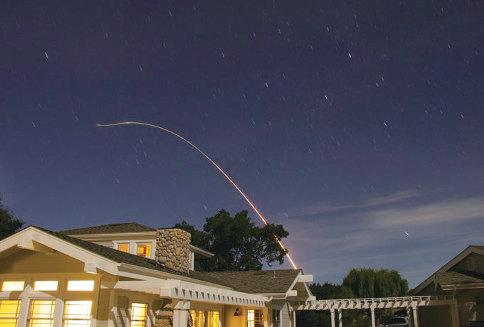

# 服役超半个世纪，可靠性遭质疑，美“民兵3”洲际导弹试射失败引嘲讽

【环球时报特约记者
晨阳】近年来美国不断加强核导力量建设，但美国空军全球打击司令部11月1日宣布，当天试射的一枚“民兵3”洲际导弹在飞行过程中出现异常，被迫在太平洋上空启动自毁程序。多家美国媒体承认，作为美国“三位一体”核威慑体系中的重要一环，这种洲际导弹已经服役了半个多世纪，近年来屡次在试射中发生意外。

**在太平洋上空被“安全终止”**

美国《星条旗报》1日称，美国空军于当地时间凌晨从范登堡空军基地发射一枚“民兵3”洲际导弹，但它在飞行过程中出现异常，在飞越太平洋时被“安全终止”。报道称，所谓“安全终止”实际是指启动了导弹自毁程序，该导弹没有携带核弹头。

_1日发射的“民兵3”洲际导弹出现异常飞行轨迹。_

美国空军全球打击司令部在声明中表示：“导弹异常是指测试期间发生的任何意外事件。由于这种异常可能与操作平台本身或测试设备等许多因素有关，需要仔细分析以确定原因。目前正在成立一个专门小组来调查原因。”美国空军表示，“仍能从这次失败的测试中得到一些有用的数据”。

美国“动力”网站1日称，现场目击者拍摄的照片显示，这枚“民兵3”导弹发射时的飞行轨迹出现异常，可能与发射失败有关。美国科学家联合会核武器专家汉斯·克里斯滕森称，“民兵3”导弹近年来多次出现发射失败的情况：2011年和2018年，“民兵3”导弹先后两次在飞行过程中出现异常而被迫自毁；2021年，一枚“民兵3”导弹的发射程序出现异常，被迫终止发射。

据介绍，“民兵3”是美国现役唯一一种陆基洲际导弹，也是美国“三位一体”核威慑体系的重要组成部分。目前一共有约400枚“民兵3”导弹服役，分布在美国5个州的固定发射井中。它属于三级固体燃料洲际导弹，最大射程超过1.2万公里，可以携带三枚核弹头，具备相当可观的突防能力。但根据核军控条约规定，目前美国的“民兵3”导弹只携带一枚核弹头。由于该导弹最早从1970年开始服役，最后一枚也早在1978年就结束生产，因此这种服役约半世纪的洲际导弹可靠性一直备受关注。《星条旗报》称，这就是为什么美国空军需要定期对该导弹进行测试，以验证其有效性、战备状态和准确性。“大多数试射都是提前几年安排的，此前该导弹的最近一次试射发生在9月6日”。

据俄罗斯《观点报》2日报道，俄罗斯军事专家尤里·克努托夫称，美国发射的这枚“民兵3”洲际导弹可能偏离了预定路线，导致飞行轨迹变得不可预测。为了降低可能的风险，美军决定令其自毁。“我认为这是由于美国军火库储存不当造成的。”

**各种丑闻和事故不断**

大部分美国媒体在介绍“民兵3”这次发射失败时，都会提到它的可靠性问题。美国“防务一号”网站介绍说，冷战结束以来，美国一度放缓了核导武器发展，冷战时期建造的“俄亥俄”级战略核潜艇、B-2战略轰炸机和“民兵3”洲际导弹一直沿用至今。而在美国“三位一体”核威慑体系中，又要数陆基洲际导弹最不受重视。“陆基洲际导弹已成为美国‘三位一体’核体系中最具争议的一环。除了建造和维护成本高昂之外，由于具体部署位置早已经被对手确定，它们仅在第一次打击时有用，必须在发现来袭核导弹后的7分钟内发射”。报道称，相比之下，海军和空军的核武器在生存性和使用灵活性方面更有优势，多年来五角大楼和智库一直有人呼吁“取消陆基洲际导弹”。冷战结束以来，“民兵3”导弹主要只进行了几次延寿改进，以服役更长时间。

2021年，负责美国核武库的时任美国战略司令部司令查尔斯·理查德上将批评称，“我希望所有人都知道：美国的400枚‘民兵3’洲际导弹实在太老了，修复它们比全部替换的成本还要高。”他抱怨说，“我在希尔空军基地看到，这种导弹实在太老了，很多图纸已经找不到，即便现有的那些图纸也比行业标准落后了六代。那些知道该如何修复的人，如今也基本不在人世了。”

不少美媒都热衷于嘲讽“民兵3”导弹的老旧程度：“美国士兵操纵着1970年部署的弹道导弹，在上世纪60年代就开始建筑的混凝土地堡中待命，以保卫21世纪的美国安全。”“科学美国人”网站称，罕有人知道，作为美国最强大的核打击手段之一，“民兵3”导弹配套的“战略自动化指挥控制系统”直到2019年仍在使用上世纪70年代生产的IBM
Series/1电脑和容量只有64K的8英寸软盘。美国《防务新闻》称，美国空军认为，这些过时的硬件设备在网络时代具备特殊的安全优势。直到2019年6月，8英寸软盘才被更换为“高度安全的固态数字存储解决方案（一种U盘系统）”，但IBM
Series/1电脑依然还在使用。报道称，这种过时的电脑发生故障时，显然难以维护。由于已经没有可用的替换零件，因此所有部件都必须进行手动修理——工作人员可能需要连续数小时在显微镜下对电路进行维修。

_发射井中的美国“民兵3”洲际导弹_

在设备严重老化、地位日益边缘化以及严重的精神压力面前，美国“民兵3”导弹部队近年丑闻频发。例如2014年马尔姆斯特伦空军基地“民兵3”导弹部队爆出了90名发射人员在技术考试中集体作弊。至于吸毒贩毒等违法活动更是在闲得无事的士兵中流行，失职、违规操作等情况屡见不鲜。即便如此，美国空军仍要求“民兵3”导弹继续服役到本世纪20年代末或30年代初，才能由新一代“哨兵”洲际导弹替代。

**接替者面临“难产”**

《星条旗报》称，新一代“哨兵”洲际导弹由诺斯罗普·格鲁曼公司研制，预计将携带更现代化的核弹头。五角大楼没有透露关于该导弹的太多技术细节，外界预计它在射程和命中精度上没有太多改进。《防务新闻》称，与“民兵3”导弹相比，“哨兵”导弹将采用模块化设计和开放式架构，允许更换老化和过时的部件。美国空军称，这种模块化方法将降低导弹的全寿命周期成本，并为它在服役周期内的改进提供灵活性。按照计划，“哨兵”洲际导弹将一对一替换现役约400枚“民兵3”导弹，并沿用后者的地下发射井，但相关指挥和控制设备以及基础设施将进行现代化改造。预计采购导弹和升级相关设施的总成本约1000亿美元，整个计划成本为2640亿美元。

但“哨兵”洲际导弹的研制并不顺利。今年早些时候，美国政府问责局称，“‘哨兵’的部署时间可能会推迟至少一年，主要原因是供应链中断、软件开发延迟和质量控制方面的缺陷”。

让五角大楼焦虑的是，并非只有陆基洲际导弹遇到这种情况。印度《欧亚时报》2日称，“哥伦比亚”级战略核潜艇作为美国“三位一体”海基核力量的未来支柱，美国国会预算办公室的报告承认，第一艘“哥伦比亚”号核潜艇的价格将高达175亿美元，超出最初预算17亿美元。后续11艘同级艇的单价为92亿美元，比海军预算多出15亿美元。“美国有史以来建造的最大、技术最复杂的战略核潜艇最终成本可能会超出美国海军和国会的预想”。更令人难以相信的是，当前美国“俄亥俄”级战略核潜艇使用的“三叉戟2D5”潜射洲际导弹同样服役了数十年，美国海军计划对其现代化改造后，让它搭载于“哥伦比亚”级核潜艇上服役到2084年！

