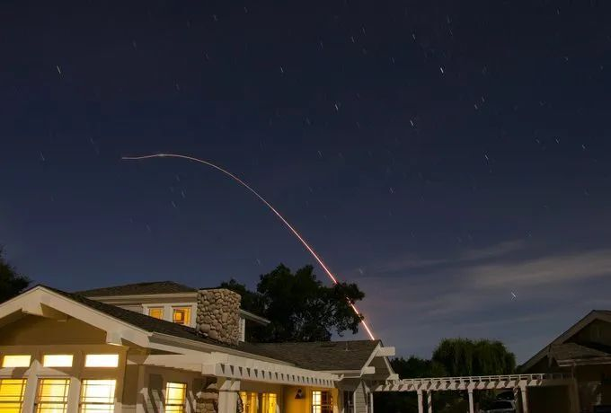
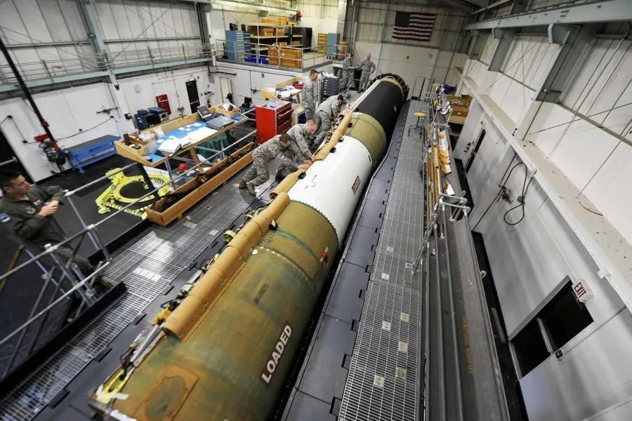

# 美“民兵3”洲际导弹空中爆炸 其所配系统仍在用上世纪70年代的电脑

美国空军全球打击司令部1日发布公告称，一枚“民兵3”洲际导弹当天在飞行过程中出现异常，被迫在太平洋上空启动自毁程序。外界注意到，这已经不是“民兵3”洲际导弹第一次在试射时出事，美国引以为傲的核武库到底怎么了？

老司机发现，这个问题深究下去，就有很多乐子可以看了。

美国《星条旗报》1日称，美国空军于当地时间凌晨从范登堡空军基地发射一枚“民兵3”洲际导弹，但它在飞行过程中出现异常，在飞越太平洋时被“安全终止”。报道称，所谓“安全终止”实际是指启动了导弹自毁程序，该导弹没有携带核弹头。

对于这次事故的原因，美国空军全球打击司令部在声明中表示：“导弹异常是指测试期间发生的任何意外事件。由于这种异常可能与操作平台本身或测试设备等许多因素有关，需要仔细分析以确定原因。目前正在成立一个专门小组来调查原因。”

 _社交媒体流传的这张照片显示“民兵3”洲际导弹发射后的飞行轨迹不正常_

尽管没有官方结论，但社交媒体上广为流传的一张照片显示，该导弹在起飞后不久飞行轨迹就出现异常。俄罗斯《观点报》2日报道，俄罗斯军事专家尤里·克努托夫称，美国发射的这枚“民兵3”洲际导弹可能偏离了预定路线，导致飞行轨迹变得不可预测。为了降低可能的风险，美军决定令其自毁。“我认为这是由于美国军火库储存不当造成的。”

美国科学家联合会核武器专家汉斯·克里斯滕森称，“民兵3”导弹近年来多次出现发射失败的情况：2011年和2018年，“民兵3”导弹先后两次在飞行过程中出现异常而被迫自毁；2021年，一枚“民兵3”导弹的发射程序出现异常，被迫终止发射。

_技术人员在更换“民兵3”导弹上老化的线缆_

但为何“民兵3”导弹发射问题频现？很多媒体习惯性地将美国试射“民兵3”当作是对外炫耀武力的象征，但五角大楼却对此很委屈——我这只是预定计划的定期测试而已，你们不要过度解读了……

老司机想说，某种意义上看，五角大楼说得也有一定道理——只是这个道理挑明白了，美军实在是脸上无光。该导弹最早从1970年开始服役，最后一枚也早在1978年就结束生产，尽管几经延寿改进，但这种服役了半世纪的“爷爷”级导弹能不能继续保持高标准战备状态，就连美军自己也没有底儿。那怎么办呢？美军的解决办法就是通过定期抽查，每年都发射几枚以验证其性能。五角大楼的官方八股文是这么说的：“需要定期对该导弹进行测试，以验证其有效性、战备状态和准确性”。

所以美军每年都要试射多枚“民兵3”导弹，很大程度上就是被这种导弹的可靠性问题逼出来的。而且从实际结果上看，近几年“民兵3”导弹的可靠性似乎的确在下降——最近5年出现了3次事故。

讽刺的是，由于陆基导弹的生存力和使用灵活性都不如空基和海基核导弹，因此“民兵3”导弹部队在美军中的地位也日益边缘化。美媒曾给出经典的讽刺段子：“美国士兵操纵着1970年部署的弹道导弹，在上世纪60年代就开始建筑的混凝土地堡中待命，以保卫21世纪的美国安全。”

更让人难以相信的是，“民兵3”导弹配套的“战略自动化指挥控制系统”直到2019年仍在使用上世纪70年代生产的IBM
Series/1电脑和容量只有64K的8英寸软盘——相信大多数中国人都没有见过这些古董！

_直到几年前，“民兵3”导弹的控制系统还在使用8英寸软盘_

美国《防务新闻》称，美国空军认为，这些过时的硬件设备在网络时代具备特殊的安全优势。直到2019年6月，8英寸软盘才被更换为“高度安全的固态数字存储解决方案（一种U盘系统）”，但IBM
Series/1电脑依然还在使用。报道称，这种过时的电脑发生故障时，由于早已经没有可用的替换零件，因此所有部件都必须进行手动修理——工作人员可能需要连续数小时在显微镜下对电路进行维修。

根据美国空军的计划，安全性已经开始下降的“民兵3”导弹要继续服役到本世纪30年代初，才能由新一代“哨兵”洲际导弹替代。而今年早些时候，美国政府问责局称“哨兵”导弹的部署时间可能会推迟至少一年，主要原因是供应链中断、软件开发延迟和质量控制方面的缺陷。

看来，“民兵3”导弹的苦日子还得持续——未来会不会有更多的导弹在试射中自爆、变成“天空的大礼花”，也不好说呢。

