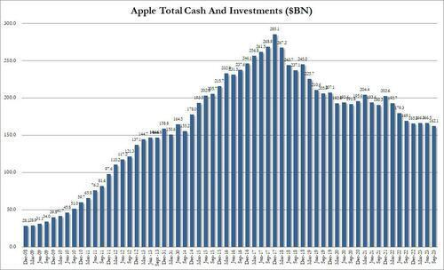

# 苹果营收连降4个季度为22年来最长，下季展望不佳，盘后跌4%

11月2日周四美股盘后，市值近2.8万亿美元的全球最大上市公司、消费电子与科技巨头苹果发布了2023财年四季报（即2023自然年第三季度业绩），大型科技股的本次财报季收尾。

有分析指出，庞大市值令其约占标普500指数权重的7%，股价变动足以影响大盘表现，作为3C消费品巨头，这份财报和对年末购物季的评论都能反映整体经济健康和消费支出意愿的线索。

苹果当季iPhone和服务收入均创新高，总营收连续四个季度同比下滑但符合市场预期，除iPhone外每个硬件收入都同比下跌，盘后一度涨超2%，财报电话会开始后转跌超4%。

**这是由于公** **司高管预测iPad** **和可穿戴设备或在12** **月当季（2024** **财年第一财季）“大幅下滑”，**
尽管预期Mac收入会加速增长、iPhone收入会继续同比增长，增幅料与上年同期类似。

苹果还称，12月季度的总收入将与去年同期相当，当时曾同比下降5%，但华尔街认为，包含年末最重磅节假日购物期的三个月内， **总营收或恢复同比增长**
至1231亿美元， **这代表指引不佳。**

苹果自2001

年以来首次连续四个季度营收同比下滑，但EPS

两位数增长并止步两季下滑

截至9月底，苹果第四财季总营收895亿美元，略好于市场预期的893亿美元，同比下滑0.7%，略好于上季度的同比降幅1.4%，环比增9.4%，是2001年以来首次营收连续四个季度同比下降。

在经历连续两个季度盈利同比下滑后，第四财季苹果EPS为每股收益1.46美元，超过预期的1.39美元，较上年同期的1.29美元增长13%，净利润229.6亿美元，好于预期的218亿美元。毛利率45.2%，高于预期的44.5%和上季度的44.5%。

此外，在2023财年，苹果总收入3832.9亿美元，略超市场预期的3829亿美元，同比下跌3%，每股利润为6.13美元，超过预期的6.06美元，较去年的6.11美元增长不降反升0.3%。

手机收入第四财季纪录最高，服务收入历史新高，其他硬件收入同比回落，Mac

大跌34%

其中，“拳头产品”、占苹果总收入一半的iPhone第四财季销售额438.1亿美元，符合预期，环比增10.4%、同比增2.8%；利润率最高且占总收入四分之一的服务收入为223.1亿美元，高于预期的213.5亿美元，同比增16.3%，
**iPhone** **收入创第四财季纪录最高，服务收入创历史新高** 。

但占总营收10%的Mac电脑收入为76.1亿美元，远逊预期的86.3亿美元，同比骤降33.8%；iPad平板电脑收入64.4亿美元，好于预期的60.7亿美元，同比跌10.2%；包括无线耳机、智能手表和智能音箱的可穿戴设备、家居和配件收入93.2亿美元，逊于预期的94.3亿美元，同比跌3.4%。

**这代表第四财季iPhone** **收入较上季度的同比下降2.4%** **显著改善** ，显示当季iPhone
15新机正式发售一周左右给总业绩带来一定提振，因此季度营收环比增长了10%、每股收益环比增近16%。同时，服务收入明显好于此前连续四个季度个位数百分比的增长，并连续三季创新高。

服务包括App Store应用商店、音频与视频流媒体Apple Music和Apple TV+、iCloud
存储、AppleCare保修、与谷歌搜索引擎许可协议的广告收入、Apple
Pay和其他产品的支付费用等。在iPhone已成更成熟的产品后，服务是苹果业务多元化的重要领域，甚至更早反映消费需求趋势。

同时，这也代表iPad收入在八个季度里第七次同比下降，Mac收入连降四个季度且在六个季度中的第五次同比下滑，并呼应了苹果CFO梅斯特里（Luca
Maestri）在8月财报时的点评，即9月份季度的收入趋势与6月份季度同比下降1%类似，iPhone和服务收入将从6月季度开始加速，但Mac和iPad销量将比去年同期下降两位数百分比，9月季度毛利率为44%至45%。

仅美洲市场收入同比增长，大中华区收入跌2.5%

，库克称Q3

中国大陆iPhone

营收创新高

分地区来看，贡献了苹果20%年收入的大中华区收入在第四财季为150.8亿美元，逊于预期的170亿美元，同比下滑2.5%、环比跌4.3%，显著弱于上季度的同比增幅7.9%。

这显示出苹果产品在其第三大市场的销售前景存在挑战。摩根大通分析师Samik Chatterjee本周指出，最近几天，随着人们对iPhone
15在中国丧失市场份额以及全球消费者支出势头疲软的担忧加剧，对苹果股票的情绪变得更具挑战性。

最大市场美洲地区的当季收入为401.2亿美元，同比增0.8%，好于上季度的同比下降5.6%；第二大市场欧洲的收入为224.6亿美元，同比跌1.5%；日本收入55亿美元，同比跌3.4%；其他亚太地区收入63.3亿美元，同比跌0.7%。也就是说，刚过去的季度只有美洲市场销量增长。

不过， **苹果** **CEO** **库克在财报电话会上对亚洲需求乐观，称iPhone**
**今年三季度在中国大陆的营收创历史新高，公司整体在印度的营收也创新高**
。他还对本周发布的最新Mac电脑性能赞赏有加，称“我们现在拥有进入年末节假日购物季最强大的产品阵容”，每项主要服务收入都破纪录。

库克稍早对媒体表示，季度内iPhone 15的表现比去年同期的iPhone 14更好，他也承认，由于需求旺盛，更昂贵的iPhone 15 Pro和Pro
Max机型供应受到限制。

而Mac电脑收入暴跌是因为与去年同期的“历史最高纪录”相比较，当时由于巨大的供应中断将一些2022自然年第二季度的销售推迟到了第三季度实现。他认为12月季度Mac将表现更好，不过也承认，PC个人电脑市场仍“充满挑战”。另外，苹果在年末重磅季度前没有发布新iPad。

**库克还称，苹果正“大力”投资生成式AI计划。**

苹果CFO则在财报声明中称，得益于强大的生态系统和客户忠诚度，公司“所有产品和所有地理区域的”活跃设备安装量再次创下历史新高，推动第四财季EPS实现两位数增长。一些分析师将活跃设备安装基数，即当前活跃使用的硬件设备数量看作预示其服务收入的未来增长。

此外，公司第四财季总体运营开支134.6亿美元，略低于预期的136亿美元；宣布现金分红每股0.24美元，第四财季花费250亿美元用于股票回购和股息分发，季末持有1621亿美元现金及等价物，略低于上季度末的1665亿美元，也创2014年6月以来最低。

财报电话会重点聚焦管理层对下季度预测

**市场特别聚焦公司管理层在财报电话会上发布的“非官方下季度业绩暗示”**
，目前认为截至12月、包含年末最重磅节假日购物期的三个月内，iPhone收入将加速至698亿美元或同比增6.4%。

这虽然将是今年年初以来的最大增幅，但会远低于历史水平，若不算2022自然年四季度的疫情导致产量受限时期，过去四年iPhone在年末节假日解读的平均销量增长率应为9.2%。

华尔街预期年末假日购物季的iPhone销量加速增长

华尔街还预计12月季度的服务收入将同比增10%，即维持两位数增速并达到近230亿美元，公司总营收或恢复同比增长至1231亿美元，较上年同期的1172亿美元增5%，每股利润2.09美元。

券商Bernstein分析师Toni
Sacconaghi直言，苹果在财年一季度的业绩通常决定了最新iPhone需求周期的强度，若公司总营收重返同比增长，势必会在严峻宏观经济环境下给投资者留下深刻印象，因为这表明其新产品受到用户欢迎。

**但尽管苹果的收入趋势看似正在改善，速度却很缓慢** （例如年末假日购物季的增长预计仍是较低个位数），突显华尔街的紧张情绪和对公司前景一定程度看衰。

券商Evercore ISI的分析师Amit
Daryanani便指出，12月季度的目标门槛有点高，不过考虑到较弱的同比比较、强大的服务业务和iPhone平均售价的适度提升，也不是不可以实现。对于平均售价，iPhone
15 Pro Max最高端手机取消最便宜的内存配置，有效提高起售价，有利于定价策略。

华尔街怎么看？担心iPhone

销量和大中华区市场份额挑战

总体来说，在苹果营收通常最大也是最重要的年末节假日购物季来临之际， **投资者最关心三个话题：** **iPhone 15**
**新机销量、服务收入能否再创新高，以及中国市场本土品牌的竞争挑战** 。Wedbush 分析师Dan
Ives相信中国有超过1亿部iPhone面临换机升级，仍是苹果机会窗口。

整体而言，巴克莱分析师Tim Long担心，全球需求疲软和换机周期延长趋势，对2024财年的iPhone
15销量并不是好兆头。更高端和更昂贵的Pro与Pro Max型号部分零部件供应，也可能会将部分销量从12月季度推迟到明年3月截止的2024财年第二财季。

Bernstein预计，由于缺乏新功能、消费者支出紧张和来自华为的竞争，Phone
15销量将“低迷”。市场研究公司Counterpoint上周称，2023自然年三季度，华为在中国的市场份额提升近4个百分点，苹果同期则损失了1个百分点，原因是“iPhone
15的初始销量低于iPhone 14系列。”

摩根士丹利分析师Erik
Woodring担心，鉴于iPhone供应短缺和消费者支出不平衡，其对12月季度更加谨慎，苹果提供的收入范围预测或低于正常季节水平和华尔街普遍预期。在年末四季度有四种因素对苹果不利：同比比较的基数效应压力、强势美元、iPhone供应问题和谨慎的消费者。

未来看什么？混合现实头显、AI

竞赛和服务业务的监管挑战

在7月2日至9月30日截止的苹果第四财季中，公司一口气发布了iPhone 15、Plus、Pro 和 Pro
Max四款机型，与上年同期分阶段推出iPhone 14新品相比应有助于销量增长。

公司还推出了第九代智能手表Apple Watch Series 9和第二代高端户外智能手表Apple Watch Ultra 2，以及配备 USB-
C端口充电盒的无线耳机AirPods Pro和EarPods。

苹果2024财年第一财季从10月1日持续到12月30日，目前发布了价格更低、配备USB-C端口的Apple
Pencil、配备M3芯片的iMac桌面电脑以及配备M3、Pro和Max最新芯片的14和16英寸MacBook
Pro笔记本电脑，并下调入门级14英寸MacBook Pro 价格，以期刺激销量。

分析普遍认为，苹果在财报发布三天前“不寻常”推出搭载最强芯片、能执行人工智能任务的新电脑，意在利用个人电脑市场在两年多低迷后复苏的大趋势，同时为下季度Mac销量反弹铺路。

据研究公司IDC统计，7
月至9月期间，全球PC出货量的降幅连续第三个季度放缓，表明市场已经触底，另一机构Counterpoint则称，同期全球智能手机市场萎缩了8%。但苹果5G智能手机芯片供应商高通称，智能手机制造商的新订单有所增加，总体需求将在未来几个季度回升。

**除了关注Vision Pro** **混合现实头显设备的明年销售情况，投资者还将关注苹果能否在AI** **“军备竞赛”中缩小与竞争对手的差距。**
但KeyBanc资本市场的分析师Bradon
Nispel称，苹果对AI驱动的资本支出影响负面，或导致2024财年自由现金流下降，尽管其产品和服务拥有坚实的AI基础。

**对于苹果新一代增长引擎服务收入，人们愈发担心反垄断监管风险，**
特别是与谷歌利润丰厚的搜索引擎排他协议能否存续。谷歌CEO皮查伊本周承认，2021年谷歌为成为苹果设备上的默认搜索引擎支付了180亿美元，约占苹果当年每股收益的近17%，今年该收入或为190亿美元。

上个季报以来苹果累跌7%

，有人担心这次若引发大跌则市值老大地位不保

苹果周四收涨2.1%，连涨五日至两周新高，今年迄今累涨超36%，跑赢同期标普500指数的累涨12%、纳指累涨27%和苹果作为成分股的道指累涨2%。

**不过自8** **月3** **日公布第三财季业绩以来，苹果股价累跌7%** **，**
市值蒸发近3000亿美元，几乎相当于美股市值排名第19位甲骨文公司的总估值，同期道指累跌3.9%。这也是2015年以来苹果家首次在6月全球开发者大会和10月底发布的第四财季财报之间出现下跌。

有分析称，这一方面是由于高利率导致科技股普遍大幅回调，纳指从8月初到现在也跌近5%，同时也由于市场担心苹果收入增长乏力，以及最新iPhone
15系列的需求受到全球宏观经济不佳、消费者支出疲软和地缘政治摩擦升级等负面因素的打击。

苹果股价目前较7月末触及的52周新高198.23美元回落了10.4%，进入技术性回调区间，甚至有人担心若本次财报不佳令苹果股价重演第三财季业绩后的下滑，其美股市值最大的地位将被紧随以后的“AI新宠”微软所取代。

在苹果财年四季报公布之前，多家机构统计的约40位华尔街分析师中，有一半左右的人（约23位）给出买入或增持评级，另有三人建议卖出，平均目标股价略低于198美元，虽较年初170美元的预期抬升，但代表未来一年还有14%的升幅空间，即进一步上涨潜力有限。

