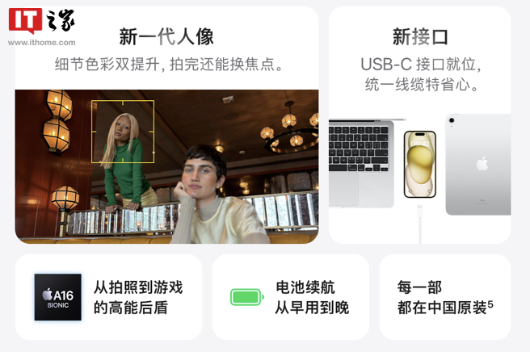
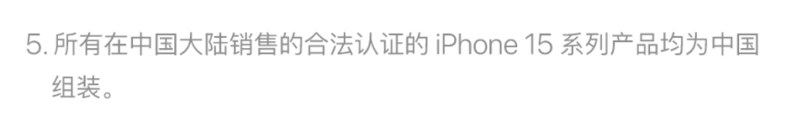
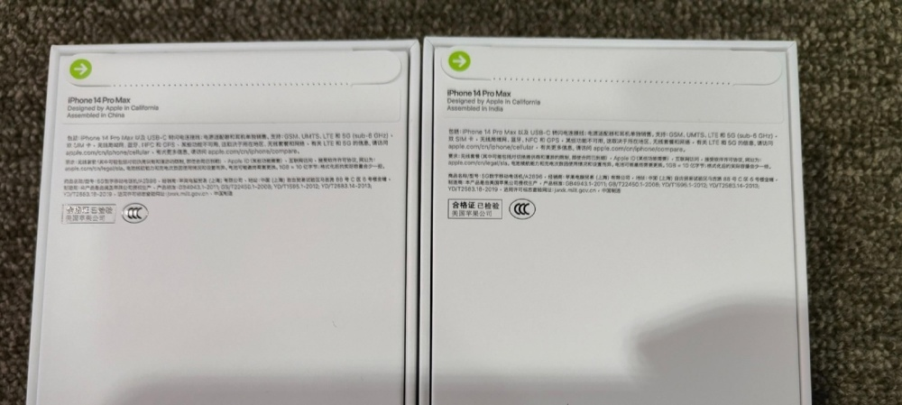

# 苹果：所有在中国大陆合法销售的iPhone 15系列手机均为中国组装

IT之家 11 月 3 日消息，据苹果公司官方公众号消息，苹果今天发布了名为“技能便利店
Vol.7”的文章，IT之家发现，苹果在文章中声称，所有在中国大陆销售的合法认证的 iPhone 15 系列产品均为中国组装。

_图源 苹果官方公众号_

而根据 IT之家此前报道，在 iPhone 14 时代，部分国行 iPhone 14 / Pro 手机为印度组装，此前有网友在苹果大连直营店购买了两台暗紫色
256GB 版的 iPhone 14 Pro Max，结果两台手机的组装地不同，分别为中国和印度。

_此前网友购买的国行 iPhone 14 Pro Max 中，有一台为印度组装_

