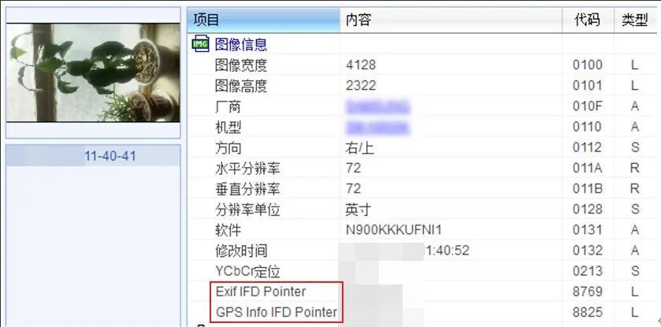
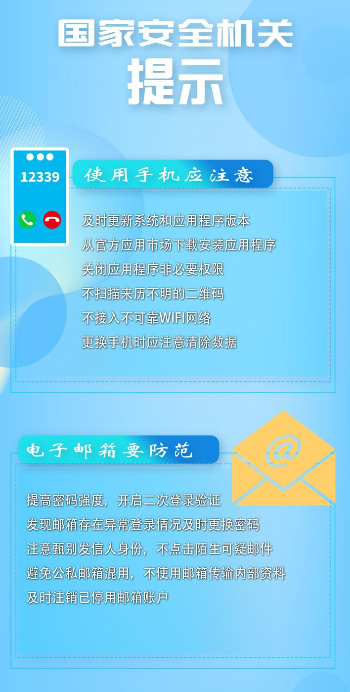

# 陌生邮件背后的“网攻阴谋”：境外间谍伪造手机程序，文档等均可被窃

一封看似普通的电子邮件，背后却是网络间谍在进行网络攻击与窃密，请跟随我们一起走进案发现场，看看究竟发生了什么。

（该案例根据真实案件改编）

**一封奇怪的陌生邮件**

夏日炎炎，蝉鸣聒噪，南方的夏天格外湿热，坐在办公室的小张被空调的冷气围裹着，忽感一丝寒意。就在他准备伸个懒腰之时，“叮咚”，单位群聊天窗口收到了新消息，通知大家参加保密知识竞赛，并要求下载安装某手机应用程序。与此同时，小张的工作邮箱也收到了一封陌生邮件。

这些操作提示，让接受过反间谍和保密教育的小张陷入了思考：这个邮箱不是单位群发的常用邮箱，里面这个安装文件会是什么内容，不会被网络“钓鱼”吧？不可能，我这么个小角色，怎么会有“黑客”对我感兴趣呢？而且有单位群里发的通知，应该不会有问题，试一试吧！

**误入圈套追悔莫及**

经过短暂的内心纠结，小张点击链接并下载安装了该手机应用程序。

小张安装完毕并点击该应用程序后，手机屏幕画面一闪，却并没有打开邮件所称的应用，更奇怪的是，应用对应的安装图标也消失了。接下来，怪事接连发生：手机流量流失莫名加速，电池开始发烫，麦克风、定位同时开启……

小张深感不妙，越发觉得自己的手机遭到了网络攻击。但此时后悔已经来不及了，小张随即拔掉电话卡、断开 WIFI连接、关闭手机，并及时上报单位网络安全中心。

在断网和屏蔽摄像头、麦克风的前提之下，网络安全专家对这部手机进行安全检查，经过 1 个多小时的不懈努力，终于揭开此次网络攻击的谜底。

原来小张遭受了境外网络攻击者常用的“钓鱼攻击”，他收到的所谓手机应用安装软件，实际是境外“网络间谍”伪造的手机木马程序，一旦目标选择下载安装，就会在手机后台执行以下操作：

\- 获取短信、通讯录、通话记录；

\- 获取 GPS 位置信息；

\- 开启录音功能；

\- 开启摄像头拍照功能；

\- 遍历 SD卡上 doc、ppt、pdf 等后缀的文件，打包压缩；

\- 远程控制手机进行指令下发；

\- 将窃取的所有文件压缩加密回传至攻击者指定网盘。

**网络间谍偷走了什么？**

通过网络安全专家的进一步分析，发现小张手机上关于某政策研究的各种文档、邮件以及手机相册里对应的照片均被攻击者偷走。

任意打开某张照片，可以看到如下信息：

该照片为小张工位上的盆栽，手机感染木马之后，在不知不觉的情况下启动了拍照功能，并对周围环境进行了拍摄。小张惊呼：“这简直太可怕了！”

此外，由于小张的手机拍照设置为包含位置信息，所以根据照片的 Exif
信息可以看到图片拍摄时的经纬度（通过经纬度可以确定手机的具体位置)，据此可以判断小张单位的精确地理位置。

事后，小张单位进一步加强对涉密事项、重点场所和涉密载体的安全防范管理，及时采取相应的技术措施和其他必要措施，加强对网络设施、信息系统等的反间谍技术防范，同时还进一步加强了对工作人员的反间谍安全防范教育培训，有效筑牢了防范网络窃密的防火墙。

**国家安全机关提示**

本案例中，小张遭遇的网络攻击俗称“钓鱼攻击”，攻击者通过构造诱饵文件，引起小张的兴趣，利用小张的好奇心和疏于防范的心理，诱导小张主动点击恶意链接，从而向其设备植入木马或盗取其账号。与电信诈骗不同，国家级网络攻击在目标的选择上十分明确，他们不会浪费资源广撒网，通常会针对特定群体目标，以情报窃取为目的进行攻击。

防范网络攻击、维护网络空间安全，关系国家安全和公民、组织切身利益，需要全社会共同努力。

（来源：国家安全部官微）

