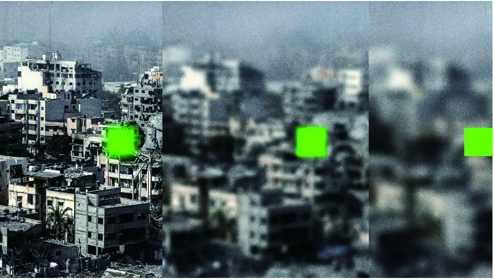

# “以色列用AI猎杀哈马斯”背后几大疑团，美媒：引发“虚假信息浪潮”

最近有关以色列使用人脸识别等人工智能(AI)技术打击哈马斯的消息备受关注。到底人脸识别等技术在加沙战场上使用的情况如何？以军手里是否有足够的哈马斯中高级指挥官的人脸数据库？还是这一说法只是以军为了后续的定点清除列出的一项“高科技”技术支持呢？

按照以色列媒体的报道，以军正使用AI和自动化技术，“快速准确”识别并打击哈马斯目标。

《耶路撒冷邮报》网站11月2日题为“自10月7日以来，以色列国防军使用人工智能袭击了加沙1.1万多个恐怖目标”的报道称，以色列国防军一名高级情报官员透露，自10月7日巴以冲突开始以来，以色列国防军的情报目标库已协助打击了加沙地区1.1万多个目标。此外，该高级官员表示，高度先进的人工智能主导的目标库帮助以色列国防军士兵在一天内瞄准并摧毁了150个隧道目标。

光看这个标题感觉非常耸动，而在以军口中的“AI参战”到底是怎么回事呢？

老刘仔细阅读这篇文章后发现，该报道有标题党之嫌。这篇报道并不是说，以色列利用人工智能技术直接打击了上万个目标，而是通过AI技术形成了目标的数据库。实际上，在基于机器学习的人工智能技术诞生之前，有的国家就开展利用自动化系统进行卫星图像识别的尝试。例如，根据目标图像特征判断是否属于导弹发射阵地、舰船、装甲车辆等。因为这往往涉及海量的数据，如果完全由人工判读，非常费时费力。除了进行目标识别，人工智能还可以被用于进行威胁排序，给出优先打击的目标。

而且从上述文章来看，提到的使用AI进行判读的目标很多是固定目标，比如可疑建筑物、地下隧道等。

《洛杉矶时报》的文章则更加直白，表示“我们不知道以色列军队如何在加沙使用人工智能，但我们应该知道”。

在10月7日哈马斯发动突然袭击前几个月，以色列国防军宣布将人工智能融入致命性行动中。正如彭博社7月报道的那样，今年早些时候，以色列国防军已开始“使用人工智能来选择空袭目标并组织战时后勤”。以色列官员当时表示，以色列国防军采用人工智能选择空中轰炸目标，并使用另一种模型来快速组织随后的袭击。

在回应置评请求时，以色列国防军发言人拒绝讨论该国人工智能的军事用途。

针对以色列使用人工智能技术对哈马斯武装人员进行人脸识别，然后对其进行狙杀的分析，老刘认为，这一点理论上可以，并且很可能被付诸实施过，但大规模应用有难度。

以军如果真的这样做需要一个重要的前提——以色列情报机构需要获得足够的哈马斯相关武装人员生物特征信息，例如清晰的面部照片和视频等，理论上如果相关的武器配备这样的识别系统，就能完成搜索、识别、猎杀的完整链条。

如果只是依靠在加沙上空飞行的无人机对人员进行识别，目标距离比较远，其分辨率很可能无法达到识别要求，而且人员过多，哈马斯高级指挥官还可能采取多种伪装来隐藏自己的真实身份，因此很难在人群中通过无人机去搜索某个特定个人。所以说，对于特定个案可以，广泛运用有难度。

除了面部识别外，人工智能技术还能辅助对语音通信进行识别。例如，以色列方面掌握了哈马斯某个高层的声纹信息，通过AI控制的无线电监听系统监听到符合这种特征的语音通信后，自动对其进行识别、录音等，当然无论是通过视频还是通过音频进行识别，都需要庞大的监听、监视网络和巨量的算力支持。

从能力的角度来说，以色列作为中东地区乃至全球在军工技术、尖端AI技术方面具有相当基础与底蕴的国家，是具有将人脸识别技术用于加沙战场的。但老刘认为，其中最最可行，也是最最必要的应用场景可能未必是大规模对付哈马斯武装分子，而是用人脸识别技术来搜寻在之前的哈马斯突袭中被掳走的以色列人质。这可能是最最需要投入相关技术实力的方向，根据公开信息，以色列情报部门和相关科技企业正在持续发力。

老刘有一种担心，那就是以军方宣称使用AI技术用于识别与锁定哈马斯，会不会只是一种对外宣传的手段。因为在以军已经包围加沙的背景下，是否有必要用这种方式来进行精准斩首。

甚至有分析认为，以色列对一些哈马斯武装人员的“定点清除”未必要那么“讲究”，很可能仍然是通过较为传统的方式，比如检测到其本人、家人以及相关人员的手机、无线电通信信号，然后对其定位，再使用“杰达姆”炸弹拆楼。

这种方式，美军在对付拉登以及“基地”组织的头目时有着非常完善的方案。以色列军方在以往对付哈马斯高级指挥官的过程中，也没少用这种斩首模式。

因此还是那句话，AI在加沙战事中参战是肯定的，但它正在以及将要发挥怎么样的作用，目前仍然是一个黑箱，甚至相关技术是否被用于减少平民附带伤亡的打击行动，还是一个疑问。

不过，有一点是确定的，人工智能技术正在以一种非常独特的作用参与到加沙信息战之中。

美国“连线”网站题为“生成式人工智能在以色列-
哈马斯之间的虚假信息战中发挥了令人惊讶的作用”的文章称，巴以冲突爆发后引发了前所未有的“虚假信息浪潮”，这是“算法驱动的战争迷雾”，使社交媒体陷入困境。

不过大西洋理事会数字取证研究实验室的副主编莱拉·马什库尔说：“肯定有人工智能（制作的）图像在流传，但还没有达到我认为该技术在信息传播中发挥核心作用的程度。”

