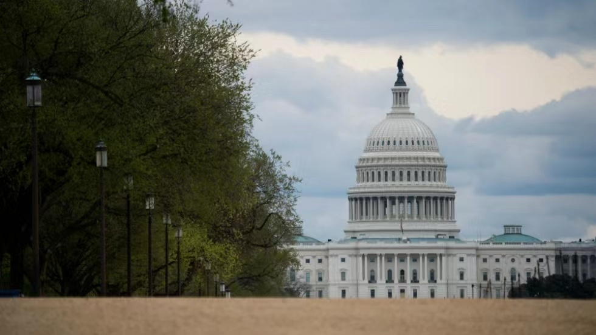

# 乌媒：白宫承认因美国国会没通过拨款，拜登政府对乌军援将缩水

【环球网报道】据《乌克兰真理报》报道，在宣布最新对乌军援后，美国白宫发言人让-
皮埃尔当地时间3日表示，由于美国国会没有通过拨款，今后拜登政府对乌克兰的军援将缩水，以尽可能延长美国支持乌克兰的能力。

_美国国会 资料图片_

据白宫网站发布的实录，让-皮埃尔告诉记者，最新的军援耗尽了目前“乌克兰安全援助计划”资金。她说，“虽然我们有剩余的总统拨款授权（PDA）来继续满足乌克兰的紧急战场需求，但我们开始向乌克兰提供较小的PDA一揽子援助，以尽可能延长我们支持乌克兰的能力”。

据媒体早些时候报道，当地时间11月3日，美国国防部发布声明，宣布向乌克兰提供新一轮安全援助，以满足乌克兰的关键安全和国防需求。该轮安全援助包括从美国国防部库存中提取的价值高达1.25亿美元的武器和装备，以及从“乌克兰安全援助计划”资金中提取的3亿美元。

据白宫网站，让-皮埃尔还称，“至关重要的是，国会应向全世界发出关于美国决心的重要信息，并采取行动通过总统的国家安全补充请求，向普京和世界其他国家表明，美国将继续坚定地与乌克兰站在一起。”

此前，美国总统拜登宣布向国会提出1000亿美元的拨款计划，其中包括对以色列和乌克兰的军事援助。不过，这在由共和党控制的众议院受挫。当地时间10月29日，新当选的美国众议院议长迈克·约翰逊明确表示，本周将向众议院提交一项独立的以色列援助法案——这表明众议院将进一步推迟审议总统拜登提出的援助乌克兰的请求。

是否继续资助乌克兰一直是一些众议院共和党人争论的问题，他们已经将对乌克兰的援助排除在9月底通过的避免美国政府关门的短期拨款之外。对此，今日俄罗斯电视台10月30日称，美国众议院多数党议员大多现在反对向乌克兰提供更多援助。

