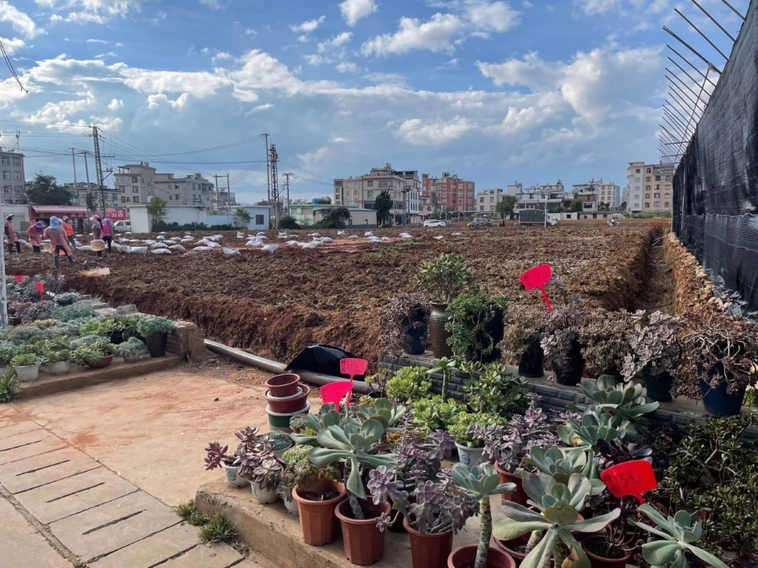
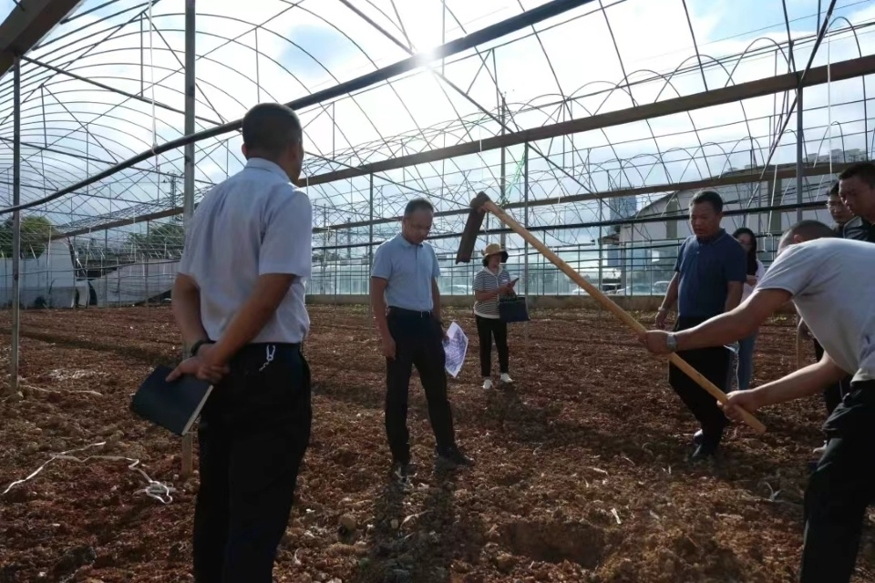
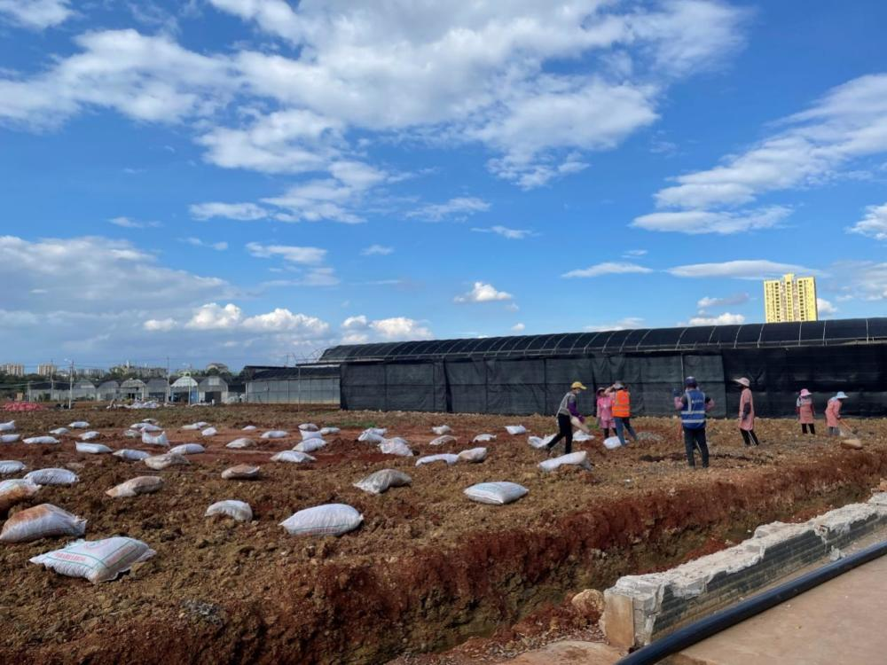

# 九名市州长“进京检讨”，因违法违规用地

 _2023年10月24日，在殷联盆花市场，土地的边缘还放着售卖的盆栽。（南方周末记者 李桂/图）_

作为亚洲最大的鲜切花交易市场，云南省昆明市斗南花卉市场一年四季都人潮涌动。

在斗南花卉市场北侧，一路之隔的是另一个和花卉有关的市场——殷联盆花市场。和斗南主营鲜切花不同，兴建于2012年的殷联盆花市场售卖的大都是绿植和盆栽。

10年过去，大棚里曾种着各类苗木和多肉植物的盆花市场，如今也部分种起了蔬菜。这和自然资源督察有关。

2023年9月15日下午，在北京市阜内大街，自然资源部对2023年例行督察发现的违法违规主要问题进行了通报。其中，殷联盆花市场“大棚房”问题被点名。

除了通报典型问题，自然资源部同时还开了一场约谈会：受国家自然资源总督察委托，国家自然资源专职副总督察陈尘肇对2023年督察发现违法违规问题突出9个市（州）政府主要负责人进行当面约谈。

9个市（州）分别是河北省石家庄市、黑龙江省哈尔滨市、浙江省温州市、安徽省滁州市、山东省临沂市、广西壮族自治区河池市、贵州省黔西南州、云南省昆明市、甘肃省兰州市。

除了代表这些市（州）政府参加约谈会的市（州）长，这些市州所在的省（自治区）政府副秘书长，省、市两级自然资源部门“一把手”也被要求出席。

国家自然资源总督察办公室公布的文章显示，此次约谈是“面对面指出督察发现的突出问题，督促地方政府加大整改查处力度，坚决遏制耕地违法行为，牢牢守住耕地保护红线”。

这是自然资源部2018年组建以来，首次举行的大规模、高规格的集中、公开约谈会。

违法占用耕地77亩

从殷联盆花市场的1号门进去，首先映入眼帘的，是各类印着“花卉”“苗木”“园艺”字样的店铺。到了10月，有的店铺门口还摆着正在开放的桂花、三角梅和各色茶花。

这些店铺大都以大棚的形式存在：屋外露天的地方和透明薄膜搭成的屋顶被盖上了黑色的遮阳网；屋内地面少有水泥和瓷砖，大都是抹平了的黄泥土——种着植物的花盆放到地上，根系从盆底钻出来，泥土会给它们提供水分和营养。

沿着主干道一直往西北方向走约300米，店铺、大棚和遮阳网都消失了，道路两侧变成了空旷又开阔的空地。空地上丢着不少鼓鼓囊囊的白色编织袋，袋子外侧印着“饲料”字样，凑近还能闻到粪便的臭味。

戴着遮阳帽的工人们把袋子扯开，黑色的肥料被铺到了黄泥地上，又有人拿着锄头把它翻开。远处的挖掘机正在另一块空地上作业，传来轰隆隆的声音。倘若不是地处城市，这里的景象看起来和农村的秋播没什么两样。

在变成空地前，这里也曾是售卖绿植的大棚。

大约一个月前，2023年9月，昆明市呈贡区委领导视察之后，大棚被拆了。2023年10月25日，一位曾在此开过店的大棚主表示，在拆棚之前，2023年8月，他就搬到了现在的大棚，两地相距约500米，都由殷联社区成立的昆明仡顶经贸有限公司（以下简称昆明仡顶）负责出租。

该大棚主表示，虽然双方的租赁合同是一年一签，但他在原来的大棚已经经营了近十年。谈及搬店的原因，他认为是“政策调整”：“那一片地当时没有批成商业用地，所以就拆了。”此前在签合同时，昆明仡顶“也搞不清楚”土地的性质。

2023年9月，在自然资源部的通报中，前述空地被定性为耕地。

通报显示，2019年2月，昆明市呈贡区殷联盆花市场被纳入“大棚房”问题整治范围并通过整改验收；2022年7月，殷联社区将已复垦的农业大棚又出租给76户商户用于售卖盆花、农资、农药等经营性活动，违法占用耕地77亩。

严格来说，“大棚房”问题的重点不在于建房形式，而在于建房位置所处的土地性质。

由农业农村部主管的《农业工程技术》杂志曾在文章中解释，“大棚房”问题是指一些工商企业、个人及组织借建农业设施或农业园区之名，违法违规占用耕地甚至永久基本农田，用于非农业建设的行为，其本质是改变土地性质和用途、改变农业生产功能，触碰耕地保护红线。

“呈贡区自然资源局”微信公众号发布的信息显示，2023年5月，国家自然资源督察成都局对昆明市2019年“大棚房”清理整治情况进行督察，其间发现涉及呈贡区的2宗“大棚房”反弹问题，其中之一为殷联盆花市场。

2023年10月26日，昆明市自然资源和规划局呈贡分局一名工作人员告诉南方周末记者，涉事“大棚房”问题“整改的责任在街道”，可以向街道了解相关情况。

殷联盆花市场位于斗南街道，2023年10月25日，斗南街道办事处的一名负责人介绍：“以前（棚里面的东西）腾空了，但是去年因为疫情和村庄拆迁，就摆了一些销售的绿植在棚里面。”

该街道负责人表示，在2023年5月的督察中，国家自然资源督察成都局指出了该地存在的问题：“按照（督察）要求，（棚）里面要求见黄土，但是这个土上面摆着东西，它就视为违规。”

2023年5月，呈贡区自然资源和规划分局与农业农村局对多家用地主体联发责令改正违法行为通知书和限期整改通知。前述街道负责人表示，按照整改通知的要求，他们需要在2023年9月底之前，将存在问题的大棚“恢复到2019年的状态”，即把棚内物品腾空。

到了具体执行阶段，整改要求被一再细化。该街道负责人记得，2023年6月，棚内东西腾空后，土也翻松了，但相关部门“每一次不同的检查，都会提不同的要求”，“所以我们反反复复的，今天要把门牌号撤掉，明天就说门上还有个广告要把它拆掉”。

到了2023年8月底，大棚只剩下空壳。

_昆明市呈贡区委书记陈净（左二）在斗南街道殷联盆花市场“大棚房”整改工作现场。（“呈贡发布”微信公众号/图）_

多个共性问题

大棚腾空近一个月后，2023年9月15日下午，包括昆明在内的9个市（州）被自然资源部约谈。

自然资源部共有北京、沈阳、上海、南京、济南、广州、武汉、成都、西安等9个自然资源地方督察局。约谈会上，9个地方督察局的局长，分别通报了督察发现的违法违规问题。

自然资源部官网公开的信息显示，此次督察发现部分地区耕地保护责任落实不到位，耕地“非农化”“非粮化”等冲击红线的突出问题依然存在，各类园区、开发区、城市市政道路未批先建等非农建设问题比较突出，违规占用永久基本农田和一般耕地种植草皮问题在部分省份不同程度存在，“大棚房”问题禁而未绝，违法侵占耕地挖湖造景问题在一些地方仍有发生，有些地方违反生态保护红线管控要求违规批矿、非法采矿严重破坏生态。

情况通报则披露了更多详细情况。综合来看，被约谈的9个市（州）出现违法违规用地问题的数量，在所在省份均排名靠前。

其中，石家庄、哈尔滨、温州、滁州、兰州存在违法违规问题“全省排名第一”，临沂、贵州黔西南州，“全省排名靠前”，昆明“问题个数排名全省第一、耕地面积排名全省第二”。

此外，此次督察亦发现多座城市存在多个共性问题。如耕地“非农化”“非粮化”等。

通报显示，哈尔滨存在“非农化”问题51个，涉及耕地900.68亩；临沂存在“非农化”问题111个，涉及耕地1065.56亩；河池存在“非农化”问题150个，涉及耕地2629.55亩；黔西南州存在“非农化”问题207个，占用耕地1649.65亩。

耕地“非农化”更具体的表现则包括“大棚房”问题、农村乱占耕地建房、部分工程项目和基础设施未批先建等。不仅是昆明，哈尔滨、温州、河池也出现了“大棚房”问题。

此外，被通报的9个市（州）中，石家庄、哈尔滨、滁州、临沂、黔西南州、兰州等6地均存在非法采矿的问题。

其中，哈尔滨代管的五常市对英泽砂石有限公司自2022年1月至2023年5月持续非法开采建筑用花岗石行为监管不力，未及时立案查处制止。将非法采矿行为上报为“伪变化”，不实上报，应付检查。哈尔滨市对五常市不如实上报行为监督不力，审核把关不严。

9个市（州）中，浙江温州是唯一被通报存在“自然资源领域信访持续多发”的城市。通报显示，2021年以来，温州市自然资源领域信访事项数量全省排位一直靠前。

会外整改

在地方督察局局长通报9个市（州）的违法违规问题之后，市（州）长们分别发言，“逐个表态”。

据中国之声报道，昆明市市长刘佳晨表示，昆明市耕地“非农化”“非粮化”问题十分突出，为此“深感自责与愧疚”。

在表态环节，多位市长亦表示，部分问题已得到整改。

针对滁州市来安县政府违法征地，用于建设金陵水乡小镇项目配套景观水系，侵占耕地400.4亩挖湖造景的问题，滁州市市长吴劲表示，来安县政府违法征地建设金陵水乡小镇项目配套景观水系的重点问题已于2023年6月30日全部整改复垦到位，并按照“人事并处”的要求提级办理，移交市纪委监委追责问责。

约谈会结束后，多个市（州）长召开会议，部署了相关工作。

第二天，2023年9月17日，河池市长王军主持召开政府常务会议，要求坚决守住耕地保护和粮食安全底线。

2023年9月19日，温州市长张振丰在全市耕地保护和粮食安全工作会议上强调，要攻坚督察反馈问题整改，按照“一个问题一个方案，闭环推进一抓到底”要求，针对性制定整改方案，限期推动问题销号清零，同步开展已整改问题“回头看”和举一反三问题同标同质整改。

同日，昆明市召开全市违法用地和耕地流出问题整改工作会议。昆明市委书记刘洪建主持会议并讲话，市长刘佳晨传达自然资源部集中公开约谈会议精神。会上，昆明市自然资源规划局汇报全市违法用地和耕地流出问题整改情况并作检讨发言。

5天后，2023年9月23日，昆明市呈贡区委书记陈净率队实地调研“大棚房”整治、耕地流出问题整改等。

“呈贡发布”微信公众号发表的文章显示，在斗南街道殷联盆花市场“大棚房”整改工作现场，陈净详细了解了全区“大棚房”整治工作整体情况、工作推进情况及存在的困难问题等。

在“呈贡发布”公开的文章中，配有一张陈净站在大棚内的照片，他身后是拆到只剩框架的大棚。就在陈净调研后不久，大棚的框架也被拆了。

前述斗南街道负责人表示，此前，他们已经有了拆除大棚的计划，“主要是有些细节和标准（没确定），刚好赶在领导来了之后就制定了，我们就快速彻底地整治了”。

谈及拆除大棚的原因，该负责人表示，是为了避免问题再次反弹。“如果棚还在，下一次谁又把东西搬进去了，检查的时候又会说（有问题）。”他解释，“到最后，我们是做通了社区和群众的工作，就是为了一次性整治到位。”

此前，盆花市场所处位置的土地都由殷联社区负责管理。“大棚房”问题反弹后，由于“社区监管不到位”，目前这七十多亩土地已经收归街道。现在大棚拆除后的位置种地的，是街道委托的第三方公司。该负责人补充：“我们街道干部也不会种地，工作也很多，所以目前是委托给第三方先来完成种植任务，然后再谈以后。”

该街道负责人还表示，2023年5月，发现“大棚房”问题反弹后，街道相关干部也被调离了原岗位。

_2023年10月24日，殷联盆花市场内，工人们正在处理运来的肥料。（南方周末记者 李桂/图）_

核心职能，仍和土地相关

自然资源部约谈地市级政府负责人，与自然资源督察有关，这是上级政府对下级政府行政监察的形式之一。

国家土地督察是国家自然资源督察的前身。为了遏制土地违法、落实耕地保护，2006年，国务院正式出台土地督察制度，主要督察对象为省、自治区、直辖市、计划单列市政府。

2018年3月，自然资源部成立，“随着自然资源管理职能的转变，为适应自然资源管理需要”，国家土地督察转型为国家自然资源督察。

2019年6月，中共中央办公厅、国务院办公厅发布《中央生态环境保护督察工作规定》，以党内法规形式明确了中央生态环境保护督察的制度构成、程序规范、权限责任等内容，同时确立了中央和省级两级督察体制。

在武汉大学环境法研究所教授陈海嵩看来，即便自然资源部整合了多个部门的职能，但和土地相关的职能，仍是核心。“自然资源的核心是土地资源”，陈海嵩说，因此，自然资源督察应该聚焦于最为成熟的土地督察业务，不断深入发展。

2021年9月1日起施行的《土地管理法实施条例》则首次明确了自然资源督察的范围和工作方式。

条例规定，国家自然资源督察机构根据授权对省（自治区、直辖市）人民政府以及国务院确定的城市人民政府的耕地保护情况、土地节约集约利用情况、国土空间规划编制和实施情况、国家有关土地管理重大决策落实情况、土地管理法律、行政法规执行情况、其他土地利用和土地管理情况等进行督察。

国家自然资源督察机构还可以约谈被督察的地方人民政府有关负责人，并可以依法向监察机关、任免机关等有关机关提出追究相关责任人责任的建议。

和此次9个市（州）长被叫到北京约谈不同，此前，国家自然资源督察机构的约谈大都在地方进行。

2022年10月至11月，国家自然资源督察机构对31个省（自治区、直辖市）和新疆生产建设兵团开展了耕地保护和矿产资源实地督察，发现了一些违法违规问题。针对督察发现的突出问题，经国家自然资源总督察授权，派驻地方的国家自然资源督察机构对部分违法违规严重的地市政府进行约谈。

其中，成都局约谈云南大理，北京局约谈河北邢台、山西晋中，南京局约谈江西九江，广州局约谈广东清远、广西南宁。

此次在北京约谈地方政府主要负责人的深意，在陈海嵩看来，依然和粮食安全有关，“接下来很长一段时间内，耕地保护、粮食安全都是非常重要的问题”。

在约谈会上，国家自然资源专职副总督察陈尘肇表示：“耕地保护任务没有减轻，而是更加艰巨了。要采取坚决有力的措施，持续加强耕地保护，牢牢守住18亿亩耕地红线。”

南方周末记者 李桂

责编 钱昊平

