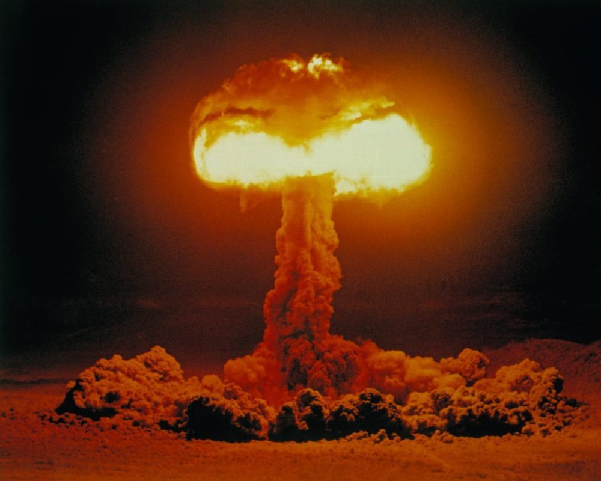

# 俄外交部：美国核试验场准备完毕，如果美恢复核试验，我们将对等回应

（观察者网讯）据“今日俄罗斯”电视台报道，11月3日，俄罗斯外交部警告美国不要恢复全面核试验。此前，俄罗斯总统普京11月2日签署法律，撤销对《全面禁止核试验条约》（CTBT）的批准。

俄外交部在一份声明中表示： **“据报道，内华达州的基础设施已经准备完毕，可进行全面的（核）测试，美国必须明白，此举将迫使我们（俄方）做出类似的回应。”**

《全面禁止核试验条约》于1996年在联合国大会通过，旨在禁止所有缔约国在任何地方进行任何核爆炸，该条约于1996年9月24日开放签署，中国是最早签署该条约的国家之一。美国已签署但至今未批准该条约。由于附件规定的44个国家尚未全部批准条约，这份条约还没有正式生效。

普京10月5日在“瓦尔代”国际辩论俱乐部全体会议上曾表示，由于美国没有批准《全面禁止核试验条约》，理论上俄罗斯可以采取“争锋相对”的措施，撤回对条约的批准。“我听到了关于开始核武器试验的呼声。但我还没有准备好说我们是否真的需要进行这些试验。”

俄罗斯副外长里亚布科夫早些时候表示，尽管撤销批准，但莫斯科将继续遵守这项条约，并且只有在美国恢复核试验的情况下，俄罗斯才会也这样做。

然而，近来美国密集发布了各种试射或研制核导等战略武器的消息。

10月18日，就在俄国家杜马通过撤回批准《全面禁止核试验条约》的法案后不久，美国在内华达州南部进行的核爆试验，使用了高能化学炸药和放射性同位素指示剂，以“验证新的预测爆炸模型”，并称这有助于探测其他国家的原子弹爆炸。彭博社援引分析人士的观点称，美国核试验的行动可能会被误解，并导致局势进一步升级，尤其是考虑到俄乌冲突加剧了美俄之间的“深厚仇恨”。

10月28日，五角大楼宣布正在研制新型B61-13核弹。

11月2日，美国空军全球打击司令部（AFSTRAT-
AIR）对外发布新闻稿称，因在加利福尼亚州范登堡空军基地的一次试射中出现“异常”，第30太空联队于当地时间1日凌晨0时6分左右，在太平洋上空“安全终止”了一枚“民兵-3”洲际弹道导弹（ICBM）的试射。而这通常是试射失败后导弹自毁的委婉说法。

国际废除核武器运动（ICAN）10月31日发表声明称，美国涉核举动是不负责任地加剧国际局势紧张，特别是考虑到欧洲和中东地区近来持续不断的冲突。该组织领导人梅丽莎·帕克呼吁美国切实履行《不扩散核武器条约》规定的义务，进行谈判以实现核裁军。

_曾在美国内华达州试验场（NTS）出现的核爆试验场景/资料图_

另一方面，俄武装力量在10月25日举行了战略核威慑力量演习，陆海空战略核力量参与，并进行了弹道导弹和巡航导弹的实际发射。普京视察了演习。

**本文系观察者网独家稿件，未经授权，不得转载。**

