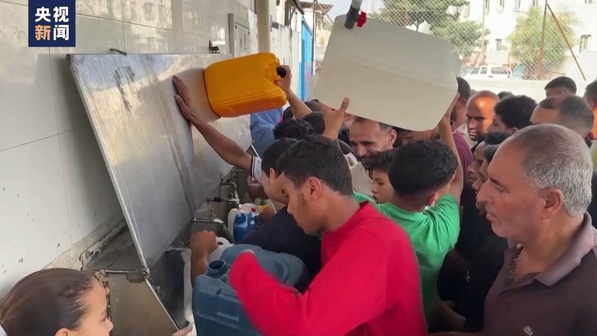
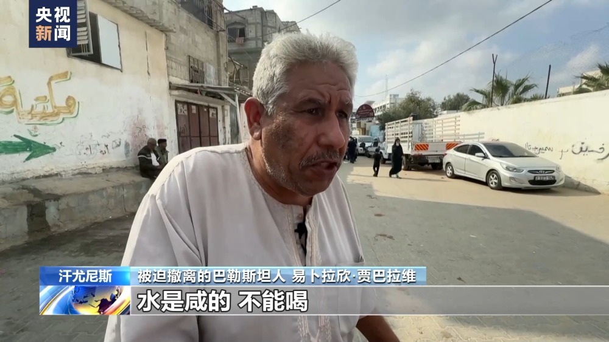
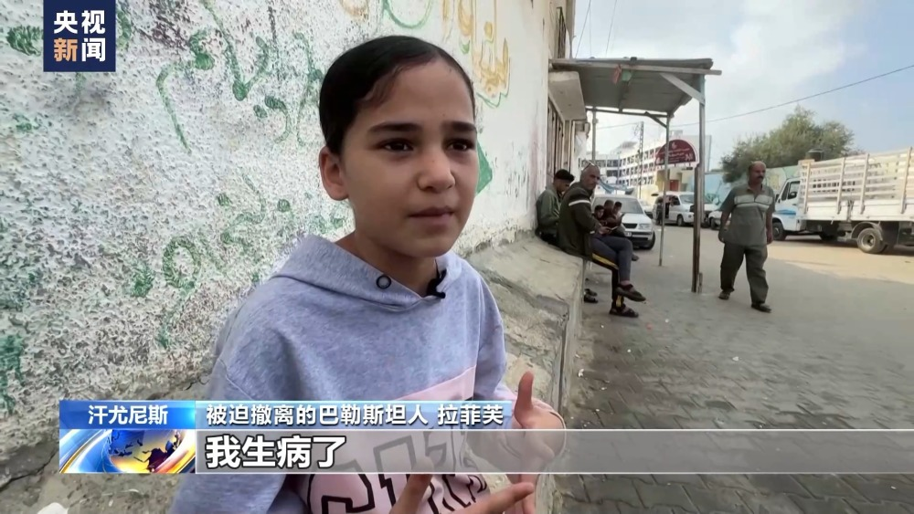
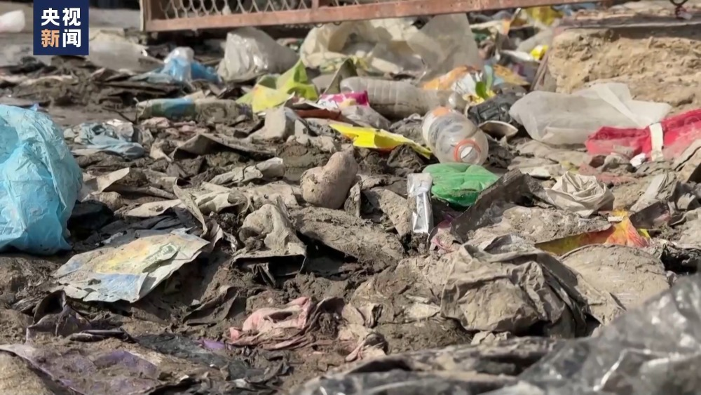
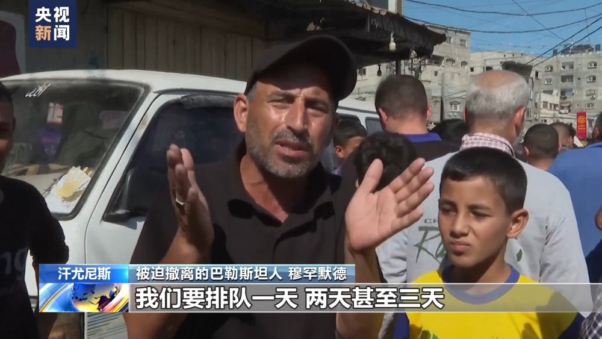
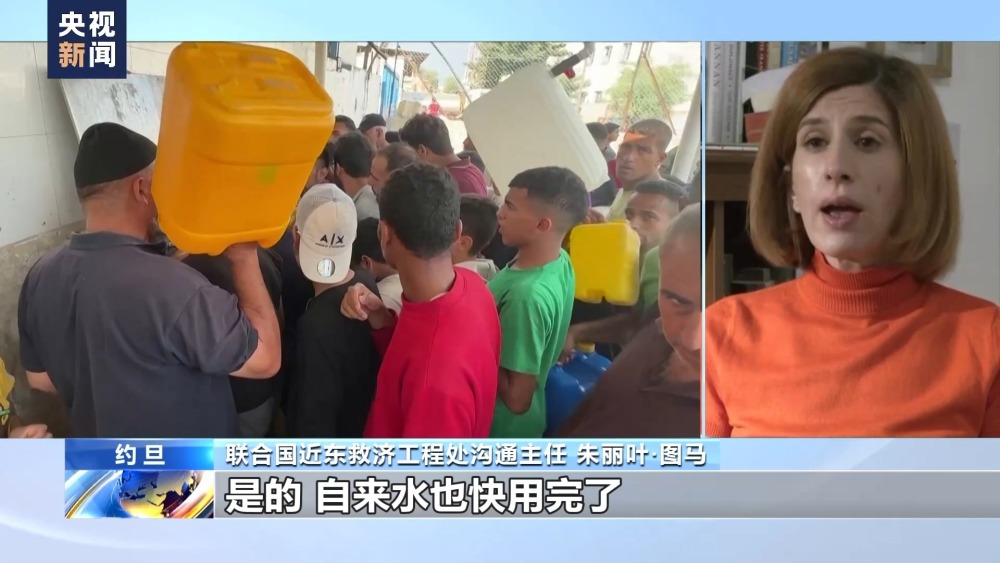
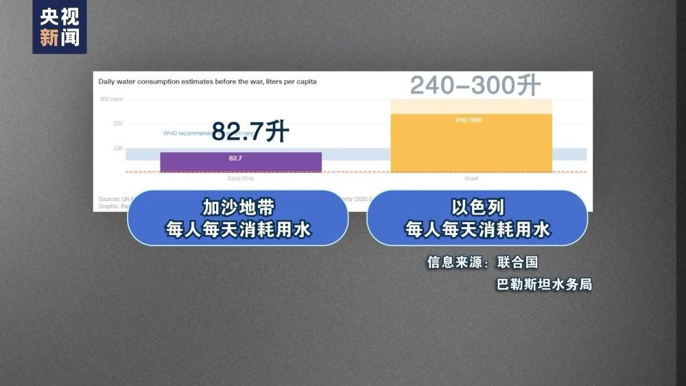
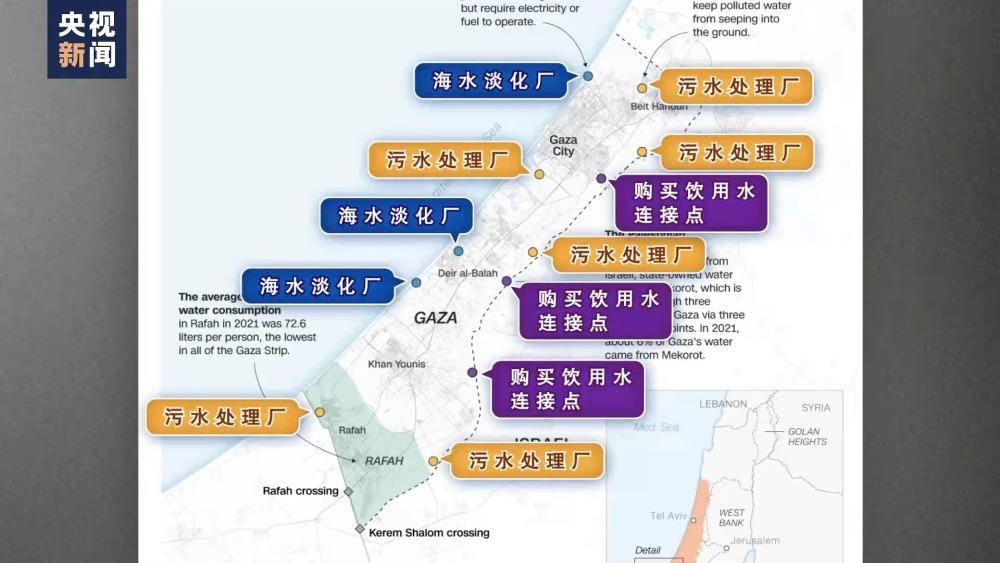
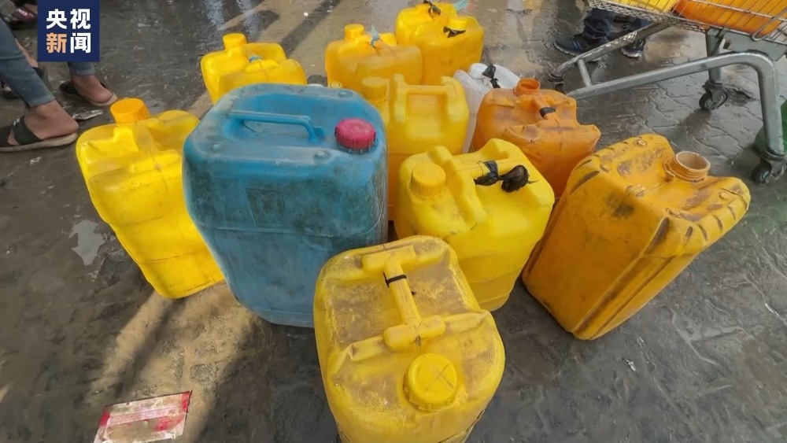

# 加沙陷饮用水危机：孩子被迫喝平时驴都不喝的水，传染病随处可见

巴以新一轮大规模冲突爆发以来，加沙地带的人道主义危机持续加剧，其中水危机尤其引发关注。在加沙地带南部的汗尤尼斯，挤满了从北部前来避难的巴勒斯坦人，为了生存，他们只能饮用未经处理的咸海水，不少人因此患病。

汗尤尼斯的街道拥挤喧嚣，随处可见成堆的垃圾。据不完全统计，有约20万流离失所的巴勒斯坦人在这里的学校、街道和联合国机构的营地避难。

在学校的一处取水点，挤满了提着大大小小水桶的人们，易卜拉欣·贾巴拉维的女儿因为水源的不干净而出现过敏反应，而他甚至找不到治疗的药物。

被迫撤离的巴勒斯坦人
易卜拉欣·贾巴拉维：水是咸的，不能喝，平常你给驴喝都觉得不行，更不要说（现在）自己被迫要喝，你的孩子也被迫要喝。也没有药治疗污染水导致的疾病。

同样饱受污染水之苦的，还有小女孩拉菲芙。

被迫撤离的巴勒斯坦人 拉菲芙：我头很疼，胃也很痛，我生病了。我的妈妈和姐妹都因为污染的水病了，我们真的累了，我们希望这场冲突结束。

自10月7日巴以爆发新一轮大规模冲突以来，以色列对加沙地带实施全面封锁，由于水、食物、燃料和药品短缺导致的人道主义危机愈演愈烈，生活在这里的人们仍在为此苦苦挣扎。

被迫撤离的巴勒斯坦人
穆罕默德：我们要排队一天、两天甚至三天，才能领到面包，而且还不是完整的一块。也没有水，我们没有水，没有饮用水也没有洗澡水。在汗尤尼斯，皮肤病、传染病和腹泻随处可见，我们的境况十分悲惨。

联合国近东救济工程处沟通主任 朱丽叶·图马：是的，自来水也快用完了。我们之前说过，加沙的水供应持续中断，水已经被用作战争的武器。

**加沙地带水危机究竟有多严重？**

当前，用水危机成为加沙地带面临的最严重的人道主义危机之一。那么，加沙地带的水从哪来？当地人的用水情况究竟怎么样？我们通过数据和图示来了解一下。

**加沙地带人均用水量是多少？**

此轮巴以冲突爆发前，加沙地带的供水就已经无法满足世卫组织建议的每人每日最低用水量的要求。数据显示，加沙地带每人每天消耗82.7升水，低于世卫组织推荐的平均每人每天100升的用水量，包括饮用、清洁、洗涤等日常用水。而以色列每人每天消耗240-300升水。

**加沙地带的水来自于哪里？**

加沙地带唯一的天然水源是沿着东地中海海岸从埃及北部穿过加沙地带再到以色列的沿海含水层，但由于海水入侵、化学品污染和生活污水排放等因素的影响，约96%来自该含水层的家庭用水不适合饮用。加沙地带饮用水则主要依赖海水淡化以及从以色列购买。

在这张图中，蓝色圆圈代表三座海水淡化厂，需要燃料发电才能运行。黄色圆圈代表六座污水处理厂，防止污水渗入地下。紫色圆圈代表巴勒斯坦水务局从以色列国家水务公司购买饮用水的三个连接点，以色列的水通过三条管道连接到这三个点再进入加沙地带。

**加沙地带水危机现在有多严重？**

联合国近东救济工程处日前发布消息说，巴以新一轮冲突爆发以来，加沙地带三座海水淡化厂由于燃油短缺已停止运行。另外，由于设备缺乏维护、进口限制和电力短缺，当地的污水处理厂长期无法满足需求。

《以色列时报》报道称，此轮冲突爆发前，以色列每天通过三条输水管道向加沙地带出售4900万升水，冲突爆发后，以色列一度切断了三条供水管，后来在10月底恢复了两条供水管，每天向加沙地带输水2800万升。然而，世卫组织东地中海区域紧急事务主任布伦南说，目前加沙地带每人每天只能获得1到3升的水，而绝对最低限度应为每人每天15升，人们被迫饮用受污染的水，传染病蔓延只是时间问题。

