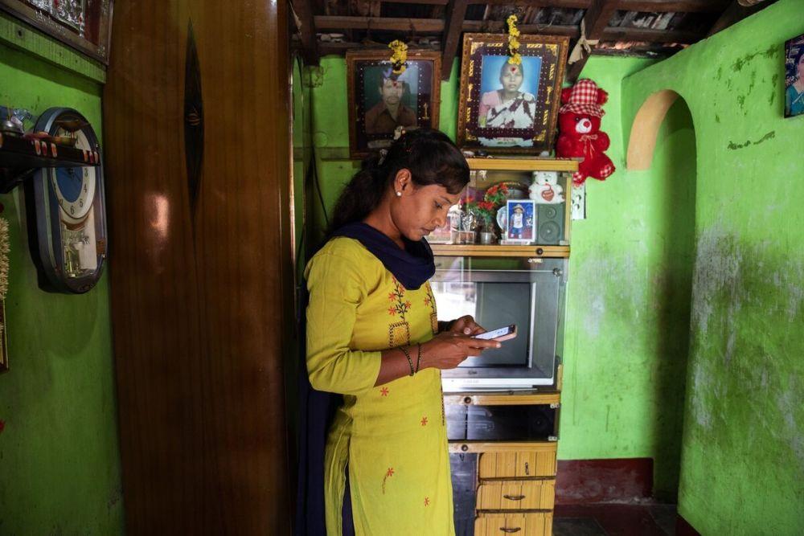
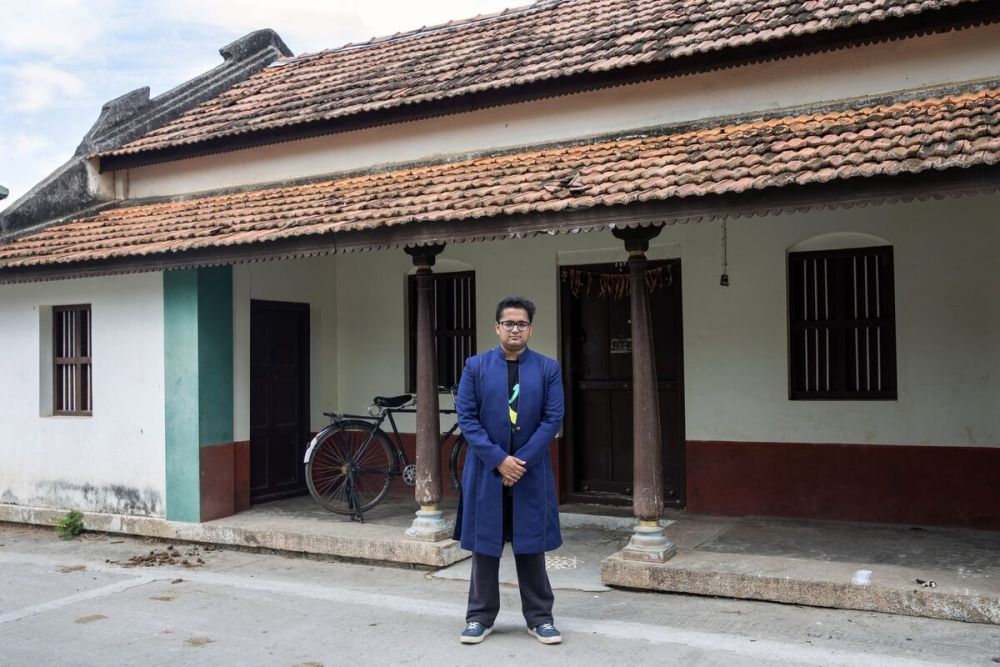
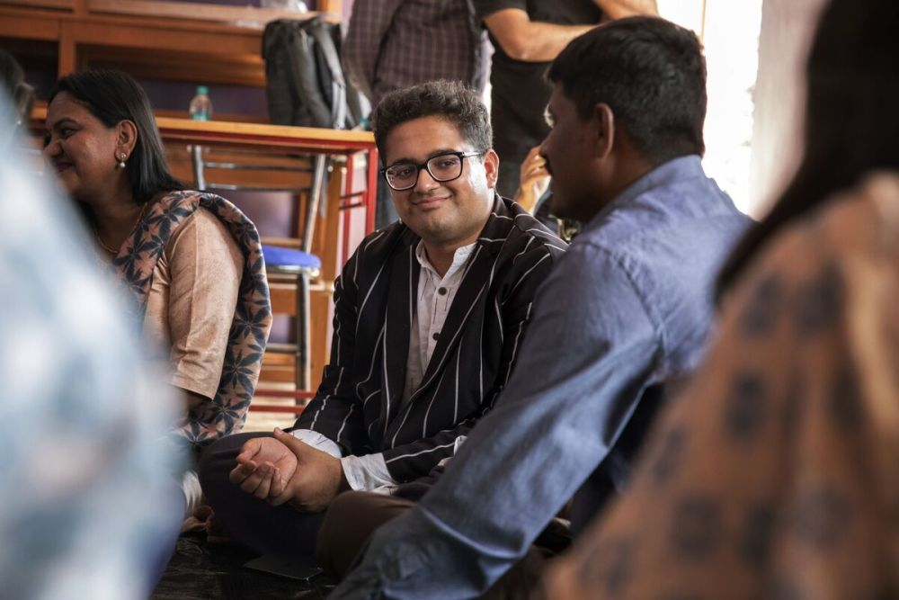
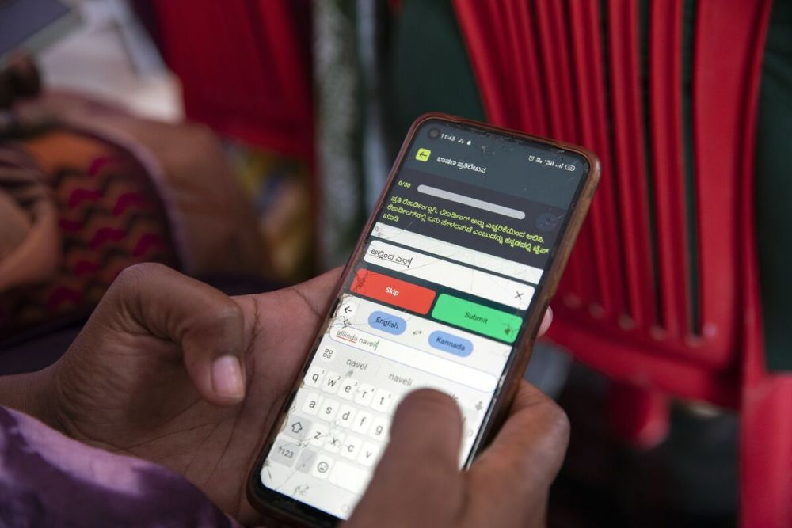
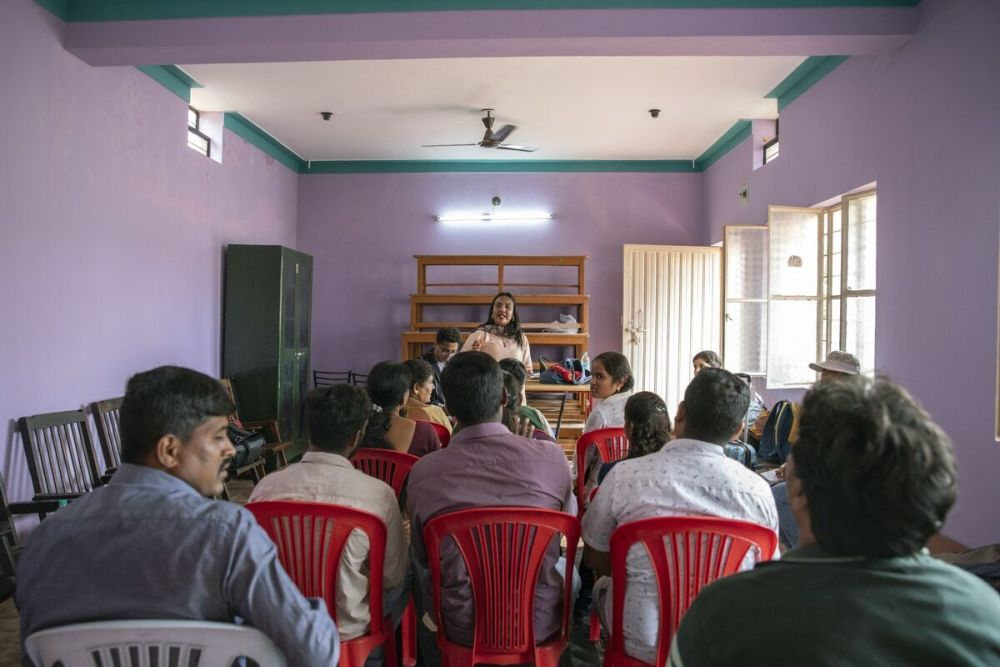

# 印度为贫困数据注释员开高薪：三天赚了以往月收入的四倍还多

**划重点**

  * _1_ 人工智能爆火离不开数据注释员的奉献，但后者通常只能得到很少的回报，而且常常受经纪公司的剥削。
  * _2_ 印度创企Karya希望提高印度贫困数据注释员的报酬，其提供的工资是该行业最低标准的20倍。
  * _3_ Karya与硅谷许多知名公司合作，为微软、谷歌等提供高质量数据集，以实现“双赢”。
  * _4_ 预计到2030年，仅印度就将拥有近100万名数据注释员。

腾讯科技讯
在建设人工智能大语言模型的语料库方面，数据注释员发挥着越来越重要的作用。然而，他们获得的报酬却非常少，而这种不公平现象在全球数据产业中几乎成为常态。为了改变现状，印度初创企业Karya正努力提高数据注释员的薪酬标准，希望帮助改善印度乃至全球贫困。

 _图1：印度卡纳塔克邦阿加拉村，Karya公司员工普里埃蒂在家工作_

**三天赚了以往月收入的四倍还多**

普里埃蒂 （Preethi
P.）住在印度卡纳塔克邦西南方名为阿加拉的小村子里，距离班加罗尔市中心大约有三个小时的车程。她的家里只有一个房间，周围是稻田和花生田，家中最值钱的家俱是一台缝纫机。通常情况下，普里埃蒂会花几个小时缝补衣服，平均每天可以赚到近1美元的报酬。然而，突然有一天，她用母语卡纳达语对着手机上的某个应用读了一句话。她停顿了一下，然后又读了一遍。

普里埃蒂只有一个名字，这在阿加拉附近很常见。除了缝补衣服，她还是一家名为Karya的初创公司的员工，该公司在阿加拉及其邻近村庄雇佣了70多人，他们负责收集印度当地语言的文本、语音和图像数据。普里埃蒂是一个庞大的、隐形劳动力大军中的一员，他们在印度、肯尼亚和菲律宾等国家开展业务，收集和标记人工智能（AI）聊天机器人和虚拟助手所依赖的数据，以帮助生成相关的回应。然而，与许多其他数据承包商不同的是，普里埃蒂的付出得到了丰厚的报酬，至少以当地标准来看是这样。

在Karya仅工作了三天，普里埃蒂就赚了4500印度卢比（约合395元人民币），这比这位22岁的高中毕业生作为裁缝时1个月收入的四倍还多。她说，这笔钱足以帮她支付当月的分期贷款。这笔钱被用来修复摇摇欲坠的泥墙，这些泥墙如今已经用五颜六色的纱丽仔细地修补好了。而这一切，普里埃蒂“只需要一部手机和能够连网”。

_图2：Karya联合创始人马努·乔普拉在印度卡纳塔克邦的农村_

**微软、谷歌都是大客户**

Karya成立于2021年，当时人工智能聊天机器人ChatGPT还没有崛起，但今年对生成式人工智能的狂热只会增加科技公司对数据永不满足的需求。印度科技行业贸易机构Nasscom的数据显示，预计到2030年，仅印度就将拥有近100万名数据注释员。Karya与其他数据供应商的不同之处在于，它向承包商（主要是女性，而且大多住在农村）提供的工资是该行业最低工资的20倍，并承诺提供质量更好的印度语数据，而科技公司也愿意支付更高的价格来获得这些数据。

这家创业公司的老板、27岁的计算机工程师马努·乔普拉（Manu
Chopra）在接受采访时表示：“每年，大型科技公司都要花费数十亿美元为他们的人工智能和机器学习模型收集训练数据。而目前收集和注释类工作的报酬却太低，这应该被视为一个行业的失败。”

如果说微薄的工资是一个行业的失败，那么硅谷对此负有一定的责任。多年来，科技公司始终将数据标记和内容审核等任务外包给成本更低的海外承包商。但现在，硅谷许多最知名的公司正求助于Karya，以解决其人工智能产品面临的最大挑战之一，即寻找高质量的数据，以构建能够更好地为数十亿潜在非英语用户服务的工具。这种合作关系可能代表着数据行业经济以及硅谷与数据提供商关系的重大转变。

微软已经聘请Karya为其人工智能产品收集本地语音数据。比尔及梅琳达·盖茨基金会也在与Karya合作，以减少输入大语言模型培训数据中的性别偏见，大语言模型是人工智能聊天机器人的基础技术。谷歌也在依靠Karya和其他当地合作伙伴收集85个印度地区的语音数据。谷歌计划扩展到每个地区，将大多数人说的语言或方言包括在内，并为125种印度方言建立一个生成式人工智能模型。

_图3：Karya创始人马努·乔普拉在印度西南部卡纳塔克邦与当地员工互动_

许多人工智能服务都是根据英文互联网数据开发的，比如文章、书籍和社交媒体帖子。因此，对于其他国家的互联网用户来说，这些人工智能模型很难代表语言的多样性，因为他们使用人工智能智能手机和应用程序的速度比学习英语的速度还要快。仅在印度就有近10亿这样的潜在用户，因为该国政府正在推动从医疗保健、教育到金融服务的各个领域推广人工智能工具。

谷歌研究院在印度的负责人马尼什·古普塔（Manish
Gupta）说：“印度是我们第一个在非西方国家开展这项业务的国家，我们正在用九种印度语言测试聊天机器人巴德（Bard）。超过100万人使用的70多种印度语言都没有数字语料库，我们面对的挑战十分严峻。”

古普塔列举了人工智能公司为服务印度互联网用户而需要解决的一系列问题，比如非英语数据集的质量低得令人沮丧，几乎没有印地语和其他印度语言的对话数据，印度语书籍和报纸的数字化内容非常有限。

当测试南亚语言时，人们发现有些大语言模型在构成单词和基本语法方面存在困难。还有人担心，这些人工智能服务可能反映出对其他文化更扭曲的看法。斯坦福大学计算机科学系教授梅兰·萨哈米（Mehran
Sahami）说，训练数据的广泛代表性至关重要，包括非英语数据，这样人工智能系统才“不会延续有害的刻板印象，产生仇恨言论，也不会产生错误信息”。

_图4：Karya的员工正收集印度本土语言的文本、声音和图像数据_

**致力于用技术消除贫困**

Karya的总部位于班加罗尔，该公司已经凸显出巨大的社会影响力。在得到政府的资助后，它能够扩大语言库，部分原因是它专门针对农村地区的工人，否则这些人不可能会从事这类工作。Karya的应用可以在没有互联网的情况下工作，它还为那些读写能力有限的人提供语音支持。在印度，超过3.2万名众包工人登录了Karya的应用程序，完成了4000万项付费数字任务，如图像识别、轮廓对齐、视频注释和语音注释等。

对于乔普拉来说，目标不仅仅是改善数据的供应，还要消除贫困。这位Karya创始人在西德里一个叫Shakur
Basti的贫困社区长大。他获得了奖学金，去了一所精英学校学习，但他在那里受到欺负，因为他的同学说他“闻起来很穷”。随后，乔普拉又前往斯坦福大学学习计算机科学，但他意识到自己讨厌在那里遇到的“如何赚到10亿美元”的心态。

2017年毕业后，乔普拉开始致力于自己长期以来的兴趣，即利用技术解决贫困问题。乔普拉说：“只要存1500美元，印度人就有资格进入中产阶级。但穷人可能需要200年才能达到这样的储蓄水平。”

 _图5：卡纳塔克邦的Karya培训中心_

乔普拉了解到，微软始终在为收集语音数据（尽管质量很差）支付巨额费用，以用于支持其人工智能系统和研究。例如，2017年，尽管马拉地语（孟买及其西印度地区使用的）有100万小时的数字化语音数据，但只有165小时可供购买。此后，他的创业公司为微软的人工智能服务收集了1万小时的马拉地语语音数据，由来自五个不同地区的男性和女性朗读。

乔普拉说：“科技公司想要数据、口音和所有东西。就连你的咳嗽声，也代表了某种自然语言，他们希望在讲话中出现这类声音。”

微软印度研究院研究数据收集伦理的研究员赛卡特·古哈（Saikat
Guha）说，他还利用Karya提供的数据开展了一个项目，帮助视力障碍者找工作。古哈表示：“这些数据的质量远远好于我使用过的任何其他来源。如果你给员工公平的薪酬，他们会将更多精力投入到工作中，最终的结果是提供更好的数据。”

与此同时，超过3万名受过教育的年轻印度女性正在与Karya合作，帮助用六种印度语言为比尔及梅林达·盖茨基金会收集“性别意识”数据集，比如医生或老板并不总是男性。这是印度语领域最大的同类项目，将作为构建数据集的语料库，以减少大语言模型中与性别相关的偏见。

Karya不会止步于印度。该公司表示，正在洽谈将其平台作为服务出售给非洲和南美的公司，这些组织也将开展类似的工作。

_图6：香巴维在Karya培训中心接受培训_

目前，班加罗尔西南另一个村庄耶兰杜尔（Yelandur）的女性们热切地等待着Karya的下一个项目：帮助转录卡纳达语的录音。25岁的香巴维
(Shambhavi S.)就是其中之一，她在给公婆喂完晚饭、哄孩子睡觉后，在家里安静地工作，从之前的一项任务中赚了几千卢比。

香巴维说：“我不知道人工智能是什么，也从来没听说过。但我想赚钱为我的孩子提供教育机会，这样他们就能学会如何使用它。”（文/金鹿）

