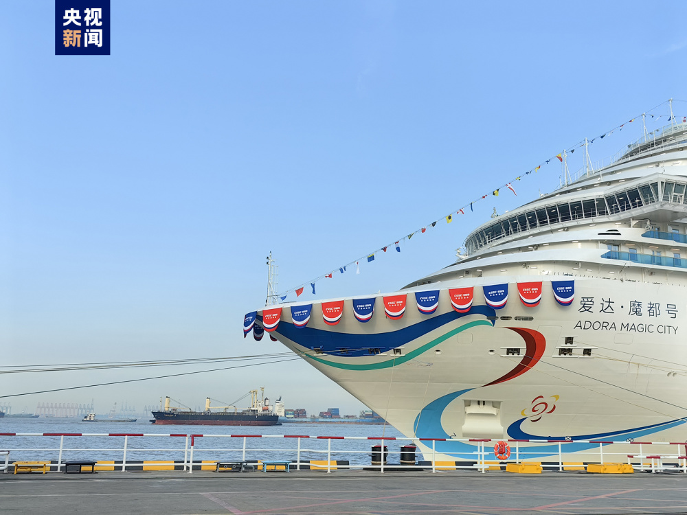
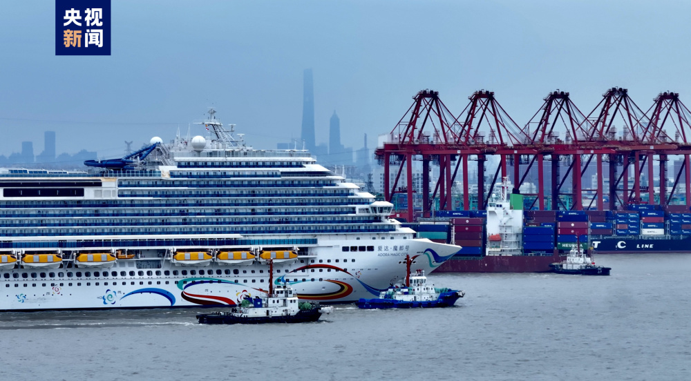
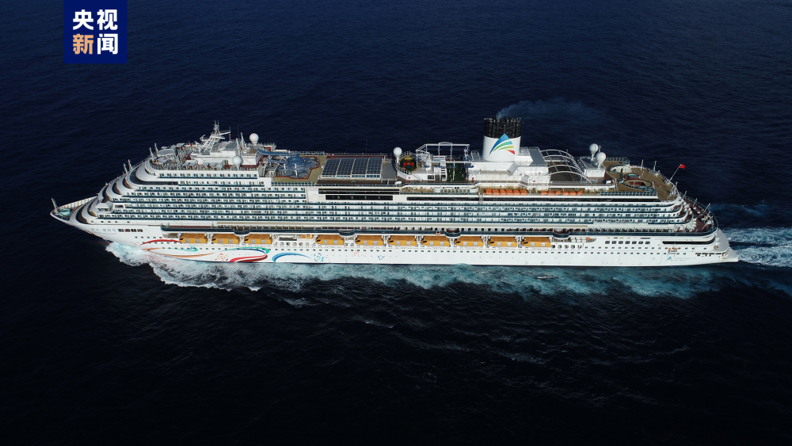

# 国产首艘大型邮轮今日正式交付

据央视新闻，今日（11月4日）下午，国产首艘大型邮轮在上海外高桥造船码头正式交付用户，标志着我国成为世界上第五个可以建造大型邮轮的国家。

国产首艘大型邮轮长323.6米，高72.2米，有24层楼高，2125间客房，最多可载乘客5246人。在超过4万平方米的公共区域配置了餐厅、剧院、健身房等设施，它也被称为移动的海上“城市”。

大型邮轮是世界上最大的单体机电产品，全船安装的零件数量超过2500万个，是复兴号高铁的13倍，被称为工业领域的集大成者。

国产首艘大型邮轮今天交付后，将于明年1月1日正式开启商业首航。

