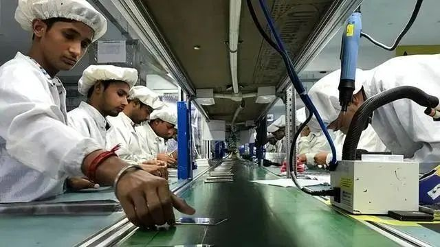
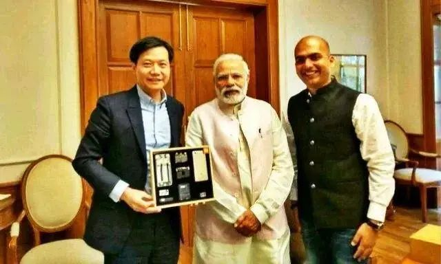

# 大批外企退出，在印度做生意太难了

不知道印度何时来整顿这样的营商环境，又有谁来继续跳进这个“坑”？

**文 | 极 耳**

外企在印度做生意，太难了。

这不是危言耸听。

最近一段时间，关于外企从印度撤资的报道屡见不鲜，迪士尼被曝从印度业务中“抽身”，纬创资通也出售了印度业务。

据央视援引印度官方公布的数据显示，7年间，2783家跨国公司关闭在印业务，包括福特、富士康等，约占在印跨国公司的六分之一。

其实，在过去很长一段时间内，印度都被认为是“跨国企业坟场”，因为印度用各种手段打压外企，包括直接封禁、资产处罚、提高关税壁垒等等。

以亚马逊为例，2022年6月，亚马逊投资一家零售集团的交易中，被判定有所隐瞒，被处以20亿卢比（约1.7亿元人民币）的罚款。2023年3月，印度储备银行（RBI）以不遵守预付支付工具规则为由对亚马逊
Pay 处以37.5万美元的罚款。

或许有人想说，既然到印度发展，自然要遵守当地法律法规。不过据环球时报报道，印度的各项法律法规像迷宫一样错综复杂，稍不注意就可能触碰到，往往导致普遍性违法和选择性执法。这为印度当局勒索外国企业提供了便利。

而且，印度还有让人想象不到的骚操作。

以印度向沃达丰罚款一事为例。印度税务部门对沃达丰开出了数十亿美元的罚款，沃达丰不服起诉至印度高院，即便印度最高法院于2012年裁定沃达丰无需缴纳税款。然而，印度议会竟直接绕过最高法院，通过了2012年财政法案，对1961年所得税法进行修订，并且这个修订是追溯性的，也就是说，相关的规定被认为从1961年开始就生效了，这直接改掉了沃达丰得以胜诉的法律基础，使沃达丰必须缴纳税款。

后来，沃达丰起诉至国际法院，在国际舆论的压力下，印度才取消罚款，印度的营商环境由此可见一斑。

**曾经，印度也是中企出海热土。**

小米在2017年成为印度销量第一的智能手机品牌，中国智能手机品牌市占率超50%，2018年出货量排名前五的智能手机品牌中，中国手机品牌占据了四席。

2018年，在印度前十大安卓应用中，有5款来自中国，前100安卓应用中，有44款由中国公司开发。

根据市场研究和分析平台Tracxn的数据显示，中国对印度的总体风险投资规模从2016年的6.68亿美元上涨至2018年的56亿美元，中国企业布局了零售电商、物流、医疗健康、人工智能、文娱、支付、出行等多个领域。

**然而，2020年4月，印度商工部突然修改了FDI政策，将所有直接或间接来自印度陆地邻国的投资从之前大部分行业适用的“自动审批路径”改为“政府审批路径”。此举被视作限制中国企业对印投资的针对性动作。**

2022年1月，印度税务情报局向小米印度罚了65.3亿卢比（约合人民币5.58亿元）税款。5月1日，再冻结其7.25亿美元（约48亿元人民币）资产。

今年6月，印度执法局向小米在印度的分公司、部分高管以及相关银行发出正式通知，指控他们非法向国外转移资金、涉嫌违反印度的《外汇管理法》。这次指控意味着小米2022年被印度冻结的近7亿美元很可能被正式罚没，这也是印度政府成立以来最大数额的资金没收。

2017年初，小米科技创始人雷军送给印度总理纳伦德拉·莫迪一部红米4A的“工程机”，一度被传为佳话。

2022年7月，vivo的119个印度相关银行账号被印度执法局封锁，总额达46.5亿卢比（约合人民币4亿元）。印度执法局在相关声明中指控称，vivo印度公司为逃避纳税，将6247.6亿卢比（约合人民币455亿元）汇往中国等地，金额相当于该公司一半左右的营收规模。

而刚刚过去的10月，印度执法部门逮捕了4名行业高管，其中包括一名中国智能手机厂商vivo的员工，理由是他们被指控涉嫌洗钱。vivo方面对此回应称：“vivo在印度严格遵守当地的法律法规。我们正密切关注近期的调查事宜，并将采取所有可行的法律措施进行应对。”

不仅是中企，近年来，印度税务部门对壳牌、诺基亚、IBM、沃尔玛、凯恩能源等多家外资企业都进行了税务调查并开出了高额罚单。日韩不少企业也面临同样的状况。监管的不确定性，已经成为外商投资的重大障碍。

**难怪有评论言道，这就是印度的套路，先给外资一些甜头或者美好的许诺，诱使外企向印度投资。等到外企在印度有了一些家底、取得了一定效益，特别是印度在这一领域也学会了一点之后，印度当局就通过各种方式来对外企进行事实上的勒索，让外企进退维谷。**

刚刚出售印度业务的纬创资通是第一家在印度生产iPhone的公司，在印度经营超过15年，曾为苹果公司生产过iPhone
SE等机型。纬创退出印度的原因，美国石英网此前报道认为，该公司在印度遭遇了诸多争议性对待。

_2020年12月12日，纬创资通印度工厂被砸。图自印媒_

此前，富士康母公司鸿海精密发布声明称，已退出与印度韦丹塔集团价值195亿美元的半导体合资公司。富士康的解释是，存在“无法顺利克服的挑战性差距”，也是十分耐人寻味的。

由于营商环境不够稳定，美国福特汽车因巨额亏损在2021年不得不退出了已耕耘10年的印度市场，特斯拉2022年也因税收问题暂停了在印度的销售计划。

而世界银行发布的《2020年全球营商环境报告》中，印度就已被认为是“全球最难做生意的国家”之一。

可以想见，如果不是实在受不了了，这些跨国企业怎么会忍痛割舍印度这么大的市场。

只是不知道印度何时来整顿这样的营商环境，又有谁来继续跳进这个“坑”？

综合整理自央视新闻、环球时报、海外网等

