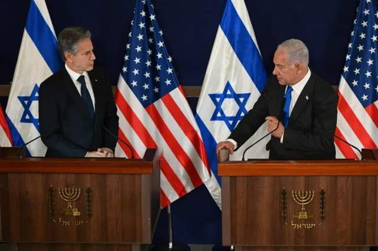
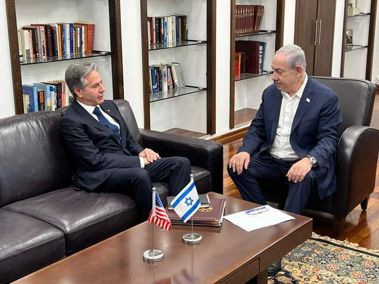
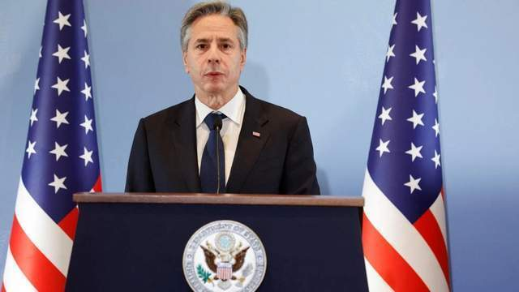

# 布林肯的建议，以色列总理内塔尼亚胡拒绝了

_图源：阿纳多卢通讯社_

以色列总理内塔尼亚胡3日晚发表电视讲话说，以方将全速推进战事，拒绝“任何不涉及释放被扣押以色列人”的临时停火。以色列不允许燃料进入加沙地带。

内塔尼亚胡表示，以方不会停止战斗，直至取得胜利并实现既定目标，即消灭巴勒斯坦伊斯兰抵抗运动（哈马斯）、让被扣押人员获释以及恢复以色列公民的安全。他说，以军正在激烈作战，对哈马斯目标的空袭是“持续的和前所未有的”。

当天，内塔尼亚胡与到访的美国国务卿布林肯举行了会晤。内塔尼亚胡在讲话中说，他已向美方阐述了以方上述立场。

布林肯在同天于特拉维夫举行的记者会上说，他与内塔尼亚胡及以色列战时内阁讨论了如何、何时、何地实施暂时停火，以及必须达成哪些谅解。“我们在今天的讨论中提出了一些合理的问题，包括如何利用暂停期来最大限度地允许人道援助流动，如何将暂停期与释放人质相连接，如何确保这些暂停期或安排不会让哈马斯占到好处。”

布林肯表示，华盛顿明白这需要时间，并且需要国际伙伴的协调。“这些都是我们迫切需要解决的问题，我们相信是能够得到解决的。”

**不过，布林肯敦促以色列暂时停止对加沙地带的军事攻势，以允许援助进入巴勒斯坦飞地。但他的这一提议，遭到了内塔尼亚胡的拒绝。**

 _图源：路透社_

路透社在报道中说，美国一直保持对以色列的大力支持，但其言论正逐渐转向增加对加沙地带的人道援助，采取措施以避免平民死亡，并暂停战斗以协助解救被哈马斯扣押的240多名人质。而布林肯的上述讲话也表明，与以色列的讨论仍有许多症结尚未化解。

值得一提的是，这也是不到一个月内，布林肯第二次到访中东，随后他还将前往约旦。据美国国务院发言人马修·米勒此前宣布，布林肯将在约旦强调保护平民生命的重要性，以及共同致力于促进以可持续和递增的方式向加沙提供人道主义援助。约旦外交部本周宣布，已召回约旦驻以色列大使，以抗议“以色列对加沙的猛烈袭击——这场战争造成了无辜平民的死亡并造成了前所未有的人道主义灾难”。

来源丨新华社、路透社、新加坡《联合早报》等

