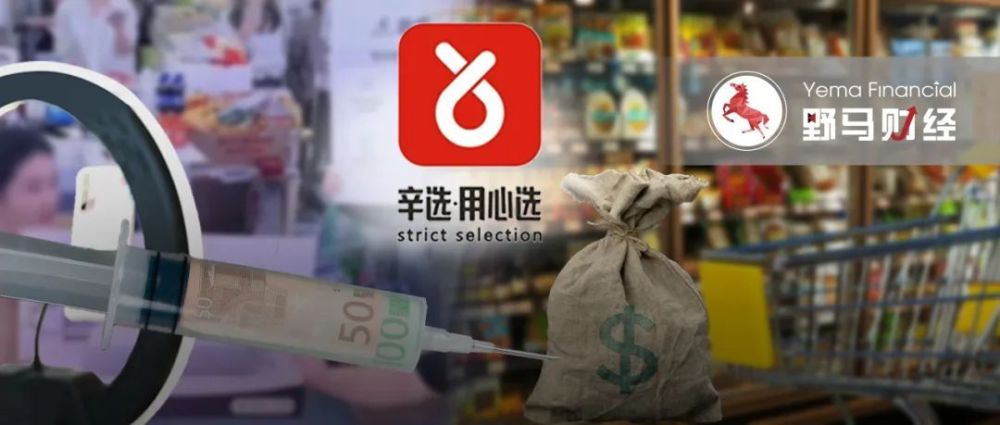
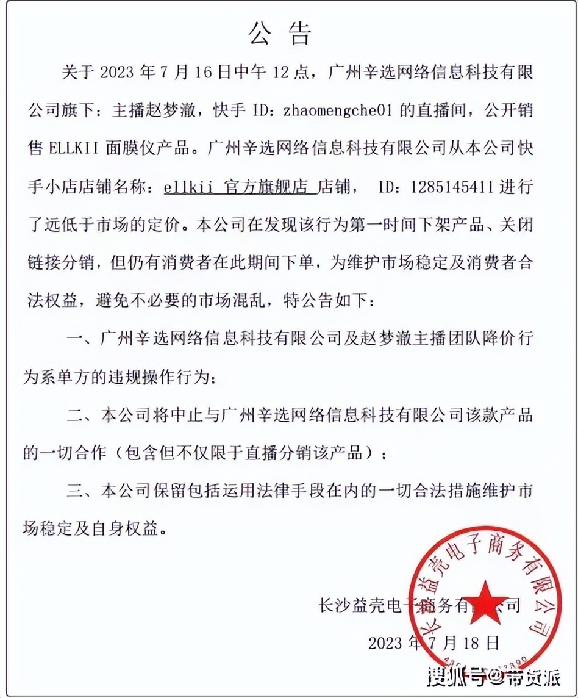

# 年卖600亿的辛巴与品牌方闹掰，背后是电商与实体经济之战

作者 | 于婞

编辑丨高岩

来源 | 野马财经

前脚在直播中因为卖出10亿慕思床，还扬言“请直播行业的从业者们朝拜我，徒子徒孙们，请说师父在上！”的辛巴，后脚就在直播中称，慕思已经终止与他的合作，对此表示遗憾和不解。并且表示，“如果品牌方在10月31日前下架（床），
**你我走法律程序** 。”

辛巴原名辛有志，辛选集团创始人。 **作为“快手一哥”，他的快手账号粉丝量高达9999万+。**
辛巴团队还有多个“徒弟”，其中蛋蛋、猫妹妹、赵梦澈的快手粉丝分别超过9000万、5000万和4000万。

按照辛巴在直播中的说法，是慕思的线下经销商对他的直播带货表示了不满，认为卖得太便宜，影响了他们的利益。此前，辛巴在快手直播间里，把慕思股份(001323.SZ)一款号称原价19800元的床，以4980元的价格，卖了二十余万张。

在直播中，辛巴还表示：“不要搞我了行吗？我辛有志没有本事去垄断一个行业。我只想今天告诉你的是，不管我卖多少钱跟你没关系。我的客户不是你的用户。听明白了吗？不影响你的销售。你们不要给我扣帽子。”

值得注意的是，在此事件中， **辛巴还质疑抖音控制舆论**
。“你炒作李佳琦控制别人的价格这件事，是不是说李佳琦卖的价格贵，然后导致你们主播拿不来货？然后今天你又炒辛巴把床卖便宜了还不行。只要是对手的主播，无一幸免。”辛巴在抖音直播中称，“我不稀罕你这个平台，不稀罕你的流量，可以把我辛有志的一切全都抹去，不在乎你。”

随后的11月2日， **辛巴415万粉丝的抖音账号被封**
。据“澎湃新闻”援引知情人士说法称，被封的原因是快手辛巴此前屡次在抖音发布不实信息，侮辱谩骂拉踩引战。至于这次辛巴会被抖音封多久，尚不明确。

辛巴与品牌的爱恨情仇

而辛巴与品牌方的摩擦也不止一次。

去年4月16日晚上9点多，辛巴像往常一样在直播间里激情洋溢地带货。对于女徒弟“蛋蛋”递过来的独立包装的“花花公子”牌内裤，一脸茫然地问：“我没有选这款产品，我没同意啊，你选的？”徒弟也瞬间懵圈了。紧接着，辛巴直起腰来，将手里攥着的单独包装的内裤推到一旁，再次强调：
**“辛选禁止卖‘花花公子’。此‘花花公子’非彼‘花花公子’，这个品牌是中国抢注的。我这辈子都不会选这款产品。”**

_来源：辛巴直播录屏_

突如其来极其戏剧化的“强硬”，不仅让屏幕前的老铁们猝不及防，更闪了合作方的腰。

随后，合作方悦为股份董事长、玛卡服饰实控人姚凌宇也在去年9月2日通过视频号，对辛巴正面“亮剑”。
**称“悦为股份已经与辛选签订了有效合同，并已经合作了5次。本次（第6次）开播前，还进行了正规流程的验货、验厂、授权等环节。而辛巴却在直播开始后，临时说我们是‘抢注品牌’，并单方面终止协议，取消合作。**
辛巴作为公众人物，对花花公子品牌认知度低，将已进入国内市场十几年，深入消费者心中的大品牌，说成是‘抢注品牌’。用自己错误的认知和言行误导消费者，随意抹黑自己合作伙伴的形象。鉴于辛巴损坏我方利益的行为，我们已经正式将其起诉，会对此事追究到底！”

而且，因为投放了辛巴的营销合作，姚凌宇表示 **进行了500多万元的备货，一下子全砸在仓库了。**

由于双方在合同中约定有争议需在广州仲裁委员会进行仲裁。最终在今年2月13日裁决如下：
**广州仲裁委认为，主播在当日直播中言语欠妥，但直播内容并未指向申请人（玛卡服饰）**
，观众不会将主播的言语内容与申请人进行联系，直播内容不会对申请人声誉产生影响。如果申请人认为主播言语构成了侵权，应另寻途径进行解决，不属于本案的处理范围。
**对申请人的全部仲裁请求不予支持。**

虽然合作方没有赢得官司，但是与辛巴不欢而散则在意料之中。

紧接着，在去年4月18日，辛巴和旗下主播蛋蛋售卖了一款名为“YPL 防晒凉感裤”的产品，但涉事品牌方YPL发布声明称，
**该品未经官方授权，不属于YPL品牌旗下产品。并表示要采取法律手段对相关销售、生产公司进行追责。**
事件背后涉及商标之争，辛巴与品牌方各执一词。但事情发酵不到一周，局面突然又柳暗花明，
**辛选表示可以为消费者提供该商品的全额退款，YPL品牌方则对辛巴带来的影响表示歉意，双方握手言和。**

此外，今年7月18日，ELLKII品牌方也发公告中止了一款面膜仪产品与辛选的带货合作。品牌方益壳电子称，辛选主播赵梦澈
**以远低于市场的定价销售ELLKII面膜仪产品，属于单方的违规操作行为。**
为维护市场稳定及消费者合法权益，避免不必要的市场胡乱，中止与辛选关于该产品的一切合作。

前有玛卡服饰、YPL、中有益壳电子、后有慕思，屡屡出现的辛巴与品牌方的摩擦，其实凸显了电商与实体经济的激烈博弈。

1个辛巴团队，抵得上3000家华润万家？

上海财经大学电子商务研究所执行所长崔丽丽教授认为，这些事情应该是品牌方在选择和辛巴进行合作之前没有做好规划，品牌在这个活动过程当中到底是要品牌宣传？还是新品营销？还是大量带货？没有做一个很好的思考。

崔丽丽分析，问题的关键是在于品牌有没有对自己要找主播带货这件事情做很好的规划和清晰的定位。她认为，辛巴是有他非常强烈的个人特点的，包括他的受众群体，也是有比较清晰的市场分层特征，品牌在找他带货的过程当中，应该思考自己的目标人群和这个主播对标的主流市场客群是不是吻合。

**在主播带货的过程当中，如果是针对既有产品进行低价、大量的销售，便会对原有的经销商体系形成一种冲击。**

资深产业经济观察家梁振鹏表示，直播电商的特点是价格战，
**因为和实体渠道卖一模一样的东西，电商成本低，没有房租，不用养那么多员工，不用交那么多水电费，所以电子商务渠道就会价格便宜。** 直播电商很难带火高端。

电商的这个特点也可以从另一位头部主播李佳琦的舆论风波中发现：花西子眉笔加上2个替换装79元的售价，还是让消费者觉得“太贵了”，并且对李佳琦粉转路。

而头部主播的带货能力，往往一个团队就能匹敌上千家实体门店。

据行业垂直媒体“电商报”消息， **2022年，李佳琦背后美腕交易总额超过650亿元，辛巴的辛选集团交易总额超600亿。**

而中国连锁经营协会（CCFA）发布的《2022年中国连锁Top100》榜单显示， **行业排名第7的华润万家，2022年销售总计692亿元。**

2022年，美腕的参保员工人数有563人，但“虎嗅网”在今年的报道中提到，美腕如今员工上千。辛选背后巴伽娱乐参保员工257人，不过辛巴在2021年的一次自我介绍视频中，曾提到辛选集团有4100名员工。而
**华润万家在全国的门店数量就超过3100家，员工人数近20万。**

几千人的直播团队创造的销售额堪比二十万人的实体产业，这也引发了外界关于 **直播电商是否在“抽血”实体产业** 的讨论。

抖音头部主播“疯狂小杨哥”还在直播间直面了这个问题，回复网友称：“电商是这个时代发展的产物，是跟着时代在走，不能时代在走，我们现在做的东西在停，不能停滞不前。”

梁振鹏指出，从实体制造业的角度来说，中国市场这么大，还有很多走中低端、走大众化定位路线的品牌，他们需要直播电商，通过打价格战的方式增加市场销售，所以
**对于实体制造业来说，直播电商是有一定促进作用的。** 不过梁振鹏还提到，对于实体销售渠道来说，那就是另外一码事。
**直播电商对实体渠道确实会造成打击** 。

梁振鹏表示，对于线下的实体门店，直播电商肯定会让他们过得更加艰难。 **实体门店会更多的被直播电商的低价产品抢走渠道和市场份额**
，直播电商当然会对他们造成打击。

艾媒咨询CEO兼首席分析师张毅认为，直播电商作为营销渠道的一种创新模式，它是对传统销售渠道销和售模式的一个巨大的革命，这点我们必须得去承认，同时
**我们要跟上这种创新。**
他同时分享了一个故事：曾经的英国贵族都用马车出行，工业革命之后，英国出现了汽车，大量的马夫和给马服务的产业链都开始相继事业。当时的讨论也十分激烈，认为汽车抽空了传统的马车行业和产业链，让大量人员失业。但如今看来，虽然少了一个马车的行业，但是多了一个巨大的产业，就是汽车和机械产业。

产业时评人张书乐指出， **电商直播和实体产业，都是渠道，必然有此消彼长** ，但不存在抽血。直播带货真正的立足领域是快消，这个定位之下，实体经济可以错峰。

直播需要画下边界线了！

其实争论不止在国内，关于直播电商对实体经济是福是祸，在其他国家也讨论的如火如荼。9月27日，印度尼西亚发布一项新令，宣布禁止社交媒体平台上的电子商务交易。10月7日，马来西亚通信和数字部部长法米也表示，该部将在近期针对印尼禁止TikTok电商服务的行动和广告内容，传召该平台管理层作出解释，以制定适合马来西亚的措施。

此外，TikTok还面临欧盟“史上最严”数字法案的监管：仅2023年1月，就因违反cookie同意规则被法国监管机构罚款500万欧元；9月，又因违反《通用数据保护条例》，被爱尔兰监管层罚款3.45亿欧元。

在国内，直播电商也开始结束草莽发展时代。10月30日，杭州市司法局发布公告称，为打造良好的法治化营商环境，杭州市将编制系列重点产业合规指引，同时公开征集关于《直播电商产业合规指引（征求意见稿）》意见建议，其中提到，直播从业者不得要求商家签订“最低价协议”，还提示直播电商从业者不得通过低价倾销、价格串通、哄抬价格、价格欺诈等方式滥用自主定价权。

此前为了抑制短视频与网络直播行业的野蛮生长，国家各级机关也相继出台了多部法律法规，如《视频直播购物运营和服务基本规范》《网络直播营销行为规范》《直播电子商务平台管理与服务规范》等等，对主播行为、产品服务、消费者权益保护等都作了相应的规范。

崔丽丽认为，电商直播与实体门店的渠道不同，模式不同，效率不同。在线商业特别具有市场端效率，而线下商业讲究的是极致降低成本。
**一个是生产端规模经济，一个是市场端规模经济**
，成本收益模式都不一样，两者无法比较。渠道需要区分侧重点，线上线下融合。线下更偏重于体验性、高价值、更可见可触摸的消费，而线上侧重于性价比消费。其实现在线上并不一定比线下便宜，就是以后实际上只是不同的场景而已。

崔丽丽表示，如果是主播都按照辛巴这样的做法，辛选供应链，就是一种 **渠道品牌** 的概念。她解释道，就是
**利用他自己对标的这个客群特征由他去选择什么样的商品是适合这个群体，然后可以反向定制。根据客群的比较集中的确定的市场规模需求，然后来反向引导工厂更好的去生产、设计商品。**
崔丽丽还提到，如果找头部主播必须要最低价，那么除了推广新品时候的牺牲营销以外，确实 **没有给实体带来新的价值，只是在原有渠道体系内的一种利益再分配。**

张书乐认为，在商言商，有利益之下，任何渠道都不可能刻意划定边界，直播带货并非无所不能，实体经济在面对渠道颠覆时，本就应该改变自己的渠道策略，在扁平化无法和直播带货比肩的领域大踏步的撤退，在直播带货无法触及的品类便捷大踏步的前进。

张毅指出，直播电商，尤其是头部主播把品牌和供应商的这个价格往死里压，这点确实会有一定的争议。这不能说是要垄断，但
**头部主播确实会有一些不平等的议价能力。他认为，这是值得法律界、监管界、以及市场共同思考的话题，这是一个新命题。**

张毅认为，这个好比当时马车时代完全不需要交警，也不需要太多的红绿灯。因为马车的速度通常在城市里面都跑的比较慢，所以不需要这么多的交通规则。但后来发现汽车出来以后，它横冲直撞的代价是非常高的，相应的各国都开始设立交通法规和交通警察，以及对应的一些服务去进行管理。
**我们要探讨的应该是这个问题，而不是抹杀。或者是对创新、对新业态一边倒的害怕。**

**你怎么看电商直播与实体产业的冲突？评论区聊聊吧。**

