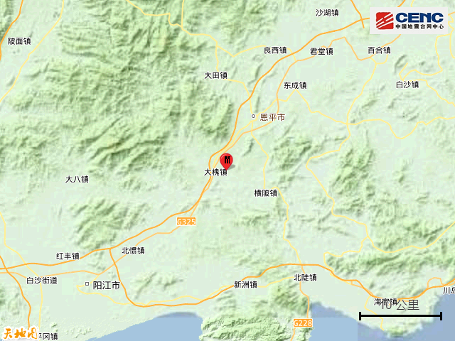

# 广东江门恩平市发生4.3级地震 震源深度8千米

[广东江门4.3级地震 无破坏性但造成当地震感非常明显且有感范围广](https://new.qq.com/rain/a/20231104A080FR00)

据中国地震台网正式测定，11月4日19时24分在广东江门市恩平市发生4.3级地震，震源深度8公里，震中位于北纬22.08度，东经112.25度。

本次地震周边5公里内的村庄有新营村、落地金钱、广华村、新联、新寨、高恩、陂口、朝锦村、福龙、吉风村，20公里内的乡镇有大槐镇、横陂镇、那吉镇、江南镇、那扶镇。

震中距恩平市13公里、距阳东区34公里、距江城区39公里、距阳春市48公里、距开平市57公里，距阳江市37公里，距江门市102公里，距广州市157公里。

震中5公里范围内平均海拔约26米。

根据中国地震台网速报目录，震中周边200公里内近5年来发生3级以上地震共9次，最大地震是2019年10月12日在广西玉林市北流市发生的5.2级地震（距离本次震中180公里），历史地震分布如图。

