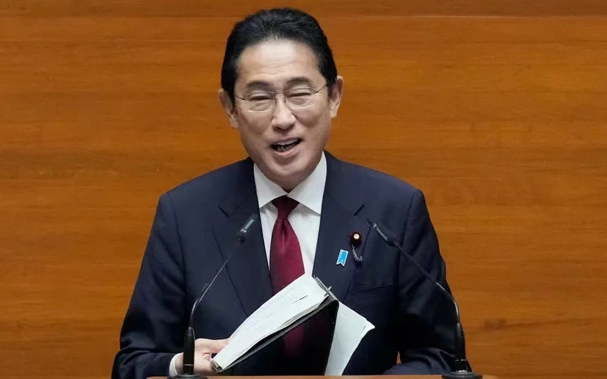

# 日媒：岸田文雄首次在菲律宾国会演讲，提到菲前总统特赦日本二战战犯

【环球网报道】据日本《每日新闻》4日报道，日本首相岸田文雄当天在菲律宾国会发表演讲，称日本与菲律宾的双边关系进入“黄金时代”，并提到菲律宾前总统基里诺曾特赦日本二战战犯。报道称，这是日本首相首次在菲律宾国会发表演讲。

 _日本首相岸田文雄4日在菲律宾国会演讲。图自日媒_

据报道，岸田在演讲时提及时任日本首相福田赳夫1977年在马尼拉演讲时提出的倡导“对等伙伴关系”“心连心信赖关系”东南亚外交原则，并提到尽管在二战中亲属被日军杀害但仍然特赦了日本战犯的菲律宾前总统基里诺。岸田声称，“不能忘记在建立友好关系之前，前人们基于宽容精神的努力”，并主张现在日菲双边关系进入“黄金时代”。

日本外务省的公开资料显示，1953年7月，基里诺特赦105名日本战犯，三年后的1956年，日菲两国实现了邦交正常化。外务省称，基里诺的特赦对实现邦交正常化做出卓越贡献，成为现代日菲友好的基石。

日本《朝日新闻》此前报道称，基里诺的特赦是基于政治判断，考虑到美国对日本的重视以及与日本的赔偿交涉，并没有得到舆论的支持。基里诺在1953年晚些时候的总统大选中惨败未能连任，并于1956年去世，淡出历史舞台。

岸田文雄于11月3日至5日访问菲律宾和马来西亚。就对菲律宾的访问，日本媒体普遍认为此举针对中国。据日本共同社3日报道，双方确认了加强安全保障领域的合作，就启动使自卫队与菲军相互顺畅往来的《互惠准入协定》（RAA）的缔约谈判达成一致。此外，日本政府还将在“政府安全保障能力强化支援”（OSA）机制下向菲方提供海岸监视雷达。这是今年4月该框架创设后首次适用。

关于岸田文雄访问菲律宾，国际问题研究院东南亚问题专家唐奇芳在接受《环球时报》记者采访时说，“岸田的这种外交路径其实是对安倍的继承和发展”，“岸田在安倍时期曾任外务大臣和防卫大臣，他一直把拉拢东南亚作为日本外交的一个非常重要的方向。现在，日本试图联手美国，对中国形成合围之势”。

