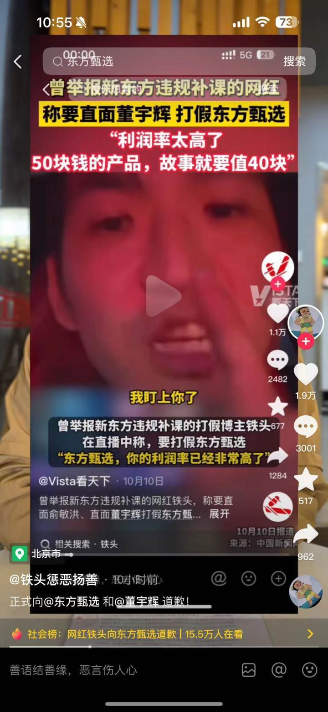
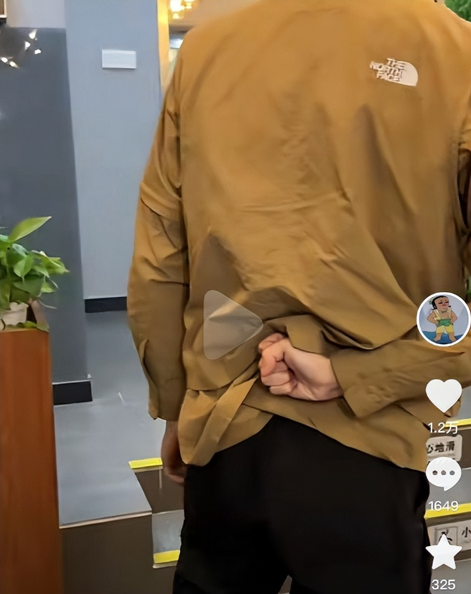

# 网红铁头向东方甄选和董宇辉道歉

11月4日凌晨，打假网红“铁头”发视频，郑重并正式地向东方甄选和董宇辉道歉。

在道歉视频中，他称“非常的后悔和自责，我今后会自我反省，不会再做同样出格、不好的这些事情，希望网友及自我一起监督”。

此前，“铁头”在10月9日直播时声称，“故事是要钱的，你那份产品50块钱，那个故事可能就要40块钱过期的毒鸡汤，听完以后觉得你提升了文化，毛都不是”。

值得注意的是，在道歉视频最后铁头做出了后背握拳的手势。

来源：橙柿互动

