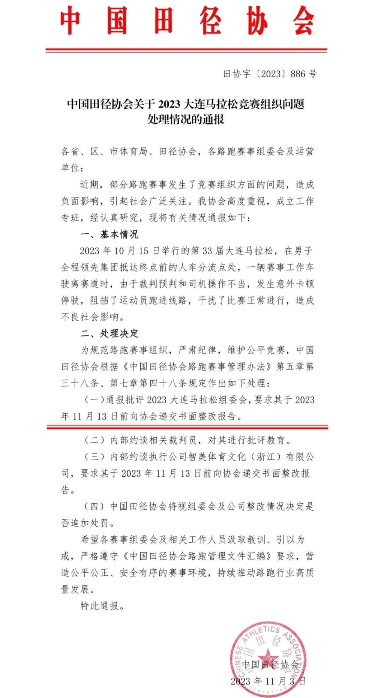
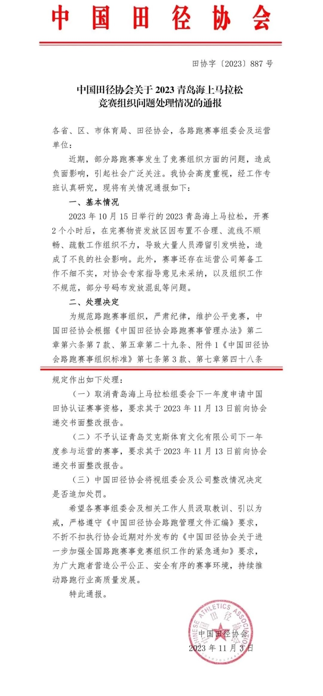

# 车辆阻挡选手、人员滞留引哄抢，田协处罚大连、青岛海上马拉松组委会

新京报讯
11月3日晚，中国田径协会发布了《关于近期路跑赛事竞赛组织问题处理情况的通报》，对近期出现竞赛组织问题的大连马拉松、青岛海上马拉松的相关单位和人员进行处理。具体情况通报如下：

**此前报道：**

[阻挡选手、冲线被拦……多地马拉松乱象频发，中国田协下发紧急通知](https://new.qq.com/rain/a/20231019A0341Q00)

[大连马拉松运营公司回应选手冲刺被车拦：愿接受和配合相关部门调查](https://new.qq.com/rain/a/20231019A07UVH00)

