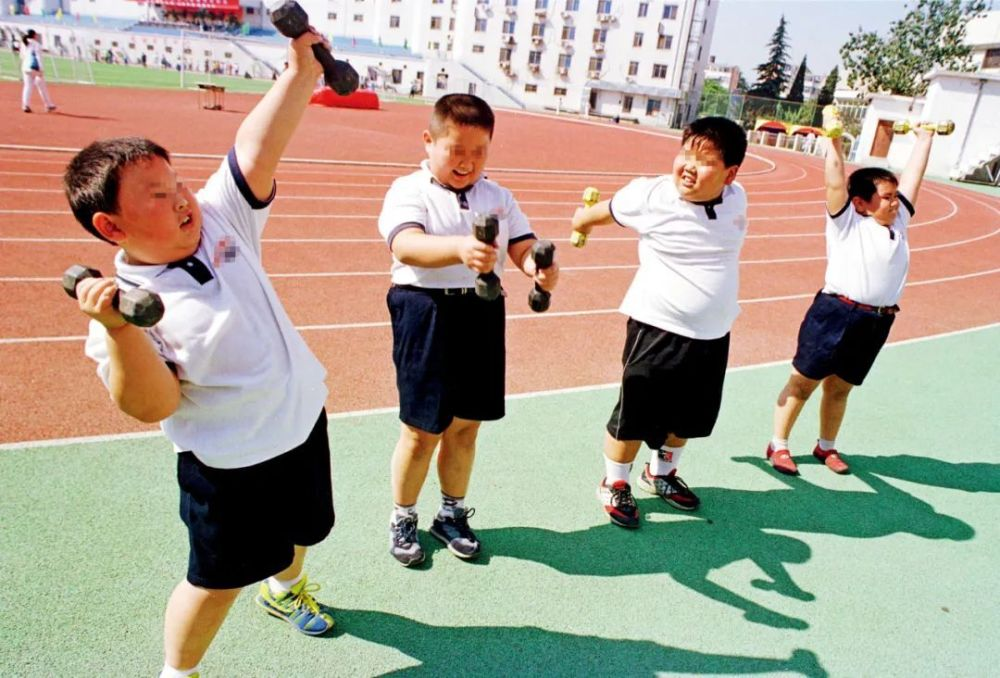

# 3岁糖尿病、6岁性早熟、10岁脂肪肝，孩子的肥胖危机你想象不到

最近几年，母义明见到最小的糖尿病患者只有3岁。

母义明是中国人民解放军总医院第一医学中心内分泌科主任。他回忆说，孩子的爷爷奶奶注意到，孩子总是口渴，抱着碳酸饮料不停地喝，并频繁小便。体检一查，孩子的血糖已超过11毫摩尔/升。一般来说，儿童正常的空腹血糖值不超过6.1毫摩尔/升。

儿童青少年肥胖，正变成全球流行病。今年4月，北京大学儿童青少年卫生研究所原所长马军等人发表的一项研究显示，1985年～2019年，中国儿童青少年超重和肥胖总检出率增长18.1倍，仅肥胖的检出率就增长了75.6倍。以全国约3亿儿童青少年的总量估算，预计2030年，中国超重和肥胖儿童青少年人数将达到约1亿。

肥胖不只是体重秤上数字的增长。更多研究和实例已证实，肥胖儿童青少年正经受人们以为成年人才会罹患的慢性疾病。叠加生长发育期，未成年人肥胖的健康问题更多样和复杂，但未得应有重视。

**“孩子的健康到了‘悬崖边’上”**

每年寒暑假，都是不少医院营养科、内分泌科接诊肥胖患儿的高峰期。闫洁是北京儿童医院临床营养科主任、内分泌遗传代谢科主任医师，她告诉《中国新闻周刊》，今年7月，他们医院内分泌遗传代谢科门诊的日接诊量增长了三分之一，肥胖的孩子也有所增多。最多时，到晚上六七点，仍有家长带着孩子在门诊外排队。闫洁提到，北京儿童医院的内分泌科、临床营养科、儿童保健科、中医科都会看儿童肥胖问题，今年暑假，医院把营养科门诊调整为减重门诊，一天30个号，每次都会被挂满。

自上世纪90年代起，中国儿童青少年的超重肥胖率开始增长，目前正处于迅速上升期，一些大城市的儿童肥胖流行程度已接近发达国家水平。2021年12月，中国儿童中心发布的《儿童蓝皮书：中国儿童发展报告（2021）》显示，2019年，中国中小学生超重肥胖率达到了24.2％，比10年前上升了8.7％。各个年龄段、男女生以及城乡的学生，超重和肥胖比例都在上涨。其中，年龄越小，超重肥胖的小孩越多，约每4个小学生中就有一人超重或肥胖，这一比例在高中生中约为1/5。此外，男生超重肥胖率高于女孩，城市高于农村。

不少研究和数据显示，2020年以来的新冠大流行，正在加剧儿童肥胖趋势。今年8月，香港大学临床医学学院儿童及青少年科学系临床副教授叶柏强团队公布的研究显示，据香港卫生署的数据，2020年，香港4岁儿童超重及痴肥（肥胖且迟钝）的比例从前一年的2.8％上升至5％。2020/2021学年的一二年级小学生，超重和肥胖率达20.9％，比上一学年增加了7％，中学一年级的超重肥胖学生比例为24.1％，同比上升3％。

2021年，《英国医学杂志》的一份研究显示，疫情期间，儿童青少年久坐时间增加，体育活动减少，家庭越来越依赖热量密集且经过加工的低成本食品，以及对数字平台的依赖等，都在加剧儿童肥胖症的患病率。中国内地虽没有相关的权威流行病学研究，但2020年以来，多位受访医生也明显感到，到门诊看病的肥胖孩子在增加。

2022年上半年，苏沁发现，10岁的儿子铮铮感冒咳嗽“小病不断”，他胳膊上有一处炎症化脓，擦了药，长时间也没见痊愈。皮肤科医生说，光治疗炎症没用，问题还在于肥胖。她又带孩子去北京儿童医院内分泌遗传代谢科检查，“医生检查完对我说，因为肥胖，孩子的健康状况已经到了‘悬崖边’上”。

身高1米55的铮铮，当时体重已有156斤，腰围超过了100厘米，体质指数（BMI）高达32.5。他的脖子、腋窝、大腿根部有黑色斑印，儿童医院的医生一眼便看出，这是黑棘皮病。这是因体内过度的脂肪蓄积造成胰岛素抵抗后的外在表现，常见于肥胖人群，是糖尿病的前兆。对于糖尿病患者或高危人群，伤口自然愈合的能力和抵抗感染的能力都会降低。此外，检查还显示，铮铮有了脂肪肝，这让苏沁难以接受，“我自己有脂肪肝可以理解，但他是一个10岁的孩子”。

**“儿童肥胖问题比成人更复杂”**

临床诊断儿童是否超重和肥胖，也是参照BMI。但不同于成年人有一个固定的标准，未成年人处在生长发育期，不同年龄、不同性别都有一个单独的肥胖标准线。10岁的男生，BMI超过21.9已算是肥胖。北京协和医院临床营养科主任医师、中国营养学会临床营养分会主任委员陈伟有一个更为直观的判断经验：儿童的BMI超过28，一般诊断为重度肥胖。“孩子个子不高，BMI数字高，一定是体重非常胖了”，这类“大胖墩”在近些年以肉眼可见的速度增多。

“家长们不要觉得老年病离儿童很遥远。”陈伟发现，这是大多数家长的认知误区。儿童超重或肥胖，是心血管疾病和2型糖尿病的主要危险因素。此外，这些孩子罹患高血压、非酒精性脂肪肝等代谢综合征、睡眠呼吸障碍、哮喘的风险也在增加。陈伟在临床上注意到，重度肥胖的孩子，患高血压的比例很多，“不是一两个人，我见到的未成年患者可能占比10％～15％”，如果不及时干预，也会出现脑出血、脑梗塞等问题。

闫洁也提到，很多人不相信，小孩也能得2型糖尿病。近十几年来，北京儿童院病房收治的因肥胖导致的2型糖尿病患儿一直没有断过，“过去感觉没有那么多，现在很常见”。

此外，儿童青少年随着生长和发育，肥胖带来的健康问题比成人更复杂。今年夏天，一位外地医生向闫洁交流一个病例：13岁的男生，身高1米7，体重87公斤，家长突然发现孩子不长个了。男孩的父亲1米85，母亲1米62，家长担心孩子未来的发育。闫洁看了相关检查结果后发现，孩子的骨龄严重超于年龄，已经达到了十六七岁，骨骺线闭合，这意味着身高停止生长。她初步判断，这个孩子的骨龄超前，是由肥胖导致。

闫洁团队还曾做过相关研究课题，到一些小学测骨龄，发现大多肥胖儿童骨龄都超前。她指出，肥胖儿童更易出现性激素分泌异常，除了骨龄超前，也会带来性早熟等问题。她在门诊注意到，近年来，出现性早熟的女童也在增多，年纪最小的只有6岁，她们多是乳房提前发育、月经初潮提前，或突然长个子。根据中华医学会儿科学分会最新发布的性早熟诊断与治疗专家共识，多项流行病学调查证实，肥胖与性早熟患病率呈正相关，女童的青春发育启动年龄、初潮年龄均与BMI相关。

相比下，闫洁在临床见到超重或肥胖的男童，多是性发育迟缓，出现乳腺发育大、生殖器发育小等症状。但许多家长不在意肥胖，也不知晓肥胖和这些疾病的关联，他们常常是先带孩子看了泌尿外科，被医生转诊到闫洁的门诊。即便如此，闫洁反复强调问题的核心在于肥胖，要减重，但家长们问来问去，还是最关注未来生殖器的发育问题。

闫洁向《中国新闻周刊》介绍，一个孩子在成长过程中，会经历4个易长胖的“危险阶段”，分别是在妊娠期最后三个月、出生后的一年内、6～7岁，以及青春期阶段，这都是脂肪发育最活跃的时期，需要家长重视和预防孩子的肥胖问题。

以青春期为例，这一阶段的孩子身高和体重快速增加，进食增多，又多处在小学高年级、初中阶段，学业压力大，运动量无法保证，出现肥胖和代谢综合征的风险更高。母义明对《中国新闻周刊》补充说，青春期是人体所有器官和细胞发育最重要的阶段，肥胖的孩子，脂肪细胞数量会增多，“相当于在身体定型过程中，埋下了伏笔”，肥胖后减重难度也很大。即便以后瘦下来，脂肪细胞数量也不会再减少，成年后也很容易复胖。

_数据显示，各个年龄段、男女生以及城乡的学生，超重和肥胖比例都在上涨。图/IC_

**需要家庭做出改变**

不同于以往公众更关注体重和身材，医学界和公共卫生领域的专家呼吁，要从健康角度重构对儿童肥胖的认知。

今年1月，美国儿科学会时隔15年首次对儿童肥胖症的治疗指南进行更新。该学会表示，儿童肥胖症是一种具有遗传、社会和环境因素的疾病，而不是由个人选择。2007年，肥胖在美国还未被视为一种疾病，治疗多集中于饮食、营养和运动方面，社会对治疗儿童肥胖的普遍观点是“等等看”。新指南强调，要在早期“积极治疗”儿童肥胖，并将药物和手术治疗引入到相关治疗方案。尽管这一新指南发布后引发争议，人们担心把药物和手术治疗用于未成年人过于激进，相关治疗方案尚未形成共识。

不过，对于重度肥胖的孩子，如果身体指标已亮出红灯，大多数医生建议，还是要及时进行药物或住院干预。闫洁举例说，如果一些肥胖的孩子在进行口服葡萄糖耐量试验后，血糖≥11.1毫摩尔/升，则可以确诊为糖尿病，并要求对方立即住院治疗。对于轻中度肥胖的孩子，减重的关键挑战是医院之外，即改善饮食和生活方式。

苏沁过往的认知中，减肥无非是“管住嘴、迈开腿”。但铮铮是油炸食品爱好者，每周至少吃一次汉堡和披萨，平时一餐吃两碗米饭，肉不限量，绿叶菜吃得少，饮食习惯难以改变。新冠疫情后，饮食更加不健康。为了减肥，苏沁认为有必要给孩子减餐，但又担心孩子还在发育，“要是我把他的餐食减量，营养又不够，导致不长个儿，损失就太大了”。

运动方面，疫情前，铮铮每周上体育课，偶尔会去滑雪。居家后，他除了上网课，多是在吃零食、追剧、看综艺。2022年6月，苏沁建议铮铮运动打卡，但每次喊他出门，都要闹到“母子决裂”，几次之后便放弃。

找不到安全、有效的减重办法，是多数家长面临的烦恼。陈伟向《中国新闻周刊》强调，一些家长可能会在寒暑假严格控制孩子饮食，同时让他们高强度运动，但这很难达到减重目的。即使瘦了几斤，孩子一旦回归到日常生活，体重很快会反弹。对于轻中度肥胖的孩子，陈伟建议，不以“瘦多少斤”为目的的改变，反而能起到更好效果。比如，不吃不该吃的东西，不喝饮料，体重可能会有所改善。

在闫洁看来，一些家长认为减肥就是不吃晚饭，只吃水果、蔬菜，这是不对的。孩子处在生长发育期，要保证一日三餐，重要的是根据孩子消耗的热量，制订每一餐的摄入量，并做好营养搭配。每个孩子肥胖程度不同，食物的选择和搭配也不同，但有一些通用标准，“比如主食中要选择三分之一的粗杂粮，肉类选择含脂肪少的，蔬菜要选择膳食纤维多的，油、盐限制在多少克，一天食物种类保持多少种等”。

但和成人不同，孩子减重需要一个家庭做出改变。陈伟指出，挑战在于，一些孩子能听懂医生的话，但他们往往坚持不住；大人着急，但又不愿意帮助孩子去做落地的工作。“我经常对一些父母说，不能光让孩子出去跑步，你们夫妻俩在家躺着玩手机，孩子肯定觉得不公平。”陈伟说。

闫洁曾接诊过一名13岁的男孩，BMI高达34，重度肥胖。他参加了北京儿童医院每年暑假举办的减重夏令营，学到营养运动的科普知识，回到姥姥家，姥姥严格按照医生要求做一日三餐，孩子的多项身体指标均有所好转。但后来，孩子回到父母家，指标很快反弹回来。每一次复查，闫洁都发现，男孩和他爸爸的肚子都会大一圈。家长往往会将责任归咎于孩子没有自制力，但闫洁认为，更关键的还在于家长的重视程度和参与度。

多位医生都提到，临床医学减重时，家庭内部意见不统一的状况十分常见。在中国，许多家庭都是祖父母、外祖父母照顾孩子。老人往往认为，孩子多吃是好事。2022年7月，苏沁给铮铮报名了北京儿童医院的暑期减重夏令营，两周封闭训练中，铮铮学习营养和运动相关知识，每天三次运动，总共瘦了7斤。医生叮嘱，回家后的前三个月很关键。但还没坚持几天，苏沁就发现，婆婆偷偷给铮铮买雪糕吃。一些家长也常常向医生无奈地抱怨类似情况。闫洁一般都建议，下次复诊时，将家中老人一起带过来。她会耐心向老人解释肥胖的危害，“给他们提到脂肪肝、糖尿病这些风险，老人就都能接受了”。

铮铮离开减重夏令营时，医生让他带走了四宫格的餐盘，并建议家长每天定量搭配饮食，一周让孩子摄入25种营养。夏令营有营养师专门制定食谱，但这对普通家庭来说并不现实。苏沁从第一天制定食谱就开始焦虑，“感觉每天在写考卷”。尝试了一周，冰箱里剩下一些没用完的蔬菜。“当你觉得这是一个负担时，就会坚持不下去。”苏沁说。她退而求其次，不再写食谱，只是按照三菜一汤，主食加入粗粮的方案，每周吃完冰箱里的20多种食材，先保证孩子均衡营养，最终坚持下来。如今，铮铮的体重仍是156斤，但身高长到1米69，BMI为27.3，肌肉量和代谢量也在上升。

日常生活中，不少父母错误的奖励方式也在助长孩子不健康的饮食习惯。和铮铮交流时，苏沁发现，过去她常常无意识地说，考得好，就给你买糖果或者吃披萨，这向孩子传达了一个观念，“认为一些不健康的食物是好的食物”。此后，苏沁逐渐改变了“奖励策略”，她跟铮铮约定，要是想吃雪糕，需要去公园走三圈；如果能瘦几斤，带他去游乐园或者去旅行，这样更有利于减重。

_北京的一家青少年减肥营。图/视觉中国_

**学校是关键一环**

干预和预防未成年人的肥胖，不仅在于家庭，需要家庭、学校、社会三方配合。潘安建议，对于儿童青少年肥胖的预防和管理，政府应加大投入力度，“因为这是一个干预后效果很好的人群”。其中，学校是关键一环，孩子处在接受知识的阶段，学校可以增加健康知识教育，完善体育运动环境和食品环境，还可以更直接有效地向家长科普相关知识。

受访医生给患儿提出加强运动的建议时，一些家长无奈表示，日常的体育课常常被其他主课占用，孩子课业负担重，很难有时间保证运动。在不少中小学，课间十分钟甚至都“消失”了。

马军是北京大学儿童青少年卫生研究所原所长、《中国儿童肥胖报告》副主编，长期研究中国儿童青少年肥胖问题。他向《中国新闻周刊》提到，在加强体育活动方面，中小学仍面临挑战。一方面，近些年教育部陆续出台政策为学生减负，希望给孩子更多时间去运动。但问题在于，主流社会观念仍认为，成绩好坏是评价孩子优秀与否的唯一标准。这导致即便学校减了负，家长仍会给孩子许多学习压力。

另一方面，学生在校难免会磕磕碰碰，家长和社会舆论都追究学校的责任，“学校承担的压力太大，为了保护孩子，就尽可能减少他们的活动”。马军认为，家庭、学校和社会仍需探索出一个新共识，即孩子在学校受伤难以避免，在给受伤学生及其家庭更好的补偿的前提下，对学校更加宽容和理解，有助于更多孩子在成长阶段释放天性。

_2022年5月18日，重庆市万盛经开区中医院走进砚石台小学，开展“知营养 会运动 防肥胖 促健康”5·20中国学生营养日宣传活动。图/视觉中国_

2020年底，国家卫健委、教育部、市场监管总局办公厅等六部门联合发布《儿童青少年肥胖防控实施方案》（以下简称《方案》），明确指出，课业负担重、儿童青少年营养不均衡、身体活动不足等，是造成超重肥胖率快速上升的原因之一。该通知提到，学校要保证在校身体活动时间，各地各校要严格落实国家体育与健康课程标准，按照有关规定将体育成绩纳入中考等考核，中小学生每天在校内中等及以上强度身体活动时间达到1小时以上，保证每周至少3小时高强度身体活动。

今年9月，《北京市义务教育体育与健康过程性考核管理办法》发布，要求新学期各区对四、六、八年级学生开展国家学生体质健康测试的统测，成绩计入中考总分。其中，学生的体质指数（BMI）占体测成绩的15％。9月下旬，一位受访医生在门诊明显发现，不少肥胖儿童都是在学校建议下到医院就医，“来自东城、西城、丰台、通州的孩子都有”。一些孩子还提到，学校从这个学期开始，还要求一些超重或肥胖的学生每天放学后在操场上单独补充锻炼。该医生认为，学校的参与，对儿童肥胖防控有重要的帮助。

在马军看来，从想办法让孩子运动的角度来看，这一措施的初衷是好的。但他提醒，BMI指标有个缺点，一些孩子锻炼很多，肌肉结实，BMI的数值也会比较高，“比较理想的方式是，学校在评估时，可以BMI和身体脂肪百分比，判断会更加科学”。

陈伟还向《中国新闻周刊》指出，孩子可获得的深加工食品、各种各样的饮料增多，也是造成儿童青少年肥胖，但容易被忽视的重要原因。《中国儿童肥胖报告（2018年）》提到，中国学龄儿童的膳食结构不尽合理，油炸食品及奶油制品、糖果和含糖饮料等饮食增多。每天每增加一份350毫升的含糖饮料，持续一年，可使得儿童BMI增加0.06％。

《方案》也要求，市场监管总局应强化食物营销管理，进一步强化母乳代用品销售管理，并制定完善部门规章，对高糖、高脂、高盐食品，加强食品标签管理，不鼓励针对儿童的营销及食品包装中使用吸引儿童的图片、描述和外形设计。

（苏沁、铮铮为化名）

记者：杨智杰

