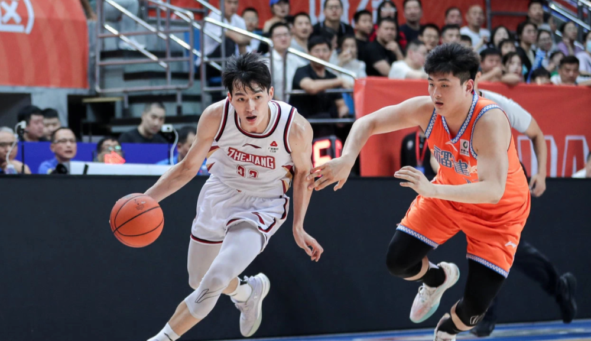

# CBA福建浙江冲突罚单出炉：吴前等4人共被罚款20万 没有球员禁赛

北京时间11月5日晚，CBA官方公布了福建男篮VS浙江男篮赛后（11月4日）冲突的罚单。没有球员被禁赛，但福建外援约瑟夫-杨、浙江男篮的程帅澎和吴前都被罚款5万元。此外，福建队随队人员李啸停赛2场、罚款5万元。

而福建主教练朱世龙、福建球员黄艺被警告。

CBA官方表示：“福建外援约瑟夫-
杨与浙江后卫程帅澎使用不当言语，并引发后续双方球队人员情绪激化；福建随队人员李啸进入比赛场地对程帅澎进行推搡，浙江球员吴前为阻止李啸使用了不当动作。”最终，这四人都被处罚。

福建主教练朱世龙和福建球员黄艺在上述事件过程中情绪激动，特给予警告。朱世龙作为球队主教练，尤其应该严格要求自我，管理好队员，切实发挥球队责任人的作用。

4日晚，福建男篮主场不敌浙江男篮，双方在赛后握手致意环节时突然爆发冲突，场面一片混乱。

冲突中，福建外援约瑟夫-杨、浙江后卫程帅澎和浙江后卫吴前、福建主教练朱世龙、福建随队人员李啸等人都不同程度地参与到了冲突中。但好在双方没有直接动手，冲突没有演变成“全武行”。这也可能是双方没有球员被禁赛，只是被罚款的原因。

至于被罚款的福建随队人员，则是翻越广告牌冲到浙江队球员面前指着对方骂骂咧咧。吴前为了阻止该随队人员，直接一把将其抱着推开。

导致双方发生冲突，和比赛多个回合的争议判罚有关系。最终，火药味一直延续到比赛结束后，并发生了双方的赛后冲突。

