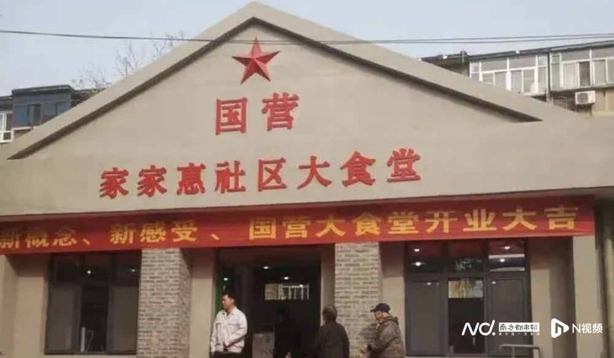

# 争议国营大食堂：让利于民，还是与民争利

10月30日，石家庄沿西社区国营大食堂正式营业，吸引了众多居民。该食堂自今年10月初试营业以来，已接待和服务顾客两万多人次。

据了解，国营大食堂的定位是：为沿西社区和周边的几千名居民提供便利餐饮服务，力求做到让顾客“5元吃饱，9元吃好”。未来，将进一步完善服务业态和内容，建立起涵盖餐饮、生鲜、家政、便利店、托育和菜鸟驿站等服务内容的综合便民服务体系。

社区食堂已经不是新鲜事物了，它的确能为居民带来诸多好处。

社区食堂可以提供方便的就餐环境，对于老年人或者没有时间自己做饭的年轻人，都有了一个新选择。

社区食堂几乎都是有补贴的，这样就可以把饭菜的价格压低，居民可以以相对较低的价格得到合格的餐食。对于价格敏感的人来说，也是好事。一个额外的好处是，居民到社区食堂吃饭，社区食堂就成了居民聚集和交流的场所，可以增加社区居民的交流，促进形成社区的社交网络。

做饭是一件耗费时间和精力的事情，不做饭，人们有更多的时间去从事其他活动，如工作、学习和娱乐等。从这个意义上，社区食堂不是几十年前的公共食堂，而是一种社会大分工加深的体现。只不过，社区食堂的是政府参与这种分工，并用补贴来支撑社区食堂。

社区食堂的关键在于它是否合理。对居民来说，饭菜便宜当然是好事，居民不会去细想背后的复杂问题。社区食堂的饭菜价格便宜，这就需要大量的补贴。如果要做到9元吃好，一定是要补贴顾客的，而且这个补贴力度还不会太小。

社区食堂能享受的一个最大的补贴，往往是场地。经营餐馆最大的成本就是场地，社区食堂往往在政府的场地经营，没有租金成本，就能极大地压低价格。似乎这是闲置资源利用，但实际上并不是。经济学上有机会成本的概念，简单地说，就是这个场地如果不给社区食堂用，租出去能收到多少钱，政府没有租，就相当于损失了这笔钱。

在高度市场化的行业生态下，社区食堂也算是一种新的社会现象、一种新的业态，与市场化的餐饮相比，社区食堂公益属性较强，讲究微利、惠民。社区食堂走市场路线，的确可以通过规模化去降低成本，但现在市场上有很多餐饮连锁店，社区食堂未必有压倒性的优势。

归根到底，社区食堂惠民还是源于政府补贴，本质上是一个政府提供的公共服务。而任何补贴都源于政府的公共预算，来源是人们的纳税，所以，都要讲究一个政治伦理，即该不该为某个群体花钱。其实社区食堂惠及的人群是不特定的，既有行动不便的老人，又有上班的年轻人；既有经济困难的人，也有富裕的人。

一项补贴政策，还应该考虑到外部性，即这个政策会额外产生什么影响。社区国营食堂刚出现的时候，有人就担心，社区食堂享受国家政策优惠，这让社区的其他饮食行业如何生存？

这个忧虑是现实的。社区食堂通常都很便宜，比起沙县小吃、兰州拉面、桂林米粉等类似模式的餐饮连锁店，要便宜一半多。所以，社区食堂一定会对周边的小餐馆、外卖店等餐饮行业造成影响，导致一些商家的生意下滑，甚至倒闭。这可能会引发一些经济问题，如失业和商业活动减少等。

其实，国家及各地政府并不是要大规模兴建国营食堂、社区食堂，现在各地兴建的社区食堂，是根据住建部2018年发布的国标“城市居住区规划设计标准”提出的。

《关于开展完整社区建设试点工作的通知》规定各市（区）应选取3至5个社区开展完整社区建设试点，试点社区将配建食堂等便民商业服务设施。

不过，现在各地财政都很紧，政府想长期补贴也恐怕有心无力。从现在的状况看，首批社区食堂已经出现关门潮。

比社区食堂更高效的办法，是直接对老人、家庭困难的居民等就餐给予补贴，让他们就近在社区周边的市场化餐馆中购买。至于那些周边没有市场化餐饮的社区，则可以用社区食堂来保证城市居住条件达标。

文｜刘远举

