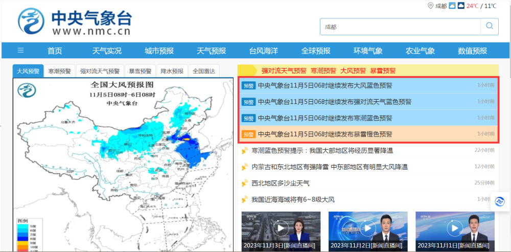
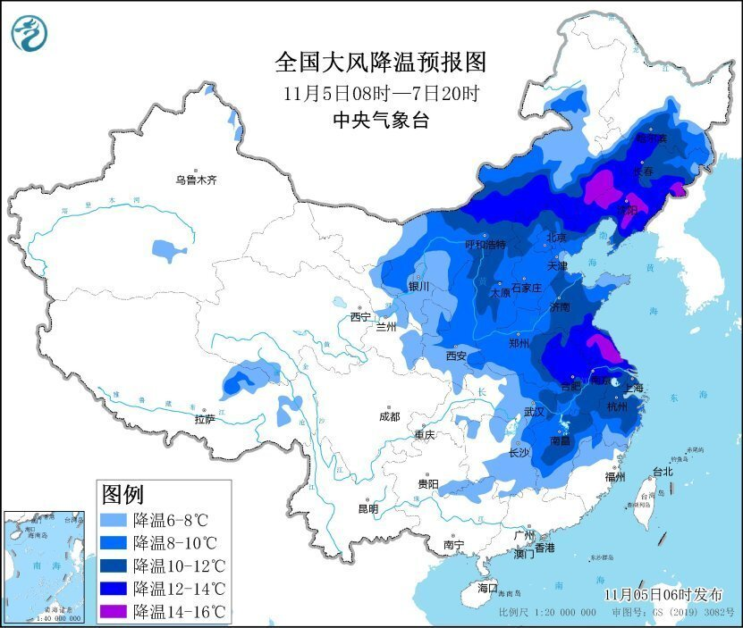
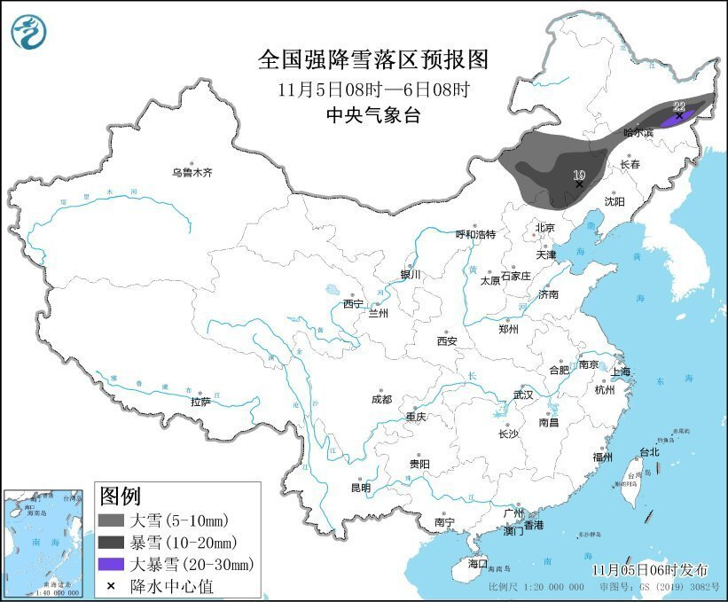
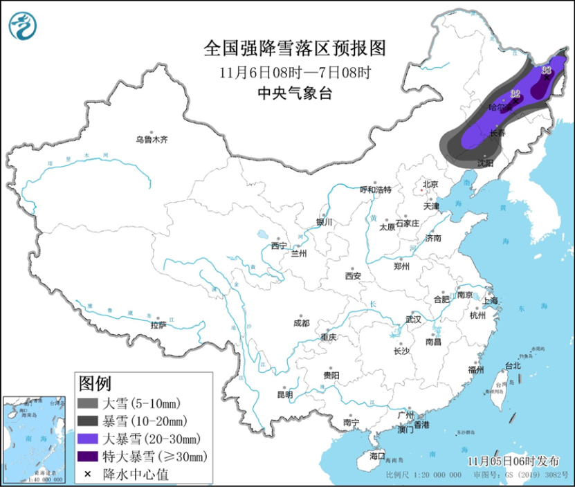
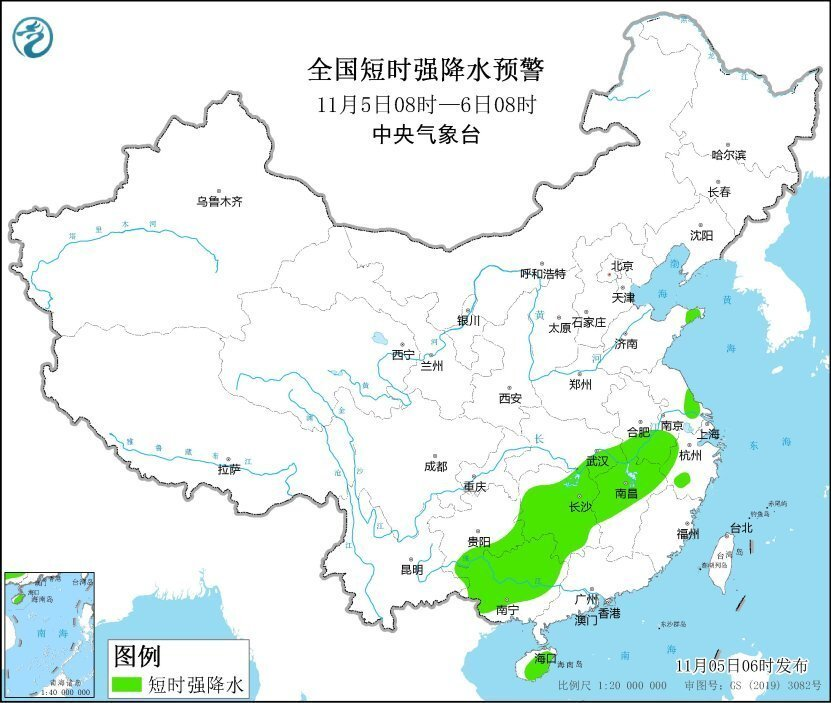
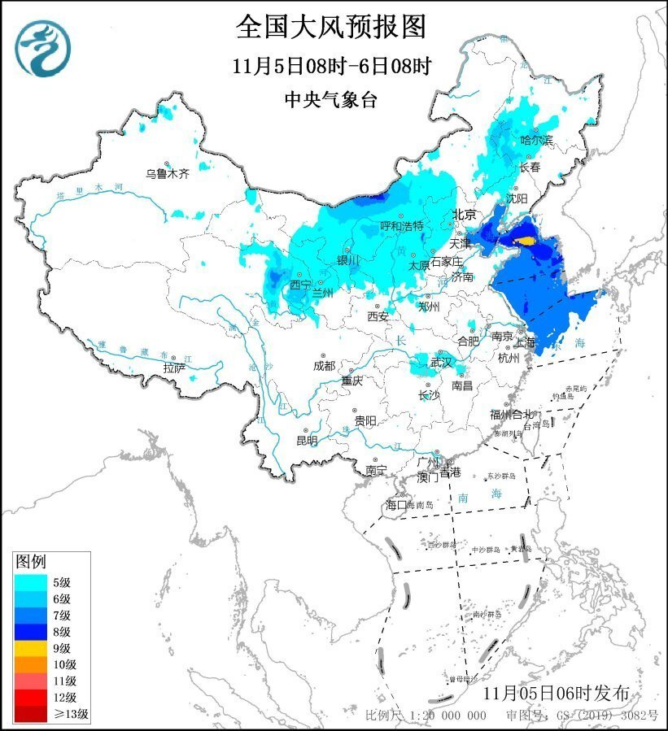

# 四预警齐发！寒潮+暴雪+大风+强对流来了，多地气温将猛降超16℃

每经编辑：毕陆名

往后几天，寒潮将会步步南下，自西向东、自北向南逐步影响我国大部地区。中央气象台11月5日再次发布暴雪橙色预警，并同时发布寒潮蓝色预警、强对流天气蓝色预警、大风蓝色预警。

_图片来源：中央气象台截图_

受强冷空气影响，预计，11月5日08时至7日20时，西北地区东部及我国中东部大部地区气温将下降6～10℃；内蒙古东南部、辽宁中北部、江苏中北部等地局地降温可达16℃以上。而4日傍晚，中央气象台也发布了寒潮、暴雪、大风、强对流四大预警！

11月3日上午，中国气象局召开11月新闻发布会。国家气候中心副主任贾小龙介绍，10月份全国平均气温12.2℃，较常年同期偏高1.6℃，为1961年以来同期最高。预计11月份，将有5次冷空气过程影响我国，但总体而言，全国大部地区气温仍会是偏高状态。
**监测显示，目前赤道中东太平洋已进入厄尔尼诺状态，即将形成一次厄尔尼诺事件，强度为中等，类型为东部型，并持续到冬季。**

寒潮等四预警齐发

**寒潮蓝色预警：**

受强冷空气影响，预计，11月5日08时至7日20时，西北地区东部及我国中东部大部地区气温将下降6～10℃，
**其中，内蒙古中部和东部、东北地区中南部、江淮中东部等地的部分地区气温将下降12～14℃，内蒙古东南部、吉林西南部和东部、辽宁中北部、江苏中北部等地局地降温可达16℃以上；**
最低气温出现在7日早晨，最低气温0℃线将位于河北北部、北京南部、山西南部至陕西关中平原、甘肃东南部一带，长江中下游沿江大部地区最低气温将降至10℃左右。长江中下游以北地区有4～6级偏北风，阵风7～9级，局地可达10级；5日至6日，渤海、黄海、东海等海域有6～8级风，最大阵风9～10级。

**暴雪橙色预警：**

预计11月5日08时至7日08时，内蒙古中东部、东北地区中西部和北部等地自西向东先后有大到暴雪，部分地区有大暴雪，局地特大暴雪（30～38毫米），新增积雪深度10～20厘米，局地可达25厘米以上。主要降雪时段5日夜间至6日。

11月5日08时至6日08时，内蒙古中东部、河北北部、辽宁西北部、黑龙江东南部等地的部分地区有大到暴雪，其中内蒙古东南部、黑龙江东南部等地局地大暴雪（20～22毫米）。上述部分地区新增积雪深度5～10厘米，局地可达15厘米以上。

11月6日08时至7日08时，内蒙古东南部、黑龙江中东部、吉林中西部、辽宁中北部等地的部分地区有暴雪到大暴雪，其中黑龙江南部和东部、吉林北部等地局地特大暴雪（30～38毫米）；吉林中西部、黑龙江南部等地局地有冻雨。上述地区新增积雪深度10～20厘米，局地可达25厘米以上。

**强对流天气蓝色预警：**

预计11月5日08时至6日08时，安徽南部、江西中北部、湖南中南部、贵州南部、广西中北部等地的部分地区将有8-10级雷暴大风或冰雹天气；安徽中南部、江苏中部、浙江西部、江西中北部、湖北东部、湖南大部、贵州南部、广西大部、海南岛等地的部分地区将有短时强降水天气，最大小时雨量30-40毫米，局地可达50毫米以上。

预计，强对流的主要影响时段为今天白天至夜间。

**大风蓝色预警：**

预计，11月5日08时至6日08时，新疆中北部、内蒙古中南部和东南部、青海东部、甘肃中部、宁夏、陕西北部、山西、河北中西部、北京、天津东部、河南北部、山东东部、辽宁西部、吉林西部、黑龙江南部、湖北东南部、湖南北部、江西北部等地将有5~6级、阵风7~9级的大风；渤海、渤海海峡、黄海大部海域、东海北部海域将有7~8级、阵风9级的大风，其中渤海海峡、黄海北部和中部的部分海域风力可达9级，阵风10~11级。

11月6日08时至7日08时，渤海、渤海海峡、黄海大部海域、东海北部海域、台湾海峡、巴士海峡、台湾以东洋面、南海东北部海域将有7~8级、阵风9~10级的大风，其中渤海海峡、黄海北部和中部的部分海域风力可达9级，阵风10~11级；新疆北部和南部、西藏北部、青海中部、甘肃西部、内蒙古大部、黑龙江大部、吉林中西部、辽宁西北部和南部、河北大部、北京中部、天津东部、山东中东部等地将有5~6级、阵风7~8级的大风。

迟来的冬天有何影响？

据扬子晚报，10月下旬以来，我国大部地区雨雪稀少，冷空气势力不强，中东部多地气温较常年同期明显偏高，华北、黄淮多地最高气温接近或达到了30℃，恍如夏日。而11月1日，此轮升温过程达到顶峰，截至1日15时，全国国家级气象站中，共有900多个站点的最高气温或最低气温打破11月最高极值纪录。山东、河南、安徽、江苏等地出现大面积超过30℃的区域，临近立冬恍若立夏。

据红网时刻新闻，11月1日湖南省最高气温达30.2℃，11月2日全省最高气温更是达31.7℃，为历史同期第2高。湖南省气候中心气候预测首席专家谢益军表示，10月下旬以来（10月21日至11月2日）全省平均气温为19.9℃，为1961年有完整气象记录以来同期最高。

近期暖热的天气实打实地推迟了入冬进程。10月底，早该入冬的内蒙古东南部、辽宁大部、山西南部以及新疆多地，都“滞留”在了秋季。据报道，北京常年入冬时间为10月31日，由于近期天气显著偏暖，预计入冬时间将推迟至11月6日前后，比常年偏晚近一周。

**目前我国多地入冬推迟，会造成哪些影响？**

据澎湃新闻，贾小龙回应提问称，今年秋季以来，我国北方气温异常偏高，东北大部、华北西北部、西北大部等地入冬时间较常年偏晚，部分地区偏晚超5天，可能造成影响农作物出苗和生长，不利于来年春耕春播。

贾小龙介绍，入冬推迟可能影响农作物生长季节和周期，不利于农业生产计划和产量；暖热气候导致农作物生长过旺且利于病虫害越冬和繁殖，严冬雨雪灾害和来年病虫害风险增大。贾小龙还表示，暖热天气可能引发物候的“生态失衡”。

每日经济新闻综合中央气象台、扬子晚报、红网时刻新闻、澎湃新闻

每日经济新闻

