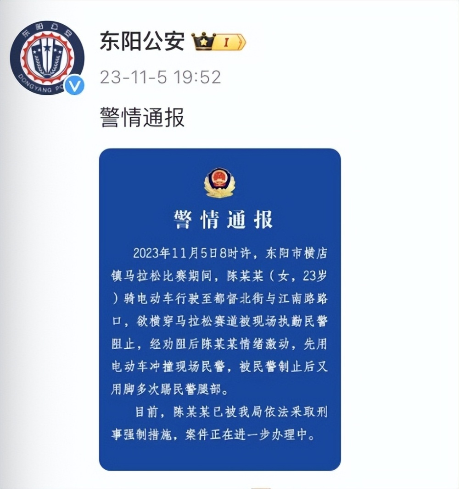

# 女子欲横穿马拉松赛道被阻止，用电动车冲撞民警，警方通报：被依法采取刑事强制措施

警情通报

2023年11月5日8时许，东阳市横店镇马拉松比赛期间，陈某某(女，23岁)
骑电动车行驶至都督北街与江南路路口，欲横穿马拉松赛道被现场执勤民警阻止，经劝阻后陈某某情绪激动，先用电动车冲撞现场民警，被民警制止后又用脚多次踢民警腿部。

目前，陈某某已被我局依法采取刑事强制措施，案件正在进一步办理中。

东阳市公安局

2023年11月5日

_来源：@东阳公安_

